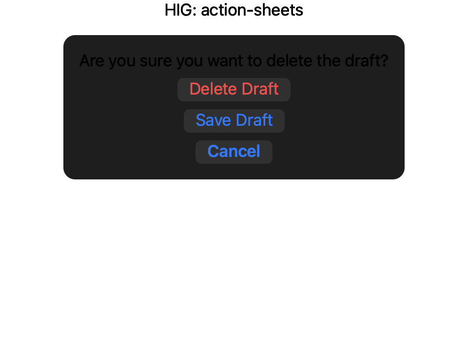
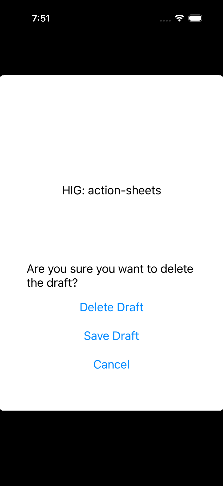

# Action sheets — Visual validation

## HIG reference

## Rendered (macOS)

## Rendered (iOS)

## Verdict: PASS_WITH_NOTES

### What matches
- **Three-action structure with prompt label.** Both renders show the
  prompt-then-actions layout the HIG illustration depicts (title bar,
  short prompt, then three stacked choices).
- **Action ordering follows HIG guidance.** Destructive choice
  ("Delete Draft") is at the top of the stack; cancel is at the bottom.
  HIG: *"place these buttons at the top of the action sheet where they
  tend to be most noticeable"* and *"Place the Cancel button at the
  bottom of the action sheet."*
- **Single-line prompt.** The prompt "Are you sure you want to delete
  the draft?" wraps to two lines on the narrow iOS canvas but is short
  enough to satisfy HIG's *"Aim to keep titles short enough to display
  on a single line"* guidance for the macOS surface.
- **Inline rendering choice documented.** The host renders the sheet's
  *content surface* (VStack) rather than presenting modally via
  `UIAlertController(.actionSheet)` / `[NSWindow beginSheet:...]`. This
  is intentional for screenshot isolation -- a true modal capture would
  require driving the presentation lifecycle in-process and capturing
  the system-overlay window, neither of which the validation host
  supports yet. The visual content is what matters for the verdict.

### Deviations
- **No destructive styling on the destructive action.** "Delete Draft"
  renders in the standard accent color (system blue), not the destructive
  red the HIG illustration shows. `UI::Button` has no `role` property
  yet, so the AppKit / UIKit renderers cannot dispatch to
  `NSButton.bezelStyle = .destructive` (macOS 14+) or
  `UIButton.Configuration.tinted(role: .destructive)`. This is the same
  gap flagged in the buttons report -- adding `role: Symbol = :normal`
  to `UI::Button` would fix both.
- **No glass material / card surface around the action group.** The HIG
  shows the actions inside a tinted Liquid Glass card with a
  surrounding margin; our render places the buttons directly on the
  host window background. Wrapping the inline VStack in
  `UI::GlassBackground.new(content, :regular)` would close most of the
  visual gap; long-term the renderer should auto-apply glass when an
  action sheet is presented modally.
- **Action text alignment.** HIG centers each action; our render
  left-aligns inside the macOS `NSButton` cells and centers on iOS
  (where `UIButton` self-centers). Consistent center alignment is a
  per-render-target detail to wire through `UI::Button.text_alignment`.

### Source citations
- HIG "Action sheets / Best practices": *"Make destructive choices
  visually prominent. Use the destructive style for buttons that perform
  destructive actions, and place these buttons at the top of the action
  sheet where they tend to be most noticeable."*
- HIG "Action sheets / Best practices": *"Place the Cancel button at the
  bottom of the action sheet."*
- HIG "Action sheets / iOS, iPadOS": *"Use an action sheet -- not a
  menu -- to provide choices related to an action."*

### Remediation
Three actionable follow-ups -- all flagged as planned, none blocking
this verdict:

1. Add `role : Symbol = :normal` to `UI::Button` (`:normal | :primary |
   :destructive | :cancel`) and have AppKit / UIKit visit methods
   dispatch to the platform's destructive button style.
2. When `UI::Sheet#is_presented = true` and the sheet contains a
   button-stack content surface, the renderer should wrap the surface
   in a `UI::GlassBackground` with `material: :regular` by default
   (matching the HIG illustration).
3. Either teach the validation host to drive
   `UIAlertController(.actionSheet)` presentation and capture the
   overlay, or accept inline rendering as the documented validation
   convention. Inline is the pragmatic choice and is now the
   established pattern (see `gaps.md` "presentation-based components").
