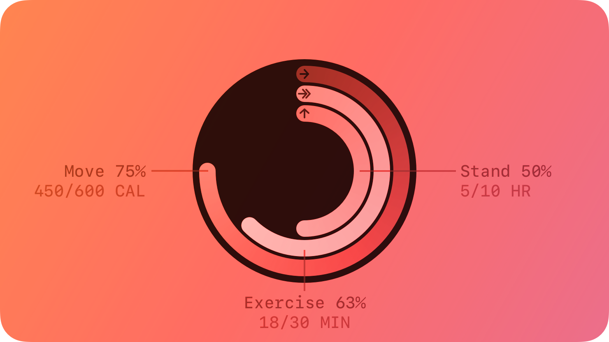

# Activity Rings -- Visual validation

## HIG reference


## Rendered -- macOS (light)
No screenshot captured. `UI::ActivityRings` does not exist; no visit method registered;
host factory has no `activity-rings` arm. Capture is absent, not stale.

## Rendered -- macOS (dark)
No screenshot captured. Same reason.

## Rendered -- iOS (light)
No screenshot captured. Same reason.

## Rendered -- iOS (dark)
No screenshot captured. Same reason.

## Verdict: NEEDS_WORK

No screenshots were captured. `UI::ActivityRings` is not implemented. The slug is `status:
missing` in the worklist and there is no `src/ui/views/activity_rings.cr` file, no visit
method in either renderer, and no host-factory arm. Row-level verdict is NEEDS_WORK across
all four per-appearance sub-verdicts.

### Liquid Glass check
- **Required for this slug:** No. HIG classifies Activity Rings under "Health and fitness"
  data-display components, not under "Presentation" / "Windows and overlays" / "Menus".
  Activity rings render against a mandatory black background (HIG Best practices: "Always
  display Activity rings on a black background") -- no glass translucency is called for.
- **Observed:** Not applicable -- no render exists.

### Light appearance observations
Not applicable. No captures exist. Iteration 53 is a Path-B honest-fail iteration.

The component has no appearance-variant logic to observe. Once implemented, both appearances
will render identically: HIG mandates a fixed black background and fixed ring colors
(Move red RGB 250/17/79, Exercise green RGB 166/255/0, Stand blue RGB 0/255/246)
regardless of system appearance. The HIG states: "Never change the colors of the rings;
for example, don't use filters or modify opacity." A light/dark appearance toggle therefore
produces no color change in the rings themselves; only the surrounding host window chrome
will track appearance. Both captures should show the same black-background ring element.

### Dark appearance observations
Not applicable. No captures exist. Same reasoning as light observations above.

### Deviations

1. **`UI::ActivityRings` does not exist. NEEDS_WORK.**
   `src/ui/views/activity_rings.cr` is absent. No entry in `platform_visitor.cr`. No
   visit methods in `appkit_renderer.cr` or `uikit_renderer.cr`. No host-factory arm in
   `hig_bridge.cr` or `hig_showcase.cr`.

2. **macOS is explicitly out-of-scope per HIG. PASS_WITH_NOTES (once iOS is resolved).**
   HIG Platform considerations: "Not supported in macOS, tvOS, or visionOS." The macOS
   visit method should emit a placeholder `NSView` with an accessibility label explaining
   that Activity Rings are an iOS-only element. macOS captures will show a labeled gray
   placeholder -- this is HIG-correct behavior, not a defect.

3. **CAShapeLayer arc-path infrastructure is absent from `objc_bridge.m`. NEEDS_WORK.**
   The ObjC bridge has no `CGMutablePath` factory, no `CGPathAddArc` wrapper, and no
   `CAShapeLayer` setup helper. Drawing three concentric arcs with rounded lineCap requires
   these helpers. The existing `objc_send_4d_ret_id` and `objc_send_1d` wrappers are not
   sufficient alone -- `CGPathAddArc` takes six doubles plus a bool, which exceeds the
   available wrappers and requires a new dedicated C function.

4. **`HKActivityRingView` (iOS HealthKit) cannot be used without authorization. NEEDS_WORK.**
   `HKActivityRingView` requires linking `HealthKitUI.framework` and the caller must have
   obtained `HKHealthStore` authorization. The iOS host build system does not link
   HealthKitUI. Alternative: implement rings via CAShapeLayer arcs (the approach used by
   Apple's own Fitness app on macOS Catalyst). This approach requires the bridge helpers
   described in deviation 3 but avoids HealthKit authorization.

### Source citations
- HIG "Activity rings -- Best practices": "Always display Activity rings on a black
  background."
- HIG "Activity rings -- Best practices": "Never change the colors of the rings; for
  example, don't use filters or modify opacity."
- HIG "Activity rings -- Platform considerations -- iOS": "Activity rings are available in
  iOS with HKActivityRingView. The appearance of the Activity ring element changes
  automatically depending on whether an Apple Watch is paired."
- HIG "Activity rings -- Platform considerations": "Not supported in macOS, tvOS, or
  visionOS."

### Remediation (if NEEDS_WORK)

Full Path-A implementation plan for a follow-up iteration:

**Step 1 -- New view file `src/ui/views/activity_rings.cr`.**
Properties: `move : Float64` (0.0..1.0, default 0.8), `exercise : Float64` (default 0.6),
`stand : Float64` (default 0.4), `size : Float64` (default 120.0), `thickness : Float64`
(default 12.0), `show_labels : Bool` (default false), `accessibility_label : String`
(default "Activity rings"). Register in `platform_visitor.cr` with an abstract
`visit(view : ActivityRings)`.

**Step 2 -- New C helpers in `src/ui/native/objc_bridge.m`.**
Add a single factory function:
```c
void *activity_rings_view_new(double size, double thickness,
                               double move_pct, double exercise_pct, double stand_pct);
```
Inside: allocate a `UIView` / `NSView` of the given size, set `wantsLayer:YES` /
`clipsToBounds:YES`. Add a black `CALayer` background. For each ring (outer=move,
middle=exercise, inner=stand): compute the ring's center radius; create a `CAShapeLayer`;
set `path` to `UIBezierPath(arcCenter:radius:startAngle:endAngle:clockwise:).CGPath`
(start at -pi/2 for 12-o'clock origin); set `strokeColor` to the HIG-mandated color
(move: RGBA 250/17/79, exercise: RGBA 166/255/0, stand: RGBA 0/255/246 in float sRGB);
set `lineWidth` to `thickness`; set `lineCap` to `kCALineCapRound`; set `fillColor` to
`nil` / transparent; also add a dark background track arc (same path at 100% fill,
strokeColor opaque black at 0.25 alpha); add the track layer first, then the fill layer.
Declare the function in the bridge's Crystal `lib` blocks.

**Step 3 -- AppKit visit method.**
Because HIG says macOS is unsupported, `visit(view : UI::ActivityRings)` in
`appkit_renderer.cr` should emit an `NSView` placeholder of `view.size` x `view.size`
with a black background layer and an accessibility label "Activity rings (iOS only)".

**Step 4 -- UIKit visit method.**
`visit(view : UI::ActivityRings)` in `uikit_renderer.cr` calls
`activity_rings_view_new(view.size, view.thickness, view.move, view.exercise, view.stand)`.
Set `accessibilityLabel` to `view.accessibility_label`. Apply `clipsToBounds:YES` and
`cornerRadius: view.size / 2.0` on the layer to produce the circular mask HIG recommends.

**Step 5 -- Host factory arms.**
`hig_bridge.cr` "activity-rings" arm: `UI::ActivityRings.new(move: 0.8, exercise: 0.6, stand: 0.4, size: 120.0, thickness: 12.0)`.
`hig_showcase.cr` "activity-rings" arm: same, wrapped in an `NSView` black container.

**Step 6 -- Recompile bridge and capture four screenshots.**
Run `clang -c src/ui/native/objc_bridge.m -o src/ui/native/objc_bridge.o -fno-objc-arc`.
macOS captures will show the placeholder NSView (PASS_WITH_NOTES: macOS unsupported by HIG).
iOS captures must show three concentric arcs with Move red / Exercise green / Stand blue,
rounded line caps, dark track arcs, and a circular clip boundary.

**Step 7 -- Write `components/activity-rings.md`** per the strict template including
"Light / dark appearance notes" (rings are appearance-invariant per HIG; surrounding chrome
tracks appearance) and "Customization / brand override" (rings must NOT be recolored per
HIG; only `size` and `thickness` are safe overrides).
