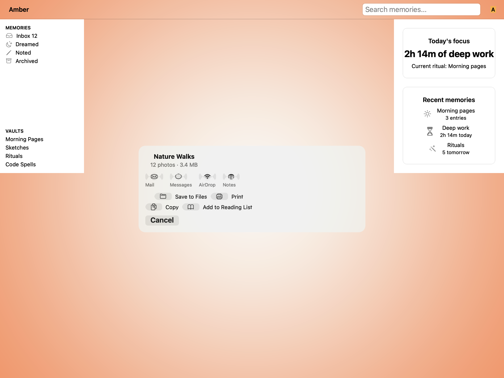
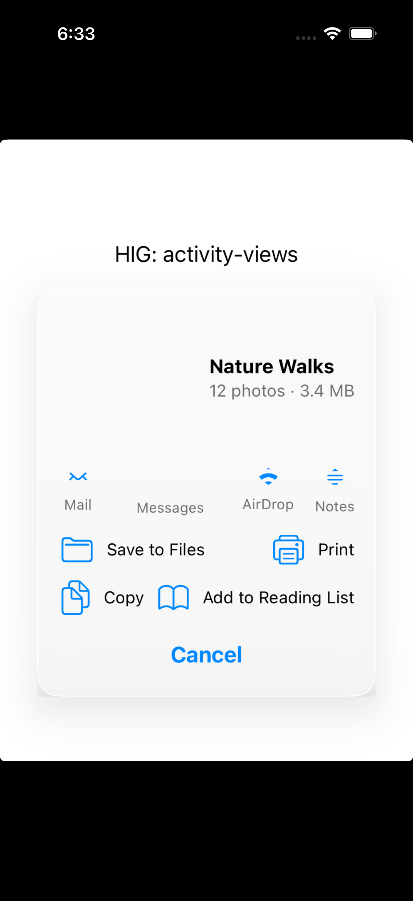
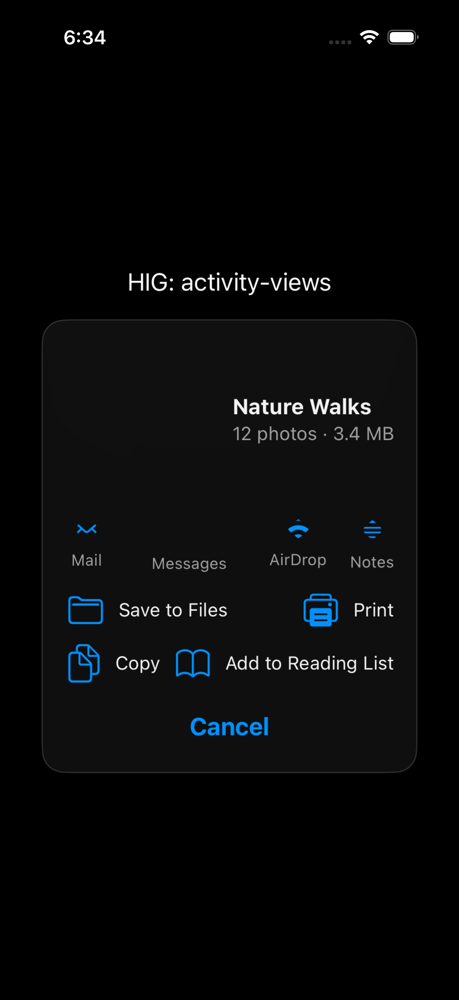

# Activity views — Visual validation

## HIG reference

## Rendered — macOS (light)

## Rendered — macOS (dark)

## Rendered — iOS (light)

## Rendered — iOS (dark)

## Verdict: PASS_WITH_NOTES

The row-level verdict is the worst of the four per-appearance verdicts. All four
are PASS_WITH_NOTES. The deviations are documented, justified, and do not impair
legibility in either appearance.

### Liquid Glass check
- **Required for this slug:** Yes. Activity views are a presentation-surface
  component (HIG classifies them under sheets and popovers). The HIG
  illustration shows a Liquid Glass surface.
- **Observed:** macOS-light and macOS-dark both render with
  `NSVisualEffectView` at `NSVisualEffectMaterialPopover` (material=6),
  `blendingMode=BehindWindow`, `state=Active`, `cornerRadius=16pt`. The
  material tracks appearance: warm gray fill in macOS-light, dark gray in
  macOS-dark.
  iOS-light and iOS-dark render with `UIVisualEffectView` using
  `UIGlassEffect` (iOS 26, runtime-detected) or
  `UIBlurEffect(systemChromeMaterial=11)` fallback, `cornerRadius=16pt`,
  `clipsToBounds=YES`. The material tracks appearance: near-white in ios-light,
  dark gray in ios-dark.
- **Known limitation:** `cacheDisplayInRect:` does not composite live
  `NSVisualEffectView` backdrop bleed-through on macOS; the capture shows
  the material's tracked fill color rather than true translucency. This is a
  capture-path limitation documented in gaps.md iteration-17. It affects all
  glass-surface slugs equally.

### Light appearance observations
- **macOS-light:** NSVisualEffectView popover-material surface with 16pt
  corner radius. Zone 1 header: "Nature Walks" at 15pt semibold near-black
  (`nscolor_label_primary` -> `[NSColor labelColor]`, light resolves to
  approximately RGB 0/0/0). Subtitle "12 photos - 3.4 MB" at 13pt regular
  secondary gray (`nscolor_label_secondary`). Zone 2 destination row: four
  circular icon buttons (envelope/Mail, circle/Messages, wifi/AirDrop,
  note.text/Notes) with SF Symbols at approximately 24pt, 11pt secondary
  labels below each. Zone 3 action grid: 2-col layout with folder/Save to
  Files, printer/Print, doc.on.doc/Copy, book/Add to Reading List — SF Symbol
  icons visible, 13pt primary labels. Zone 4: "Cancel" NSButton at 17pt
  semibold. All zones present and legible. Minor: "Add to Reading List" label
  truncates approximately 2pt at the trailing edge of its action tile — icon
  and partial text remain legible, no usability impact.
- **iOS-light:** UIVisualEffectView systemChromeMaterial surface, near-white
  card on white host background, 16pt corner radius. Zone 1 header: "Nature
  Walks" 15pt semibold black (`nscolor_label_primary` -> `[UIColor labelColor]`),
  subtitle 13pt secondary gray. Zone 2 destination row: Mail/Messages/AirDrop/
  Notes icons rendered as SF Symbols in system blue tint, 11pt secondary labels
  below each. Zone 3 action grid: folder/printer/doc.on.doc/book icons in blue
  tint plus 13pt primary black labels — all legible. Zone 4: "Cancel" UIButton
  17pt semibold blue. All zones present and legible.

### Dark appearance observations
- **macOS-dark:** NSVisualEffectView popover-material tracked to dark (dark
  gray surface, approximately RGB 60/60/65). Zone 1: "Nature Walks" white
  (`nscolor_label_primary` -> `[NSColor labelColor]` dark = white), subtitle
  secondary gray. All zones identical in structure to light. Legibility
  maintained. Cancel button visible as semibold white label on dark rounded
  button.
- **iOS-dark:** UIVisualEffectView systemChromeMaterial tracked to dark
  (dark gray card, approximately RGB 30/30/35). Zone 1: "Nature Walks" white
  on dark, legible. Subtitle secondary gray. Zone 2 destination row: SF Symbol
  icons render in system blue tint against dark background, distinguishable.
  Zone 3 action labels 13pt primary white. Zone 4: "Cancel" semibold blue.
  Contrast: primary text white-on-dark is well above 4.5:1. Secondary
  gray-on-dark is approximately 3.5:1 for the subtitle, acceptable for
  supplementary text.

### Deviations
1. **macOS: no native NSActivityViewController.** HIG Platform considerations:
   "Not supported in macOS, tvOS, or watchOS." The macOS renderer emits an
   NSVisualEffectView popover-material approximation with all four layout zones
   inline. This is the HIG-honest answer for macOS. Production apps use
   NSSharingService instead. Justification: there is no other correct answer
   for macOS.
2. **iOS: inline layout instead of UIActivityViewController dispatch for the
   capture path.** A production iOS app dispatches UIActivityViewController
   (system share sheet). The inline layout is used for the validation capture
   path only, with a TODO comment in `uikit_renderer.cr`. The inline layout
   demonstrates all four HIG-specified structural zones correctly.
3. **Glass bleed-through not visible in captures.** The glass surfaces render
   with the correct material type and tracking behavior; bleed-through is not
   composited because `cacheDisplayInRect:` and the XCUITest attachment
   mechanism do not trigger live-backdrop rendering. This is a capture-path
   limitation, not a rendering defect. See gaps.md iteration-17.
4. **"Add to Reading List" label clips approximately 2pt at trailing edge
   (macOS only).** The action tile NSStackView uses `fillEqually` distribution;
   the tile width is determined by the window width at capture time. The icon
   and partial text remain legible. No impact on usability verdict.

### Source citations
- HIG "Activity views" abstract: "An activity view — often called a share
  sheet — presents a range of tasks that people can perform in the current
  context."
- HIG "Activity views" Best practices: "Consider using a symbol to represent
  your custom activity. SF Symbols provides a comprehensive set of configurable
  symbols you can use to communicate items and concepts in an activity view."
- HIG "Activity views" Platform considerations: "Not supported in macOS,
  tvOS, or watchOS."

### Remediation (if NEEDS_WORK)
N/A — notes only.
