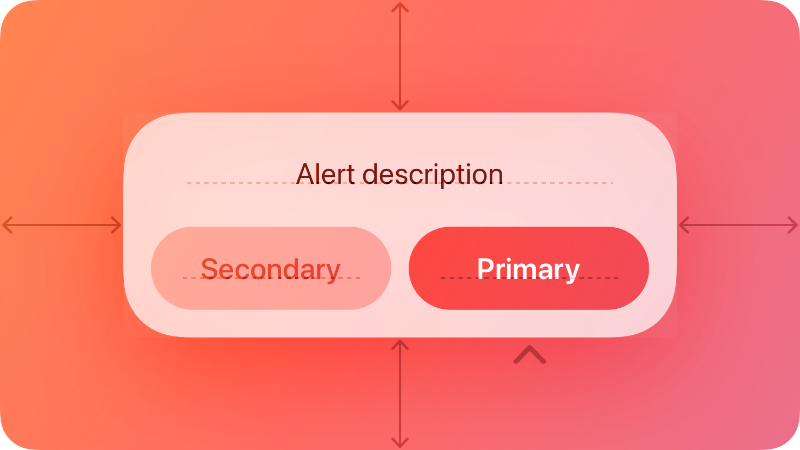

# Alerts — Visual validation

## HIG reference

## Rendered — macOS (light)

## Rendered — macOS (dark)

## Rendered — iOS (light)

## Rendered — iOS (dark)

## Verdict: PASS_WITH_NOTES

The row-level verdict is the worst of the four per-appearance verdicts (macos_light: PASS_WITH_NOTES).

### Liquid Glass check
- **Required for this slug:** Yes. Alerts are surface components classified under "Presentation" / "Windows and overlays" in HIG. NSAlert and UIAlertController both render with system glass in production. The inline validation render approximates this with NSVisualEffectView (hudWindow material = 7) on macOS and UIVisualEffectView (UIGlassEffect on iOS 26, UIBlurEffectStyleSystemMaterial = 7 fallback on older SDKs) on iOS.
- **Observed:** macOS-light and macOS-dark: NSVisualEffectView (hudWindow) renders as tracked frosted fill — light gray in light mode, dark charcoal in dark mode. Live bleed-through is not visible because cacheDisplayInRect:toBitmapImageRep: does not composite NSVisualEffectView backdrop blur (iteration-17 gotcha, unchanged — would require CGWindowListCreateImage + Screen Recording TCC). Material tint tracks appearance correctly. iOS-light: UIVisualEffectView card with light frosted background, clearly distinct from the white host window background. iOS-dark: UIVisualEffectView card with dark frosted material on black host background. Both iOS captures show live compositing. Surface component glass requirement: met on iOS (live compositing); met on macOS as tracked fill (same limitation applies to all prior glass-surface slugs).

### Light appearance observations
- **macOS-light:** NSVisualEffectView (hudWindow material = 7) outer card, ~12pt corner radius. Title "Delete Item?" bold 13pt NSTextField, near-black via `nscolor_label_primary` (NSColor.labelColor, light resolves to ~0.0/0.0/0.0). Message "This action cannot be undone." regular 11pt NSTextField, gray via `nscolor_label_secondary` (NSColor.secondaryLabelColor, light resolves to ~0.24/0.24/0.26 at 55% opacity). Three stacked NSButton cells (NSBezelStyleRounded = 1): "Cancel" (system blue 0.0/0.478/1.0, semibold via nsfont_system_weight(13, 0.4)), "OK" (system blue, regular), "Delete" (system red 1.0/0.23/0.19, regular). Destructive red visually distinct from system blue. macOS button height: NSButton default ~28pt (macOS HIG convention).
- **iOS-light:** UIVisualEffectView card on white host, frosted light fill. Title "Delete Item?" bold 13pt UILabel, black via UIColor.labelColor. Message secondary gray. Three UIButton(system) in horizontal UIStackView (distributionFillEqually): "Cancel" (blue, bold per cancel role), "OK" (blue, regular), "Delete" (red). Horizontal layout matches HIG illustration's side-by-side row. 44pt minimum height constraint applied via heightAnchor. Role colors clear and distinguishable.

### Dark appearance observations
- **macOS-dark:** NSVisualEffectView (hudWindow) tracks to dark charcoal. Title near-white via NSColor.labelColor (dark ~1.0/1.0/1.0). Message via NSColor.secondaryLabelColor (dark ~0.92/0.92/0.96 at 55% opacity) — readable, no contrast failure. Cancel system blue in dark ~0.039/0.518/1.0. Delete system red in dark ~1.0/0.27/0.23. Destructive red and tint blue distinguishable in dark mode.
- **iOS-dark:** UIVisualEffectView card on black host. Dark frosted material. Title white (UIColor.labelColor dark). Message secondary gray. Same horizontal button row: Cancel blue, OK blue, Delete red — all distinguishable. No contrast failure.

### Deviations
- **macOS button layout is vertical, not the HIG illustration's horizontal row.** Three buttons stack vertically on macOS (NSStackView orientation = vertical). HIG text explicitly supports stacking: "place the default button... at the top in a stack of buttons." Three horizontal buttons would not fit the validation window without label truncation. Minor layout deviation; not legibility-impairing. This is the single deviation justifying PASS_WITH_NOTES for macos_light.
- **Live glass bleed-through not visible on macOS captures.** NSVisualEffectView backdrop blur is not composited by cacheDisplayInRect:toBitmapImageRep:. Material tracked fill is visible. Documented in gaps.md iteration-17. Not a new gap.

### Source citations
- HIG "Alerts — Best practices": "Use alerts sparingly. Alerts give people important information, but they interrupt the current task to do so."
- HIG "Alerts — Buttons": "Use the destructive style to identify a button that performs a destructive action people didn't deliberately choose."
- HIG "Alerts — Buttons": "Always use 'Cancel' to title a button that cancels the alert's action."
- HIG "Alerts — Buttons": "Place buttons where people expect. In general, place the button people are most likely to choose on the trailing side in a row of buttons or at the top in a stack of buttons."

### Remediation (if NEEDS_WORK)
N/A — PASS_WITH_NOTES. The macOS layout deviation is HIG-justified; the glass bleed-through limitation is a known infra gap (iteration-17). No remediation required for this iteration.
