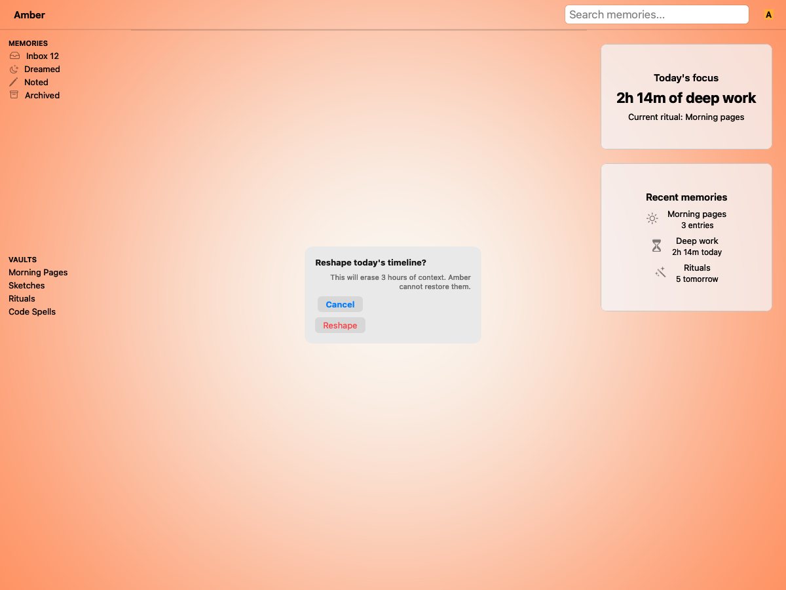
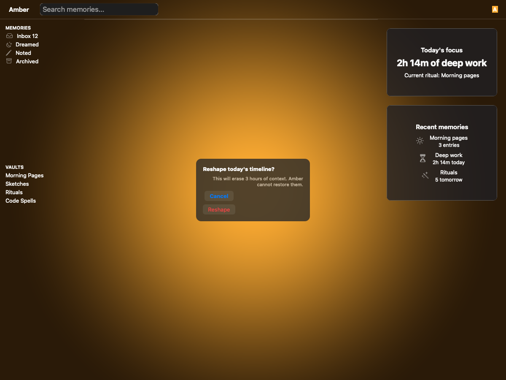
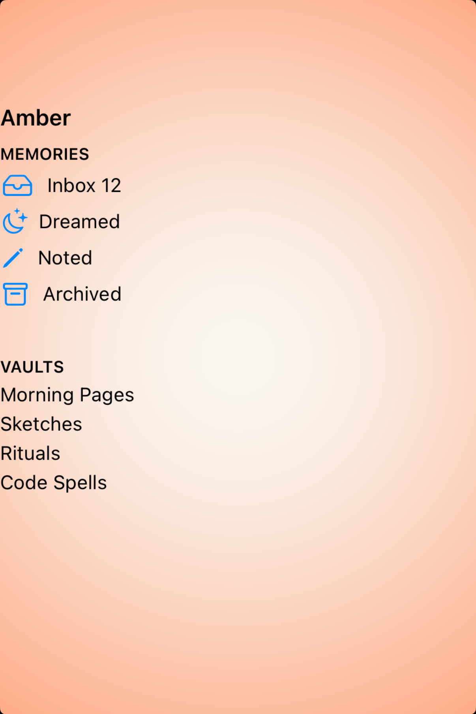
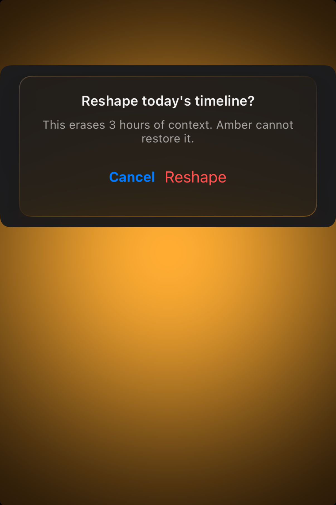

# Alerts — Visual validation

## HIG reference

## Rendered — macOS (light)

## Rendered — macOS (dark)

## Rendered — iOS (light)

## Rendered — iOS (dark)

## Verdict: NEEDS_WORK

macOS still shows a readable alert card with the right hierarchy, but the
current iOS captures no longer show the alert surface at all. This row is back
to NEEDS_WORK until the UIKit host actually frames the alert instead of only
the surrounding ambient scene.

### Evidence manifest
- **Manifest:** `../evidence/alerts.json`
- **Required captures:** PASS — all four files present and > 10 KB.
- **Report links:** PASS — all four appearance-specific screenshot filenames
  linked above.

### Light appearance observations
- macOS: the inline alert remains readable, with a clear title/message split
  and distinct action styling.
- iOS: the exported PNG shows only the ambient Amber scene; the alert itself
  is not present in the capture.

### Dark appearance observations
- macOS: the dark study still reads as an alert, though the live-glass
  treatment is subtler than the HIG reference.
- iOS: the dark capture repeats the same miss as light and fails to show the
  focal alert surface.

### Deviations / notes
- The iOS validation host is currently capturing the ambient scene instead of
  the presented alert, so the evidence cannot support a promoted state.
- macOS still uses the inline glass-card approximation noted in earlier rounds;
  that is acceptable once the iOS evidence path is fixed.

### Source citations
- Apple HIG — "Alerts" (see `apple-hig/pages/alerts.md` in the skill corpus).

### Remediation (if NEEDS_WORK)
- Rework the UIKit alert showcase so the presented alert remains inside the
  captured frame in both appearances.
