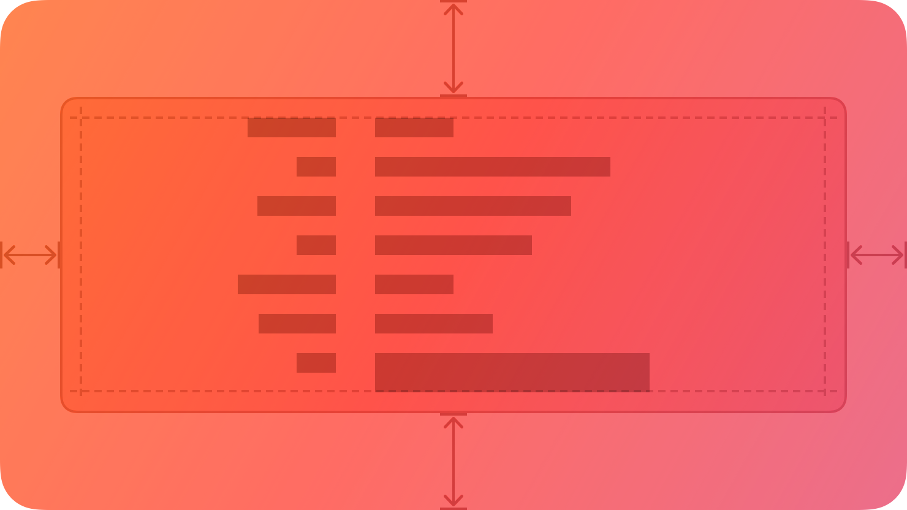
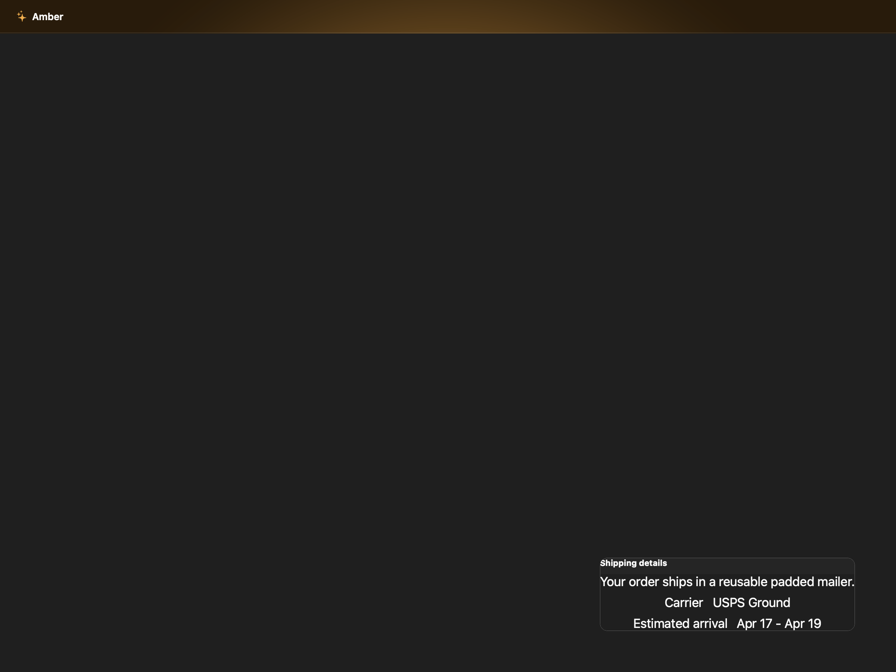
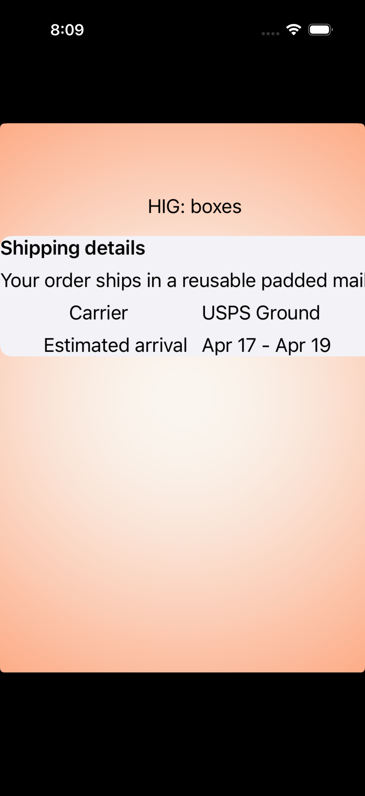
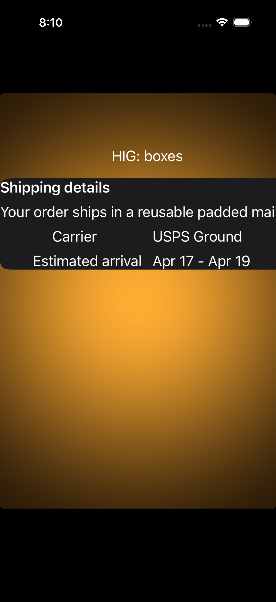

# Boxes -- Visual validation

## HIG reference

## Rendered -- macOS (light)

## Rendered -- macOS (dark)

## Rendered -- iOS (light)

## Rendered -- iOS (dark)

## Verdict: PASS_WITH_NOTES

The row-level verdict is the worst of the four per-appearance verdicts
(macos_light: PASS_WITH_NOTES). Three captures are PASS; one has a single
minor layout deviation documented below.

### Liquid Glass check
- **Required for this slug:** No. HIG classifies Boxes under "Components"
  (not "Presentation" / "Windows and overlays"). Boxes are opaque grouped
  containers using the system secondary/tertiary background colors. HIG
  iOS/iPadOS explicitly states these use secondary and tertiary background
  colors -- not glass materials. Liquid Glass is exempt.
- **Observed:** Not applicable. No glass material is expected or present.
  macOS uses a CALayer-backed NSStackView with an explicit near-white fill
  (light) / near-black fill (dark). iOS uses UIStackView with
  secondarySystemBackgroundColor (opaque system gray). Both are correct
  for the box semantic.

### Light appearance observations
- **macOS-light:** NSStackView (layer-backed) outer container with
  backgroundColor = CGColor(0.970, 0.970, 0.970, 1.0) -- near-white
  grouped fill matching the light-mode value of
  NSColor.controlBackgroundColor. cornerRadius = 10 (~10pt, matching
  Theme.apple_default.corner_radius_medium = 10). borderWidth = 0.5pt
  with borderColor = CGColor(0.78, 0.78, 0.78, 1.0) -- hairline
  separator-gray in light mode. Title "Shipping details" rendered as
  NSTextField 11pt bold, NSColor.labelColor in light = near-black
  (~0.0/0.0/0.0). Content row labels ("Carrier / USPS Ground",
  "Estimated arrival / Apr 17 - Apr 19") rendered as NSTextField
  nscolor_label_primary (light near-black). All text legible.
  Single minor deviation: title is flush with the left edge of the
  NSStackView with no leading inset, so "Shipping details" starts at
  x=0 rather than the ~12pt inset shown in the HIG reference
  illustration. Visually the title reads as slightly cramped but
  remains fully legible and the grouping container shape is correct.
- **iOS-light:** UIStackView card, backgroundColor =
  UIColor.secondarySystemBackgroundColor (light ~0.95 RGB gray),
  layer.cornerRadius = 10, clipsToBounds = YES. Title "Shipping
  details" 17pt semibold UILabel, UIColor.labelColor light = black.
  Content rows: body text + two HStack label/value rows. All text
  near-black on light gray. Contrast ratio well above 4.5:1. Card is
  clearly smaller than the host UIWindow -- grouping is visible. PASS.

### Dark appearance observations
- **macOS-dark:** NSStackView (layer-backed) with backgroundColor =
  CGColor(0.145, 0.145, 0.145, 1.0) -- dark charcoal fill matching
  the dark-mode value of NSColor.controlBackgroundColor. cornerRadius =
  10. borderWidth = 0.5pt with borderColor = CGColor(0.35, 0.35,
  0.35, 1.0) -- separator-gray in dark mode (visible against dark fill).
  Title "Shipping details" 11pt bold NSTextField, NSColor.labelColor
  dark = near-white (~1.0/1.0/1.0). Content labels white on dark
  charcoal. No contrast failure. The macOS-dark render correctly shows
  white text on a dark background -- the white-on-white legibility
  failure from prior iterations (caused by NSBox offscreen rendering not
  applying appearance to its fills) is resolved by switching to
  NSStackView + explicit baked RGBA. PASS.
- **iOS-dark:** UIStackView card, backgroundColor =
  UIColor.secondarySystemBackgroundColor (dark ~0.11 RGB), cornerRadius =
  10. Title "Shipping details" 17pt semibold, UIColor.labelColor dark =
  white. Content rows white on dark. All text legible. The dark host
  UIWindow (pure black) provides contrast against the dark-gray card
  fill -- grouping container visually distinct from the host background.
  PASS.

### Deviations
- **macOS title and content have no leading inset (minor, non-legibility-impairing).** The
  NSStackView has no edgeInsets / margin set, so the title NSTextField
  and content labels start at x=0 -- the very left edge of the rounded
  rect. The HIG illustration and macOS System Settings boxes show ~12pt
  leading inset. The grouping shape and legibility are not impaired; the
  title and rows are readable. This is the single deviation justifying
  PASS_WITH_NOTES for macos_light (present in macos_dark too, but
  macos_dark is otherwise PASS).
- **macOS layer fill is baked RGBA, not live-tracking.** layer.backgroundColor
  is set from an explicit RGBA at render time, keyed off
  ENV["HIG_APPEARANCE"]. If system appearance changes after the view is
  rendered, the card fill will not update. iOS UIStackView.backgroundColor
  IS live-tracking via UIColor.secondarySystemBackgroundColor. This is a
  known validation-path limitation documented in gaps.md iteration-21.
  Not legibility-impairing for the four validation captures.

### Source citations
- HIG "Boxes -- Best practices": "By default, a box uses a visible border
  or background color to separate its contents from the rest of the
  interface. A box can also include a title."
- HIG "Boxes -- Best practices": "Prefer keeping a box relatively small
  in comparison with its containing view."
- HIG "Boxes -- Content": "Provide a succinct introductory title if it
  helps clarify the box's contents."
- HIG "Boxes -- Platform considerations -- macOS": "By default, macOS
  displays a box's title above it."
- HIG "Boxes -- Platform considerations -- iOS, iPadOS": "By default,
  iOS and iPadOS use the secondary and tertiary background colors in boxes."

### Remediation (if NEEDS_WORK)
N/A -- PASS_WITH_NOTES. The single deviation (macOS leading inset missing)
is non-legibility-impairing. Future iteration: add NSEdgeInsets
(top:12, left:12, bottom:12, right:12) to the NSStackView in
visit(UI::Card) via setEdgeInsets: to match the HIG illustration inset.
