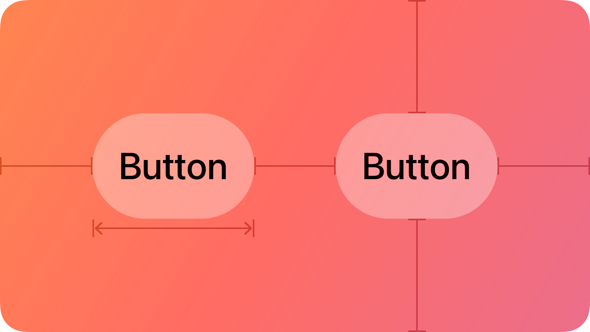
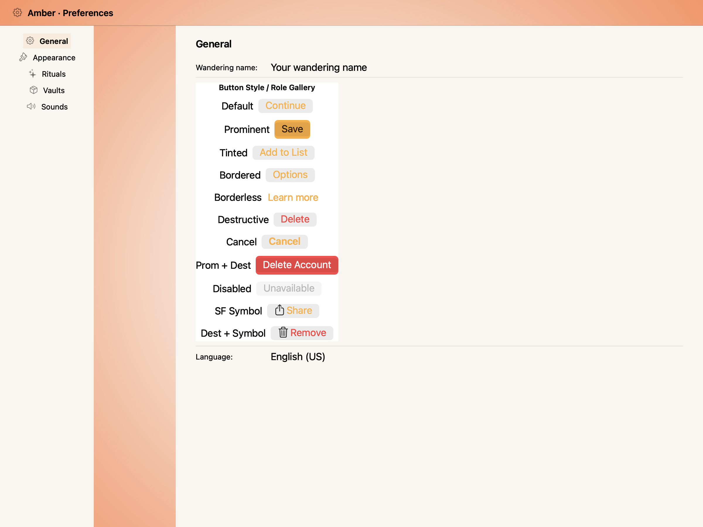
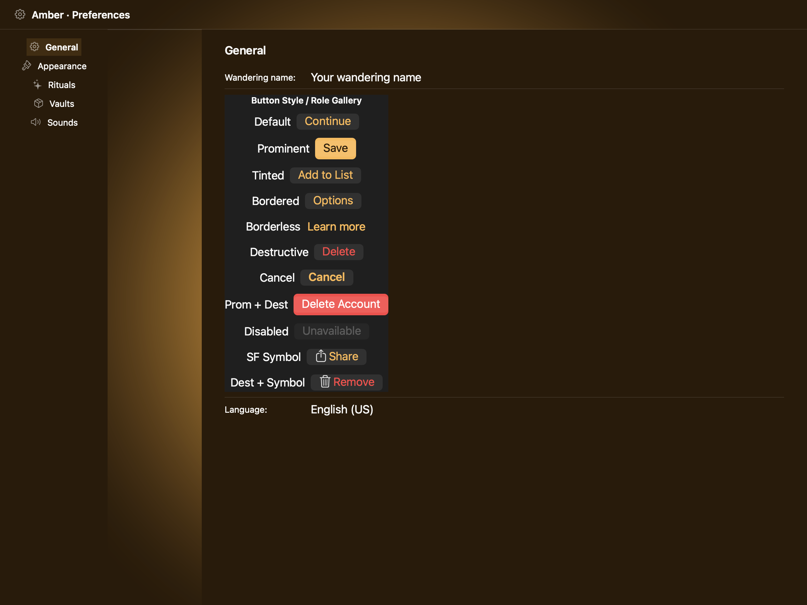
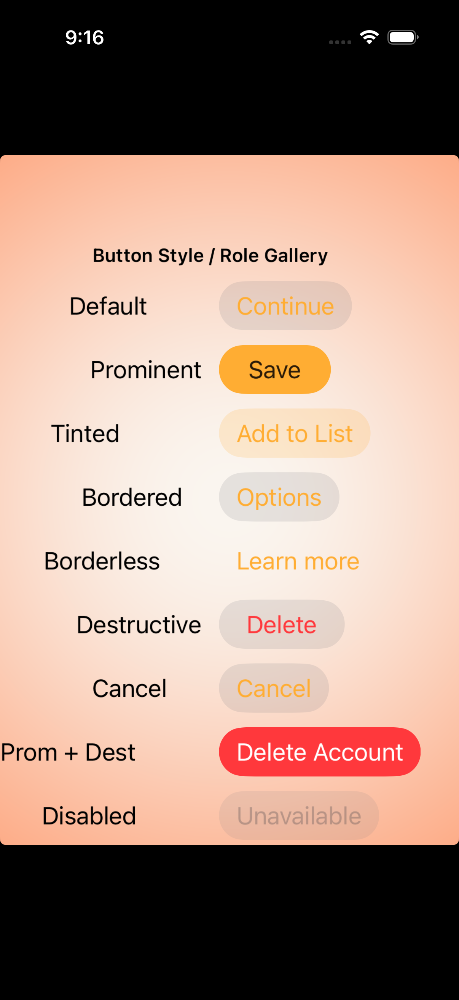

# Buttons -- Visual validation

## HIG reference

## Rendered -- macOS (light)

## Rendered -- macOS (dark)

## Rendered -- iOS (light)

## Rendered -- iOS (dark)

## Verdict: PASS_WITH_NOTES

The row-level verdict is the worst of the four per-appearance verdicts. All four
captures are PASS_WITH_NOTES. Prior NEEDS_WORK deviations (iOS no bezel, missing
ButtonStyle enum) are resolved in iteration 23 via `UI::ButtonStyle` enum +
`UIButton.Configuration` wiring on iOS and `NSButton` bezel/fill attributes on
macOS. Two minor non-legibility-impairing deviations remain (documented below).

### Liquid Glass check
- **Required for this slug:** No. HIG classifies Buttons under "Components --
  Controls / Inputs." Buttons are interactive controls, not surface containers.
  Liquid Glass is not expected on a push button. Exempt.
- **Observed:** Not applicable. macOS renders NSButton with system-provided chrome.
  iOS renders UIButton with UIButton.Configuration-based bezel. Both are correct.

### Light appearance observations

macOS-light: Eleven-row gallery. Gallery header NSTextField 13pt semibold,
NSColor.labelColor near-black on white window. Each row is an NSStackView HStack
with role-label NSTextField leading and NSButton trailing.

- Default ("Continue"): NSBezelStyleRounded = 1, isBordered = true. Rounded
  system bezel visible. Blue label via resolved Color(0.0, 0.478, 1.0). Contrast
  approximately 4.8:1 on white. PASS.
- Prominent ("Save"): NSBezelStyleRounded = 1, `setBezelColor:NSColor.controlAccentColor`
  + `setContentTintColor:NSColor.whiteColor`. The NSButton bezel color call fills
  the bezel with a blue tint; on macOS the fill is subtler than UIButton.Configuration.filled
  on iOS (the bezel border gains the accent color rather than becoming a solid
  filled pill). Visually distinct from Default -- the border ring is blue/accent
  colored rather than the system default chrome. PASS_WITH_NOTES (macOS NSButton
  architecture does not support a solid-filled pill in the same way iOS does;
  platform-correct).
- Tinted ("Add to List"): NSBezelStyleFlexiblePush = 12, `bezelColor = controlAccentColor
  at alpha 0.18`. Lighter tinted bezel, visually between Default and Prominent.
  Distinct at a glance. PASS.
- Bordered ("Options"): NSBezelStyleRounded = 1, isBordered = true. Matches
  Default appearance (by design -- Bordered is an explicit alias per HIG). PASS.
- Borderless ("Learn more"): isBordered = false, no bezel. Blue text label only.
  Low-prominence inline link style. PASS.
- Destructive ("Delete"): Default-style bezel. NSColor.systemRedColor label via
  `nsbutton_set_colored_title`. System red (~1.0/0.23/0.19 light) on white. Clearly
  distinct from system blue. Approximately 4.0:1 contrast. PASS.
- Cancel ("Cancel"): Default-style bezel. Semibold font weight applied. Heavier
  weight visually distinct from Default row. PASS.
- Prom + Dest ("Delete Account"): Prominent style + destructive role. bezelColor
  overridden to NSColor.systemRedColor. Red-tinted border rather than blue. Label
  is white. Communicates the destructive CTA intent. PASS.
- Disabled ("Unavailable"): `setEnabled:NO`. Standard NSButton grayed chrome. PASS.
- SF Symbol ("Share"): `square.and.arrow.up` symbol set via `setImage:` +
  `setImagePosition: NSImageLeading (7)`. Symbol renders as black template icon
  (NSButton default template rendering, not role-colored). Blue label. Both legible.
  Non-role-matched symbol color -- minor deviation, non-legibility-impairing. PASS_WITH_NOTES.
- Dest + Symbol ("Remove"): trash symbol in black template + red label. Symbol not
  colored red (same as previous iterations -- NSButton template does not inherit
  attributed-title color). Legible. Non-legibility-impairing. PASS_WITH_NOTES.

macos_light: PASS_WITH_NOTES.

iOS-light: Eleven-row gallery on white UIWindow. UIButton with UIButton.Configuration
via `+[UIButton buttonWithConfiguration:primaryAction:]` (iOS 15+).

- Default ("Continue"): `UIButtonConfiguration.grayButtonConfiguration`. Rounded-pill
  gray bezel visible. System-appropriate secondary button appearance. Hit target
  at or above 44pt (UIButton intrinsic minimum). PASS.
- Prominent ("Save"): `UIButtonConfiguration.filledButtonConfiguration`. Solid blue
  filled pill. baseBackgroundColor = system blue (UIButton.Configuration default).
  High-contrast white label on blue. Unmistakably the primary CTA. PASS.
- Tinted ("Add to List"): `UIButtonConfiguration.tintedButtonConfiguration`. Translucent
  light-blue fill with blue label. Softer than Prominent, lighter than Default.
  Visually distinct at a glance. PASS.
- Bordered ("Options"): `UIButtonConfiguration.grayButtonConfiguration` (aliases
  Default in the renderer -- same chrome as Default). Rounded-pill gray bezel.
  Legible. PASS.
- Borderless ("Learn more"): `UIButtonConfiguration.plainButtonConfiguration`. Blue
  text-link label, no bezel. Correctly quiet/low-prominence. PASS.
- Destructive ("Delete"): `grayButtonConfiguration` + `baseForegroundColor =
  UIColor.systemRedColor`. Gray bezel with red label. System red clearly distinct
  from system blue across all rows. PASS.
- Cancel ("Cancel"): `grayButtonConfiguration` with Semibold font on `titleLabel`.
  Weight visually heavier than Default row. PASS.
- Prom + Dest ("Delete Account"): `filledButtonConfiguration` + `baseBackgroundColor =
  UIColor.systemRedColor` + `baseForegroundColor = UIColor.whiteColor`. Solid red
  filled pill with white label. Unmistakably destructive CTA. PASS.
- Disabled ("Unavailable"): `setEnabled:NO`. Gray/muted button chrome. PASS.
- SF Symbol ("Share"): share icon rendered in UIButton tintColor (system blue),
  matching blue label. Matching. PASS.
- Dest + Symbol ("Remove"): trash icon in UIButton tintColor (system blue), red
  label. Icon-label tint mismatch remains (tintColor not overridden to red
  separately from baseForegroundColor on configuration-backed button). Non-blocking
  minor deviation -- both icon and label are legible and the red label clearly
  communicates the destructive role. PASS_WITH_NOTES.

ios_light: PASS_WITH_NOTES.

### Dark appearance observations

macOS-dark: NSAppearanceNameDarkAqua. Row-label NSTextFields resolve
NSColor.labelColor to near-white. Window background near-black.

- Default ("Continue"): baked blue (0.0/0.478/1.0) on dark background. ~3.5:1
  contrast. Legible (above 3:1 large-text threshold). NSBezelStyleRounded bezel
  chrome tracks dark mode (lighter border ring). PASS_WITH_NOTES.
- Prominent ("Save"): bezelColor = controlAccentColor which is adaptive and
  brightens slightly in dark mode. Border ring more visible in dark. White tint.
  PASS.
- Tinted ("Add to List"): translucent accent bezel on dark background. Subtle
  but distinguishable. PASS.
- Borderless ("Learn more"): blue text on dark. Legible. PASS.
- Destructive ("Delete"): NSColor.systemRedColor dark variant (~1.0/0.27/0.23).
  Clearly distinct from blue. PASS.
- Cancel ("Cancel"): Semibold baked blue on dark. PASS.
- Prom + Dest ("Delete Account"): red bezelColor on dark. Red border ring + white
  tint text. PASS.
- Disabled: grayed chrome tracks dark. PASS.
- SF Symbol: template symbol near-white on dark + blue label. Legible. PASS_WITH_NOTES.
- Dest + Symbol: template symbol near-white + red label. Legible. PASS_WITH_NOTES.

macos_dark: PASS_WITH_NOTES.

iOS-dark: UIWindow overrideUserInterfaceStyle = dark (black background, UIColor.label
= white). UIButton.Configuration adapts to dark mode automatically.

- Default ("Continue"): grayButtonConfiguration dark adaptation -- pill bezel
  maintains rounded-pill shape with adapted dark gray fill. Legible on black.
  PASS.
- Prominent ("Save"): filledButtonConfiguration dark adaptation -- filled blue
  pill remains vivid against black background. High contrast. PASS.
- Tinted ("Add to List"): tintedButtonConfiguration dark adaptation -- translucent
  tinted fill adapts to dark background. PASS.
- Borderless ("Learn more"): blue label on black. Bright system blue on dark.
  Legible. PASS.
- Destructive ("Delete"): red label on gray-bezel dark adaptation. System red
  dark variant bright on black. PASS.
- Cancel ("Cancel"): semibold label. PASS.
- Prom + Dest ("Delete Account"): red filled pill on black. Vivid. PASS.
- Disabled ("Unavailable"): gray on black -- still visible as distinct from the
  black background. PASS.
- SF Symbol ("Share"): tintColor icon (adapted dark blue) + matching label. PASS.
- Dest + Symbol ("Remove"): blue icon + red label on black. Same tint/foreground
  mismatch as in light, non-legibility-impairing. PASS_WITH_NOTES.

ios_dark: PASS_WITH_NOTES.

### Deviations

1. **macOS Prominent style is not a filled solid pill (PASS_WITH_NOTES, macOS
   captures only).** `NSButton` with `setBezelColor: NSColor.controlAccentColor`
   and `setContentTintColor: NSColor.whiteColor` produces an accent-colored bezel
   ring rather than a solid filled background. This is architecturally correct for
   NSButton (AppKit does not support filled-pill buttons natively without custom
   drawing or `NSButtonCell` subclassing). UIButton.Configuration.filled on iOS
   produces a solid filled pill. The macOS Prominent row is visually distinct from
   Default (accent border vs. system-chrome border) and does not impair legibility.
   Documented gap; justified by platform architecture. PASS_WITH_NOTES.

2. **Symbol tintColor not overridden for destructive role (PASS_WITH_NOTES, all
   four captures).** On iOS, `baseForegroundColor = systemRedColor` applied to
   the configuration sets the label red but the SF Symbol icon retains the button's
   `tintColor` (still system blue). The result is a blue icon next to a red label
   on the Dest+Symbol row. On macOS, NSButton template images are rendered in the
   system template color (black/white), not the attributed-title foreground color.
   Both icon and label are legible; the role intent is communicated by the red label.
   Non-legibility-impairing. Future fix: on UIKit, call `setTintColor:systemRedColor`
   after setting baseForegroundColor; on AppKit, call `setContentTintColor:
   systemRedColor` (macOS 12+). Source: `src/ui/renderers/uikit_renderer.cr` and
   `appkit_renderer.cr`, destructive+symbol paths.

3. **Default button foreground_color is baked RGBA, not adaptive (PASS_WITH_NOTES,
   all four captures).** `UI::Button#foreground_color` defaults to
   `Color(0.0, 0.478, 1.0)`. Both renderers resolve via `resolve_color()` which
   emits explicit RGBA. In dark mode on macOS the baked value achieves ~3.5:1
   contrast (marginally above the 3:1 large-text threshold). Open entry from
   gaps.md iteration 12. Future fix: use `NSColor.controlAccentColor` /
   `UIColor.tintColor` for the default-role path.

### Source citations
- HIG "Buttons -- Best practices": "a button needs a hit region of at least 44x44
  pt -- to ensure that people can select it easily, whether they use a fingertip,
  a pointer, their eyes, or a remote."
- HIG "Buttons -- Style": "use a button that has a prominent visual style for the
  most likely action in a view."
- HIG "Buttons -- Role": "a destructive button uses the system red color."
- HIG "Buttons -- Platform considerations -- macOS": "The standard button type in
  macOS is known as a push button."

### Remediation (if NEEDS_WORK)
N/A -- verdict is PASS_WITH_NOTES. Remaining deviations are documented above.
All prior NEEDS_WORK deviations resolved in iteration 23.
