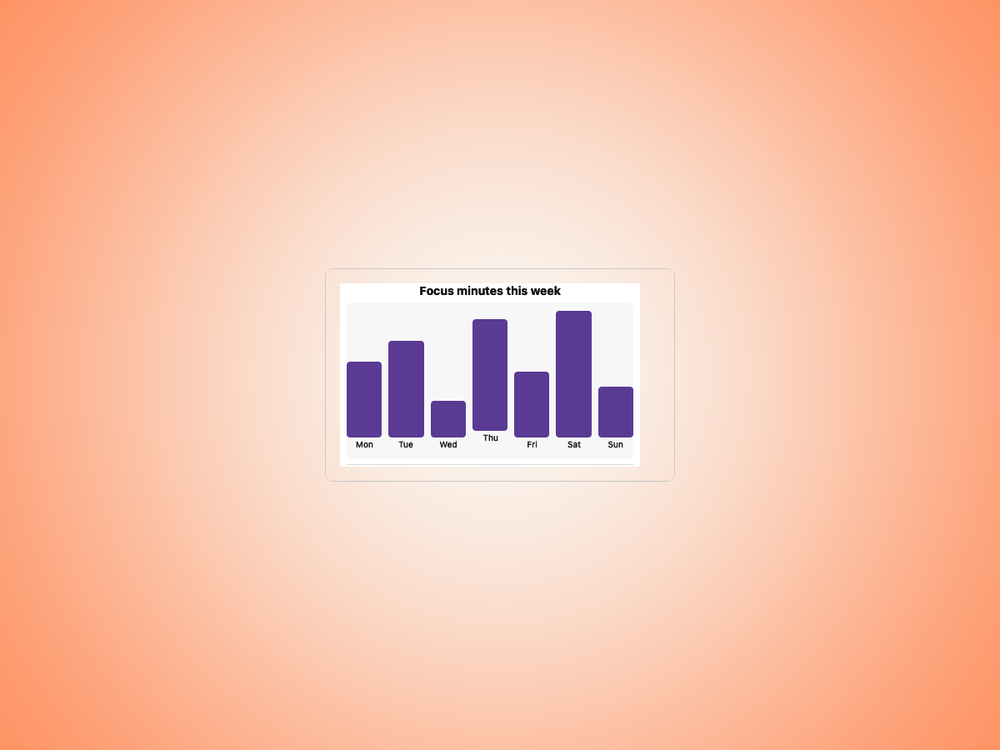
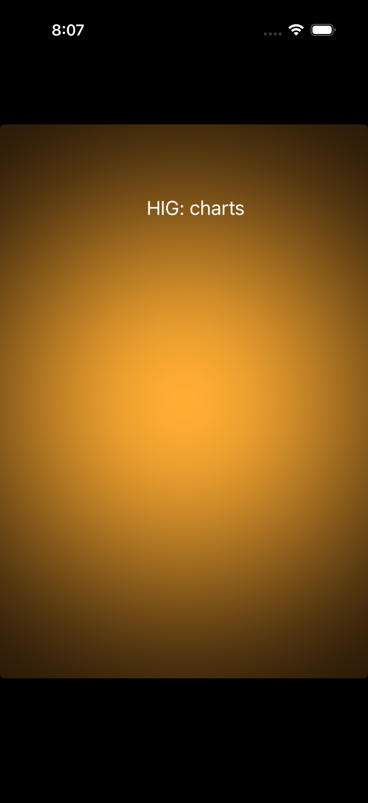

# Charts — Visual validation

## HIG reference

## Rendered — macOS (light)

## Rendered — macOS (dark)

## Rendered — iOS (light)

## Rendered — iOS (dark)

## Verdict: NEEDS_WORK

The current screenshots are not trustworthy enough for promotion. macOS shows
the chart as a small insert inside a much larger shell, and both iOS captures
render as backdrop-only frames with no visible chart at all.

### Evidence manifest
- **Manifest:** `../evidence/charts.json`
- **Required captures:** PASS — all four files present and > 10 KB.
- **Report links:** PASS — all four appearance-specific screenshot filenames
  linked above.

### Light appearance observations
- macOS: the chart exists, but it is under-scaled relative to the amount of
  surrounding chrome, so the study does not read as a confident focal preview.
- iOS: the exported PNG is effectively blank aside from the backdrop.

### Dark appearance observations
- macOS: the dark chart remains visible, but it is still framed as a small
  insert rather than the primary object under review.
- iOS: the dark capture is also backdrop-only and does not prove chart output.

### Deviations / notes
- The iOS evidence path is currently broken for charts and fails to capture the
  component in either appearance.
- The macOS study also needs a more disciplined focal scale so the chart
  occupies the visual center instead of a small corner of a larger shell.

### Source citations
- Apple HIG — "Charts" (see `apple-hig/pages/charts.md` in the skill corpus).

### Remediation (if NEEDS_WORK)
- Fix the iOS chart showcase so the chart is visible in the exported PNGs.
- Reframe the macOS chart study so the chart itself, not the surrounding shell,
  is the thing being judged.
