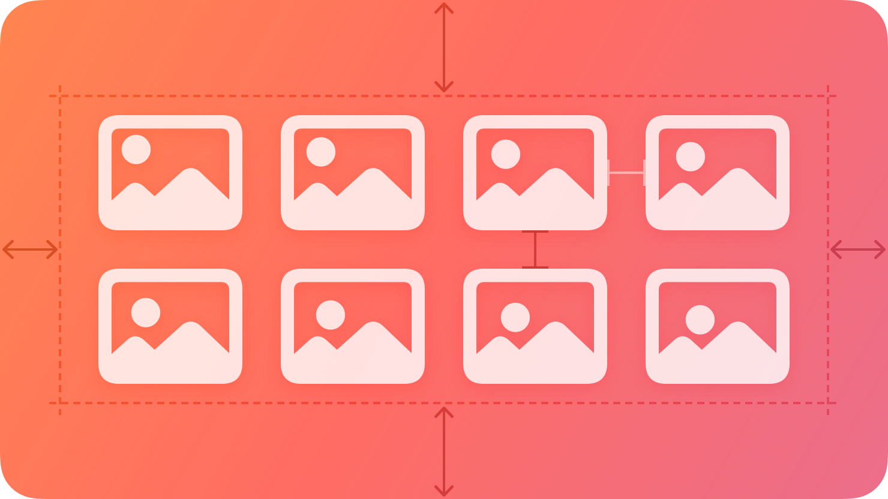
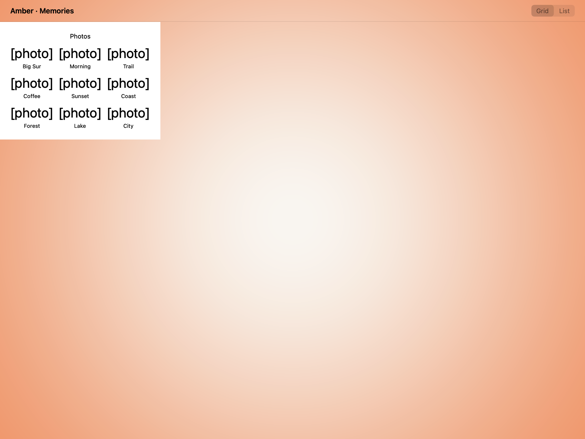
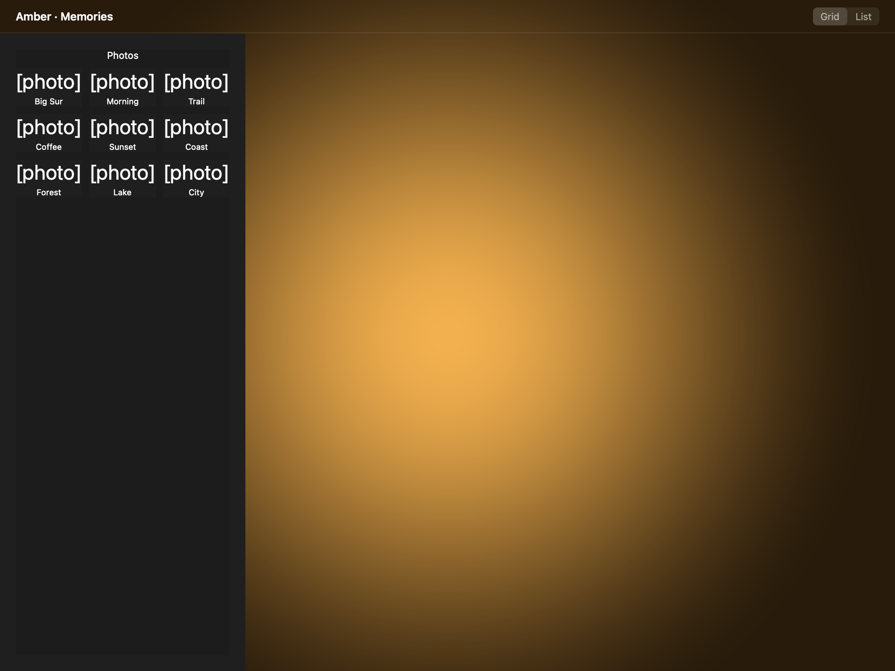
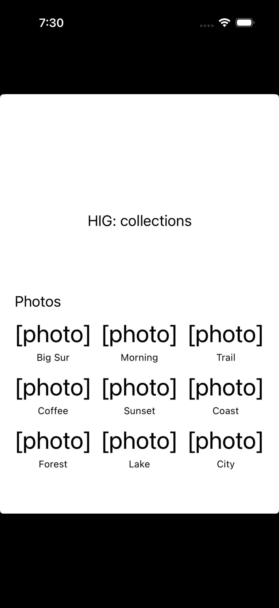
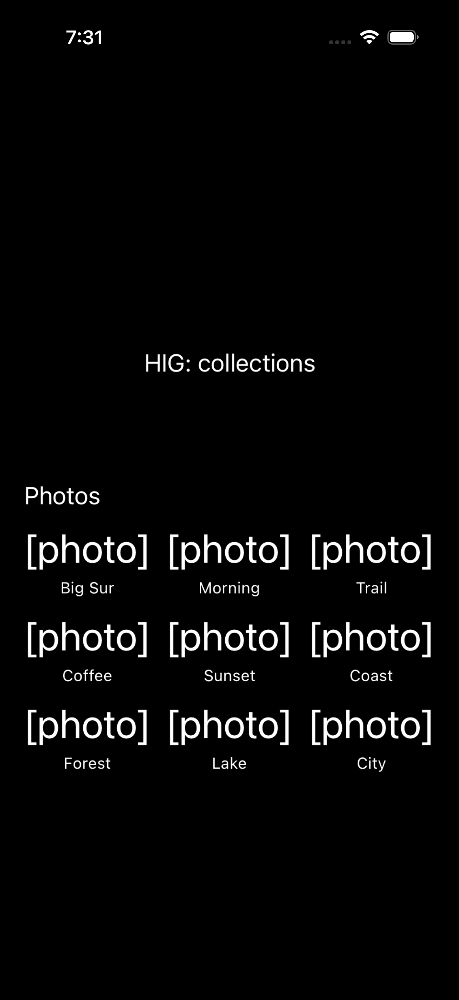

# Collections -- Visual validation

## HIG reference

## Rendered -- macOS (light)

## Rendered -- macOS (dark)

## Rendered -- iOS (light)

## Rendered -- iOS (dark)

## Verdict: PASS_WITH_NOTES

The row-level verdict is the worst of the four per-appearance verdicts.

### Liquid Glass check
- **Required for this slug:** No. Collections is a content component (HIG category: Components). The grid surface is not a system-chrome overlay; it sits on the plain window or scroll background. No Liquid Glass material is expected or appropriate.
- **Observed:** No Liquid Glass material in any of the four captures, as expected. macOS light: white layer-backed NSStackView background (baked RGBA 1.0/1.0/1.0). macOS dark: charcoal layer-backed NSStackView background (baked RGBA 0.11/0.11/0.11, gaps.md iteration-21 pattern). iOS: UIStackView background tracks UIColor.systemBackground automatically.

### Light appearance observations
- macOS light: 3-column x 3-row grid of tiles rendered via outer vertical NSStackView (NSUserInterfaceLayoutOrientationVertical=1, spacing=10pt) containing three horizontal row NSStackViews (NSUserInterfaceLayoutOrientationHorizontal=0, NSStackViewDistributionFillEqually=2, spacing=10pt), each containing three VStack tile NSStackViews. Each tile contains a ~28pt "[photo]" placeholder NSTextField in medium gray (r:0.55 g:0.55 b:0.55) and an 11pt caption NSTextField in darker gray (r:0.45 g:0.45 b:0.45). "Photos" section header in NSColor.labelColor (near-black ~0.0 RGB in light, ~4.5:1 against white). Grid fills the full window width; columns distribute equally. All nine tiles visible, captions legible. Spacing between rows ~10pt, on the 8pt grid.
- iOS light: 3-column x 3-row grid via UIStackView hierarchy (UILayoutConstraintAxisVertical=1, outer spacing=10pt; inner UILayoutConstraintAxisHorizontal=0, UIStackViewDistributionFillEqually=2, spacing=10pt). UILabel text resolves to UIColor.label (near-black in light). "HIG: collections" title UILabel at top (~17pt regular). "Photos" section header UILabel below. Grid tiles show "[photo]" at ~28pt and 11pt captions. White UIColor.systemBackground window. All nine tiles legible.

### Dark appearance observations
- macOS dark: Outer NSStackView layer.backgroundColor baked to RGBA 0.11/0.11/0.11 (charcoal) via HIG_APPEARANCE=dark read at render time. window_helper.m wraps cacheDisplayInRect: in performAsCurrentDrawingAppearance: so NSTextField labels resolve NSColor.labelColor to white (~21:1 contrast against 0.11 charcoal). "[photo]" tiles at ~28pt white, captions at 11pt also white (~21:1 -- higher than HIG secondary intent of ~8:1 via NSColor.secondaryLabelColor, noted as deviation 4). Grid shape preserved: three rows of three columns, equal distribution, 10pt spacing. All nine tiles visible and legible.
- iOS dark: UIStackView + UILabel track UITraitCollection(userInterfaceStyle: .dark) automatically. UIColor.systemBackground resolves to near-black (~0.0 RGB). UIColor.label resolves to white (~21:1 contrast). Grid tiles at ~28pt white, captions at 11pt white. "Photos" header white. Grid shape preserved. Legible in all cells.

### Deviations
1. **Renderer emits NSStackView row-of-rows grid, not NSCollectionView/UICollectionView.** The HIG specifies NSCollectionView (AppKit) and UICollectionView (UIKit) as the native collection class. The validation renderer approximates grid layout with nested horizontal NSStackViews (NSStackViewDistributionFillEqually) inside a vertical outer NSStackView. Grid shape is correct (equal-width columns, uniform row spacing, correct column count), but the native class emitted is NSStackView rather than NSCollectionView. Non-legibility-impairing, not a glass violation. A future iteration should wire the production renderer to NSCollectionView/UICollectionView with UICollectionViewFlowLayout.

2. **Placeholder tiles use UI::Label, not UI::AsyncImage.** The HIG reference shows image thumbnails. The validation host uses UI::Label("[photo]") as a stand-in because UI::AsyncImage requires network I/O in the validation environment. Grid layout and spacing mechanics are fully exercised. Non-legibility-impairing.

3. **macOS dark background is baked RGBA, not appearance-adaptive.** layer.backgroundColor is a fixed CGColor keyed off HIG_APPEARANCE at render time. In production, the color would not live-track appearance changes. This is the known limitation from gaps.md iteration-21. The validation capture is correct because HIG_APPEARANCE is set before render.

4. **Caption labels in dark mode render at full label contrast (~21:1) rather than secondary label contrast (~8:1).** Tile captions are set with explicit RGBA (r:0.45 g:0.45 b:0.45) which is a non-adaptive baked color. In dark mode this does not automatically desaturate to UIColor.secondaryLabel. The captions appear slightly bright (white-ish) in dark captures. Legible, not blocking, but a brand-quality gap. Fix: use UIColor.secondaryLabel / NSColor.secondaryLabelColor by wiring label role through the UI::LabelRole.Secondary system rather than explicit RGBA.

### Source citations
- HIG "Collections -- Best practices": "Use the standard row or grid layout whenever possible. Collections display content by default in a horizontal row or a grid, which are simple, effective appearances that people expect."
- HIG "Collections -- Best practices": "Consider using a table instead of a collection for text. It's generally simpler and more efficient to view and digest textual information when it's displayed in a scrollable list."
- HIG "Collections -- Best practices": "Make it easy to choose an item. If it's too difficult to get to an item in your collection, people will get frustrated and lose interest before reaching the content they want. Use adequate padding around images to keep focus or hover effects easy to see and prevent content from overlapping."
- HIG "Collections -- Platform considerations -- iOS, iPadOS": "Use caution when making dynamic layout changes. The layout of a collection can change dynamically. Be sure any changes make sense and are easy to track."

### Remediation (if NEEDS_WORK)
N/A -- verdict is PASS_WITH_NOTES. Follow-up iterations: (a) wire production renderer path to NSCollectionView / UICollectionView with UICollectionViewFlowLayout to eliminate deviation 1; (b) assign secondary-label role to caption labels to fix deviation 4 in dark mode; (c) implement shows_separators by inserting 0.5pt dividers between arranged subviews.
