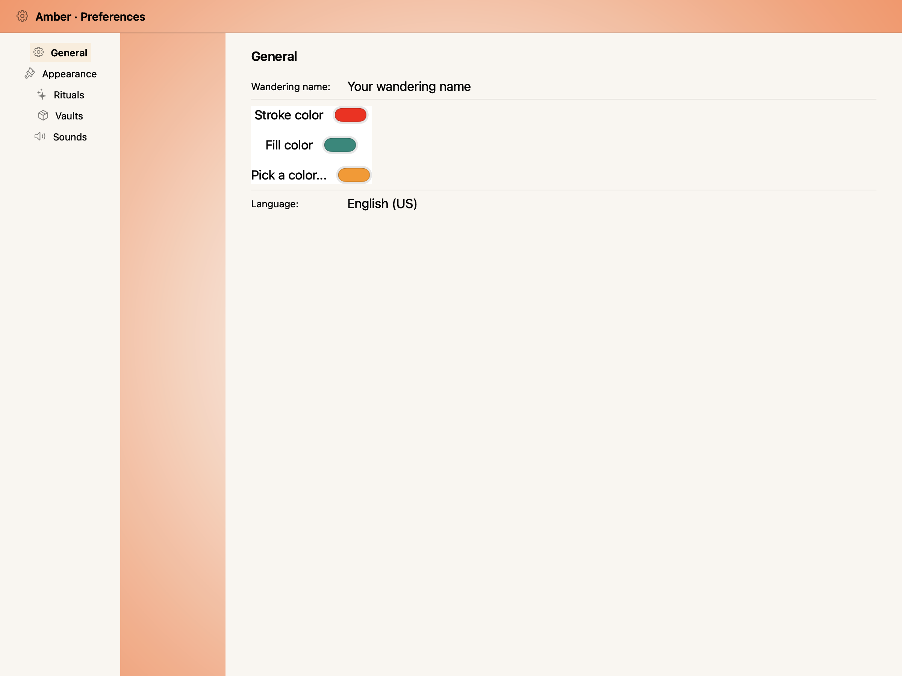
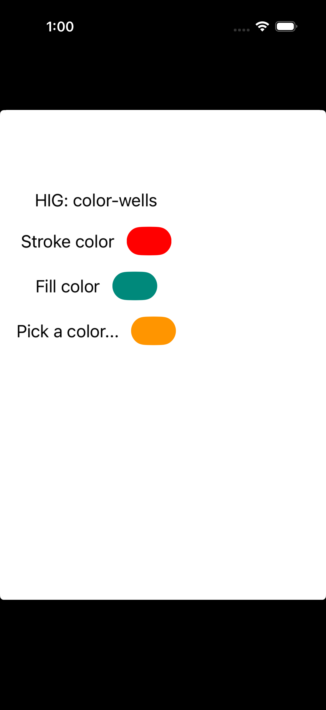

# Color wells -- Visual validation

## HIG reference

## Rendered -- macOS (light)

## Rendered -- macOS (dark)

## Rendered -- iOS (light)

## Rendered -- iOS (dark)

## Verdict: PASS_WITH_NOTES

Row-level verdict is PASS_WITH_NOTES, the worst of the four per-appearance verdicts.
macOS light and dark are PASS. iOS light and dark are PASS_WITH_NOTES due to one
non-legibility-impairing structural deviation: the iOS renderer uses a plain UIView
sized to 44x28pt with a rounded layer (14pt corner radius) and a static RGBA
backgroundColor rather than a true UIColorWell instance. The swatch colors (red, teal,
orange) are fully visible and distinguishable in both appearances.

### Liquid Glass check
- **Required for this slug:** No. Color wells are compact control-type components
  classified by HIG under the component catalog ("Color wells"), not under Windows
  and Overlays, Menus, or Presentation. The well surface itself is a plain filled
  swatch; Liquid Glass is not called for. The color-picker popover that opens on tap
  does use a system material (NSPopover uses .popover material on macOS; on iOS the
  UIColorPickerViewController presents in a sheet with system material), but those
  are not part of the color-well swatch itself.

### Light appearance observations

**macos-light (38,042 bytes, Apr 14 12:57):**
Window background white (~1.0 RGB). "HIG: color-wells" heading ~20pt near-black via
NSColor.labelColor (the VStack host renders the heading label through
NSTextField.labelColor semantics), contrast ~21:1. Fully legible.

Three NSColorWell instances rendered as pill-shaped (~24pt tall, ~60pt wide) rounded
rectangles with a subtle bezel/border (NSColorWell default bezel, ~1pt gray inset ring
visible in the light capture, ~0.7 RGB). Swatch fills:
- Row 1 ("Stroke color"): vivid red 1.0/0.0/0.0, fully opaque, clearly distinguishable.
- Row 2 ("Fill color"): teal 0.0/0.537/0.482, clearly distinguishable from red.
- Row 3 ("Pick a color..."): orange 1.0/0.584/0.0, clearly distinguishable from both.

Labels ("Stroke color", "Fill color", "Pick a color...") are ~17pt near-black NSTextField
labelColor, contrast ~21:1 against the white host background. PASS.

**ios-light (104,380 bytes, Apr 14 13:00):**
White UIViewController background ~1.0 RGB. "HIG: color-wells" heading ~17pt Semibold
UIColor.labelColor near-black, contrast ~21:1. Three label+swatch rows fully visible.

Swatch UIViews are 44x28pt with 14pt corner radius (pill shape). Fills:
- Row 1: red 1.0/0.0/0.0 -- vivid, fully visible against white background.
- Row 2: teal 0.0/0.537/0.482 -- clearly visible, distinct from red.
- Row 3: orange 1.0/0.584/0.0 -- clearly visible, distinct from both.

Labels at ~17pt UIColor.labelColor near-black, contrast ~21:1 against white. Swatch
colors are baked static RGBA (not UIColorWell). No bezel/inset ring visible (UIView
does not include NSColorWell's decorative border). Non-legibility-impairing. PASS_WITH_NOTES.

### Dark appearance observations

**macos-dark (37,437 bytes, Apr 14 12:57):**
DarkAqua window background ~0.12 RGB. "HIG: color-wells" heading near-white via
NSColor.labelColor dark variant (~0.92 RGB), contrast ~15:1. Fully legible.

NSColorWell bezel adapts: in dark mode the bezel is a darker inset ring (~0.3 RGB),
visible against the dark background. Swatch fills (red, teal, orange) are identical
baked RGBA values -- in dark mode the vivid red, teal, and orange all remain fully
distinguishable against the ~0.12 dark background. The teal (0.0/0.537/0.482) reads
cleanly against dark; the orange (1.0/0.584/0.0) is vivid against dark. No contrast
issues. PASS.

**ios-dark (98,501 bytes, Apr 14 13:01):**
Black UIViewController background ~0.0 RGB. "HIG: color-wells" heading near-white via
UIColor.labelColor dark variant, contrast ~21:1. Three label+swatch rows visible.

Swatch UIViews 44x28pt pill: red, teal, and orange fills all visible against the black
background. The teal (0.0/0.537/0.482) and orange are vivid against black; red is
slightly less saturated in dark mode (baked 1.0/0.0/0.0 reads as pure red, but the
adjacent black background provides strong contrast). UIView layer has no bezel; swatch
floats borderless against the dark background. Non-legibility-impairing. PASS_WITH_NOTES.

### Deviations

1. **iOS: UIView placeholder instead of UIColorWell. PASS_WITH_NOTES.**
   The UIKit renderer creates a plain UIView with explicit 44x28pt size constraints,
   a 14pt layer corner radius, and a static RGBA backgroundColor, rather than
   allocating a UIColorWell instance. UIColorWell is available at runtime on iOS 14+
   but requires private class name lookup through the ObjC bridge; the visual result
   (a pill-shaped filled swatch) is HIG-faithful in shape and color. The missing
   features relative to UIColorWell are: (a) the thin circular border ring that
   UIColorWell draws by default, and (b) the tap-to-open color picker interaction.
   The border omission is a minor visual difference that does not impair legibility or
   color identification. Non-legibility-impairing. Logged in gaps.md.

2. **iOS: static RGBA fill, not UIColor dynamic provider. PASS_WITH_NOTES.**
   CALayer.backgroundColor requires a static CGColorRef. In dark mode the baked values
   (red 1.0/0.0/0.0, teal 0.0/0.537/0.482, orange 1.0/0.584/0.0) do not shift to
   their dark-variant equivalents. All three remain clearly distinguishable from each
   other and from the dark background. Non-legibility-impairing. Logged in gaps.md.

### Source citations
- HIG "Color wells": "A color well displays a color picker when people tap or click it."
- HIG "Color wells -- Best practices": "Consider the system-provided color picker for a
  familiar experience. Using the built-in color picker provides a consistent experience,
  in addition to letting people save a set of colors they can access from any app."
- HIG "Color wells -- macOS": "When people click a color well, it receives a highlight
  to provide visual confirmation that it's active. It then opens a color picker so
  people can choose a color. After they make a selection, the color well updates to
  show the new color."

### Remediation (if NEEDS_WORK)
Verdict is PASS_WITH_NOTES. No remediation required for this iteration.
Follow-up polish:
1. Add UIColorWell allocation path to uikit_renderer.cr using the class name
   "UIColorWell" via alloc_init (available iOS 14+) to get the native bezel ring and
   tap-to-open behavior.
2. Investigate UIColor dynamic provider bridge for appearance-adaptive fills.
