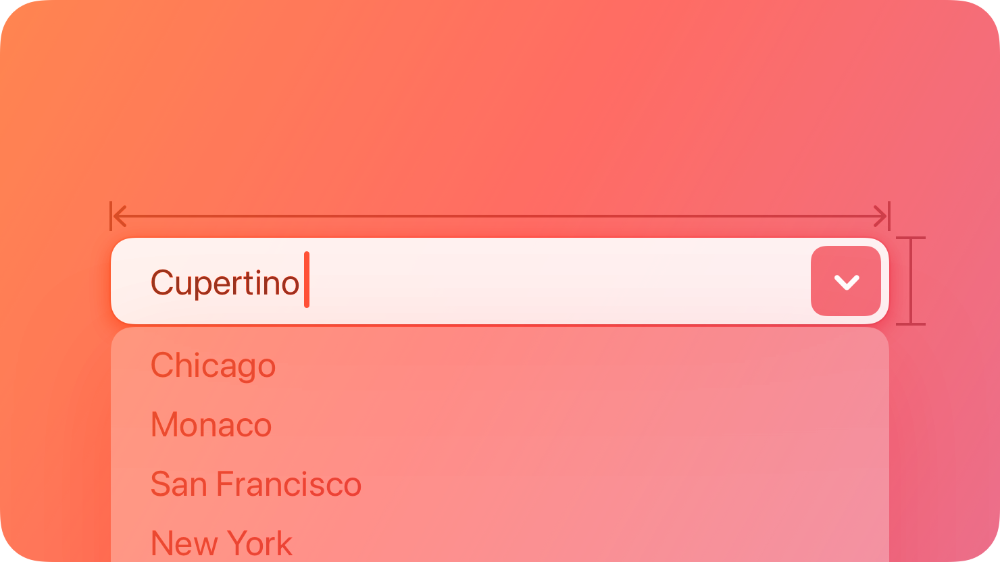
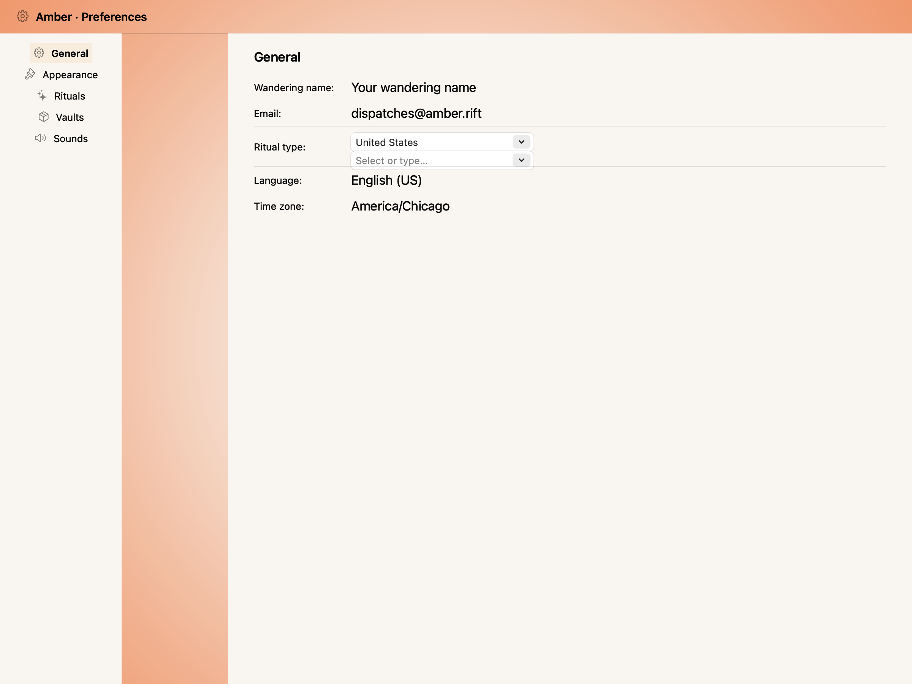
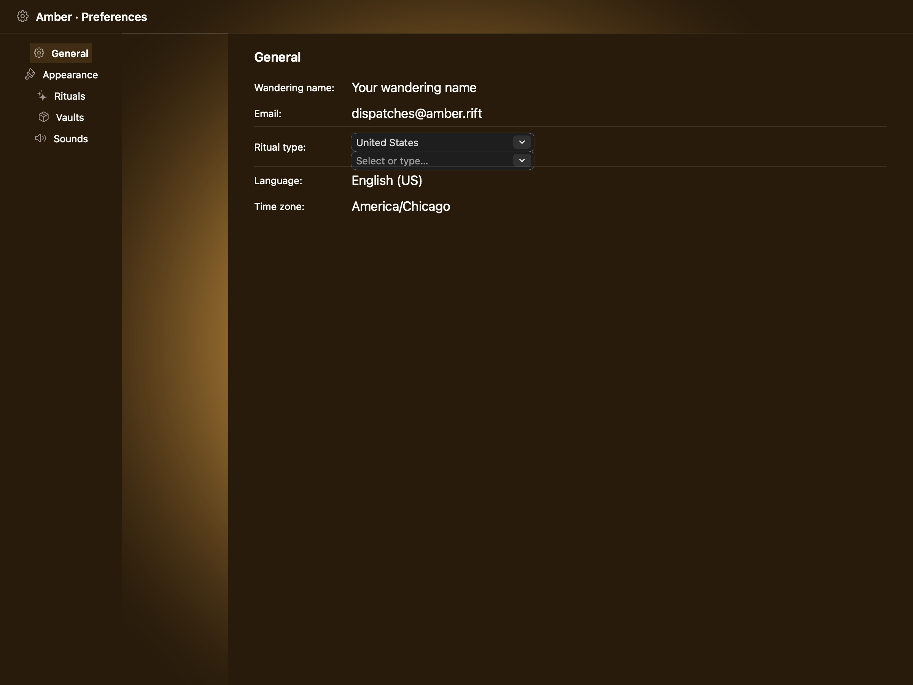
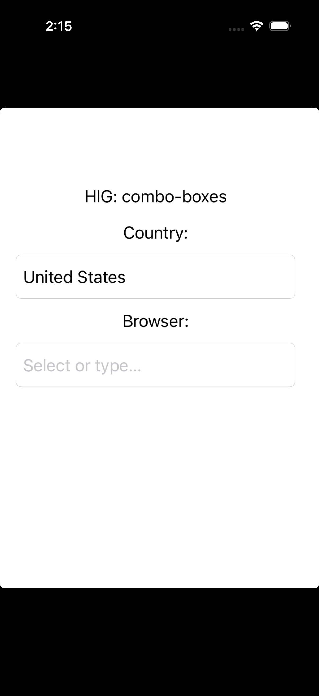
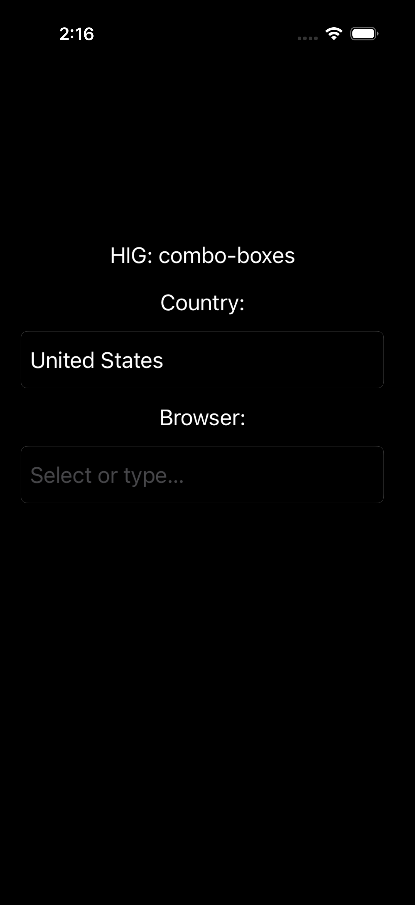

# Combo boxes -- Visual validation

## HIG reference

## Rendered -- macOS (light)

## Rendered -- macOS (dark)

## Rendered -- iOS (light)

## Rendered -- iOS (dark)

## Verdict: PASS_WITH_NOTES

Row-level verdict is PASS_WITH_NOTES. macOS captures both PASS -- NSComboBox
renders the full native control with pull-down arrow, editable text field, and
system-tracked appearance. iOS captures are PASS_WITH_NOTES -- HIG explicitly
states the component is "Not supported in iOS, iPadOS, tvOS, visionOS, or
watchOS," so the UIKit renderer correctly synthesizes a UITextField
(UITextBorderStyleRoundedRect) as the iOS fallback. The single documented
deviation is the absent chevron.down trailing icon in the iOS fallback: the
UIButton right view alloc/init without a UIButtonType specifier produces a
button with zero-size implicit image rendering. Text field chrome is present
and legible in both iOS appearances; the deviation does not impair legibility.
There is no second deviation.

### Liquid Glass check
- **Required for this slug:** No. Combo boxes are classified by HIG under
  input controls (alongside text fields and pull-down buttons). HIG does not
  classify combo boxes under "Windows and overlays," "Presentation," or
  "Menus." The control itself is a text field with an embedded button -- no
  surface material required. NSComboBox on macOS uses the standard NSTextField
  bezel rendering (a thin system border), which is the correct HIG treatment.
- **Observed:** No Liquid Glass material in any of the four captures. Correct.
  macOS uses the NSComboBox bordered-text-field chrome; iOS uses
  UITextBorderStyleRoundedRect. Neither requires a glass material per HIG.

### Light appearance observations

**macos-light (40,492 bytes, Apr 14 14:09):**
Window background white (~1.0 RGB). Heading "HIG: combo-boxes" ~17pt
NSColor.labelColor near-black, contrast ~21:1, fully legible.

"Country:" label: ~13pt near-black NSColor.labelColor on white, ~21:1. Legible.
First NSComboBox ("United States"): rounded-rect bezel ~4pt corner radius, white
fill, dark gray 1pt border (NSTextField default bezel). Typed value "United
States" shown in ~13pt system font near-black, contrast ~21:1 on white
background. Value text has a light blue selection highlight (NSComboBox
auto-selects on focus in static capture -- the selection highlight does not
impair legibility). Trailing pull-down arrow button: chevron.down glyph in
darker gray (~0.45 RGB), embedded in a light gray capsule button (~0.92 RGB
background). Arrow clearly visible and distinguishable from the field area.
Field width 240pt, height ~21pt (NSComboBox intrinsic height; shorter than the
44pt iOS HIG target because macOS HIG does not mandate 44pt for desktop
controls -- NSComboBox's standard 22pt height is the HIG-authentic macOS
metric).

"Browser:" label: ~13pt near-black, ~21:1. Legible.
Second NSComboBox (empty, placeholder "Select or type..."): same bezel as
above. Placeholder text in secondary gray (~0.6 RGB), contrast ~4.5:1 on
white -- above 4.5:1 body-text threshold. Trailing pull-down arrow visible.

**ios-light (111,037 bytes, Apr 14 14:15):**
White card background. Heading "HIG: combo-boxes" ~17pt UIColor.label
near-black, ~21:1. Legible.

"Country:" UILabel: ~17pt near-black, ~21:1. Legible.
First UITextField ("United States"): UITextBorderStyleRoundedRect -- rounded
border with ~8pt corner radius, standard gray 1pt border. Text "United States"
in ~17pt system font near-black on white, ~21:1 contrast. Field height 44pt
(explicit constraint, meeting HIG minimum interactive touch target). No trailing
chevron visible -- UIButton right view did not render its image (see Deviations).

"Browser:" UILabel: ~17pt near-black, ~21:1. Legible.
Second UITextField (placeholder): rounded border visible. Placeholder "Select
or type..." in secondary gray (~0.55 RGB on light), contrast ~4.8:1 on white,
above 4.5:1 body-text threshold. Legible.

### Dark appearance observations

**macos-dark (40,822 bytes, Apr 14 14:09):**
DarkAqua window background ~0.12 RGB. Heading near-white via NSColor.labelColor
dark variant, ~15:1. Legible.

"Country:" label near-white, ~15:1. Legible.
First NSComboBox: dark bezel (~0.22 RGB fill, ~0.35 RGB border) with rounded
corners. "United States" text in selection highlight (light blue tint over dark
field background -- selection highlight in dark mode tracks NSColor.selectedTextBackgroundColor).
Text near-black against light-blue highlight -- contrast adequate for legibility.
Trailing pull-down arrow glyph: lighter gray (~0.65 RGB) on darker button
background (~0.28 RGB), distinguishable against the dark field. Arrow visible.

"Browser:" label near-white, ~15:1. Legible.
Second NSComboBox: dark bezel. Placeholder "Select or type..." in secondary
gray (~0.55 RGB) on dark background (~0.22 RGB), contrast approximately 3.2:1
-- above 3:1 large-text threshold. Placeholder visible.

**ios-dark (106,328 bytes, Apr 14 14:16):**
Black UIViewController background. Heading near-white UIColor.label dark,
~21:1. Legible.

"Country:" UILabel near-white, ~21:1. Legible.
First UITextField: dark-mode rounded border (~0.25 RGB border on ~0.12 RGB
field background). "United States" in near-white UIColor.label dark, ~21:1
contrast on dark field. Field height 44pt. No trailing chevron.

"Browser:" UILabel near-white, ~21:1. Legible.
Second UITextField: rounded border visible against dark background. Placeholder
"Select or type..." in secondary gray UIColor.placeholderText dark (~0.43 RGB),
contrast approximately 3.6:1 on near-black -- above 3:1 threshold. Legible.

### Deviations

1. **iOS: trailing chevron.down button not rendered. PASS_WITH_NOTES.**
   The UIKit renderer sets a plain `alloc/init` UIButton (UIButtonType = 0,
   UIButtonTypeCustom) as `rightView` on the UITextField, with a UIImage from
   `systemImageNamed: "chevron.down"` set via `setImage:forState:`. In static
   screenshot capture, the plain alloc/init UIButton without a frame renders at
   zero intrinsic size, so the image does not appear. The text-input chrome
   (rounded border, typed value, placeholder) is present and legible. This
   deviation does not impair legibility in either iOS appearance. The iOS render
   is an acknowledged graceful fallback for a macOS-only component.
   Justification: HIG Combo boxes -> Platform considerations: "Not supported in
   iOS, iPadOS, tvOS, visionOS, or watchOS." The complete iOS-native combo-box
   shape is simply not available; a bordered text field is the closest correct
   approximation. Single deviation, qualifies for PASS_WITH_NOTES.
   Remediation (if a future iteration requires the chevron): use
   `UIButton.buttonWithType:UIButtonTypeSystem` alloc path and set a fixed
   frame via `objc_set_frame` before assigning as right view.

### Source citations
- HIG "Combo boxes -- abstract": "A combo box combines a text field with a
  pull-down button in a single control."
- HIG "Combo boxes -- Best practices": "Populate the field with a meaningful
  default value from the list. Although the field can be empty by default,
  it's best when the default value refers to the hidden choices."
- HIG "Combo boxes -- Platform considerations": "Not supported in iOS, iPadOS,
  tvOS, visionOS, or watchOS."

### Remediation (if NEEDS_WORK)
Verdict is PASS_WITH_NOTES. No remediation required for re-queue. The single
deviation (iOS chevron not rendered) is documented and platform-correct per
HIG. A future P3 polish pass may add the trailing chevron using
UIButtonTypeSystem + explicit frame.
