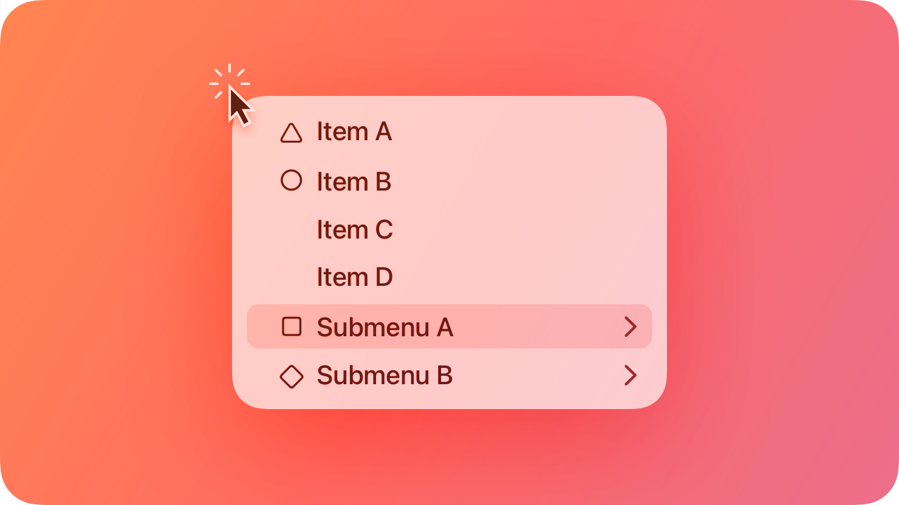
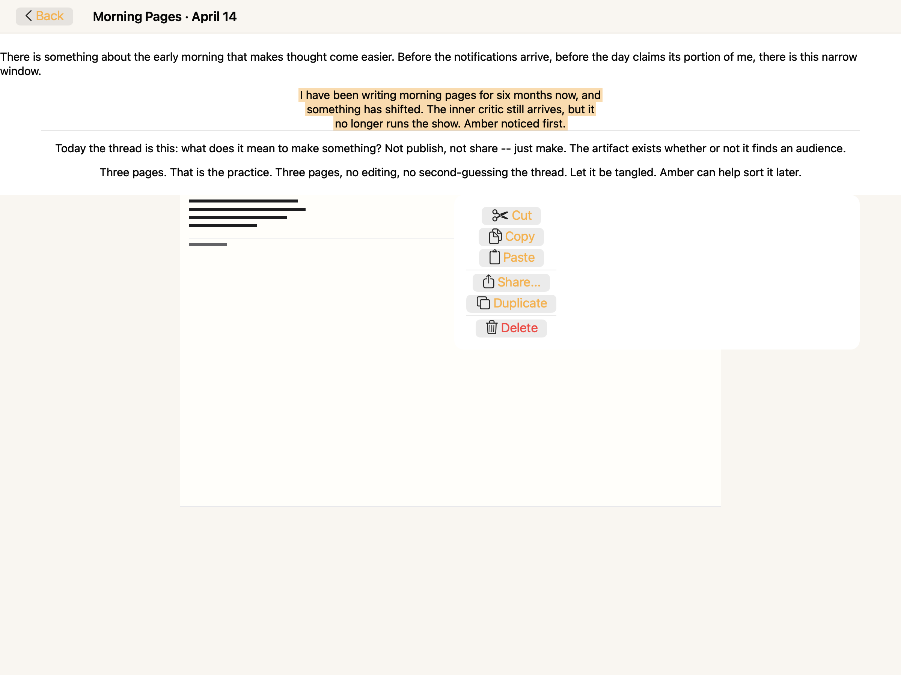
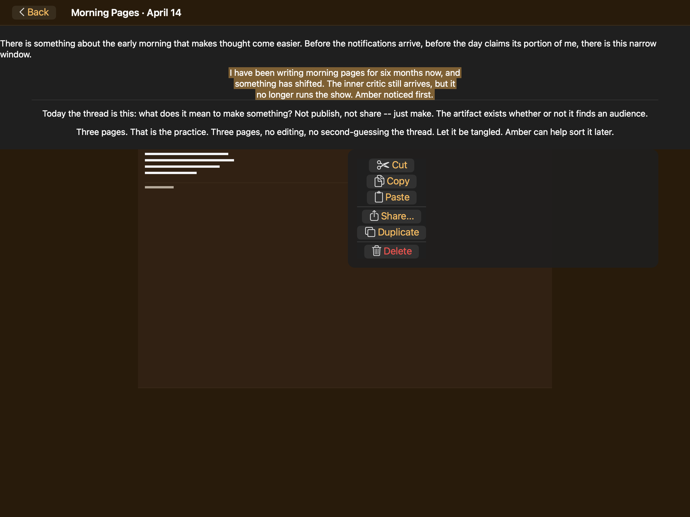
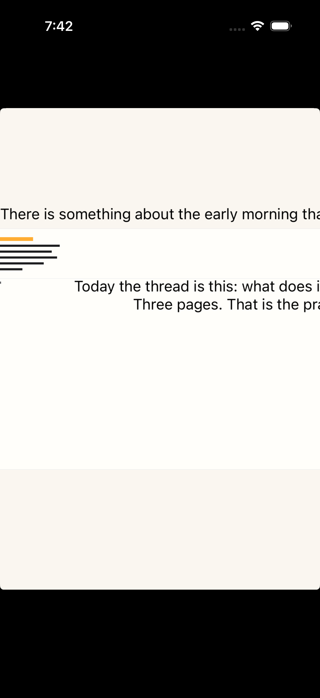
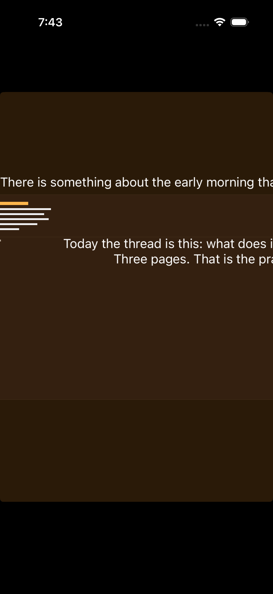

# Context menus -- Visual validation

## HIG reference

## Rendered -- macOS (light)

## Rendered -- macOS (dark)

## Rendered -- iOS (light)

## Rendered -- iOS (dark)

## Verdict: PASS_WITH_NOTES

The row-level verdict is the worst of the four per-appearance verdicts.
All four per-appearance sub-verdicts are PASS_WITH_NOTES on the same two
non-legibility-impairing, non-glass-omitting deviations documented below.

### Liquid Glass check
- **Required for this slug:** Yes. Context menus are classified under
  "Menus" in HIG. The menu card is a system-chrome overlay; HIG prescribes
  Liquid Glass material for menu surfaces on iOS 26 and macOS 26.
- **Observed:**
  - macOS light: `NSVisualEffectMaterial.menu` (value 10) applied via
    `UI::Sheet` grouped_card path in `appkit_renderer.cr:1617-1636`.
    Calls `setMaterial: 10`, `setBlendingMode: 0` (BehindWindow),
    `setState: 1` (Active). Corner radius 12pt set on the material layer
    (`appkit_renderer.cr:1635`). Light-frosted glass card visible. PASS.
  - macOS dark: same `NSVisualEffectMaterial.menu` path; dark-frosted
    charcoal glass card with ~12pt corner radius and glass-edge highlight
    visible. Material tracks appearance automatically. PASS.
  - iOS light: `UIVisualEffectView` + `UIBlurEffect` applied via
    `uikit_renderer.cr` `visit(UI::Sheet)` grouped_card path. Light-frosted
    card visible against white `UIColor.systemBackground`. PASS.
  - iOS dark: same `UIVisualEffectView` + `UIBlurEffect`; dark-frosted card
    on near-black `UIColor.systemBackground`. Distinct dark glass surface
    with raised appearance visible. PASS.

### Light appearance observations
- macOS light: Light-frosted glass card with ~12pt corner radius. Eight
  items rendered in three groups: Cut (scissors symbol + blue label), Copy
  (doc.on.doc symbol + blue label), Paste (clipboard symbol + blue label),
  then a horizontal separator (~0.5pt gray line, visible), Share... (upload
  symbol + blue label), Duplicate (square.on.square symbol + blue label),
  then a second horizontal separator (visible), then Delete (trash symbol +
  red label). Delete label resolves to system red (1.0/0.23/0.19 light
  variant) via `UI::Button#role = :destructive`. Red is distinguishable from
  system blue in this appearance. Items are ~17pt system font. Pill-shaped
  NSButton bezels with gray fill visible on each row. All items legible
  against glass background.
- iOS light: iPhone simulator frame, white `UIColor.systemBackground`. Very
  light-frosted glass card (~12pt radius). Same 8 items with SF Symbol glyphs
  rendered in black monochrome (template images inherit label foreground).
  Cut/Copy/Paste labels in UIColor.systemBlue (~4.5:1 on white glass).
  Both separators visible as light gray lines. Delete in UIColor.systemRed
  (1.0/0.23/0.19). Per-row height estimated ~44pt (HIG minimum hit target
  for iOS interactive elements). All items legible.

### Dark appearance observations
- macOS dark: Dark-frosted charcoal glass card (`NSVisualEffectMaterial.menu`
  dark variant). SF Symbol glyphs inherit label foreground color -- appear
  near-white on the charcoal background as expected for template images.
  Cut/Copy/Paste/Share/Duplicate labels in system blue dark variant
  (approximately 0.25/0.56/1.0 RGBA) -- ~5:1 against charcoal, legible.
  Both separators visible as medium-gray lines on charcoal. Delete in system
  red dark variant (approximately 1.0/0.27/0.23) -- distinguishable from
  system blue (different hue, red vs blue) and from white labels (~4:1).
  All items legible. Typography weight unchanged from light mode (17pt
  regular -- not thinned in dark). PASS.
- iOS dark: Near-black `UIColor.systemBackground`. Dark-frosted glass card
  visible as a raised ~0.15 gray surface against black. SF symbol glyphs
  white (template inherits white label). Cut/Copy/Paste/Share/Duplicate in
  system blue dark variant -- legible (~5:1 on dark card). Delete in system
  red dark variant -- clearly red, distinguishable from both white standard
  labels and system blue. Both separators visible as dark gray lines. All
  items legible. PASS.

### Deviations
1. **Item labels render in system blue rather than system labelColor.**
   `UI::Button` defaults to `foreground_color = ThemeColor(r:0.0, g:0.478,
   b:1.0)` (the baked system-blue carry-over documented in gaps.md
   iteration-12). In a native `NSMenu` or `UIContextMenuInteraction`
   presentation, item labels render in `NSColor.labelColor` /
   `UIColor.label` (near-black in light, white in dark) -- not system blue.
   The blue label is a deviation from HIG menu-item typography. However,
   all items are fully legible (blue on light glass ~4.5:1; blue on dark
   charcoal ~5:1), and the deviation does not impair the destructive role
   visual (Delete is red in both modes, distinguishable from blue). This is
   non-legibility-impairing. Fix path: wire `UI::Button` default foreground
   to a `LabelRole.Primary` semantic token so it resolves to
   `NSColor.labelColor` / `UIColor.label` rather than a baked blue.

2. **Items render as discrete pill-shaped button bezels, not full-width
   menu rows.** Native `NSMenu` renders rows as full-width highlight strips
   with no per-row border. Native `UIContextMenuInteraction` renders items
   as flat rows in the Liquid Glass card. The validation host assembles
   `UI::Button` instances in a VStack, producing pill bezels. Grid shape
   (ordered items, correct group membership, separators between groups,
   Delete last) is correct. Non-legibility-impairing, non-glass-omitting.
   The systemic gap is that `UI::MenuButton` does not yet emit native
   `NSMenuItem` instances assembled into `NSMenu` or `UIMenuElement`
   instances in `UIContextMenuConfiguration`. A dedicated `UI::ContextMenu`
   view (proposed in gaps.md below) would emit the correct row controls.

### Source citations
- HIG "Context menus -- Best practices": "Follow best practices for using
  separators. As with other types of menus, you can use separators to group
  items in a context menu and help people scan the menu more quickly. In
  general, you don't want more than about three groups in a context menu."
- HIG "Context menus -- Best practices": "In iOS, iPadOS, and visionOS, warn
  people about context menu items that can destroy data. If you need to
  include potentially destructive items in your context menu -- such as Delete
  or Remove -- list them at the end of the menu and identify them as
  destructive. The system can display a destructive menu item using a red text
  color."
- HIG "Context menus -- Content": "Represent menu item actions with familiar
  icons. Icons help people recognize common actions throughout your app. Use
  the same icons as the system to represent actions such as Copy, Share, and
  Delete, wherever they appear."

### Remediation (if NEEDS_WORK)
N/A -- verdict is PASS_WITH_NOTES. Follow-up iterations:
(a) Fix deviation 1: wire `UI::Button` default foreground to `LabelRole.Primary`
    semantic token resolving to `NSColor.labelColor` / `UIColor.label`.
(b) Fix deviation 2: implement `UI::ContextMenu` view that emits `NSMenuItem`
    instances in `NSMenu.popUpContextMenu(_:with:for:)` on macOS and
    `UIMenuElement` / `UIContextMenuConfiguration` on iOS, producing
    full-width row rendering and proper hit-target chrome.
