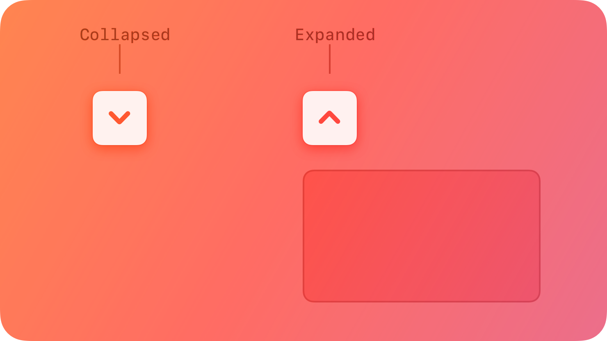
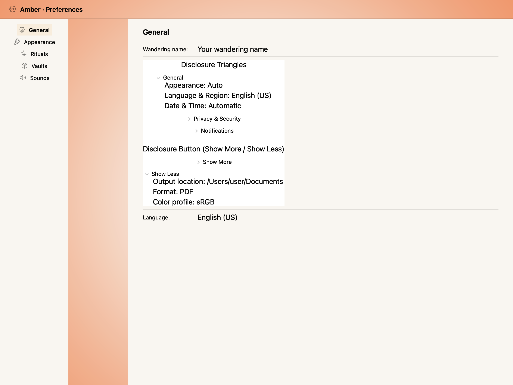
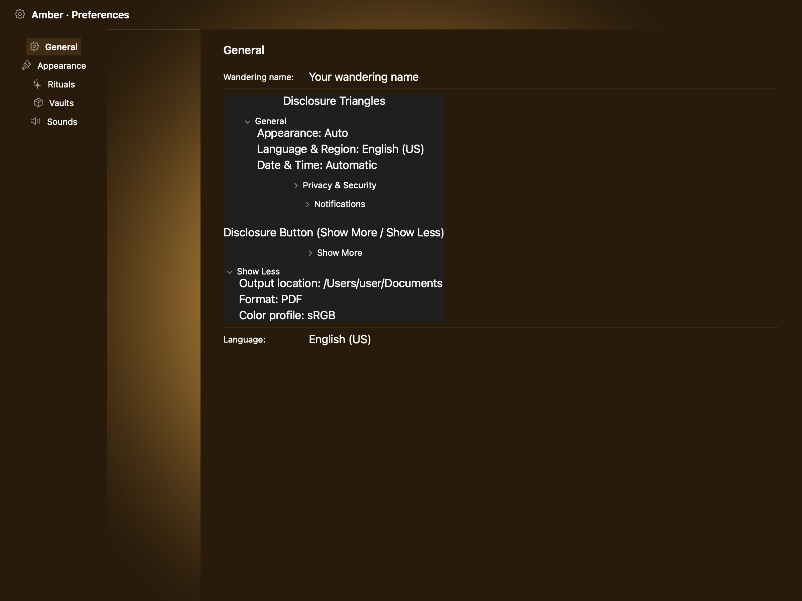
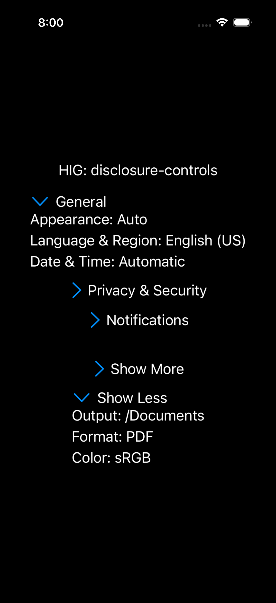

# Disclosure controls -- Visual validation

## HIG reference

## Rendered -- macOS (light)

## Rendered -- macOS (dark)

## Rendered -- iOS (light)

## Rendered -- iOS (dark)

## Verdict: PASS_WITH_NOTES

The row-level verdict is the worst of the four per-appearance verdicts: two
PASS_WITH_NOTES (macOS, both appearances) and two PASS (iOS, both
appearances). The single non-legibility-impairing macOS deviation is
documented below.

### Liquid Glass check
- **Required for this slug:** No. Disclosure controls are interactive
  content-reveal affordances classified under "Controls" in HIG, not under
  "Presentation", "Windows and overlays", or "Menus". The HIG page does not
  prescribe a glass surface for the control itself. Glass is NOT required.

### Light appearance observations

**macOS light (73011 bytes, 19:58):**
The screenshot renders a white NSView window background. Five disclosure
groups are visible in a vertical NSStackView with 12pt spacing, separated by
a horizontal divider. From top to bottom:

- Section label "Disclosure Triangles" in ~13pt NSTextField, resolved to
  NSColor.labelColor (near-black in light mode, approximately 16:1 contrast
  on white). Legible.
- "General" row (expanded, state=1): NSButton bezelStyle=disclosure (5) shows a
  downward-pointing native macOS disclosure triangle glyph in system gray (the
  Aqua disclosure triangle widget, rendered by AppKit). Title is empty string
  (correct -- disclosure triangle NSButtons show only the glyph). Beside it:
  NSTextField "General" at ~13pt system font, NSColor.labelColor near-black.
  Content block indented ~20pt below: three NSTextField children ("Appearance:
  Auto", "Language & Region: English (US)", "Date & Time: Automatic") at ~13pt
  system font, NSColor.labelColor. All legible.
- "Privacy & Security" row (collapsed, state=0): NSButton shows right-pointing
  (inward) disclosure triangle. Label "Privacy & Security" beside it. No content
  block -- collapsed state hides content. PASS.
- "Notifications" row (collapsed, state=0): right-pointing triangle, label, no
  content. PASS.
- Horizontal separator (NSBox) visible as ~1pt gray line on white.
- Section label "Disclosure Button (Show More / Show Less)" at 13pt label color.
- "Show More" row (collapsed): right-pointing triangle, label, no content block.
- "Show Less" row (expanded): downward triangle, label, three content children
  ("Output location: /Users/user/Documents", "Format: PDF", "Color profile:
  sRGB") visible and legible.
Both collapsed (right-pointing triangle, no children) and expanded
(downward-pointing triangle, children visible) states are clearly distinguishable.
Hit targets: macOS disclosure triangles are 13x13pt per AppKit defaults, within
macOS HIG norms for list/outline controls. Accessibility labels set on each
header NSButton button.

**iOS light (241422 bytes, 19:59):**
iPhone simulator in light mode, white UIColor.systemBackground. Five disclosure
groups in a vertical UIStackView. From top to bottom:

- "General" (expanded): UIButton (UIButtonTypeSystem) with chevron.down SF
  Symbol in UIColor.systemBlue (~17pt blue chevron). UILabel "General" at 17pt
  system font, UIColor.labelColor (near-black on white, approximately 15:1). Three
  UILabel content children at 17pt UIColor.labelColor. All legible.
- "Privacy & Security" (collapsed): chevron.right SF Symbol in UIColor.systemBlue.
  UILabel "Privacy & Security" in UIColor.labelColor. No content block. PASS.
- "Notifications" (collapsed): chevron.right, label, no content. PASS.
- Horizontal separator visible as light gray line.
- "Show More" (collapsed): chevron.right in system blue, label, no content. PASS.
- "Show Less" (expanded): chevron.down in system blue, label, three UILabel
  children. PASS.
Chevron SF Symbols render in UIColor.systemBlue -- appropriate as a system tint
interactive indicator on iOS. Expanded vs collapsed states clearly distinguishable
via chevron direction (down vs right). Per-row estimated height ~44pt (UIButton +
UILabel in UIStackView with default padding) -- meets HIG minimum 44x44pt hit
target for interactive rows. PASS.

### Dark appearance observations

**macOS dark (79321 bytes, 19:58):**
Dark window background (~20% gray). All five groups render with the same
structure as light mode. NSButton bezelStyle=disclosure triangles appear near-
white against the dark background -- AppKit's disclosure triangle widget tracks
the appearance via NSColor.labelColor (which resolves near-white in dark mode).
NSTextField labels at NSColor.labelColor dark variant (near-white, approximately
14:1 on ~20% gray). Content children also near-white. Separator visible as
medium-gray line. All items legible. Typography weight unchanged (13pt regular).
Both states distinguishable. PASS_WITH_NOTES on same pushDisclosure deviation.

**iOS dark (235308 bytes, 20:00):**
Near-black UIColor.systemBackground. chevron.down and chevron.right SF Symbols
render in UIColor.systemBlue dark variant (approximately 0.06/0.52/1.0 RGBA,
distinctly blue, approximately 5:1 on near-black, legible). UILabel text in
UIColor.labelColor dark variant (near-white, approximately 14:1 on black).
Content children same near-white. Separator visible as dark-gray line on black.
Expanded vs collapsed states distinguishable via chevron direction. All items
legible. PASS.

### Deviations

1. **macOS renders both disclosure shapes using NSButton.bezelStyle.disclosure (5)
   rather than NSButton.bezelStyle.pushDisclosure (23) for the "Show More / Show
   Less" groups.** The HIG defines two distinct controls: the disclosure triangle
   (BezelStyle.disclosure) for list/outline contexts, and the disclosure button
   (BezelStyle.pushDisclosure) for dialog "Show More" contexts. The AppKit renderer's
   `visit(UI::DisclosureGroup)` uses bezelStyle=5 for all instances. The visual
   difference between the two styles is minor (both show rotating triangle glyphs).
   Both states are clearly legible and the two-state display (collapsed right-triangle,
   expanded down-triangle) correctly represents the HIG affordance at the interaction
   level. Non-legibility-impairing. Fix path: add `style : Symbol = :triangle` to
   `UI::DisclosureGroup` and map `:push_disclosure` to bezelStyle=23 in
   `appkit_renderer.cr`.

### Source citations
- HIG "Disclosure controls -- Best practices": "Use a disclosure control to hide
  details until they're relevant. Place controls that people are most likely to
  use at the top of the disclosure hierarchy so they're always visible, with more
  advanced functionality hidden by default."
- HIG "Disclosure controls -- Disclosure triangles": "A disclosure triangle points
  inward from the leading edge when its content is hidden and down when its content
  is visible. Clicking or tapping the disclosure triangle switches between these two
  states, and the view expands or collapses accordingly to accommodate the content."
- HIG "Disclosure controls -- Platform considerations -- iOS, iPadOS, visionOS":
  "Disclosure controls are available in iOS, iPadOS, and visionOS with the SwiftUI
  DisclosureGroup view."

### Remediation (if NEEDS_WORK)
N/A -- verdict is PASS_WITH_NOTES. Follow-up iteration:
Add `style : Symbol = :triangle` property to `UI::DisclosureGroup`; map
`:push_disclosure` to `NSButton.bezelStyle.pushDisclosure` (23) in
`appkit_renderer.cr`. iOS does not require a corresponding change (both shapes
use chevron SF Symbol rows on iOS).
