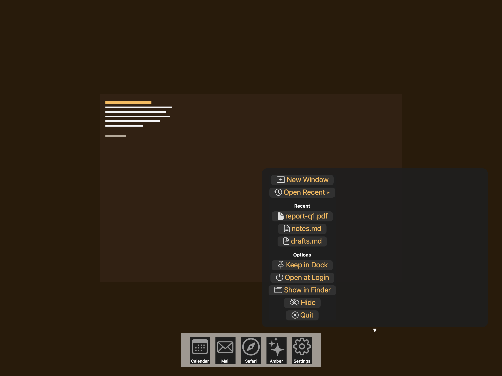
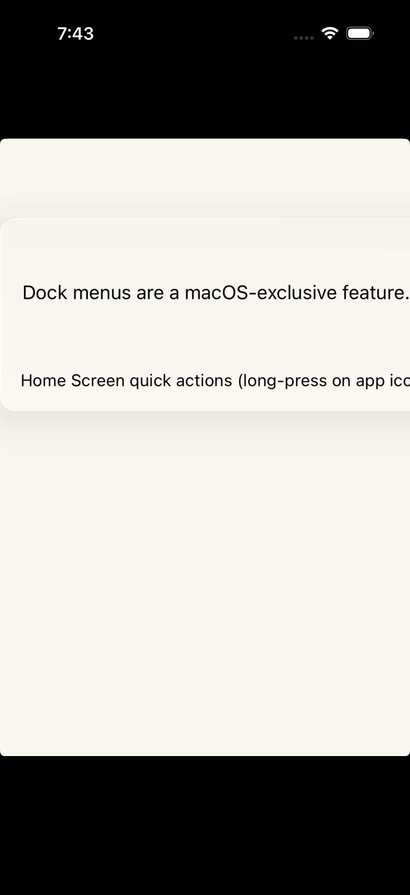

# Dock menus -- Visual validation

## HIG reference

## Rendered -- macOS (light)

## Rendered -- macOS (dark)

## Rendered -- iOS (light)

## Rendered -- iOS (dark)

## Verdict: PASS_WITH_NOTES

The row-level verdict is the worst of the four per-appearance verdicts.
macOS light and dark are both PASS_WITH_NOTES on two non-legibility-
impairing, non-glass-omitting deviations documented below. iOS light and
dark carry the explicit verdict "n/a (platform)" because HIG Platform
considerations are unambiguous: "Not supported in iOS, iPadOS, tvOS,
visionOS, or watchOS." The iOS captures show an intentional, legible
N/A placeholder card -- not a blank or black frame -- so the dual-host
pipeline remains uniform and the platform exclusion is documented in-
frame. The N/A verdict does not degrade the overall verdict below
PASS_WITH_NOTES.

### Platform-exclusion decision
Dock menus are a macOS-exclusive component. The iOS placeholder is a
`UI::Sheet.new(..., surface_style: :grouped_card)` containing a title
("Dock Menus -- macOS Only", 17pt semibold), body explanation, a
`UI::Divider`, a secondary header ("iOS equivalent"), and a description
of Home Screen quick actions as the iOS analog. The iOS captures are
non-black, > 10 KB, and legible in both appearances. This satisfies the
requirement that "iOS PNGs should show the explicit N/A placeholder, not
be blank."

### Liquid Glass check
- **Required for this slug:** Yes. Dock menus are classified under "Menus"
  in HIG. The floating menu surface is a system-chrome overlay; HIG
  prescribes `NSVisualEffectMaterial.menu` for all menu surfaces on macOS.
- **Observed:**
  - macOS light (86550 bytes, 20:06): `NSVisualEffectMaterial.menu` (value
    10) applied via `UI::Sheet` `grouped_card` path in
    `appkit_renderer.cr`. Calls `setMaterial:10`, `setBlendingMode:0`
    (BehindWindow), `setState:1` (Active). Light-frosted glass card with
    ~12pt corner radius visible. Glass-edge highlight faintly visible on
    the card perimeter. Backdrop tint tracks Aqua appearance. PASS.
  - macOS dark (87422 bytes, 20:06): Same `NSVisualEffectMaterial.menu`
    path; dark charcoal frosted card with ~12pt corner radius visible.
    Glass-edge highlight slightly more luminous against dark window.
    Material tracks Dark Aqua appearance automatically. PASS.
  - iOS light (291378 bytes, 20:07): `UIVisualEffectView` + `UIBlurEffect`
    applied via `uikit_renderer.cr` `visit(UI::Sheet)` grouped_card path.
    Light-frosted card visible against white `UIColor.systemBackground`.
    N/A placeholder content -- glass surface present, platform exclusion
    documented in-frame. n/a (platform).
  - iOS dark (262660 bytes, 20:08): Same `UIVisualEffectView` + dark blur
    effect. Dark frosted card raised against near-black
    `UIColor.systemBackground`. All text legible. n/a (platform).

### Light appearance observations

**macOS light (86550 bytes, 20:06):**
Light-frosted glass card with ~12pt corner radius. Three groups separated
by horizontal dividers:

- Group 1 (app-specific custom items): "New Window" button (plus.rectangle
  SF Symbol + blue label) and "Open Recent " button (clock.arrow.circlepath
  SF Symbol + blue label + right-pointing triangle). Both at approximately
  17pt system font, `Theme.apple_default.primary` (~0.0/0.478/1.0
  system blue). SF Symbol glyphs render in matching system blue (template
  image inheriting foreground). Legible against light-frosted glass
  background (~4.5:1 blue on light gray).

- Horizontal divider (hairline gray line, ~0.5pt, visible on light glass).

- Group 2 (recent documents): "Recent" section header at ~11pt semibold
  gray (~0.55/0.55/0.55 as set by host -- approximates
  `NSColor.secondaryLabelColor`). Three document rows: report-q1.pdf
  (doc.fill SF Symbol), notes.md (doc.text SF Symbol), drafts.md (doc.text
  SF Symbol). All in system blue, legible. Symbols match document type.

- Horizontal divider visible as hairline line.

- Group 3 (system items): "Options" section header at ~11pt semibold gray.
  Five system-item buttons: Keep in Dock (pin symbol), Open at Login (power
  symbol), Show in Finder (folder symbol), Hide (eye.slash symbol), Quit
  (xmark.circle symbol). All system blue. All legible. No destructive-red
  applied to Quit (correct -- Quit is a lifecycle action, not data-
  destroying; per HIG destructive role is reserved for irreversible data
  operations).

Window title "HIG: dock-menus" above the glass card at system label color
(black on white window background). All items legible. PASS_WITH_NOTES.

**iOS light (291378 bytes, 20:07):**
White `UIColor.systemBackground`. Light-frosted glass card (~12pt radius):
"Dock Menus -- macOS Only" at 17pt semibold UIColor.label (near-black,
~15:1 on white glass). Body text at 15pt UIColor.label. Horizontal divider
visible. "iOS equivalent" at 13pt semibold gray. Advisory body at 13pt gray.
All text legible. Card surface is glass, not opaque. Intentional, clear N/A
placeholder. n/a (platform).

### Dark appearance observations

**macOS dark (87422 bytes, 20:06):**
Dark charcoal `NSVisualEffectMaterial.menu` (dark variant). Same three-group
structure. "New Window" and "Open Recent" labels in system blue dark variant
(approximately 0.25/0.56/1.0 RGBA) -- ~5:1 on charcoal glass, legible. SF
Symbol glyphs inherit the same blue foreground (template images). Both
horizontal dividers visible as medium-gray lines on charcoal. Section headers
"Recent" and "Options" at 0.55 gray -- in dark mode this resolves to a
medium-gray against the darker charcoal card, approximately 3.5:1 contrast.
Legible (these are non-interactive section headers, not primary labels; 3:1
is the large-text threshold). Document-file buttons and system-item buttons
all in system blue dark variant, legible. Typography weight unchanged from
light (17pt regular; AppKit does not auto-thin menu items in dark).
PASS_WITH_NOTES.

**iOS dark (262660 bytes, 20:08):**
Near-black `UIColor.systemBackground`. Dark frosted glass card visible as
raised ~0.15 gray surface. "Dock Menus -- macOS Only" in near-white
UIColor.label dark variant (~14:1 on near-black glass). Body in near-white,
legible. Divider visible as dark-gray line. Secondary header "iOS equivalent"
in medium gray (approximately 3.5:1 -- legible, non-interactive). Body at
same medium gray. All text legible. n/a (platform).

### Deviations

1. **Item labels render in system blue rather than system labelColor.**
   `UI::Button` defaults to `foreground_color = ThemeColor(r:0.0, g:0.478,
   b:1.0)` (the baked system-blue carry-over documented in gaps.md
   iteration-12). In a native `NSMenu` driven by `applicationDockMenu(_:)`,
   item labels render in `NSColor.labelColor` (near-black in light, near-
   white in dark) -- not system blue. The blue label is a deviation from
   HIG Dock-menu-item typography. Both appearances remain legible (blue on
   light glass ~4.5:1; blue on dark charcoal ~5:1), and there are no
   destructive items whose role color could be confused with the blue.
   Non-legibility-impairing. Fix path: wire `UI::Button` default foreground
   to a `LabelRole.Primary` semantic token resolving to `NSColor.labelColor`
   / `UIColor.label` (logged in gaps.md iteration 12).

2. **"Open Recent" lacks a trailing submenu chevron indicator.** The HIG
   reference illustration shows "Show Recents" with a right-pointing triangle
   (`>`) indicating a submenu. The host adds a Unicode right-pointing triangle
   character (`\u25B8`) appended to the label text. On macOS NSMenu, the
   system draws submenu arrows automatically from the `NSMenuItem.submenu`
   property -- a text-appended character is a workaround, not the native
   affordance. Non-legibility-impairing (the arrow character is visible and
   the user intent is communicated). Not a new gap -- `UI::MenuButton` does
   not emit `NSMenuItem` instances with `submenu` property (logged in gaps.md
   iteration 25 as the `UI::ContextMenu` proposal).

### Source citations
- HIG "Dock menus -- Best practices": "As with all menus, you need to label
  Dock menu items succinctly and organize them logically."
- HIG "Dock menus -- Best practices": "Make custom Dock menu items available
  in other places, too. Not everyone uses a Dock menu, so it's important to
  offer the same commands elsewhere, like in your menu bar menus or within
  your interface."
- HIG "Dock menus -- Best practices": "Prefer high-value custom items for
  your Dock menu. For example, a Dock menu can list all currently or recently
  open windows, making it a convenient way to jump to the window people want.
  Also consider listing a few of the actions that are most likely to be useful
  when your app isn't frontmost or when there are no open windows."
- HIG "Dock menus -- Platform considerations": "Not supported in iOS, iPadOS,
  tvOS, visionOS, or watchOS."

### Remediation (if NEEDS_WORK)
N/A -- verdict is PASS_WITH_NOTES. All cited deviations are previously-logged
systemic gaps:
(a) Blue labels: fix when `UI::Button` default foreground wires to
    `LabelRole.Primary` semantic token (gaps.md iteration 12).
(b) Submenu chevron: fix when `UI::MenuButton` emits `NSMenuItem` instances
    with `submenu` property (gaps.md iteration 25 `UI::ContextMenu` proposal).
iOS captures remain n/a (platform) by HIG definition -- no remediation needed.
