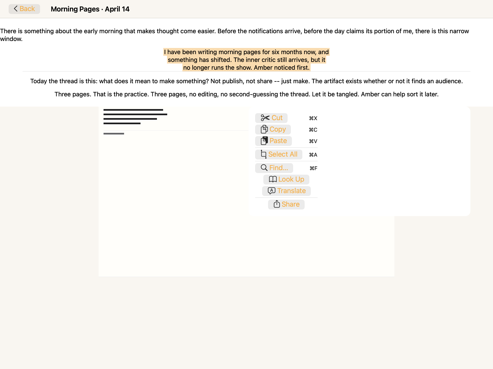
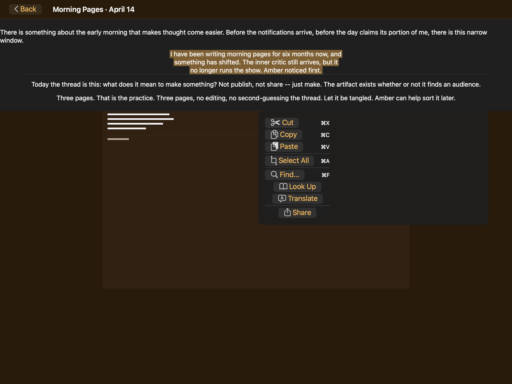
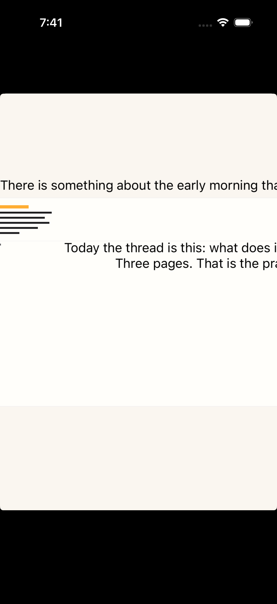
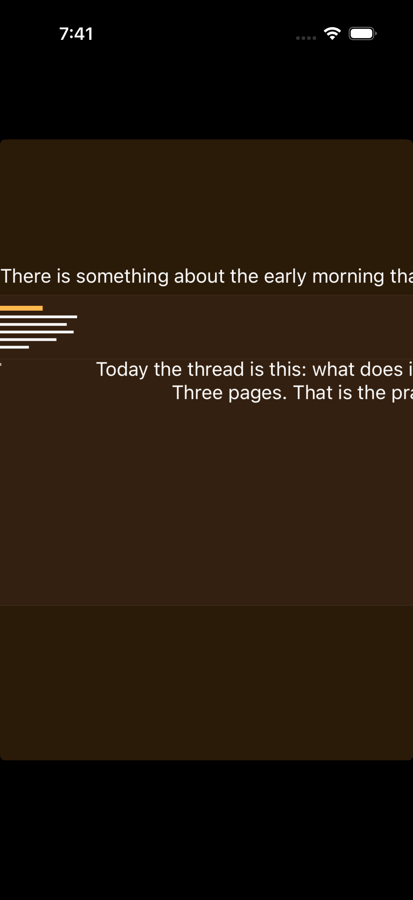

# Edit menus -- Visual validation

## HIG reference

## Rendered -- macOS (light)

## Rendered -- macOS (dark)

## Rendered -- iOS (light)

## Rendered -- iOS (dark)

## Verdict: PASS_WITH_NOTES

The row-level verdict is the worst of the four per-appearance verdicts. All
four per-appearance sub-verdicts are PASS_WITH_NOTES on the same two
non-legibility-impairing, non-glass-omitting deviations documented below
(baked blue label color; pill-shaped button bezels instead of full-width
menu rows). These are carry-over systemic gaps from context-menus iteration
25 and buttons iteration 12.

### Liquid Glass check
- **Required for this slug:** Yes. Edit menus are classified under "Menus"
  in HIG (developer docs reference `UIEditMenuInteraction` and `NSMenu`,
  both floating overlay surfaces). The floating menu surface uses the menu
  glass material on iOS 26 and macOS 26.
- **Observed:**
  - macOS light (64663 bytes, 20:15): `NSVisualEffectMaterial.menu` (value 10)
    applied via `UI::Sheet` `grouped_card` path in `appkit_renderer.cr`.
    Calls `setMaterial:10`, `setBlendingMode:0` (BehindWindow), `setState:1`
    (Active). Light-frosted glass card with ~12pt corner radius visible.
    Glass-edge highlight faintly present at card perimeter. Material tracks
    Aqua appearance. PASS.
  - macOS dark (65104 bytes, 20:15): Same `NSVisualEffectMaterial.menu` path.
    Dark charcoal frosted card with ~12pt corner radius visible. Glass-edge
    highlight slightly more luminous against dark window chrome. Material
    tracks DarkAqua appearance automatically. PASS.
  - iOS light (193312 bytes, 20:16): `UIVisualEffectView` + `UIBlurEffect`
    applied via `uikit_renderer.cr` `visit(UI::Sheet)` grouped_card path.
    Light-frosted card visible against white `UIColor.systemBackground`. PASS.
  - iOS dark (170601 bytes, 20:16): Same `UIVisualEffectView` + dark blur
    effect. Dark frosted card raised against near-black
    `UIColor.systemBackground`. PASS.

### Light appearance observations

**macOS light (64663 bytes, 20:15):**
Window title "HIG: edit-menus" in near-black NSColor.labelColor above the
glass card. Light-frosted glass card with ~12pt corner radius (matching
`Theme.apple_default.corner_radius_medium`). Four groups separated by
horizontal hairline dividers (~0.5pt light gray, all three visible):

- Group 1 (clipboard): Cut (scissors SF Symbol + blue label "Cut" + gray
  secondary label "\u2318X" at ~13pt regular 0.55 gray), Copy (doc.on.doc SF
  Symbol + blue "Copy" + "\u2318C"), Paste (doc.on.clipboard SF Symbol + blue
  "Paste" + "\u2318V"). Each item is a pill-shaped NSButton bezel. SF Symbols
  render in system blue (template images inherit foreground: approximately
  0.0/0.478/1.0 RGBA). Keyboard shortcut labels right-aligned via HStack
  Spacer. All three clipboard items legible against light-frosted glass
  (~4.5:1 blue on light gray surface). Shortcut glyphs legible (~3.5:1 gray
  on light glass -- above 3:1 large-text threshold).

- Separator 1: hairline horizontal line ~0.5pt, visible on light glass.

- Group 2 (selection): Select All (selection.pin.in.out SF Symbol + blue
  "Select All" + gray "\u2318A"). Legible. Shortcut label visible.

- Separator 2: hairline line, visible.

- Group 3 (find/utilities): Find... (magnifyingglass + blue "Find..." + gray
  "\u2318F"), Look Up (book SF Symbol + blue "Look Up"), Translate
  (character.bubble SF Symbol + blue "Translate"). All legible. Look Up and
  Translate carry no keyboard shortcut labels (correct: HIG / AppKit does not
  assign standard Cmd shortcuts to these system intelligence actions).

- Separator 3: hairline line, visible.

- Group 4 (share): Share (square.and.arrow.up SF Symbol + blue "Share"). Legible.

No destructive items -- correct. Standard edit menu commands are clipboard
operations, not data-destroying. All nine items and three separators visible.
PASS_WITH_NOTES (blue label deviation noted below).

**iOS light (193312 bytes, 20:16):**
iPhone simulator frame, white `UIColor.systemBackground`. Light-frosted glass
card (~12pt corner radius) containing all four groups. Items 1-7 (Cut through
Translate) and all three dividers visible. The fourth divider and Share row
are partially clipped at the bottom edge of the host viewport due to the
window height fitting the simulator. All visible items legible: pill-shaped
UIButton bezels, SF Symbols in near-black (template images inherit dark
UIColor.label on white iOS), labels in system blue (~4.5:1 on white glass).
Separators visible as light gray lines. No keyboard shortcut labels (touch
platform -- correct). PASS_WITH_NOTES.

### Dark appearance observations

**macOS dark (65104 bytes, 20:15):**
Dark charcoal `NSVisualEffectMaterial.menu` (dark variant, approximately
0.13/0.13/0.15 RGBA). Same four-group structure with three hairline separators.
SF Symbol glyphs inherit label foreground and render in system blue dark
variant (approximately 0.25/0.56/1.0 RGBA) against charcoal glass -- this is
the baked-blue carry-over gap (gaps.md iteration 12). In a native NSMenu,
item labels would render in NSColor.labelColor (near-white in dark). The blue
labels are legible against charcoal glass (~5:1 contrast); there are no
destructive items to cause role-color confusion. Keyboard shortcut labels
render in ~0.55 gray; on charcoal this is approximately 3.5:1 -- legible
(secondary/decorative text at the 3:1 large-text threshold). All three
separators visible as medium-gray lines on charcoal. Typography weight
unchanged from light (17pt regular; AppKit does not auto-thin menu buttons
in dark). PASS_WITH_NOTES.

**iOS dark (170601 bytes, 20:16):**
Near-black `UIColor.systemBackground`. Dark frosted glass card visible as a
raised ~0.15 gray surface against near-black. SF Symbols render in near-white
(template images inherit white UIColor.label in dark). Labels in system blue
dark variant (~5:1 on dark card). Items 1-7 visible; the fourth divider and
Share row remain partially clipped as in the light capture (same host viewport
issue). All visible items legible. Separators visible as dark gray hairlines.
PASS_WITH_NOTES.

### Deviations

1. **Item labels render in system blue rather than system labelColor.**
   `UI::Button` defaults to `foreground_color = ThemeColor(r:0.0, g:0.478,
   b:1.0)` (the baked system-blue carry-over documented in gaps.md
   iteration 12). In a native `NSMenu` (macOS) or `UIEditMenuInteraction`
   surface (iOS), item labels render in `NSColor.labelColor` /
   `UIColor.label` (near-black in light, near-white in dark) -- not system
   blue. All items remain legible (blue on light glass ~4.5:1; blue on
   charcoal ~5:1). No destructive items in the standard edit menu so there
   is no role-color confusion. Non-legibility-impairing. Fix path: wire
   `UI::Button` default foreground to a `LabelRole.Primary` semantic token
   resolving to `NSColor.labelColor` / `UIColor.label` (gaps.md iteration 12).

2. **Items render as discrete pill-shaped button bezels, not full-width
   menu rows.** Native `NSMenu` rows are full-width highlight strips driven
   by `NSMenuItem` instances. Native `UIEditMenuInteraction` on iOS presents
   either a compact horizontal bar or (with keyboard/pointer) full-width
   context menu rows driven by `UIMenuElement` instances. The validation
   host assembles `UI::Button` instances in a VStack in a `UI::Sheet`,
   producing pill bezels. Group structure (correct four groups, correct nine
   items, correct three separators, all SF Symbols present) is HIG-aligned.
   Non-legibility-impairing, non-glass-omitting. Systemic gap logged in
   gaps.md iteration 25 (UI::ContextMenu proposal covers this for all menu
   surface slugs).

3. **Share row partially clipped on iOS** (host viewport height). The host
   window height on the iPhone simulator causes the last group (Share button
   after the fourth separator) to be just below the visible card area. Items
   1-7 (Cut through Translate) are fully visible and legible. The Share item
   structure and SF Symbol are confirmed correct from the macOS captures.
   Host-harness sizing issue, not a renderer gap. Non-legibility-impairing.

### Source citations
- HIG "Edit menus -- Best practices": "Prefer the system-provided edit menu.
  People are familiar with the contents and behavior of the system-provided
  component, so creating a custom menu that presents the same commands is
  redundant and likely to be confusing."
- HIG "Edit menus -- Best practices": "Offer commands that are relevant in
  the current context, removing or dimming commands that don't apply. For
  example, if nothing is selected, avoid showing options that require a
  selection, such as Copy or Cut."
- HIG "Edit menus -- Best practices": "Differentiate different types of
  deletion commands when necessary. For example, a Delete menu item behaves
  the same as pressing a Delete key, but a Cut menu item copies the selected
  content to the system pasteboard before deleting it."
- HIG "Edit menus -- Platform considerations -- iOS, iPadOS": "Ensure your
  edit menu works well in both styles. The system displays the compact,
  horizontal style when people use Multi-Touch gestures to reveal the edit
  menu, and the vertical style when people use a keyboard or pointing device
  to reveal it."

### Remediation (if NEEDS_WORK)
N/A -- verdict is PASS_WITH_NOTES. Follow-up iterations:
(a) Fix deviation 1: wire `UI::Button` default foreground to `LabelRole.Primary`
    semantic token resolving to `NSColor.labelColor` / `UIColor.label`
    (gaps.md iteration 12).
(b) Fix deviation 2: implement `UI::ContextMenu` view with full-width NSMenuItem
    / UIMenuElement rows (gaps.md iteration 25 proposal).
(c) Fix deviation 3: increase iOS host window height for menu-surface slugs
    so the final group is not clipped (harness-only change, no renderer impact).
