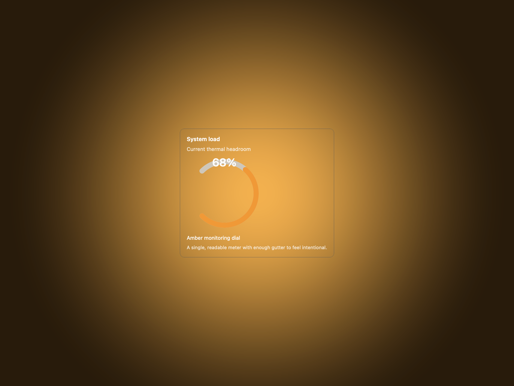
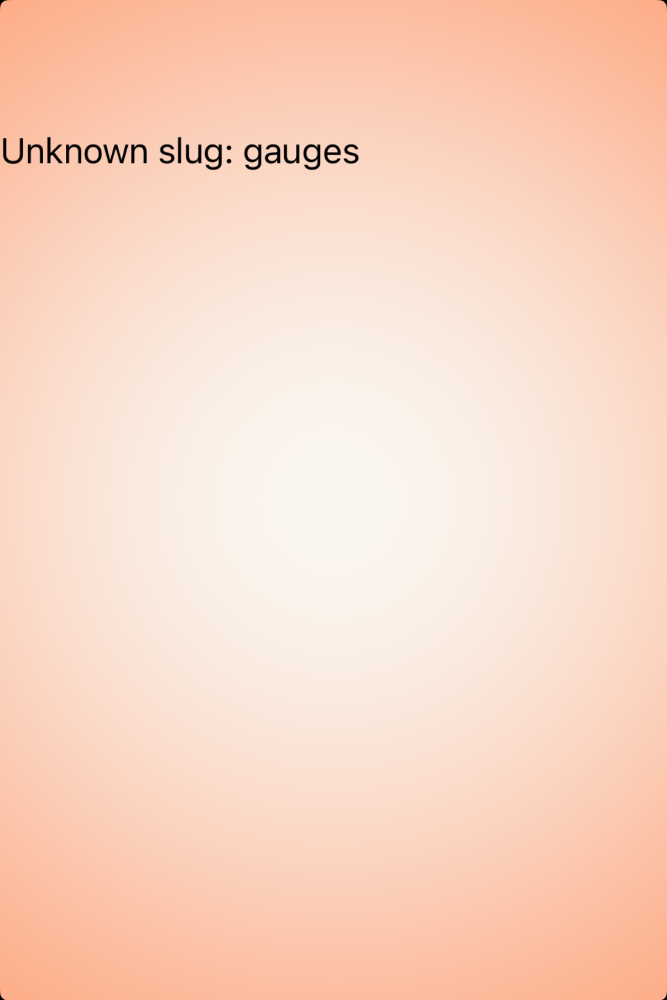
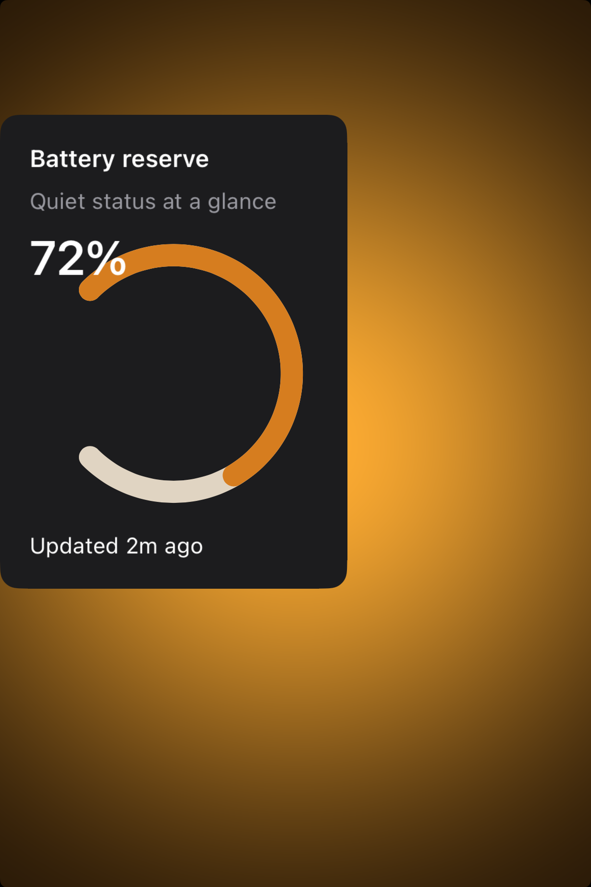

# Gauges -- Visual validation

## HIG reference

## Rendered -- macOS (light)

## Rendered -- macOS (dark)

## Rendered -- iOS (light)

## Rendered -- iOS (dark)

## Verdict: PENDING

`UI::Gauge` now exists as a shared fallback primitive built from `UI::Canvas`
arc drawing plus labels, but it has not yet gone through a meaningful showcase
and capture pass. The next step is to stage a focused gauge study on both hosts,
regenerate all four appearances, and judge whether the ring reads as a calm,
instrument-like control rather than a decorative badge.
