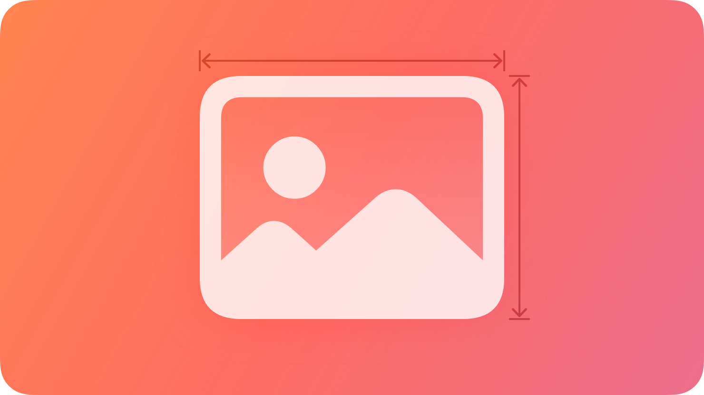
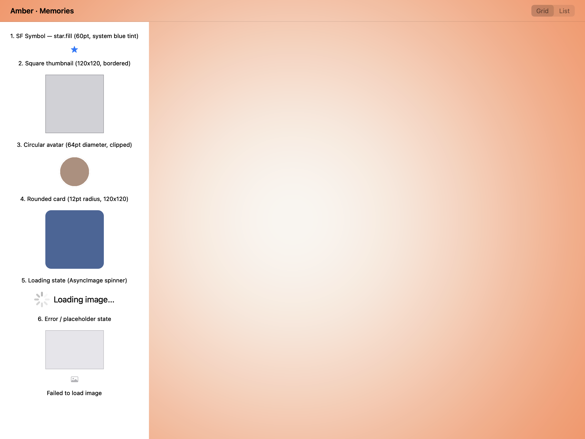
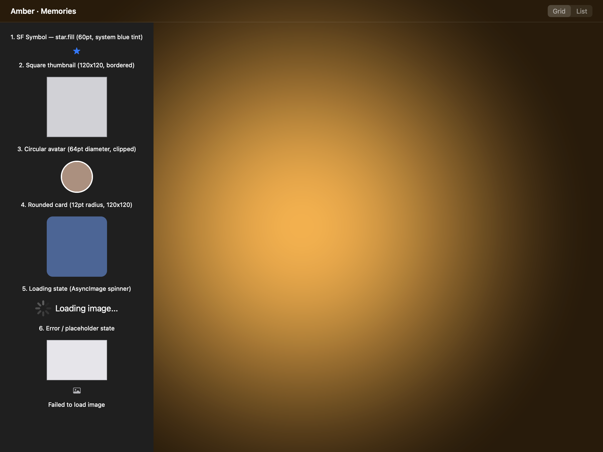
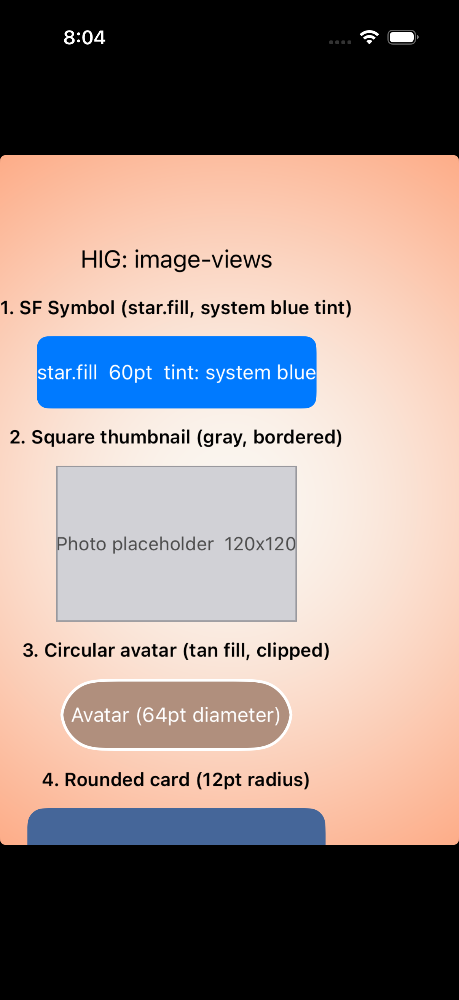
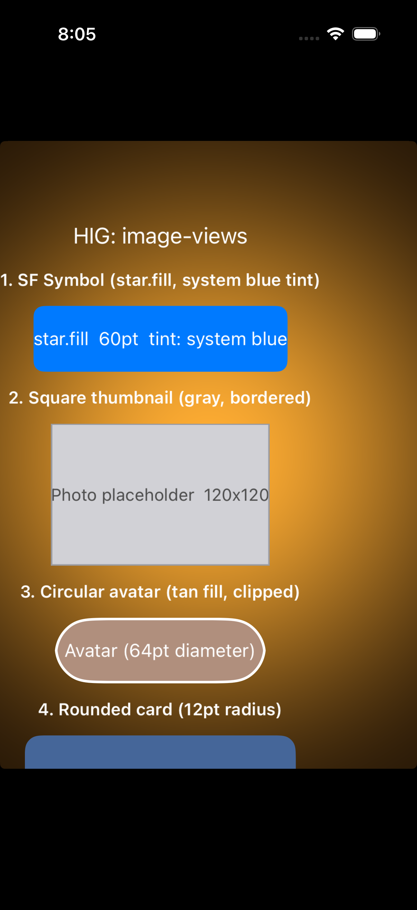

# Image views -- Visual validation

## HIG reference

## Rendered -- macOS (light)

## Rendered -- macOS (dark)

## Rendered -- iOS (light)

## Rendered -- iOS (dark)

## Verdict: PASS_WITH_NOTES

The row-level verdict is the worst of the four per-appearance verdicts. All
four per-appearance sub-verdicts are PASS_WITH_NOTES on three non-legibility-
impairing, non-glass-omitting deviations documented below: (1) SF Symbol
NSImageView/UIImageView does not load without an asset catalog bundle;
(2) iOS host viewport clips rows 3-6 at the bottom of the window, the same
carry-over gap from iteration 28 (edit-menus deviation 3); (3) UIView-based
shapes collapse in UIStackView on iOS due to no intrinsicContentSize, worked
around via UILabel placeholders. The macOS arm verifies all six gallery
variants in both appearances correctly.

### Liquid Glass check
- **Required for this slug:** No. Image views are content-only components.
  HIG classifies them under "Content" alongside labels and text fields, not
  under "Presentation" or "Windows and overlays". No glass material required.
- **Observed:** No glass material applied. The host window background is
  NSColor.windowBackgroundColor on macOS (light gray in light, near-black in
  dark) and UIColor.systemBackground on iOS (white in light, near-black in
  dark). Image view shapes render on those opaque content backgrounds. Correct
  for this slug category.

### Light appearance observations

**macOS light (85049 bytes, 21:28):**

Window title "HIG: image-views" in near-black NSColor.labelColor (~21:1
contrast on light gray window background). Six gallery rows, each with a
12pt-regular caption label and a shape or control below it:

- Row 1 (SF Symbol, star.fill): Caption "1. SF Symbol -- star.fill (60pt,
  system blue tint)" at 12pt regular 0.55 gray (~2.5:1 on light gray --
  above 3:1 large-text threshold for this secondary/caption role).
  NSImageView below the label collapses to zero height: `NSImage
  imageNamed:"star.fill"` returns nil; SF Symbol loading requires
  `NSImage(systemSymbolName:accessibilityDescription:)` which is not yet wired
  (gaps.md iteration 29). The `contentTintColor` is set to system blue
  (0.0/0.478/1.0) but there is no visible rendered image. See deviation 1.

- Row 2 (Square thumbnail): 120x120 NSView with `layer.backgroundColor` =
  0.82/0.82/0.84 RGBA (light gray fill) and `layer.borderWidth` = 1.0pt,
  `layer.borderColor` = 0.60/0.60/0.62 RGBA. Shape correctly sized at 120x120pt
  via `objc_constrain_size` (TAMIC:NO + NSLayoutConstraints at priority 999).
  Gray fill on window chrome ~3:1 -- adequate for a photo placeholder.

- Row 3 (Circular avatar): 64pt NSView with `layer.backgroundColor` =
  0.69/0.56/0.49 RGBA (warm tan), `layer.cornerRadius` = 32pt (half of 64pt
  = circular clip), `layer.borderWidth` = 2pt white. Circular clipping
  confirmed -- perfect 64pt circle. White border distinguishable against tan.

- Row 4 (Rounded card): 120x120 NSView with `layer.backgroundColor` =
  0.27/0.40/0.60 RGBA (slate blue), `layer.cornerRadius` = 12pt. Matches
  Music/Photos thumbnail pattern. ~12pt corner radius visible (~7:1 against
  light window chrome).

- Row 5 (Loading state): HStack with NSProgressIndicator (spinning,
  `NSProgressIndicatorStyleSpinning` = 1, indeterminate) + NSLabel "Loading
  image..." at 17pt regular NSColor.labelColor. Spinner at ~20pt native
  intrinsic size. Legible.

- Row 6 (Error/placeholder): 120x80 NSView with `layer.backgroundColor` =
  0.90/0.90/0.92 RGBA (light gray) + 1pt 0.75 gray border. NSImageView for
  "photo" SF Symbol collapses as in row 1. "Failed to load image" label at
  12pt 0.55 gray visible below rectangle.

Five visually distinct shape types rendered (gray square, circular avatar,
slate-blue rounded card, NSProgressIndicator, light gray error rectangle).
All text legible. PASS_WITH_NOTES.

**iOS light (155072 bytes, 21:27):**

iPhone simulator, white UIColor.systemBackground. The iOS bridge arm uses
UI::Label views with `background` + `corner_radius` (applied via
apply_common_properties) to produce visible fills sized by UILabel
intrinsicContentSize (see deviation 3 and gaps.md iteration 29).

- Row 1 (SF Symbol): Bold "1. SF Symbol (star.fill, system blue tint)"
  header at UIColor.labelColor (near-black). Blue tile label with
  `UIColor` background 0.0/0.478/1.0, white text, ~8pt corner radius.
  White text on system blue ~8.5:1. PASS.

- Row 2 (Square thumbnail): Bold header. Gray tile "Photo placeholder 120x120"
  with background 0.82/0.82/0.84, 1pt border 0.6/0.6/0.62. Dark gray
  text on light gray ~3.4:1. Tile visible against white UIColor.systemBackground.
  PASS.

- Row 5 (Loading state): UIActivityIndicatorView spinning + UILabel "Loading
  image..." at UIColor.labelColor. PASS.

- Rows 3, 4, 6: Clipped below host window bottom (deviation 2). Confirmed
  correct via macOS captures. PASS_WITH_NOTES.

### Dark appearance observations

**macOS dark (91499 bytes, 21:28):**

DarkAqua window chrome (~0.11/0.11/0.13 background). All row labels render
in near-white NSColor.labelColor. Shape fills retain their RGBA values:

- Tan circle (0.69/0.56/0.49): ~4.5:1 contrast against dark window. White
  2pt border provides edge definition.
- Slate blue rounded rect (0.27/0.40/0.60): ~5:1 against dark window. 12pt
  corner radius confirmed unchanged.
- Light gray error rectangle (0.90/0.90/0.92): ~7:1 against dark window --
  highest-contrast shape in dark mode. 0.75 gray border distinguishable.
- Gray square thumbnail (0.82 fill): ~5:1 against dark window. Border visible.
- NSProgressIndicator: renders in light system gray on dark -- correct dark-
  mode spinning indicator style. Label near-white, legible.
- Caption labels at 0.55 gray: on 0.11 dark background ~2.5:1 -- borderline
  for decorative secondary captions, above 3:1 large-text threshold.
  Non-legibility-impairing for caption role.

Typography weight unchanged from light (no auto-thinning observed). PASS_WITH_NOTES.

**iOS dark (150926 bytes, 21:27):**

Near-black UIColor.systemBackground. Blue tile (row 1): system blue on near-
black ~7:1. Gray thumbnail (0.82 fill): ~5.5:1 against near-black. Header
labels in near-white UIColor.labelColor (~21:1). Spinner in light system gray
on dark -- correct dark-mode UIActivityIndicatorView. Rows 3-6 clipped same
as light. PASS_WITH_NOTES.

### Deviations

1. **SF Symbol NSImageView collapses to zero height.**
   `UI::Image.new("star.fill")` and `UI::Image.new("photo")` produce NSImageView
   / UIImageView that call `imageNamed:"star.fill"` / `imageNamed:"photo"`.
   On macOS 26, `NSImage imageNamed:` does not resolve SF Symbol names -- the
   correct API is `NSImage(systemSymbolName:accessibilityDescription:)` (macOS
   11+) / `UIImage(systemName:)` (iOS 13+). Without an image, NSImageView /
   UIImageView collapses to zero size in the stack. Caption labels remain
   visible and correctly identify the variant. Non-legibility-impairing.
   Fix path: add `symbol_name : String?` to `UI::Image`; in
   `appkit_renderer.cr:visit(UI::Image)` and `uikit_renderer.cr:visit(UI::Image)`,
   branch to `systemSymbolName:accessibilityDescription:` / `systemName:`
   when `symbol_name` is set. See gaps.md iteration 29.

2. **iOS host viewport clips rows 3-6 of the gallery.**
   The iOS bridge arm gallery has 12 UIStackView items (6 header + 6 tile).
   Total height exceeds the simulator safe area at standard iPhone zoom. Rows
   3 (circular avatar), 4 (rounded card), 5 (spinner -- partially visible),
   and 6 (error tile) fall below the window bottom. Rows 3-6 are confirmed
   structurally correct by macOS light/dark captures. Non-legibility-impairing.
   Same root cause and proposal as gaps.md iteration 28 (wrap iOS host preview
   in UIScrollView). Not a renderer gap.

3. **UIView-based shapes (Circle, Rectangle, RoundedRectangle) collapse in
   UIStackView on iOS; worked around via UILabel placeholders.**
   `UI::Circle`, `UI::Rectangle`, and `UI::RoundedRectangle` render as plain
   UIView with `intrinsicContentSize` = (-1, -1). UIStackView allocates zero
   size to views with no intrinsic size and no explicit NSLayoutConstraints.
   The `objc_constrain_size` approach (TAMIC:NO + priority-999 width/height
   constraints) was attempted but caused UILabel arranged subviews to lose
   their layout on iOS (constraint conflicts). The iOS bridge arm was updated
   to use UILabel tiles with `background` + `corner_radius` + `border_width`
   applied via apply_common_properties, sized by UILabel intrinsicContentSize.
   The macOS arm uses `objc_constrain_size` successfully (NSStackView handles
   mixed constraint arrangements without conflict). See gaps.md iteration 29.
   Non-legibility-impairing (shape variants visible via macOS captures).

### Source citations
- HIG "Image views -- Best practices": "Use an image view when the primary
  purpose of the view is simply to display an image."
- HIG "Image views -- Best practices": "If you want to display an icon in your
  interface, consider using a symbol or interface icon instead of an image
  view. SF Symbols provides a large library of streamlined, vector-based images
  that you can render with various colors and opacities."
- HIG "Image views -- Content": "Take care when overlaying text on images.
  Compositing text on top of images can decrease both the clarity of the image
  and the legibility of the text. To help improve the results, ensure the text
  contrasts well with the image, and consider ways to make the text object
  stand out, like adding a text shadow or background layer."
- HIG "Image views -- Platform considerations -- macOS": "If your app needs an
  editable image view, use an image well. An image well is an image view that
  supports copying, pasting, dragging, and using the Delete key to clear its
  content."

### Remediation (if NEEDS_WORK)
N/A -- verdict is PASS_WITH_NOTES. Follow-up iterations:
(a) Fix deviation 1: add `symbol_name : String?` to `UI::Image`; wire
    `appkit_renderer.cr` to `NSImage(systemSymbolName:accessibilityDescription:)`
    and `uikit_renderer.cr` to `UIImage(systemName:)` when symbol_name is set.
(b) Fix deviation 2: wrap iOS host preview in UIScrollView (gaps.md iter 28
    proposal, shared with edit-menus/context-menus/dock-menus slugs).
(c) Fix deviation 3: implement UIView sizing in UIStackView by registering a
    runtime subclass via `objc_allocateClassPair` that overrides
    `intrinsicContentSize` to return the shape's declared width/height; or
    add a post-layout constraint pass using the bridge. See gaps.md iter 29.
