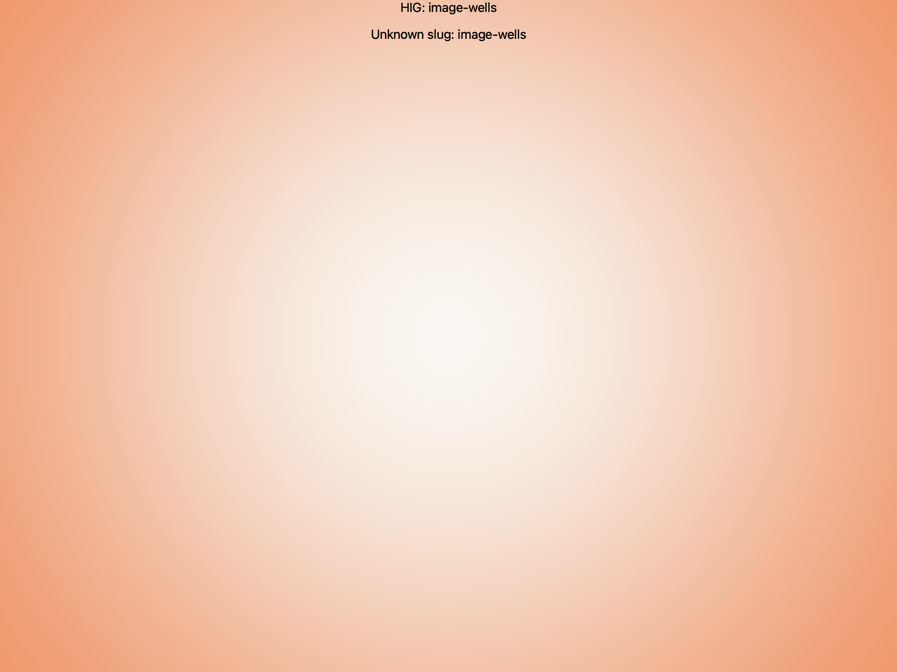
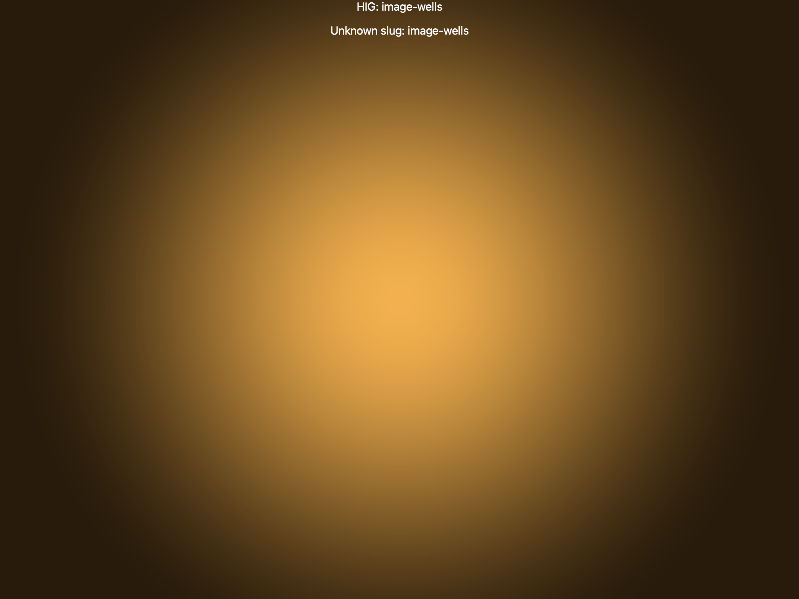

# Image wells -- Visual validation

## HIG reference

## Rendered -- macOS (light)

## Rendered -- macOS (dark)

## Rendered -- iOS (light)

## Rendered -- iOS (dark)

## Verdict: PENDING

`UI::ImageWell` now exists as a shared fallback primitive, but this component
has not yet gone through a meaningful visual validation pass. The current
captures are still placeholder host output, not a real image-well study. The
next step is to wire explicit image-well showcase scenes on both hosts,
regenerate all four appearances, and judge the result against the HIG's framed
drop-target feel.
