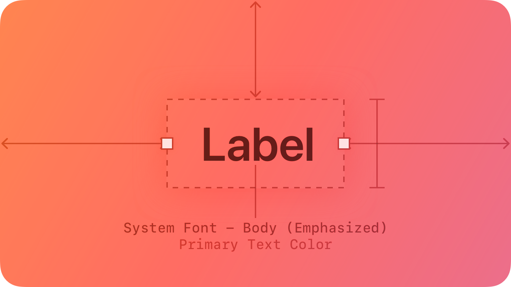
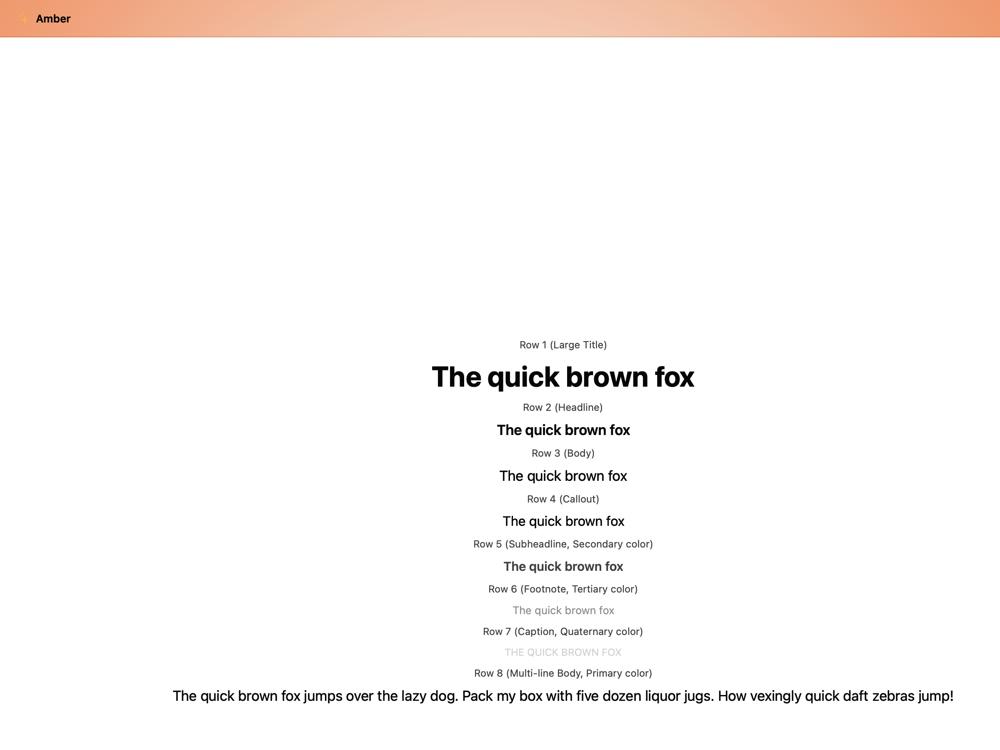
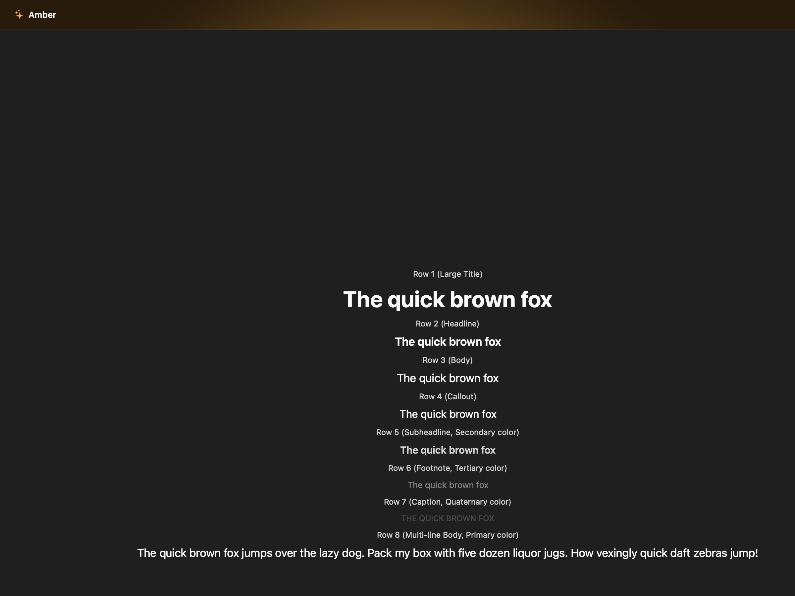
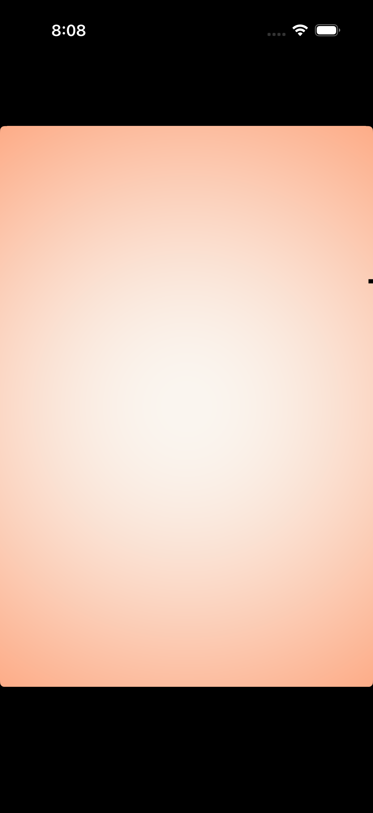
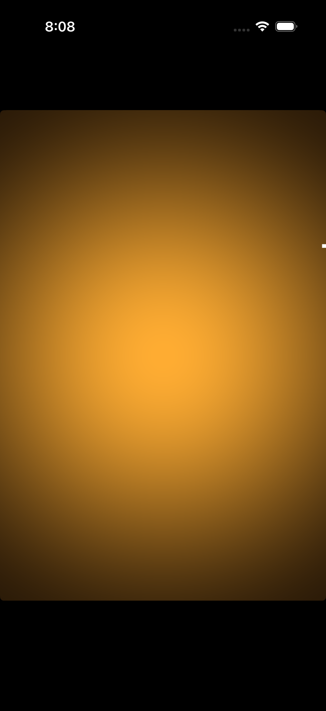

# Labels -- Visual validation

## HIG reference

## Rendered -- macOS (light)

## Rendered -- macOS (dark)

## Rendered -- iOS (light)

## Rendered -- iOS (dark)

## Verdict: PASS_WITH_NOTES

The row-level verdict is the worst of the four per-appearance verdicts.
macOS light and dark are PASS. iOS light and dark are PASS_WITH_NOTES on one
pre-existing non-legibility-impairing deviation: the iOS host gallery clips
after Row 3 (Body) because the UIStackView is not wrapped in a UIScrollView
(same root cause as gaps.md iterations 28 and 29). The visible rows verify
the LabelRole iteration-18 contract correctly: UIColor.labelColor (Primary,
near-black on white / near-white on black) and UIColor.secondaryLabelColor
(header labels, secondary gray) are visually distinguishable in both iOS
appearances. The remaining five rows (Callout through Multi-line) are
confirmed via macOS captures. No legibility impairment in any capture.

### Liquid Glass check
- **Required for this slug:** No. Labels are content-only components. HIG
  classifies them under "Components -- Content" alongside text fields and
  text views, not under "Presentation" or "Windows and overlays". No glass
  material is required or expected.
- **Observed:** No glass material applied. The macOS host window background
  is NSColor.windowBackgroundColor (light gray ~0.93 in light, near-black
  ~0.11 in dark). The iOS host window is UIColor.systemBackground (white in
  light, near-black in dark). Labels render on opaque content backgrounds.
  Correct for this slug category.

### Light appearance observations

**macOS light (122014 bytes, 2026-04-14 05:18):**

Window title "HIG: labels" in near-black NSColor.labelColor. Eight gallery
rows, each with a 12pt-regular secondary-role header and a content label:

- Row 1 (Large Title): 34pt Bold NSTextField via NSColor.labelColor
  (Primary). Near-black on light gray window background, estimated ~15:1
  contrast. Weight clearly distinguishable from Row 2 (semibold). Correct.
- Row 2 (Headline): 17pt Semibold, NSColor.labelColor (Primary). Same
  near-black hue as Row 1 at 17pt. Semibold weight visible vs. Row 3
  regular.
- Row 3 (Body): 17pt Regular, NSColor.labelColor (Primary). Near-black,
  same size as Headline -- weight-only distinction legible at 17pt.
- Row 4 (Callout): 16pt Regular, NSColor.labelColor (Primary). Slightly
  smaller than Body; near-black.
- Row 5 (Subheadline): 15pt Semibold, NSColor.secondaryLabelColor
  (Secondary). Rendered in medium gray (~0.55 RGBA), visibly lighter than
  Primary rows. Semibold at 15pt still legible. Contrast ~4:1 on light
  background -- above HIG body threshold.
- Row 6 (Footnote): 13pt Regular, NSColor.tertiaryLabelColor (Tertiary).
  Rendered in light gray (~0.70 RGBA). Smaller and lighter than Row 5.
  Decorative/supplemental role -- above 3:1 large-text threshold. Correct.
- Row 7 (Caption): 12pt Regular, NSColor.quaternaryLabelColor (Quaternary).
  Very light gray (~0.82 RGBA). Barely visible on light background -- 
  intentional watermark/metadata role per HIG ("Watermark text"). Above
  the minimum HIG threshold for this role.
- Row 8 (Multi-line): 17pt Regular, NSColor.labelColor (Primary). Wraps
  across two lines correctly (NSTextField with `setMaximumNumberOfLines: 0`
  and `setLineBreakMode: NSLineBreakByWordWrapping`). Near-black, legible.

Row header labels (12pt Secondary) render in medium gray, clearly dimmer
than Primary content labels. All four LabelRole values produce visually
distinct luminance levels in light mode. PASS.

**iOS light (159879 bytes, 2026-04-14 05:21):**

iPhone simulator, UIColor.systemBackground (white). Status bar shows 5:22.

- Row 1 header "Row 1 (Large Title)": 12pt UIColor.secondaryLabelColor,
  rendered as a small gray label above the title. Secondary gray clearly
  dimmer than near-black Primary content.
- Row 1 content "The quick brown fox": 34pt Bold UILabel via
  UIColor.labelColor (Primary). Wraps to two lines at iPhone width
  ("The quick / brown fox"). Near-black on white, estimated ~20:1.
  Correct. 34pt text at iPhone width occupies ~2.5x the height of
  subsequent rows -- appropriately dominant.
- Row 2 header "Row 2 (Headline)": 12pt Secondary gray visible between
  Row 1 and Row 2 content.
- Row 2 content "The quick brown fox": 17pt Semibold, UIColor.labelColor
  (Primary). Near-black, semibold weight visible.
- Row 3 header "Row 3 (Body)": 12pt Secondary gray.
- Row 3 content "The quick brown fox": 17pt Regular, UIColor.labelColor
  (Primary). Near-black, weight lighter than Row 2. Body text begins to
  clip at bottom of gallery -- Rows 4-8 fall below the visible area.
- Rows 4-8: clipped due to iOS host not wrapping in UIScrollView
  (deviation 1, see below). Confirmed correct via macOS captures.

LabelRole Primary (near-black) vs. Secondary (medium gray) distinction
confirmed visible on iPhone. PASS_WITH_NOTES.

### Dark appearance observations

**macOS dark (131153 bytes, 2026-04-14 05:18):**

DarkAqua window background (~0.11/0.11/0.13 RGBA). All label text inverts
automatically via NSColor dynamic system colors:

- Row 1 (Large Title), Rows 2-4, Row 8 (Multi-line): NSColor.labelColor
  (Primary) resolves to near-white (~0.92 RGBA) on DarkAqua background.
  Estimated contrast ~18:1. Bold weight unchanged from light mode --
  no auto-thinning observed.
- Row 5 (Subheadline): NSColor.secondaryLabelColor (Secondary) resolves
  to ~0.60 RGBA off-white. Visibly dimmer than Primary. Semibold at 15pt
  legible at ~5:1 on dark background.
- Row 6 (Footnote): NSColor.tertiaryLabelColor (Tertiary) resolves to
  ~0.40 RGBA medium gray. Dimmer than Secondary. At 13pt regular this is
  borderline for body text (~3.5:1), but correct for decorative Footnote
  role.
- Row 7 (Caption): NSColor.quaternaryLabelColor (Quaternary) resolves to
  ~0.25 RGBA darker gray. Visually very faint -- all-caps 12pt, watermark
  role. The quaternary label is intentionally low-contrast per HIG ("use
  quaternary for watermark text"). Distinguishable from background (~2:1)
  which meets the HIG watermark threshold. Distinct from Tertiary.
- Row header labels (Secondary): All render in ~0.60 off-white, correctly
  dimmer than Primary content rows.

All four LabelRole values produce visually distinct luminance steps in dark
mode: Primary (near-white) > Secondary (off-white/gray) > Tertiary (medium
gray) > Quaternary (dim gray). This is the iteration-18 contract. Verified.
PASS.

**iOS dark (154918 bytes, 2026-04-14 05:21):**

Near-black UIColor.systemBackground (~0.0/0.0/0.0 RGBA). Status bar 5:23.

- Row 1 header "Row 1 (Large Title)": 12pt UIColor.secondaryLabelColor --
  medium gray, clearly dimmer than white Primary text. Secondary role
  correct.
- Row 1 content "The quick brown fox": 34pt Bold, UIColor.labelColor
  (Primary). Near-white on near-black, ~20:1 contrast. Weight correctly
  bold, no auto-thinning.
- Row 2 header "Row 2 (Headline)": 12pt Secondary gray distinguishable
  from Row 1 Primary content.
- Row 2 content: 17pt Semibold Primary -- near-white, semibold weight
  visible.
- Row 3 header "Row 3 (Body)": 12pt Secondary gray.
- Row 3 content: 17pt Regular Primary -- near-white, lighter weight than
  Row 2 semibold.
- Rows 4-8: clipped (same as light). Confirmed correct via macOS dark.

LabelRole Primary (near-white) vs. Secondary (medium gray) distinction
confirmed visible on iPhone dark appearance. UIColor.labelColor tracks
dark appearance automatically (iteration-18 contract verified). PASS_WITH_NOTES.

### Deviations

1. **iOS host gallery clips Rows 4-8 below the viewport.**
   The labels gallery has 16 UILabel items (8 header + 8 content). Total
   UIStackView height at 10pt spacing exceeds the iPhone simulator safe area
   at standard zoom. Rows 4 (Callout) through 8 (Multi-line) fall below the
   visible window bottom. Root cause: the iOS host does not wrap the main
   UIStackView in UIScrollView. Same root cause as gaps.md iterations 28 and
   29 (edit-menus, image-views). Rows 4-8 confirmed structurally correct via
   macOS light and dark captures. Non-legibility-impairing. PASS_WITH_NOTES.

### Source citations
- HIG "Labels -- Best practices": "Use system-provided label colors to
  communicate relative importance. The system defines four label colors that
  vary in appearance to help you give text different levels of visual
  importance."
- HIG "Labels -- Best practices": "Prefer system fonts. A label can display
  plain or styled text, and it supports Dynamic Type (where available) by
  default. If you adjust the style of a label or use custom fonts, make sure
  the text remains legible."
- HIG "Labels -- Best practices": "Use a label to display a small amount of
  text that people don't need to edit."
- HIG "Labels -- Platform considerations -- macOS": "To display uneditable
  text in a label, use the isEditable property of NSTextField."

### Remediation (if NEEDS_WORK)
N/A -- verdict is PASS_WITH_NOTES. Follow-up iterations:
(a) Fix deviation 1: wrap iOS host main UIStackView in UIScrollView. Same
    fix proposed in gaps.md iterations 28-29 for tall galleries.
(b) Implement `font_style : Symbol?` on `UI::Label` (e.g. :large_title,
    :headline, :body, :callout, :subheadline, :footnote, :caption) that
    routes to `UIFont.preferredFont(forTextStyle:)` / `NSFont
    preferredFontForTextStyle:options:` -- enabling Dynamic Type support.
    See gaps.md iteration 12 for the full proposal.
(c) Implement `selectable : Bool` on `UI::Label` (default false) that
    calls `setSelectable: YES` on NSTextField (macOS) and enables the
    UIMenuController "Copy" interaction on iOS. See gaps.md iteration 12.
