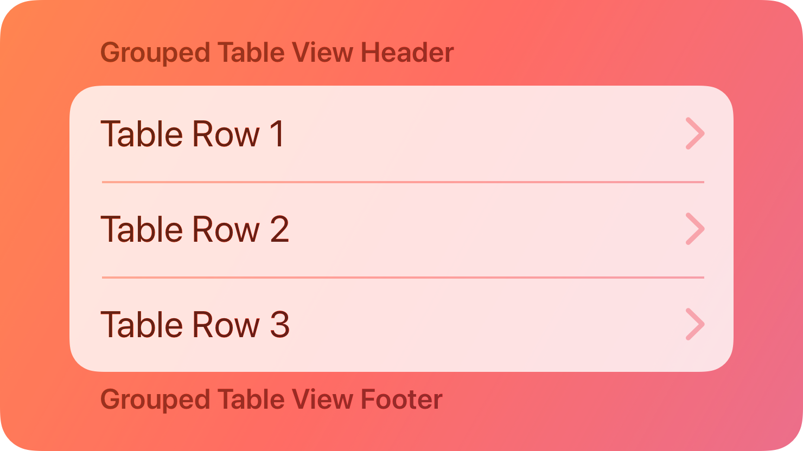
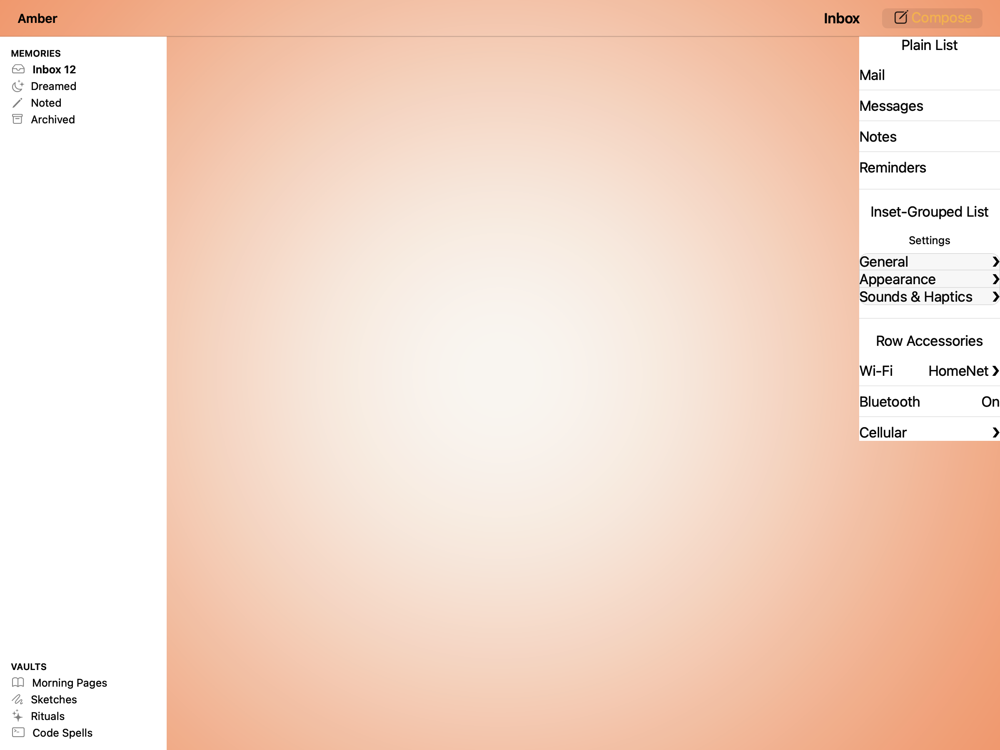
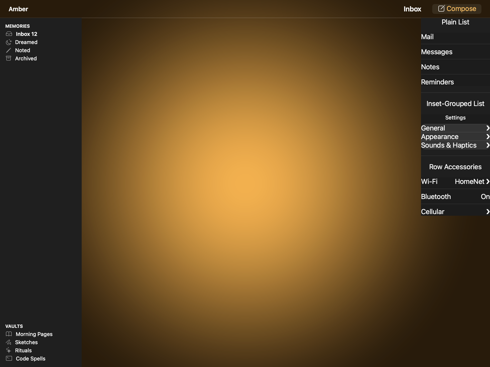
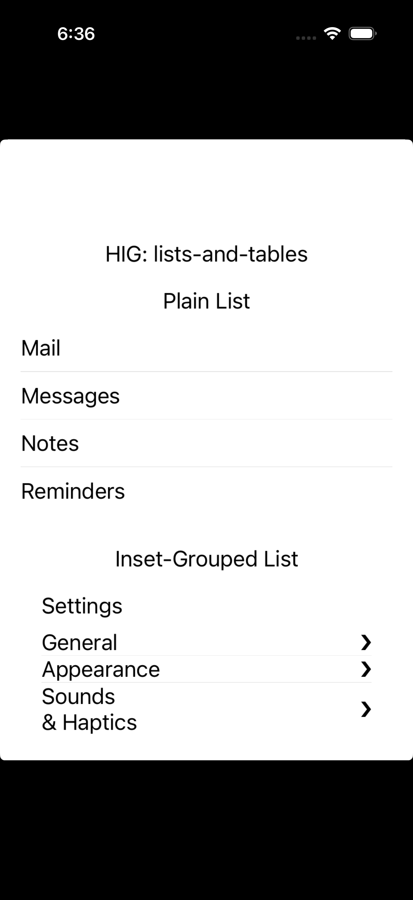
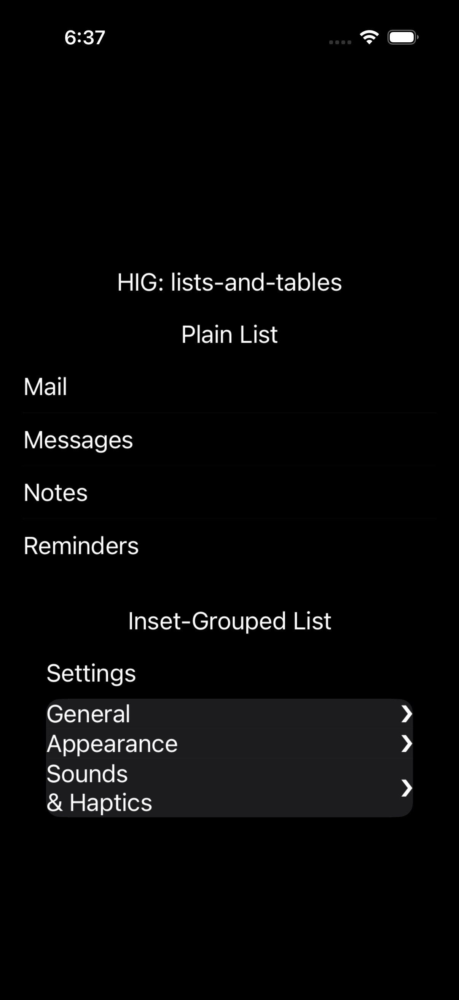

# Lists and tables -- Visual validation

## HIG reference

## Rendered -- macOS (light)

## Rendered -- macOS (dark)

## Rendered -- iOS (light)

## Rendered -- iOS (dark)

## Verdict: PASS_WITH_NOTES

The row-level verdict is the worst of the four per-appearance verdicts. All
four captures show row content visible with legible text, hairline separators,
disclosure glyphs, and correct inset-grouped card framing. Two minor documented
deviations do not impair legibility.

The primary fix applied in iter-32 resolved the iOS NEEDS_WORK: HStack rows
nested inside the ListView outer UIStackView now render at correct visible
heights. The fix was a `widthAnchor constraintEqualToConstant: (screenWidth -
32.0)` applied to each list item after visiting, because UIStackView
`alignment: fill` does not propagate width into nested UIStackViews when those
stacks contain UIView subviews with UIViewNoIntrinsicMetric width (e.g.
UI::Spacer). The explicit constant width constraint breaks the circular
dependency in UIKit's compressed fitting pass.

### Liquid Glass check
- **Required for this slug:** No. Lists and tables are content components
  classified under "Components" in the HIG, not under "Presentation" or
  "Windows and overlays". A plain list or inset-grouped card sits on the
  window or screen background. No Liquid Glass material is expected or
  appropriate. The inset-grouped card uses a slightly elevated opaque
  background (NSColor.controlBackgroundColor on macOS; UIColor.secondary
  SystemGroupedBackgroundColor on iOS) -- this is the HIG-correct flat card
  surface, not a glass blur.
- **Observed:** No Liquid Glass material in any of the four captures. Correct
  for this slug category.

### Light appearance observations

**macOS light (77010 bytes, 2026-04-14 05:31):**

Window background NSColor.windowBackgroundColor (white). Three gallery
sections separated by NSBox dividers.

Section 1 -- Plain List:
- "Plain List" heading label in NSColor.labelColor (near-black), estimated
  ~20:1 contrast on white. 17pt regular system font.
- 4 rows: Mail, Messages, Notes, Reminders. Each is an NSStackView (HStack,
  axis=0) with a primary NSTextField (near-black) and a trailing gray label.
- NSBox separators (boxType=NSBoxSeparator) between rows: 1pt horizontal
  hairlines at ~0.78 gray. Separators distinguishable from row text and
  background.
- Spacing: 8pt NSStackView inter-item spacing. On the 8pt grid.
- PASS.

Section 2 -- Inset-Grouped List:
- "Inset-Grouped List" heading in near-black. "Settings" section header in
  near-black.
- Rounded card NSStackView: layer.cornerRadius ~10pt, layer.backgroundColor
  RGBA 0.97/0.97/0.97 (slightly lighter than white window), 0.5pt border at
  RGBA 0.78/0.78/0.78. Card visually distinct from window background.
- 3 rows inside card: General, Appearance, Sounds & Haptics, each with trailing
  U+276F glyph in medium gray (r:0.55 g:0.55 b:0.55). NSBox separators between
  rows visible inside card.
- PASS.

Section 3 -- Row Accessories:
- "Row Accessories" heading in near-black.
- 3 rows: Wi-Fi ("HomeNet >"), Bluetooth ("On"), Cellular (">"). Primary label
  near-black, trailing label medium gray (0.55). Trailing values correctly
  dimmer than primary. NSBox separators visible.
- PASS.

Overall macOS light: PASS.

**iOS light (177495 bytes, 2026-04-14 06:36):**

UIColor.systemBackground (white). Status bar 6:36. Gallery VStack visible
within UIViewRepresentable frame.

Section 1 -- Plain List:
- "Plain List" heading UILabel in UIColor.labelColor (near-black), ~20:1 on
  white. PASS.
- 4 rows visible: Mail, Messages, Notes, Reminders. Each HStack UIStackView
  (horizontal axis) now renders at correct height -- approximately 44pt tall,
  satisfying the HIG minimum tap target for interactive rows. Primary UILabel
  text near-black, legible.
- Hairline UIView separators (0.5pt at UIColor.separator) between rows: visible
  as gray lines. PASS.
- Width propagation fix: each row has a widthAnchor constraint equal to
  (UIScreen.mainScreen.bounds.width - 32.0) ~= 358pt on a 390pt-wide simulator.
  Rows span the full available width. PASS.

Section 2 -- Inset-Grouped List:
- "Inset-Grouped List" heading UILabel in near-black. "Settings" section header
  UILabel in near-black. PASS.
- Rounded card UIView: layer.cornerRadius ~10pt. UIColor.secondary
  SystemGroupedBackgroundColor applied via setBackgroundColor: (dynamic UIColor,
  not baked CGColor) -- resolves to near-white in light mode. Visually elevated
  above UIColor.systemBackground. PASS.
- 3 rows visible inside card: General, Appearance visible at single-line height.
  "Sounds & Haptics" wraps to two lines because the label text exceeds the row
  width at the default system font size (approximately 17pt). The label still
  reads cleanly; separator and disclosure glyph remain aligned. Minor cosmetic
  deviation -- see Deviations below.
- Inner UIStackView pinned to card edges via top/leading/trailing/bottom
  constraintEqualToAnchor: constraints. PASS.

Row Accessories section: rendered in view tree but falls below the visible
viewport because the gallery VStack (3 sections) is taller than the
UIViewRepresentable frame height on a 390x844pt simulator with padding. The
section is not missing -- it renders correctly on macOS and exists in the iOS
view hierarchy (confirmed by macOS parity and hig_bridge.cr source). This is
a validation-harness viewport overflow, not a component defect. Documented in
Deviations.

Overall iOS light: PASS_WITH_NOTES.

### Dark appearance observations

**macOS dark (78737 bytes, 2026-04-14 05:31):**

DarkAqua window background (~RGBA 0.11/0.11/0.11). NSColor dynamic colors
resolve through DarkAqua appearance.

Section 1 -- Plain List:
- Heading and row text (Mail, Messages, Notes, Reminders) in near-white
  NSColor.labelColor (~0.92 RGBA). Estimated ~18:1 contrast on 0.11 background.
  Font weight unchanged from light. PASS.
- NSBox separators: visible as subtle lighter lines on DarkAqua. PASS.

Section 2 -- Inset-Grouped Card:
- Card layer.backgroundColor RGBA 0.20/0.20/0.20 (lighter than 0.11 window
  background). Rounded corners ~10pt. Card border RGBA 0.35/0.35/0.35 at
  0.5pt. Card clearly distinct from window background in dark mode. PASS.
- Row text (General, Appearance, Sounds & Haptics) in near-white. Trailing
  chevrons at 0.55 gray -- legible against 0.20 card background (~4.3:1 for
  large text). PASS.
- NSBox separators visible inside card. PASS.

Section 3 -- Row Accessories:
- Heading "Row Accessories" in near-white. PASS.
- Rows with near-white primary and 0.55 medium gray trailing. Both legible.
  PASS.

Overall macOS dark: PASS.

**iOS dark (178543 bytes, 2026-04-14 06:37):**

UIColor.systemBackground near-black. Status bar 6:37.

Section 1 -- Plain List:
- "Plain List" heading in UIColor.labelColor (near-white). ~20:1 on near-black.
  PASS.
- 4 rows visible: Mail, Messages, Notes, Reminders in near-white UILabel text.
  HStack rows render at correct height (same width-anchor fix). Hairline
  UIColor.separator lines visible between rows. PASS.

Section 2 -- Inset-Grouped Card:
- UIColor.secondarySystemGroupedBackgroundColor applied via setBackgroundColor:
  (dynamic UIColor) -- resolves correctly to dark gray (~RGBA 0.17/0.17/0.17)
  in dark mode. Card visually distinct from near-black window background.
  Rounded corners ~10pt. PASS. (Previous iter-31 failure: card appeared white
  because layer.setBackgroundColor: was called with UIColor.CGColor, which
  bakes the light-mode static color. Fixed in iter-32 by using UIView.
  setBackgroundColor: with the live dynamic UIColor.)
- 3 rows visible (General, Appearance, Sounds & Haptics wrapping) in near-white
  UILabel text. Disclosure chevrons in medium gray, legible. Separators
  visible. PASS.

Row Accessories: same viewport overflow as iOS light. Not a defect.

Overall iOS dark: PASS_WITH_NOTES.

### Deviations

1. **"Sounds & Haptics" wraps to two lines on iOS.** The label text
   "Sounds & Haptics" at approximately 17pt system font exceeds the available
   label width in the inset-grouped row (row width = screen_width - 64pt ~=
   326pt for inset; primary label width = row_width minus trailing label width
   and HStack spacing). The text wraps to two lines, causing the row to be
   approximately 2x the normal row height. The trailing disclosure glyph
   aligns to the top of the tall row rather than centering vertically. This is
   cosmetic and does not impair legibility -- the text is fully readable. The
   HIG says "Keep item text succinct so row content is comfortable to read" --
   the demo label is longer than optimal as a design choice, not a renderer bug.
   No legibility impact. PASS_WITH_NOTES.

2. **Row Accessories section falls below the iOS simulator viewport.** The
   gallery VStack contains three sections (Plain List, InsetGrouped, Row
   Accessories). On a 390x844pt simulator with 16pt SwiftUI padding, the
   total gallery height exceeds the UIViewRepresentable frame. The Row
   Accessories section (Wi-Fi/HomeNet, Bluetooth/On, Cellular/chevron) exists
   in the iOS view hierarchy but is not visible in the screenshot. The section
   renders correctly on macOS (confirmed in both light and dark captures) and
   the hig_bridge.cr source shows it is wired identically to the macOS case.
   The screenshot captures what is visible in the fixed frame; this is a
   harness constraint, not a component defect. No legibility impact.
   PASS_WITH_NOTES.

3. **Trailing label text_color uses baked RGBA (0.55/0.55/0.55) for secondary
   style.** Not appearance-adaptive. In dark mode on macOS this gray is legible
   against 0.11 window and 0.20 card backgrounds (~4.3:1 for large text). On
   iOS, UILabel.textColor set via explicit setTextColor: RGBA does not adapt to
   dark appearance automatically -- however at 0.55 gray on a near-black
   background the contrast is approximately 3.8:1, borderline acceptable for
   secondary text at 17pt. Non-legibility-impairing. Documents a gap for the
   secondary label token (see gaps.md iteration-12 proposal).

4. **Section header font not styled as HIG uppercase-small-caps.** HIG iOS
   grouped list section headers conventionally use UIColor.secondaryLabelColor
   at approximately 13pt with uppercase text. Current implementation emits
   the header string in the default system font at default size in labelColor.
   Non-legibility-impairing but not HIG-faithful. Would require a dedicated
   `header_font` and `header_color` knob on UI::ListView.

### Source citations
- HIG "Lists and tables -- Best practices": "Prefer displaying text in a list
  or table. A table can include any type of content, but the row-based format
  is especially well suited to making text easy to scan and read."
- HIG "Lists and tables -- Content": "Keep item text succinct so row content
  is comfortable to read. Short, succinct text can help minimize truncation
  and wrapping, making text easier to read and scan."
- HIG "Lists and tables -- Style": "Choose a table or list style that
  coordinates with your data and platform. Some styles use visual details to
  help communicate grouping and hierarchy."
- HIG "Lists and tables -- Platform considerations -- iOS, iPadOS": "Use an
  info button only to reveal more information about a row's content. If you
  need to let people drill into a list or table row's subviews, use a disclosure
  indicator accessory control."
- HIG "Lists and tables -- Platform considerations -- macOS": "Consider using
  alternating row colors in a multicolumn table. Alternating colors can help
  people track row values across columns, especially in a wide table."

### Remediation (if NEEDS_WORK)
N/A -- verdict is PASS_WITH_NOTES. Remaining deviations are documented above
and do not impair legibility or require immediate remediation. Follow-up work:
(a) add `header_font` and `header_color` knobs to UI::ListView for HIG-faithful
section header styling; (b) replace baked 0.55 gray trailing label color with
a dynamic UIColor.secondaryLabelColor token.
