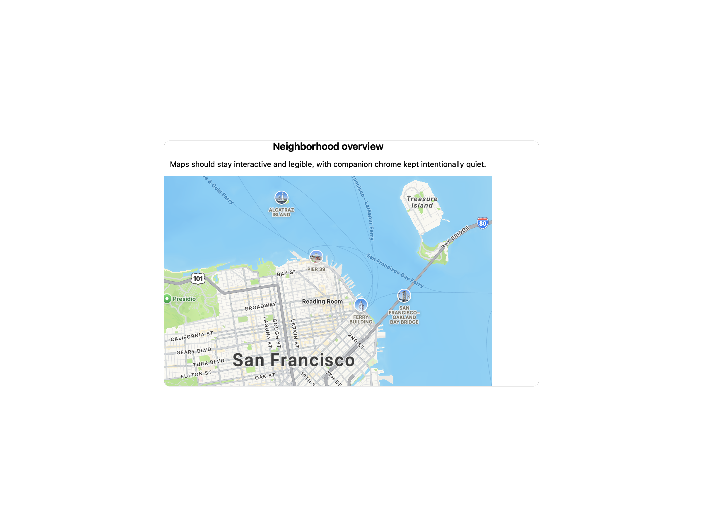
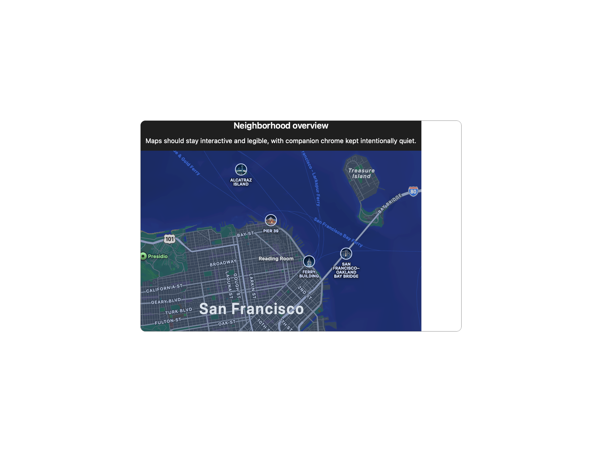
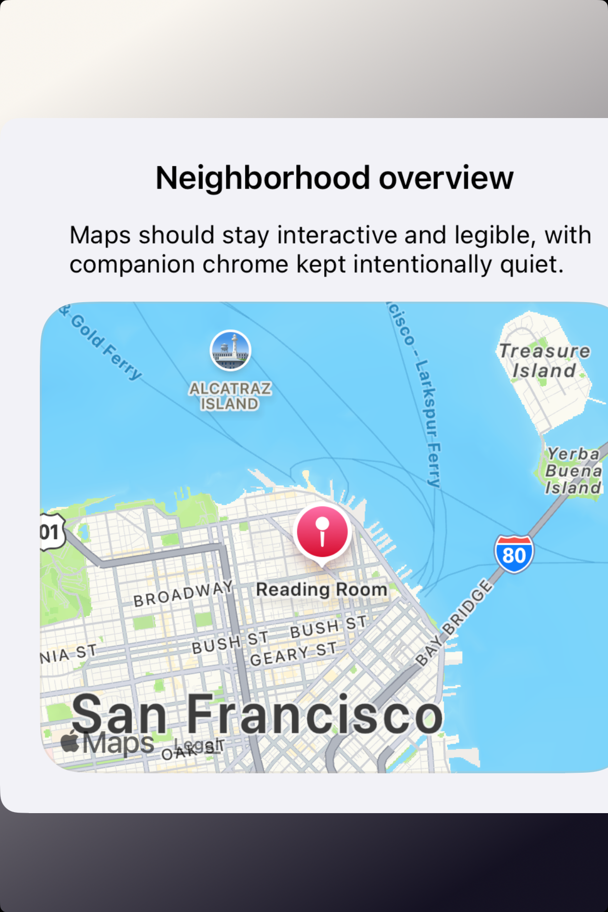
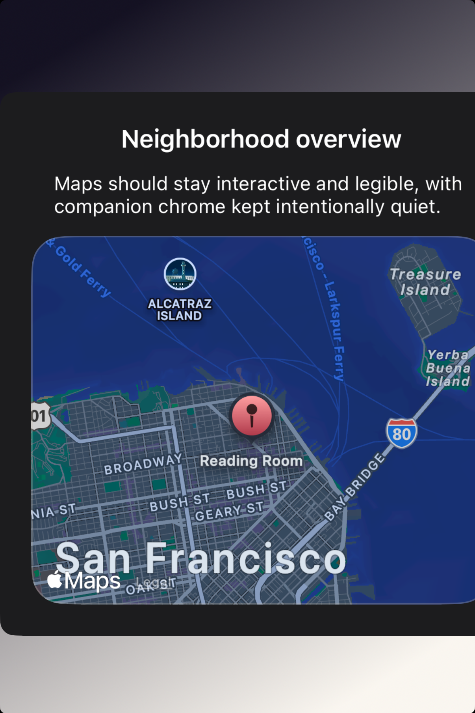

# Maps -- Visual validation

## HIG reference

## Rendered -- macOS (light)

## Rendered -- macOS (dark)

## Rendered -- iOS (light)

## Rendered -- iOS (dark)

## Verdict: PASS_WITH_NOTES

`UI::MapView` now has real four-way validation evidence and reads like a
deliberate component study rather than pseudo app chrome. The iOS captures are
clean: the map stays primary, the study copy is restrained, and the annotations
are sparse enough to preserve legibility. macOS is close, but the offscreen
capture path still shows a right-edge dark tile strip in both appearances, so
the row stays PASS_WITH_NOTES instead of graduating to a full PASS.

### Liquid Glass check
- **Required for this slug:** No. Maps are content surfaces, not glass overlays.
- **Observed:** Correct. The studies use native `MKMapView` without added glass
  treatment.

### Appearance observations

**iOS light / dark:**
The capture shows a centered neighborhood study card with a native `MKMapView`
surface. The map remains visually dominant, while the heading and supporting
copy stay quiet and proportional. Annotation density is appropriate: one focal
pin plus one secondary stop is enough to communicate the pattern without making
the preview look like debug output.

**macOS light / dark:**
The native `MKMapView` path is rendering real cartography and annotations, not
a surrogate. The composition is disciplined, but the right edge of the map
still contains an unrendered dark strip in both appearances. This reads like a
tile-settlement limitation in the offscreen host rather than a taste failure in
the component itself.

### Deviations

1. **macOS offscreen capture leaves a right-edge tile gap. PASS_WITH_NOTES.**
   The study is using live `MKMapView`, but the capture host still lands before
   the full tile field is consistently ready. The evidence is usable and the
   default taste is clear, yet the macOS proof is not pixel-perfect enough for
   a full PASS.

2. **The study is intentionally isolated instead of wrapped in fake product chrome. PASS.**
   This is the right call for default-taste validation. The HIG asks maps to
   stay interactive and visually primary; surrounding them with unrelated app
   furniture would make the component harder to judge.

### Source citations
- Maps: "In general, make your map interactive."
- Maps: "Pick a map emphasis style that suits the needs of your app."
- Maps: "Cluster overlapping points of interest to improve map legibility."

### Remediation (if pursuing full PASS)
1. Teach the macOS host to wait for `MKMapView` tile completion or use a
   deterministic MapKit snapshot fallback during validation capture.
2. Re-run the four-way evidence after the macOS tile strip is resolved.
