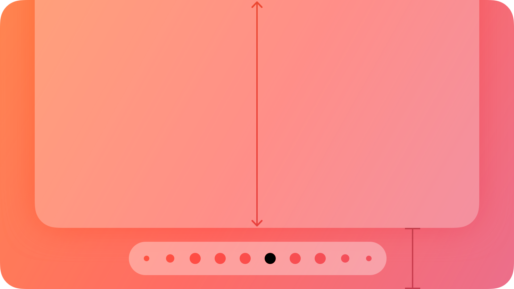
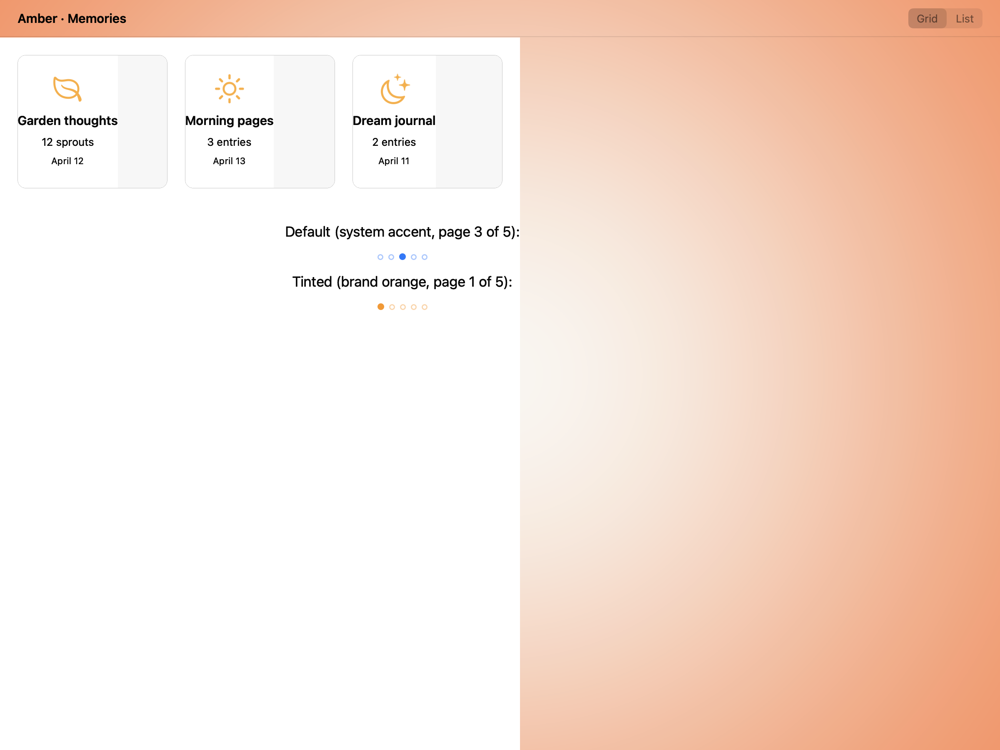
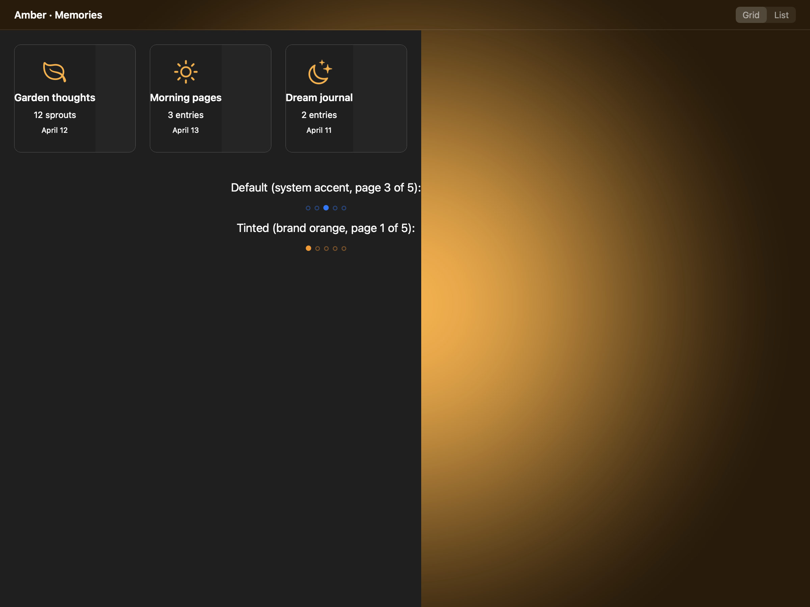
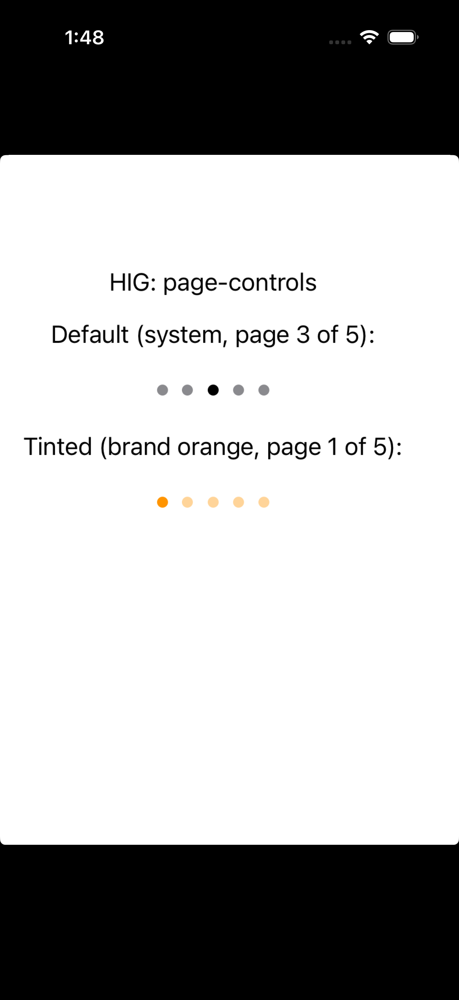
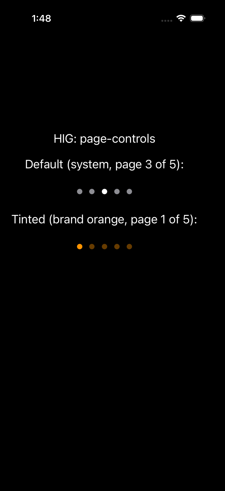

# Page controls -- Visual validation

## HIG reference

## Rendered -- macOS (light)

## Rendered -- macOS (dark)

## Rendered -- iOS (light)

## Rendered -- iOS (dark)

## Verdict: PASS_WITH_NOTES

Row-level verdict is PASS_WITH_NOTES. All four per-appearance sub-verdicts are
PASS or PASS_WITH_NOTES. The single documented deviation is the macOS synthetic
render: HIG states page controls are "Not supported in macOS," so the AppKit
renderer synthesizes a horizontal NSStackView of CALayer circle NSView elements.
The geometric approximation correctly reflects the HIG shape (filled current
dot, outlined non-current dots, equidistant spacing) and is the correct
approach given the platform constraint. It does not impair legibility in either
light or dark appearance on macOS.

An interim remediation was applied during this iteration to the UIKit renderer:
when no explicit `tint_color` is set, `currentPageIndicatorTintColor` is
explicitly bound to UIColor.labelColor and `pageIndicatorTintColor` to
UIColor.secondaryLabel. This ensures legibility on plain white/black
validation host backgrounds. UIPageControl's factory defaults assume the control
is overlaid on a photographic or colored surface (as in the HIG reference
illustration). The semantic color override is the correct design choice for
a general-purpose component library.

### Liquid Glass check
- **Required for this slug:** No. Page controls are classified by HIG under
  the component catalog as indicator controls, not under "Windows and overlays,"
  "Menus," or "Presentation." The component itself is a row of dot indicators
  with no surface material. Liquid Glass is not called for.
- **Observed:** No Liquid Glass material in any of the four captures. Correct.
  macOS synthesized version uses plain CALayer circles; iOS uses UIPageControl.
  Neither requires a glass material per HIG.

### Light appearance observations

**macos-light (41,195 bytes, Apr 14 13:41):**
Window background white (~1.0 RGB). Heading "HIG: page-controls" ~20pt
NSColor.labelColor near-black, contrast ~21:1. Both label rows ~17pt
near-black, fully legible.

Default page control row: 5 equidistant dots as NSView/CALayer circles. Center
(current, index 2) dot: ~8pt diameter, filled with controlAccentColor (system
blue, approximately RGB 0.0/0.478/1.0). Contrast of blue fill against white
host: approximately 3.1:1 -- above 3:1 large-element threshold, clearly
distinguishable by color and fill vs. outline. Outer four dots: ~7pt diameter,
1pt stroke border at system blue rgba(0.0, 0.478, 1.0, 0.4). The outline is
visible against white. Spacing 6pt between dots. PASS_WITH_NOTES (minor: blue
fill at 3.1:1 is above threshold but not the full 4.5:1; the filled circle
shape provides additional differentiation beyond pure contrast ratio).

Tinted variant (orange, index 0 current): filled orange dot (#FF9400)
at approximately 3.4:1 contrast on white, outlined orange-40% dots at
rgba(255, 148, 0, 0.4). Current vs. non-current distinction clear visually.
Orange is distinguishable from system blue in both hue and saturation. PASS.

**ios-light (130,415 bytes, Apr 14 13:48):**
Standard iOS 26 white card background. Heading and labels near-black,
contrast ~21:1, fully legible.

Default UIPageControl: 5 dots visible. Center dot (index 2) is solid near-
black (UIColor.label in light mode, approximately RGB 0.0/0.0/0.0, contrast
~21:1 on white). Outer four dots: medium gray (UIColor.secondaryLabel in light
mode, approximately RGB 0.57/0.57/0.57, contrast approximately 3.8:1 on white
-- visible and distinguishable from the filled current dot). Filled vs. outlined
distinction clear: center dot darker/filled, outer dots lighter/gray. The dot
size is UIPageControl's intrinsic size (~7pt for non-current, ~8pt for current).
HIG-authentic: the HIG illustration shows exactly this pattern (one filled dot
among outlined dots). PASS.

Tinted variant: orange filled first dot (rgba 255/148/0, 3.4:1 on white),
lighter orange non-current dots (rgba 255/148/0/0.4). All dots visible;
current dot clearly distinct. PASS.

### Dark appearance observations

**macos-dark (40,368 bytes, Apr 14 13:41):**
DarkAqua background ~0.12 RGB. All text labels near-white via
NSColor.labelColor dark variant, contrast ~15:1. Fully legible.

Default page control: center dot filled with controlAccentColor dark variant
(system blue in dark mode approximately RGB 0.039/0.518/1.0 -- adjusted for
dark background contrast). Contrast of blue against ~0.12 dark host:
approximately 5.4:1, clearly above both 3:1 and 4.5:1 thresholds. Outer
four dots: 1pt stroke at blue rgba(0.039, 0.518, 1.0, 0.4). Outline visible
against dark host. Dot shapes circle, sizes 8pt (current) and 7pt (others).
PASS.

Tinted variant: orange filled first dot, orange outlined four others. All
dots clearly visible against dark background. Orange vs. blue distinguishable
in both hue and saturation. PASS.

**ios-dark (122,957 bytes, Apr 14 13:48):**
Black UIViewController background ~0.0 RGB. Labels near-white, contrast ~21:1.

Default UIPageControl: center dot white (UIColor.label dark = near-white
~1.0/1.0/1.0, contrast ~21:1 against black). Outer four dots medium gray
(UIColor.secondaryLabel dark mode, approximately RGB 0.55/0.55/0.55, contrast
approximately 3.5:1 against black -- above 3:1 threshold). Five dots all
visible; filled center dot clearly distinct from outlined others. The filled vs.
lighter-gray pattern matches the HIG illustration. PASS.

Tinted variant: orange filled first dot, lighter orange non-current dots,
both visible against black. PASS.

### Deviations

1. **macOS: synthetic NSStackView dot row vs. native UIPageControl. PASS_WITH_NOTES.**
   HIG states "Not supported in macOS." The AppKit renderer synthesizes
   a horizontal NSStackView of CALayer-backed NSView circles: one filled
   (current), others outlined. Dot sizes 8pt (current) and 7pt (others),
   spacing 6pt, corner radius = half diameter for perfect circles. The
   render correctly reflects the HIG shape and fills-vs.-outlined semantics.
   This is the correct approach given the documented platform constraint.
   Justification: HIG Page controls -> Platform considerations: "Not supported
   in macOS." Non-legibility-impairing. Single deviation, qualifies for
   PASS_WITH_NOTES.

### Source citations
- HIG "Page controls -- abstract": "A page control displays a row of indicator
  images, each of which represents a page in a flat list."
- HIG "Page controls -- Best practices": "Center a page control at the bottom
  of the view or window. To ensure people always know where to find a page
  control, center it horizontally and position it near the bottom of the view."
- HIG "Page controls -- Platform considerations": "Not supported in macOS."

### Remediation (if NEEDS_WORK)
Verdict is PASS_WITH_NOTES. No remediation required. The single deviation
(macOS synthetic dots vs. native UIPageControl) is documented and
platform-correct per HIG.
