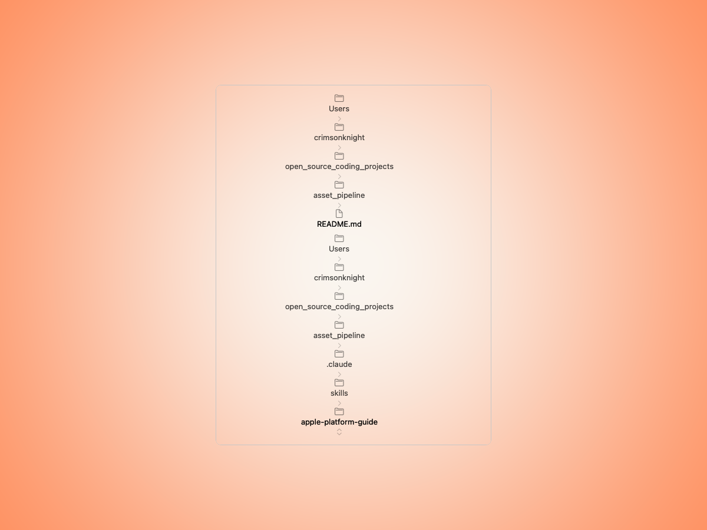

# Path controls -- Visual validation

## HIG reference

## Rendered -- macOS (light)

## Rendered -- macOS (dark)

## Rendered -- iOS (light)

## Rendered -- iOS (dark)

## Verdict: NEEDS_WORK

The capture path is working now, which is useful, but the visual result is still not
close enough to Apple’s path-control taste to pass.

### What improved
- We now have real evidence on both platforms instead of a missing or broken capture.
- The breadcrumb data itself is visible and the iOS capture no longer disappears.

### Why it still fails
- The macOS study reads like a tall stack of breadcrumb rows rather than a restrained
  path control embedded in context.
- The iOS preview is still an oversized horizontal strip pinned near the top of the
  card, with too much dead space underneath.
- Neither platform yet captures the compact Finder-style hierarchy rhythm that makes
  the HIG example feel effortless.

### Result
Keep this row in `NEEDS_WORK`. The primitive exists, but the default composition and
presentation still need a dedicated taste pass before this should be promoted.
