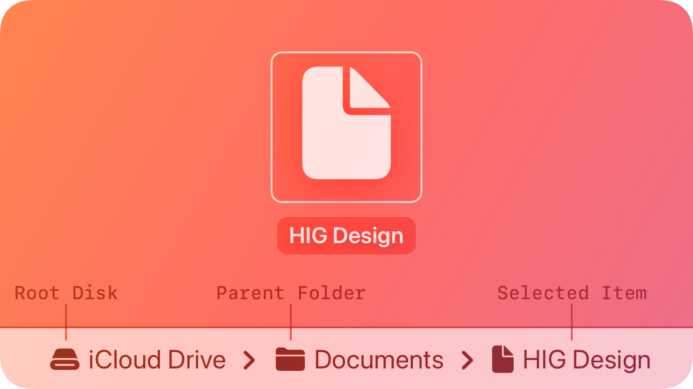

# Path controls -- Visual validation

## HIG reference

## Rendered -- macOS (light)

## Rendered -- macOS (dark)

## Rendered -- iOS (light)

## Rendered -- iOS (dark)

## Verdict: PENDING

This slug is no longer truly missing: `UI::PathControl` exists in the library
and both native renderers implement it. The backlog needed to catch up to that
reality. The row remains `PENDING` because the current validation studies are
not trustworthy yet. macOS is still falling through to an unknown-slug frame in
the host capture path, and the iOS fallback preview needs a more disciplined
composition before we should grade it seriously.

### Evidence manifest
- **Manifest:** `../evidence/path-controls.json`
- **Required captures:** PASS -- all four files present and linked above.
- **Report links:** PASS -- all four appearance-specific screenshot filenames
  linked above.

### Light appearance observations
- macOS: the current screenshot is not a valid component study; it falls back to
  an unknown-slug frame instead of showing the `NSPathControl` surface.
- iOS: the breadcrumb fallback exists and is readable, but it is brighter and
  flatter than the calmer, more deliberate studies we want from the default
  library taste.

### Dark appearance observations
- macOS: same host-routing failure as light appearance; the capture is not yet
  grading the actual control.
- iOS: the fallback remains recognizable, but the framing and contrast need a
  cleaner pass before the row should be promoted.

### Deviations / notes
- Apple HIG marks path controls unsupported on iOS, so the UIKit rendering here
- is best understood as a documented fallback rather than a claim of native HIG
  parity.
- The immediate fix is to reconnect the macOS showcase slug to the real
  `UI::PathControl` study and then decide whether the iOS fallback should remain
  in the validation grid or be clearly labeled as platform-specific guidance.

### Source citations
- Apple HIG -- "Path controls" (see `apple-hig/pages/path-controls.md` in the
  skill corpus).

### Remediation (if NEEDS_WORK)
N/A -- pending host cleanup.
