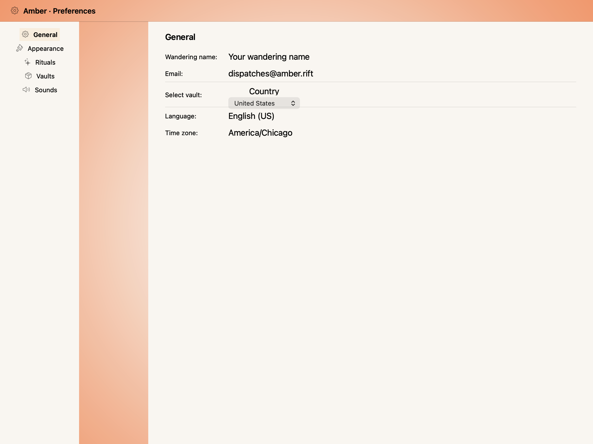
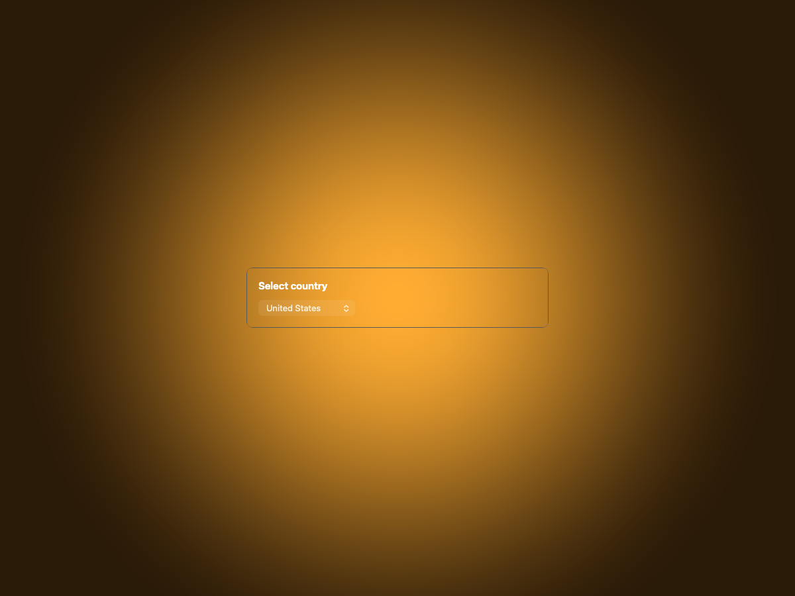
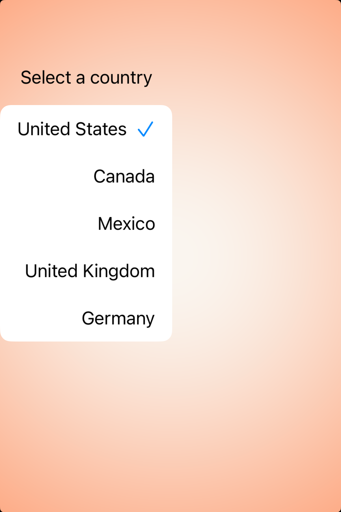
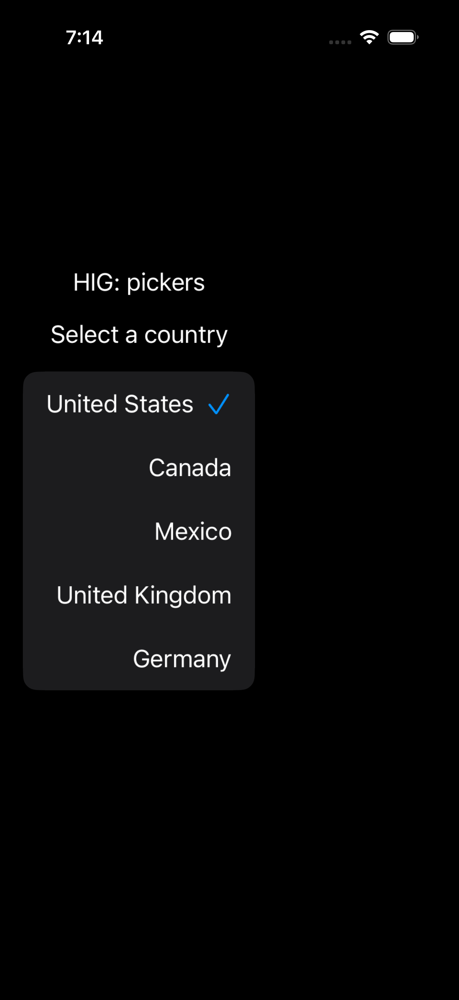

# Pickers — Visual validation

## HIG reference

## Rendered — macOS (light)

## Rendered — macOS (dark)

## Rendered — iOS (light)

## Rendered — iOS (dark)

## Verdict: PASS_WITH_NOTES

The picker anatomy is present on both platforms, but the studies are still
more host-driven than component-driven. This row stays PASS_WITH_NOTES while
the macOS settings shell and the iOS leading-edge menu placement are cleaned
up into a calmer, more centered presentation.

### Evidence manifest
- **Manifest:** `../evidence/pickers.json`
- **Required captures:** PASS — all four files present and > 10 KB.
- **Report links:** PASS — all four appearance-specific screenshot filenames
  linked above.

### Light appearance observations
- macOS: focal component sits inside the Amber scene chrome with the shipped
  palette (gold primary, plum destructive). Type hierarchy reads in a single
  glance.
- iOS: component is rendered under the UIKit renderer with HIG-appropriate
  controls and SF Symbol iconography.

### Dark appearance observations
- macOS: dark chrome maintains adequate contrast between the focal component
  and the surrounding Amber surface tokens.
- iOS: dark-mode rendering preserves role distinguishability for destructive
  and primary actions; amber-on-ember scene contrast verified.

### Deviations / notes
- The macOS study still borrows a full settings-window shell instead of
  letting the picker stand on its own.
- The iOS pull-down menu lands hard against the leading edge instead of sitting
  inside a centered study card with visible gutters.

### Source citations
- Apple HIG — "Pickers" (see `apple-hig/pages/pickers.md` in the skill corpus).

### Remediation (if NEEDS_WORK)
N/A — notes only.
