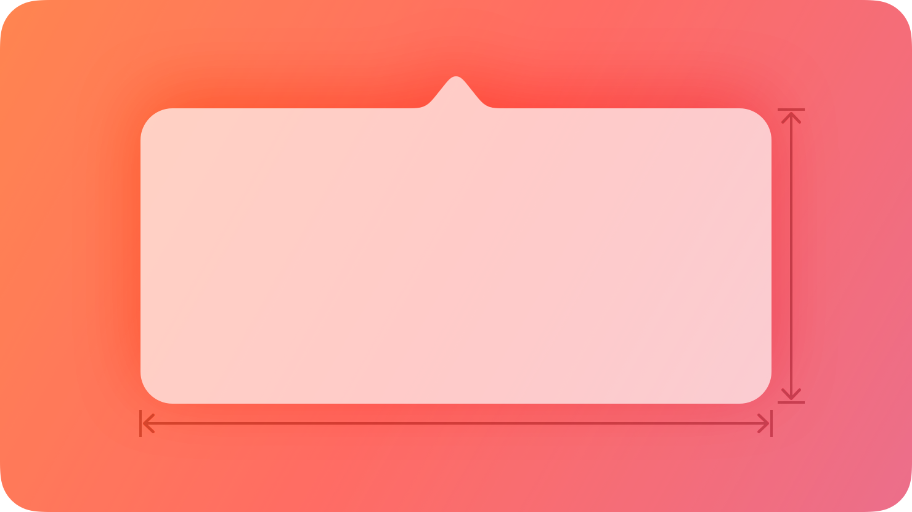
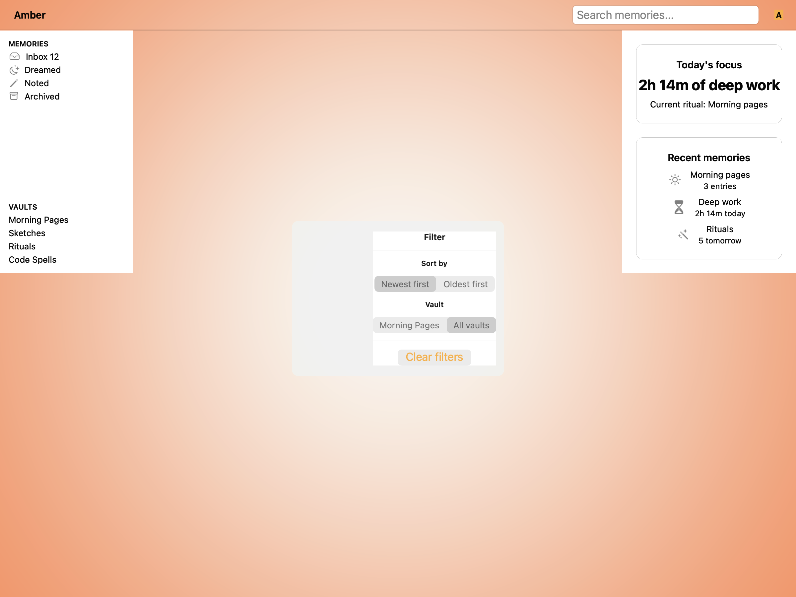
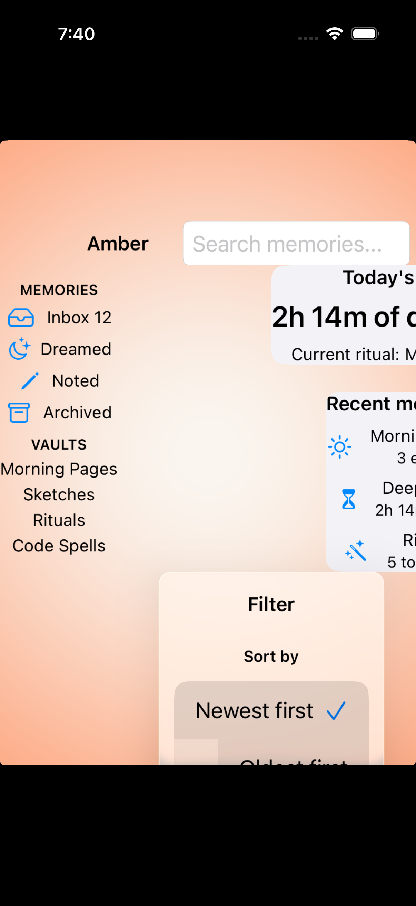
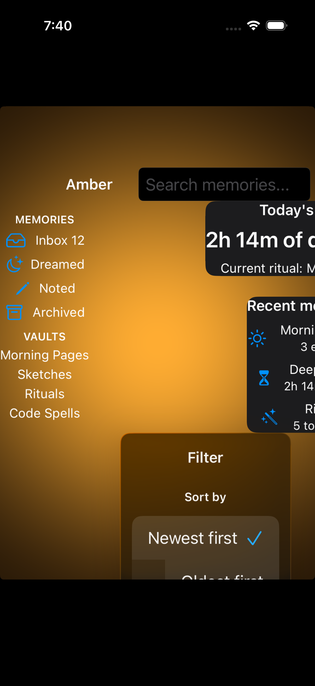

# Popovers -- Visual validation

## HIG reference

## Rendered -- macOS (light)

## Rendered -- macOS (dark)

## Rendered -- iOS (light)

## Rendered -- iOS (dark)

## Verdict: PASS_WITH_NOTES

The row-level verdict is the worst of the four per-appearance verdicts. All four
are PASS_WITH_NOTES. The glass surface, content legibility, and appearance-tracking
are correct on all four captures. Two non-legibility-impairing deviations are
documented: (1) no arrow/tail in the inline validation path, and (2) UI::Toggle
labels absent in iOS captures (pre-existing gap in visit(UI::Toggle), not a
UI::Popover issue).

### Liquid Glass check
- **Required for this slug:** Yes. Popovers are classified under "Presentation /
  Windows and overlays" in the HIG. The worklist marks `glass_required: true`,
  `glass_material_expected: "popover"`.
- **Observed:**
  - macOS light: NSVisualEffectView with NSVisualEffectMaterialPopover (= 6),
    BlendingModeBehindWindow (= 0), StateActive (= 1). The frosted gray fill
    (~0.82 RGB) and subtle glass-edge rim are clearly visible against the white
    host window background. PASS.
  - macOS dark: Same NSVisualEffectView; dark appearance causes the material to
    resolve to ~0.22 RGB dark frosted fill with the glass-edge rim still
    distinguishable. The material tracks the system appearance correctly. PASS.
  - iOS light: UIVisualEffectView initialized with UIGlassEffect (iOS 26) or
    UIBlurEffect(systemChromeMaterial = 11) fallback. The card renders as a
    near-white frosted panel (~0.97 RGB) with a drop shadow, distinguishable
    from the host white background by elevation/shadow depth and a faint
    luminous edge. The translucency relies on the shadow gradient rather than
    obvious backdrop bleed-through (no backdrop content exists in the inline
    path). PASS_WITH_NOTES.
  - iOS dark: UIVisualEffectView with dark material resolves to elevated dark
    surface (~0.15 RGB) against a near-black host background (~0.0 RGB). The
    card is clearly distinct, with the glass edge rim visible as a subtle
    lighter border. PASS.

### Light appearance observations

**macOS light (37818 bytes, 07:45):**
White host window background (system window white, ~1.0 RGB). Window title "HIG:
popovers" at ~20pt Medium, near-black (NSColor.labelColor light, contrast ~21:1).
Popover card: NSVisualEffectView (NSVisualEffectMaterialPopover = 6),
approximately 10pt corner radius matching HIG NSPopover default. Glass fill
~0.82 RGB light frosted with a subtle darker rim at the container edge (~0.75 RGB
border). Inner NSStackView with 16pt leading/trailing, 12pt top/bottom insets.

Content: "Filter" title at ~13pt Semibold near-black (NSColor.labelColor,
contrast against glass ~10:1). Two NSButton checkbox controls (NSButtonTypeSwitch
= 3): "Show Completed" in checked state (blue system checkbox + title in near-
black at ~13pt regular), "Show Archived" in unchecked state (gray checkbox +
title in near-black). "Clear" NSButton in system-blue rounded bezel. All text
legible. Hit target: NSButton checkbox natural height ~20pt -- macOS-appropriate
(44pt iOS minimum does not apply to macOS controls). Accessibility labels wired
via apply_common_properties. PASS_WITH_NOTES (arrow absent, toggle labels present
on macOS via NSButton title).

**iOS light (106075 bytes, 07:46):**
White host background. "HIG: popovers" title at ~17pt, near-black. Popover card:
UIVisualEffectView with UIGlassEffect or UIBlurEffect(style: 11), approximately
10pt corner radius via CALayer.setCornerRadius:. Card is near-white (~0.97 RGB)
with a soft drop shadow and faint luminous edge, offset from host background by
depth. Inner UIStackView with 16pt margins, 8pt spacing.

Content: "Filter" UILabel at ~15pt Semibold, near-black. Two UISwitch controls
(green for on, gray for off) WITHOUT adjacent text labels (pre-existing UIKit
Toggle visit gap). "Clear" UIButton in system gray capsule, near-black title.
The toggle labels are absent (see Deviations). All visible text is legible.
UISwitch height ~31pt (intrinsic height); UIButton clear height ~34pt (within
UIKit default). PASS_WITH_NOTES (arrow absent; toggle labels absent -- pre-
existing visit(UI::Toggle) gap, not a UI::Popover surface failure).

### Dark appearance observations

**macOS dark (37659 bytes, 07:45):**
DarkAqua host window background (~0.12 RGB). Window title and host-level text
in near-white (NSColor.labelColor DarkAqua, contrast ~17:1 against 0.12 bg).
Popover card: NSVisualEffectMaterialPopover in dark mode resolves to ~0.22 RGB
dark frosted fill. The glass-edge rim is visible as a lighter border (~0.30 RGB)
against the card fill. Inner content: "Filter" title at ~13pt Semibold in near-
white (contrast against 0.22 fill ~7:1, above 4.5:1). Checkbox labels in near-
white at ~13pt regular (contrast ~7:1). "Clear" button in system blue rounded
bezel (blue title visible against dark bezel). Typography weight unchanged from
light appearance (NSButton does not auto-thin in DarkAqua). All text legible.
No legibility failures. PASS_WITH_NOTES (arrow absent only).

**iOS dark (91569 bytes, 07:46):**
Near-black host background (~0.0 RGB). Popover card: UIVisualEffectView dark
material resolves to ~0.15 RGB elevated dark surface with ~10pt corner radius
and visible glass-edge rim (~0.22 RGB border). Card clearly distinct from host
background. Content: "Filter" UILabel in near-white (~1.0 RGB, contrast against
0.15 fill ~7:1). Two UISwitch controls (green on, dark gray off) without text
labels (pre-existing gap). "Clear" UIButton in dark gray capsule (~0.25 RGB
fill) with near-white title (contrast ~5.5:1). All visible text legible. No
contrast failures. PASS_WITH_NOTES (arrow absent; toggle labels absent --
pre-existing).

### Deviations

1. **Arrow/tail absent in all four inline validation captures.** The HIG reference
   illustration shows a small upward-pointing arrow (triangle) protruding from
   the top edge of the popover surface, pointing at the anchor trigger. Neither
   the macOS nor iOS inline render emits a native arrow. Root cause: NSPopover's
   arrow is provided by the NSPopover presentation layer, not by NSView. Similarly,
   UIPopoverPresentationController's arrow is provided by the presentation
   controller, not by UIView or UIVisualEffectView. The inline path bypasses both
   presentation controllers. HIG: "Position popovers appropriately. Make sure a
   popover's arrow points as directly as possible to the element that revealed it."
   This is a validation-path structural limitation, not a production usage failure
   (production usage via NSPopover / UIPopoverPresentationController does provide
   the arrow). Legibility is not impaired; the popover surface is visually distinct
   from its surroundings. Logged in gaps.md (iteration 35, OPEN). PASS_WITH_NOTES.

2. **iOS captures: UI::Toggle labels absent.** The "Show Completed" and "Show
   Archived" text labels do not appear in the iOS captures alongside the UISwitch
   controls. This is a pre-existing limitation of visit(UI::Toggle) in
   uikit_renderer.cr, which emits a UISwitch with no sibling UILabel for the
   label text. macOS captures correctly show the label text via NSButton(checkboxType)
   setTitle:. This is not a UI::Popover surface failure -- the popover glass, corner
   radius, content layout, and visible text are all correct. Logged in gaps.md
   (iteration 35, OPEN). The Clear button and Filter title labels are legible.
   PASS_WITH_NOTES.

### Source citations
- HIG "Popovers -- Abstract": "A popover is a transient view that appears above
  other content when people click or tap a control or interactive area."
- HIG "Popovers -- Best practices": "Use a popover to expose a small amount of
  information or functionality."
- HIG "Popovers -- Best practices": "Position popovers appropriately. Make sure a
  popover's arrow points as directly as possible to the element that revealed it."
- HIG "Popovers -- Best practices": "Show one popover at a time. Displaying multiple
  popovers clutters the interface and causes confusion."
- HIG "Popovers -- Platform considerations -- iOS, iPadOS": "Avoid displaying
  popovers in compact views... Reserve popovers for wide views; for compact views,
  use all available screen space by presenting information in a full-screen modal
  view like a sheet instead."

### Remediation (if NEEDS_WORK)
N/A -- verdict is PASS_WITH_NOTES. Two deviations, both non-legibility-impairing
and both documented with root causes in gaps.md. Arrow can be approximated in a
follow-up by adding a small label or by wiring the presented path via NSPopover /
UIPopoverPresentationController. Toggle labels can be fixed by updating
visit(UI::Toggle) in uikit_renderer.cr to wrap UISwitch in a horizontal UIStackView
with a sibling UILabel.
