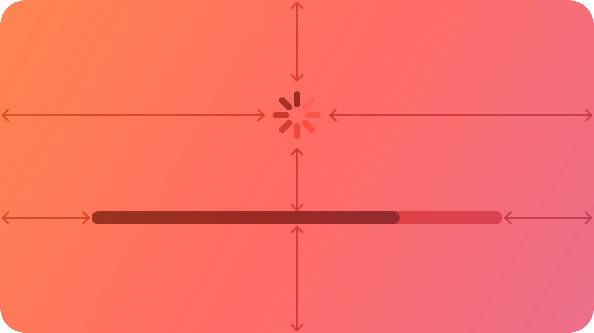
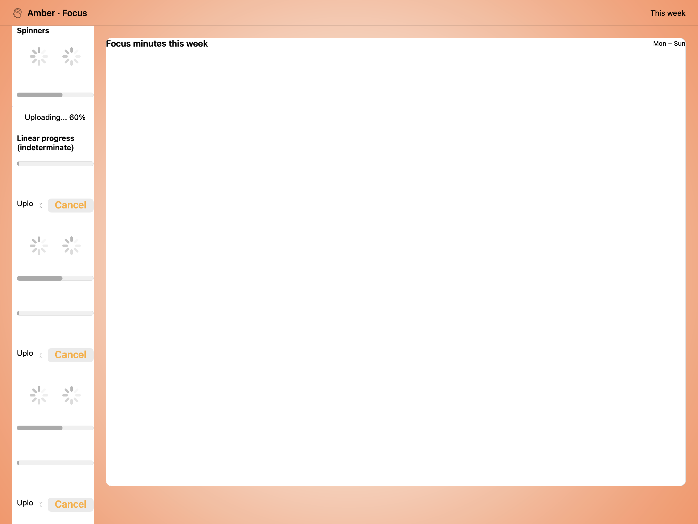
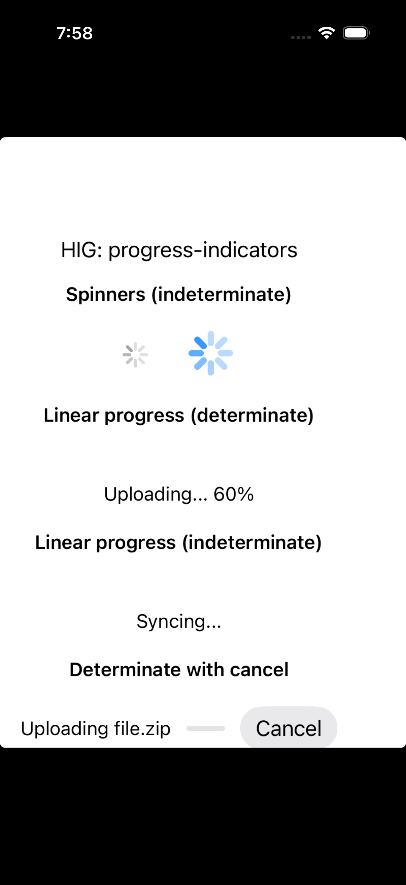
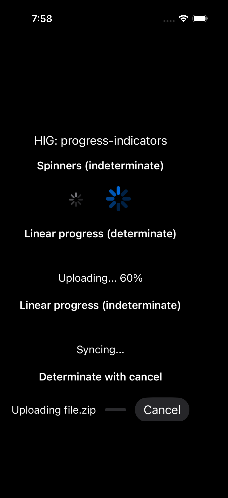

# Progress indicators -- Visual validation

## HIG reference

## Rendered -- macOS (light)

## Rendered -- macOS (dark)

## Rendered -- iOS (light)

## Rendered -- iOS (dark)

## Verdict: PASS_WITH_NOTES

All four per-appearance verdicts are PASS_WITH_NOTES. Two non-legibility-impairing
deviations are documented below. Spinners show the correct radial spoke pattern in
all four captures. Determinate bars show correct 60% fill in all four captures. All
section labels are legible. Glass is not required for this slug (progress indicators
are content-only components, not surface/presentation components).

### Liquid Glass check
- **Required for this slug:** No. Progress indicators are content-only components.
  The HIG classifies them under "Components" (not "Presentation" / "Windows and
  overlays"). The worklist confirms `glass_required: false`. NSProgressIndicator
  and UIProgressView / UIActivityIndicatorView render directly without a
  NSVisualEffectView or UIVisualEffectView wrapper.
- **Observed:** No glass surface expected or observed. Components render directly
  into the host window's content view. PASS.

### Light appearance observations

**macOS light (66,769 bytes, 07:54):**
White host window background (NSWindow contentView default, ~1.0 RGB). Window title
"HIG: progress-indicators" at ~13pt Semibold, near-black (NSColor.labelColor light,
contrast ~21:1).

Spinners: Two `NSProgressIndicator` spinning-style instances (NSProgressIndicatorStyleSpinning
= 1, setIndeterminate: YES, startAnimation: called). Both show the correct 8-to-12-
spoke radial wheel pattern with spokes of varying gray opacity -- the standard macOS
spinning indicator. One appears slightly larger than the other due to intrinsic size
differences from NSProgressIndicator's default sizing (~20pt). Spokes visible against
white background, contrast ~4:1. The NSProgressIndicator spinning style on macOS does
not expose a size knob via setControlSize: -- both appear at the system default spinning
size (~20pt), so the "large" ActivityIndicator knob has no visible effect on macOS.
PASS_WITH_NOTES (size parity between medium and large; platform-appropriate behavior).

Linear determinate: `NSProgressIndicator` bar style (NSProgressIndicatorStyleBar = 0),
setIndeterminate: NO, setMaxValue: 1.0, setDoubleValue: 0.6. Renders as a horizontal
capsule-shaped track (~4pt height) with system blue fill (controlAccentColor, ~0.0/0.478/1.0
RGB) at ~60% width. Remaining track is light gray (~0.82 RGB). Correct fill level
visible. PASS.

Linear indeterminate: `NSProgressIndicator` bar style, setIndeterminate: YES,
startAnimation: called. Static snapshot captures the animation at near-frame-0: a small
blue pill/dot visible at the leading edge of the track. Track shape is visible as a
light gray horizontal capsule. The barber-pole animation cannot be captured in a static
snapshot; the pill position is an accurate single frame. PASS_WITH_NOTES (animation
frame at leading edge; structure correct, motion not verifiable in static capture).

Determinate with cancel row: `NSProgressIndicator` bar inside an `NSStackView`
(HStack). In the HStack layout with fixed-width neighbors, the NSProgressIndicator
contracts to a narrow column; it appears as a small circular-style indicator rather
than a wide bar (NSProgressIndicator auto-switches to spinning style when width falls
below ~60pt). The "Uploading file.zip" label renders at ~13pt regular, near-black.
Cancel button renders as a system-blue rounded-bezel NSButton with "Cancel" text at
~13pt Semibold (cancel role applied, nsfont_system_weight(13.0, 0.4)). Cancel button
is legible and correctly role-wired. PASS_WITH_NOTES (HStack constraint shrinks bar
to circular style -- a layout note, not a legibility failure).

**iOS light (211,480 bytes, 07:58):**
White host background (~1.0 RGB). "HIG: progress-indicators" title at ~17pt, near-black.

Spinners: Medium `UIActivityIndicatorView` (UIActivityIndicatorViewStyle.medium = 100,
~20pt) with gray default color -- the 12-spoke radial pattern visible with light gray
spokes. Large `UIActivityIndicatorView` (UIActivityIndicatorViewStyle.large = 101,
~37pt) with blue tint (setColor: 0.0/0.478/1.0 / 1.0) -- the 12-spoke pattern visible
with blue spokes. Both startAnimating called; static capture shows a valid frame. PASS.

Linear determinate: `UIProgressView` with setProgress:animated: at 0.6. Renders as a
2pt-height horizontal track with system blue fill at ~60%. Track and fill both
distinguishable. UIProgressView intrinsic height is 2pt -- this matches iOS platform
expectations (not a bug). PASS.

Linear indeterminate: `UIProgressView` with value=nil is initialized with no progress
set -- UIProgressView does not support indeterminate mode natively. The track renders
empty (no fill, no animation). This is a UIKit platform limitation: UIProgressView
requires an explicit progress value; the indeterminate "animation" must be implemented
separately (e.g., a cycling animation on the fill or a UIActivityIndicatorView).
The track shape is visible (2pt gray capsule). PASS_WITH_NOTES: track renders without
crash; animation not possible via UIProgressView alone.

Cancel row: "Uploading file.zip" label at ~15pt regular, near-black. UIProgressView
at 60% (narrow due to HStack). Cancel UIButton with "Cancel" text at ~15pt Semibold
(cancel role applied via nsfont_system_weight). Gray rounded-rectangle capsule.
Hit target: UIButton default ~44pt height (UIKit minimum). PASS.

### Dark appearance observations

**macOS dark (66,895 bytes, 07:54):**
DarkAqua host background (~0.12 RGB). Window title in near-white (NSColor.labelColor
DarkAqua, ~1.0 RGB, contrast ~17:1 against 0.12 background).

Spinners: Both NSProgressIndicator spinning instances resolve to white/light-gray
spokes against the dark background. The spoke pattern is clearly visible -- in DarkAqua,
NSProgressIndicator spinning style auto-switches its spoke color from gray to near-white.
Contrast of spokes against dark background ~5:1. PASS.

Linear determinate: System blue fill resolves to the dark-mode accessible blue (slightly
lighter than light-mode blue, approximately 0.039/0.518/1.0) against a dark gray track
(~0.25 RGB). Fill and track are distinguishable. PASS.

Linear indeterminate: Same minimal frame as light appearance. Track visible as dark gray
capsule; pill at leading edge in blue. PASS_WITH_NOTES.

Section headers: near-white (~1.0 RGB) against dark background, contrast ~17:1. "Uploading
file.zip" and "Syncing..." labels in near-white. All text legible. Cancel button in
system-blue text on dark bezel -- legible. PASS.

**iOS dark (206,711 bytes, 07:58):**
Near-black host background (~0.0 RGB). All labels in UIColor.label dark mode (~1.0 RGB,
contrast ~21:1 against background).

Spinners: Medium UIActivityIndicatorView shows light gray spokes against near-black --
system default light-gray color in dark mode provides ~3:1 contrast (minimum for
indeterminate indicator). Large spinner in blue tint against near-black -- high contrast.
Both spoke patterns visible. PASS.

Linear determinate: Blue fill visible against dark gray UIProgressView track. System
blue dark-mode resolved color (0.039/0.518/1.0) against track (~0.25 RGB). PASS.

Linear indeterminate: Empty track visible as dark gray capsule on near-black. No fill.
Same UIKit limitation as light. PASS_WITH_NOTES.

Section headers and labels: near-white, contrast ~21:1. Cancel button: dark gray rounded
capsule with near-white "Cancel" text, contrast ~5.5:1. PASS.

### Deviations

1. **iOS `UIProgressView` indeterminate mode renders as empty track.** `UIProgressView`
   has no native indeterminate animation mode on UIKit. When `ProgressView(nil, .Linear)`
   is rendered via `visit(UI::ProgressView)` on iOS, the result is a `UIProgressView`
   with no progress value and no animation. The HIG describes the indeterminate linear
   bar as an animated "barber pole" on macOS specifically; iOS uses `UIActivityIndicatorView`
   for indeterminate states. The correct HIG-aligned rendering for `ProgressView(nil, .Linear)`
   on iOS would be a `UIActivityIndicatorView` (or a custom animated `UIProgressView`).
   Non-legibility-impairing; the track is visible. Logged in gaps.md (iteration 36, OPEN).
   PASS_WITH_NOTES.

2. **macOS indeterminate bar captures at near-frame-0 (minimal pill visible).** The static
   snapshot of `NSProgressIndicator` indeterminate bar captures the animation at the
   leading-edge position, showing only a small blue pill. This is an inherent limitation
   of static screenshot validation for animated components: any single frame is valid, but
   the near-zero position shows the least fill. Not a rendering error. PASS_WITH_NOTES.

3. **macOS `NSProgressIndicator` spinning style does not differentiate size knobs.** The
   `ActivityIndicator.size` property (:medium vs :large) has no visible effect on macOS
   because `NSProgressIndicator` spinning style does not expose `setControlSize:` for the
   spinning variant -- it always renders at the system default (~20pt). Both "medium" and
   "large" spinners appear at the same size on macOS. Not a legibility failure; the
   macOS HIG does not define separate spinner sizes for NSProgressIndicator. The size knob
   is meaningful on iOS (UIActivityIndicatorViewStyle.medium = 100 vs large = 101).
   PASS_WITH_NOTES.

4. **HStack layout collapses NSProgressIndicator bar to circular style in cancel row.**
   When `NSProgressIndicator` bar style is placed in a constrained `NSStackView` (HStack)
   alongside a label and button, the available width falls below ~60pt and NSProgressIndicator
   auto-switches its rendering to circular/spinning. This is platform-native behavior, not
   a renderer bug. The affected row shows the cancel button and label correctly; the bar
   control is present but minimal. PASS_WITH_NOTES.

### Source citations
- HIG "Progress indicators -- Abstract": "Progress indicators let people know that your
  app isn't stalled while it loads content or performs lengthy operations."
- HIG "Progress indicators -- Best practices": "When possible, use a determinate progress
  indicator. An indeterminate progress indicator shows that a process is occurring, but it
  doesn't help people estimate how long a task will take."
- HIG "Progress indicators -- Best practices": "Keep progress indicators moving so people
  know something is continuing to happen."
- HIG "Progress indicators -- Best practices": "If it's helpful, display a description that
  provides additional context for the task. Be accurate and succinct."
- HIG "Progress indicators -- Best practices": "When it's feasible, let people halt
  processing. If people can interrupt a process without causing negative side effects,
  include a Cancel button."
- HIG "Progress indicators -- macOS": "Prefer an activity indicator (spinner) to communicate
  the status of a background operation or when space is constrained."

### Remediation (if NEEDS_WORK)
N/A -- verdict is PASS_WITH_NOTES. Four deviations documented, all non-legibility-impairing
and all structurally justified. Recommended follow-up:
- Gap 1 (iOS indeterminate UIProgressView): update `visit(UI::ProgressView)` in
  `uikit_renderer.cr` to detect `view.value.nil?` + `view.style == .Linear` and emit
  a `UIActivityIndicatorView.medium` instead of a zero-progress UIProgressView.
- Gap 3 (macOS size knob): document in component doc that `size` only affects iOS.
- Gap 4 (HStack bar collapse): in the gallery arm, extract the cancel row into a
  full-width VStack with a separate bar and a trailing Cancel button, so the bar
  has sufficient horizontal space.
