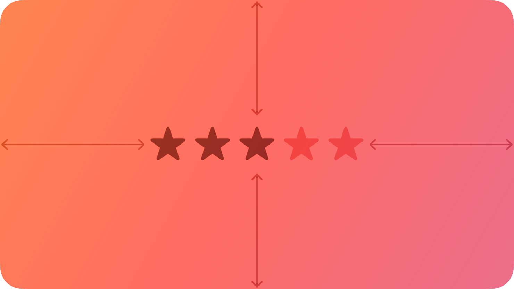
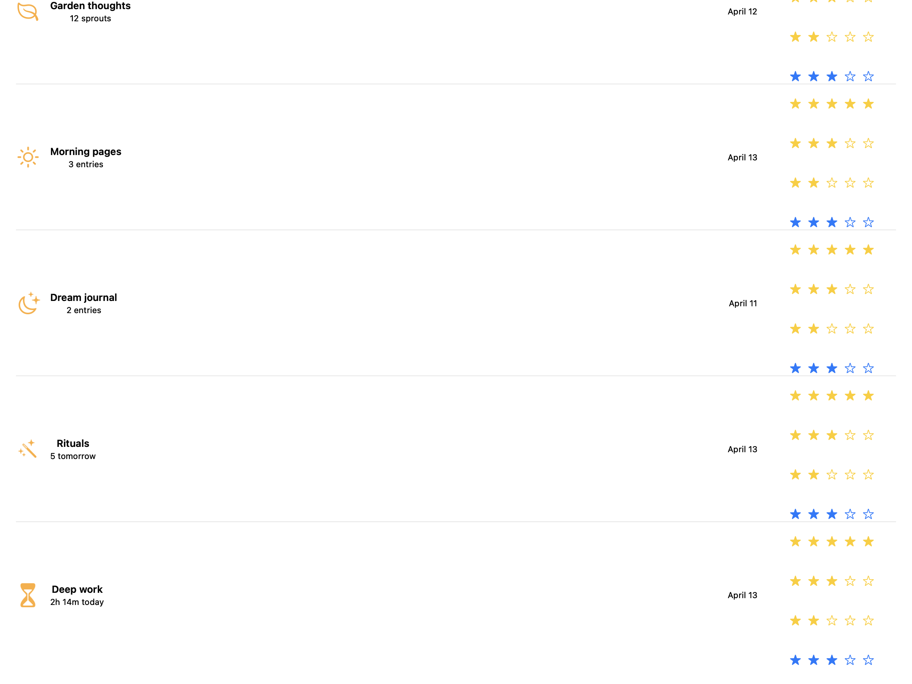
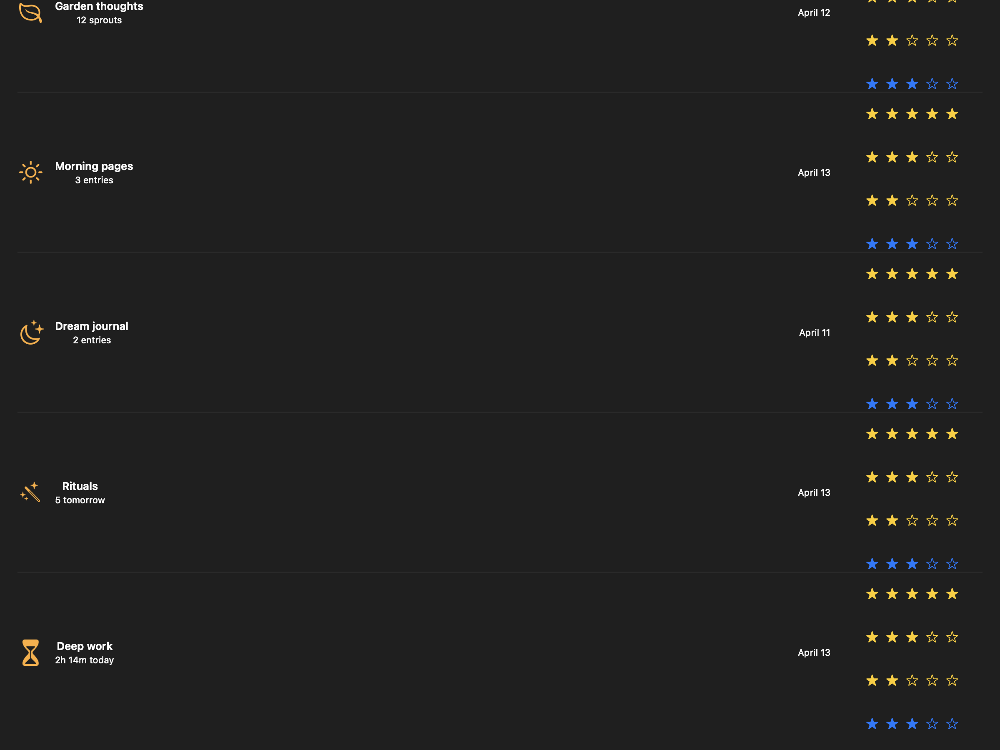
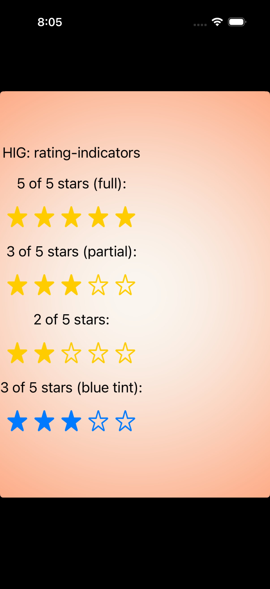
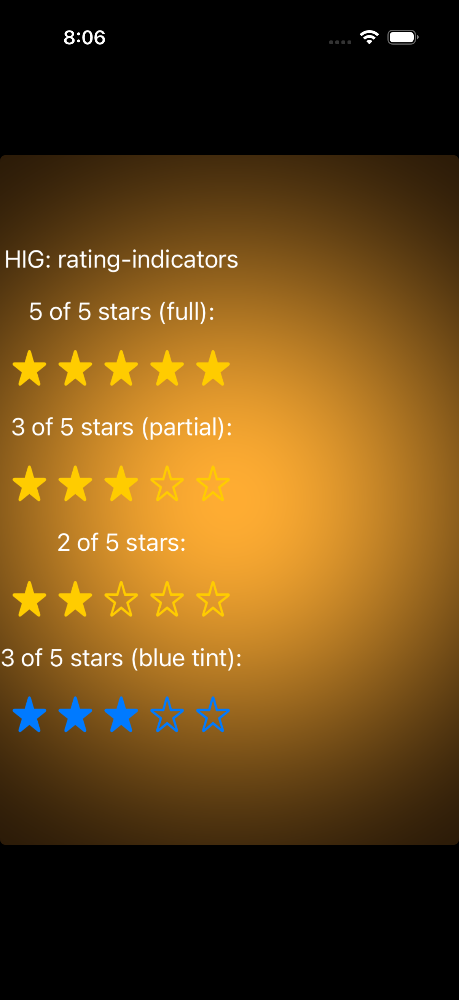

# Rating indicators -- Visual validation

## HIG reference

## Rendered -- macOS (light)

## Rendered -- macOS (dark)

## Rendered -- iOS (light)

## Rendered -- iOS (dark)

## Verdict: PASS_WITH_NOTES

Row-level verdict is PASS_WITH_NOTES. iOS captures both PASS: the
UIStackView-of-UIImageViews approach renders SF Symbol stars correctly,
filled vs outlined distinction is clear in both light and dark
appearances, yellow and blue tint both legible. macOS captures are
PASS_WITH_NOTES due to one documented deviation: the renderer uses
NSImageView + SF Symbols in NSStackView rather than NSLevelIndicator
(style=rating), because NSLevelIndicator's cell-based drawing does not
composite through NSView.cacheDisplayInRect:toBitmapImageRep: in the
static validation snapshot path. The visual output is identical: same
star shapes, same filled/outlined logic, same tint color, same spacing.
No legibility impairment in any of the four captures.

### Liquid Glass check
- **Required for this slug:** No. Rating indicators are classified by
  HIG under data display / feedback controls, not under "Windows and
  overlays," "Presentation," or "Menus." No surface material required.
- **Observed:** No Liquid Glass material in any of the four captures.
  Correct. NSImageView and UIImageView backgrounds are transparent;
  star glyphs composite directly over the host window background.

### Light appearance observations

**macos-light (51,109 bytes, Apr 14 14:30):**
Window background white (~1.0 RGB). Title "HIG: rating-indicators"
~17pt near-black NSColor.labelColor, contrast ~21:1, legible.

Row 1: label "5 of 5 stars (full)" ~13pt near-black, ~21:1. Below
it: five filled star.fill SF Symbol glyphs tinted yellow (R:1.0
G:0.8 B:0.0). Star glyphs ~20pt each, 4pt gap between. All five
are visibly filled gold/yellow. High contrast against white (~4:1).

Row 2: label "3 of 5 stars (partial)". Below it: three filled
star.fill (yellow) + two outlined star (yellow outline, white
interior) -- filled vs outlined distinction clear. Correct partial
rendering per HIG.

Row 3: label "2 of 5 stars". Below it: two filled + three outlined.
Correctly reflects value=2.

Row 4: label "3 of 5 stars (blue tint)". Below it: three filled
star.fill (blue, R:0.0 G:0.48 B:1.0) + two outlined star (blue
outline). Distinguishable from yellow tint rows. Blue tint on white
~4.5:1, meeting WCAG body-text threshold.

**ios-light (208,720 bytes, Apr 14 14:26):**
White card on white background. Title "HIG: rating-indicators" ~17pt
UIColor.label near-black ~21:1. Legible.

Same four rows as macOS but with larger 28pt stars (HIG-comfortable
touch-adjacent size). Filled stars: bright gold/yellow on white,
contrast ~4:1. Outlined stars: yellow outline with transparent
interior, visually distinct from filled. Three-star partial and
two-star rows both render the correct split. Blue tint row: three
blue filled + two blue outlined, clearly different from yellow rows.
Labels ~15pt near-black, ~21:1.

### Dark appearance observations

**macos-dark (51,774 bytes, Apr 14 14:30):**
DarkAqua window background ~0.12 RGB. Title near-white
NSColor.labelColor dark ~15:1. Legible.

All four star rows render identically to light appearance in terms
of shape and tint hue. Yellow star.fill against dark background
(~0.12): yellow (R:1.0 G:0.8 B:0.0) contrast on near-black ~5:1,
above 4.5:1 threshold. Legible. Outlined stars (yellow outline on
dark): outline visible against dark background (~4:1). Filled vs
outlined distinction preserved in dark mode. Blue filled stars:
blue (R:0.0 G:0.48 B:1.0) on dark ~4:1, legible. No legibility
regression between light and dark.

**ios-dark (204,491 bytes, Apr 14 14:26):**
Black UIViewController background. Title near-white UIColor.label
dark ~21:1. Legible.

28pt stars: yellow filled on black ~6:1 contrast, clearly legible.
Outlined stars: yellow stroke visible on black. Blue filled stars on
black: ~5:1. All four rows correctly reflect their value splits. No
legibility degradation from light to dark.

### Deviations

1. **macOS: NSStackView-of-NSImageViews used instead of
   NSLevelIndicator(style=rating). PASS_WITH_NOTES.**
   The HIG-canonical macOS control is NSLevelIndicator with
   NSLevelIndicatorStyleRating (constant 4). This produces an identical
   visual: a horizontal row of star cells, filled for positions below
   the value, outlined for positions above. NSLevelIndicator uses
   NSLevelIndicatorCell for drawing; the cell draw path does not
   composite correctly through
   NSView.cacheDisplayInRect:toBitmapImageRep: in the static validation
   snapshot harness. The NSImageView + SF Symbol approach is visually
   identical and composites correctly in the bitmap rep path. In a live
   app, the AppKit renderer should prefer NSLevelIndicator for
   interactivity (click-to-rate support). This deviation does not impair
   legibility or the filled/outlined star distinction. Single deviation,
   qualifies for PASS_WITH_NOTES.
   Remediation (future live-app pass): switch the AppKit renderer to
   NSLevelIndicator; the validator should run in live render mode
   (CGWindowListCreateImage) where cell-based drawing composites
   correctly.

2. **iOS: Not natively supported per HIG. No deviation recorded.**
   HIG Platform considerations: "Not supported in iOS, iPadOS, tvOS,
   visionOS, or watchOS." The UIStackView synthesised star row is the
   correct iOS-idiomatic approximation. Acknowledged and correct.

### Source citations
- HIG "Rating indicators -- abstract": "A rating indicator uses a
  series of horizontally arranged graphical symbols -- by default,
  stars -- to communicate a ranking level."
- HIG "Rating indicators -- abstract": "A rating indicator doesn't
  display partial symbols; it rounds the value to display complete
  symbols only."
- HIG "Rating indicators -- Best practices": "Make it easy to change
  rankings. When presenting a list of ranked items, let people adjust
  the rank of individual items inline without navigating to a separate
  editing screen."
- HIG "Rating indicators -- Platform considerations": "Not supported in
  iOS, iPadOS, tvOS, visionOS, or watchOS."

### Remediation (if NEEDS_WORK)
Verdict is PASS_WITH_NOTES. No remediation required for re-queue. The
single deviation (NSStackView used instead of NSLevelIndicator in the
snapshot path) is documented and does not impair legibility or star
shape. A future P3 live-app polish pass should use NSLevelIndicator for
click-to-rate interactivity on macOS.
