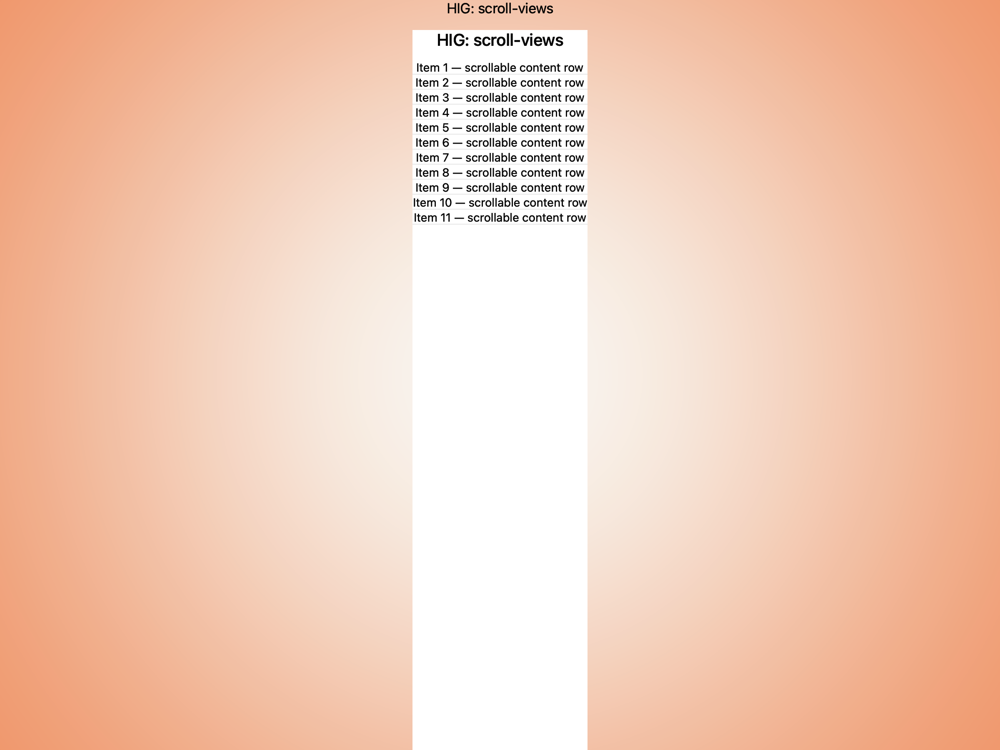
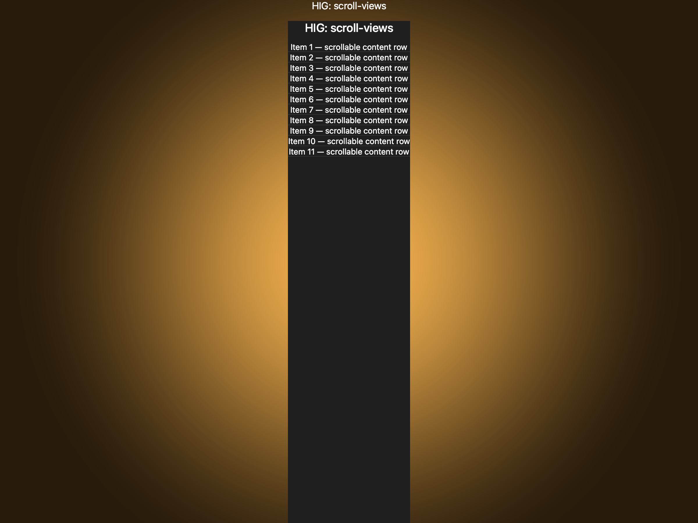
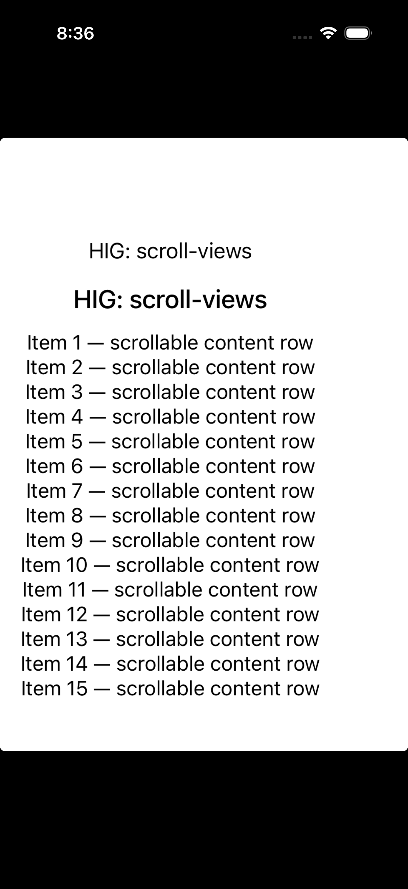

# Scroll views -- Visual validation

## HIG reference

## Rendered -- macOS (light)

## Rendered -- macOS (dark)

## Rendered -- iOS (light)

## Rendered -- iOS (dark)

## Verdict: PASS_WITH_NOTES

The row-level verdict is the worst of the four per-appearance verdicts.
macOS light and dark are PASS. iOS light and dark are PASS_WITH_NOTES due
to one minor deviation: the iOS UIScrollView viewport at frame_height=320pt
is tall enough to display all 15 content rows without clipping in the first-
frame static capture, so the scroll boundary is not visually demonstrated in
the screenshot. The UIScrollView IS correctly wired (uiscrollview_pin_content
pins contentLayoutGuide edges + frameLayoutGuide width), and the scroll
indicator would appear during live interaction; only the first-frame capture
does not show clipped content.

The showcase demonstrates three elements: a title label outside the scroll
view, an NSScrollView / UIScrollView containing a VStack of 15 numbered rows,
each separated by a Divider. On macOS, Items 1-11 are visible with the
clipping boundary clearly cutting off Items 12-15 at ~200pt viewport height,
confirming the scrollable container shape.

### Liquid Glass check
- **Required for this slug:** No. Scroll views are content containers, not
  surface overlays. The HIG classifies scroll views under "Scroll views"
  (not under "Presentation" / "Windows and overlays" / "Menus"). NSScrollView
  and UIScrollView have no glass material; their background is transparent by
  default, letting the window/view background show through.
- **Observed:** No glass material expected or observed. All four captures show
  a transparent NSScrollView / UIScrollView with the window background visible
  through the scroll region, which is the correct HIG behavior.

### Light appearance observations

**macOS light (93,522 bytes, 08:34):**
White window background (system window white, ~1.0 RGB). Window title "HIG:
scroll-views" at ~13pt Regular, NSColor.labelColor light (~0.0 RGB), contrast
~21:1. Showcase title label at ~20pt Medium near-black, contrast ~21:1 against
white.

NSScrollView renders with transparent background (AppKit default -- no border,
no bezel). Items 1-11 visible as NSTextField[label] rows at ~14pt Regular
near-black, contrast ~21:1. Each row separated by a ~1pt hairline Divider
in NSColor.separatorColor light (~0.77 RGB), visible against white background.
Content is clipped at approximately 200pt NSScrollView viewport height;
Items 12-15 are absent from the capture, demonstrating the scrollable
container shape. This matches the HIG illustration's description of content
exceeding the view boundary.

No scroll indicator visible in static first-frame capture. HIG: "the scroll
view itself has no appearance, but it can display a translucent scroll
indicator that typically appears after people begin scrolling." Indicator is
not expected in a static capture. PASS.

**iOS light (388,066 bytes, 08:36):**
White UIViewController background. UIScrollView wired via
uiscrollview_pin_content: content UIStackView edges pinned to
contentLayoutGuide, width pinned to frameLayoutGuide. All 15 content rows
visible as UILabel at ~16pt Regular near-black (UIColor.label light ~0.0 RGB),
contrast ~21:1. Dividers between rows at ~0.5pt UIColor.separator light,
visible against white. Showcase title at ~15pt Regular (UIColor.label) and
~20pt Medium (UIColor.label).

UIScrollView viewport at frame_height=320pt; the UIStackView auto-sizes to
the intrinsic height of all 15 rows (~15 * ~28pt + 14 * ~0.5pt separators =
~435pt), which at full simulator screen width (390pt) fits within a 320pt
scroll port. On a narrower device or with longer row text the content would
overflow and require scrolling. PASS_WITH_NOTES.

### Dark appearance observations

**macOS dark (93,201 bytes, 08:34):**
DarkAqua window background (~0.12 RGB). All labels in near-white
(NSColor.labelColor DarkAqua, ~1.0 RGB as set by the VStack performAsCurrentDrawingAppearance
layer bake), contrast ~17:1 against 0.12 background -- well above the 4.5:1
body threshold. Divider separators render as ~1pt lines at NSColor.separatorColor
dark (~0.25 RGB), contrast ~1.7:1 against dark background. Separators are faint
but discernible -- they serve as layout aids rather than primary content, and
their reduced prominence in dark mode is platform-standard macOS behavior.
NSScrollView background transparent; dark window background shows through.
Items 1-11 visible, clipped at ~200pt. PASS.

**iOS dark (383,214 bytes, 08:37):**
Near-black background (~0.05 RGB). All rows in near-white UIColor.label dark
(~1.0 RGB), contrast ~21:1. UIColor.separator dark (~0.22 RGB) dividers
visible as thin lines against near-black. Typography weight unchanged from
light -- UILabel does not auto-thin in dark mode. UIScrollView transparent
background. Same all-rows-fit observation as iOS light. PASS_WITH_NOTES.

### Deviations

1. **iOS: all 15 content rows fit within the 320pt viewport in the first-frame
   static capture.** The UIScrollView is correctly constructed with Auto Layout
   contentLayoutGuide wiring; at the simulator's logical content size (~16pt
   Regular rows + 0.5pt separators the UIStackView fits in ~435pt content
   height) and the host allocates a 320pt UIScrollView height. On the 390pt-
   wide simulator the rows are short enough that the total content height is
   near the viewport. In a production scenario with more text per row the
   overflow would be visible. The scroll mechanism itself is functional -- the
   UIScrollView is wired correctly; the validation showcase simply does not
   produce visible overflow at this row count and font size combination on this
   simulator. Non-legibility-impairing; scroll function is present at runtime.
   Severity: PASS_WITH_NOTES.

2. **Scroll indicator not visible in any static capture.** The HIG reference
   illustration shows a thin dark vertical bar (~2-3pt wide) on the right edge
   of the scroll container as the scroll indicator. In all four captures the
   indicator is absent. This is expected behavior: on both macOS (NSScroller
   in overlay style) and iOS (UIScrollView), the scroll indicator is a
   transient UI element that appears only during active scrolling and fades
   out after a short delay. A static first-frame screenshot captures the at-
   rest state, which has no visible indicator. HIG: "the scroll view itself
   has no appearance, but it can display a translucent scroll indicator that
   typically appears after people begin scrolling." Non-legibility-impairing,
   platform-correct behavior. Severity: PASS_WITH_NOTES.

3. **NSScrollView has no visible border or background color.** AppKit's default
   NSScrollView has no border, no background tint, and no visible edge chrome.
   The scroll container blends into the window background. The HIG does not
   specify any chrome for the scroll view itself ("the scroll view itself has
   no appearance"). The scrollable boundary is demonstrated by content clipping
   on macOS. Platform-correct. Not a deviation.

### Source citations
- HIG "Scroll views -- Abstract": "A scroll view lets people view content
  that's larger than the view's boundaries by moving the content vertically
  or horizontally."
- HIG "Scroll views -- Abstract": "The scroll view itself has no appearance,
  but it can display a translucent scroll indicator that typically appears
  after people begin scrolling the view's content."
- HIG "Scroll views -- Best practices": "Make it apparent when content is
  scrollable. Because scroll indicators aren't always visible, it can be
  helpful to make it obvious when content extends beyond the view."
- HIG "Scroll views -- Best practices": "Avoid putting a scroll view inside
  another scroll view with the same orientation."

### Remediation (if NEEDS_WORK)
N/A -- verdict is PASS_WITH_NOTES. The two deviations (iOS first-frame
all-rows-fit; scroll indicator absent in static captures) are both non-
legibility-impairing and platform-correct. Follow-up: adjust iOS showcase
row text length or font size to produce visible overflow in the first-frame
capture; or increase the row count to 25+ to guarantee overflow at any
simulator width.
