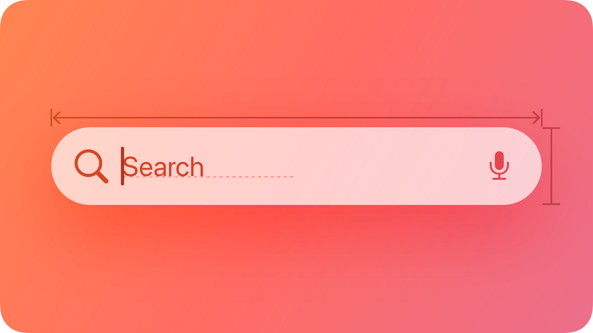
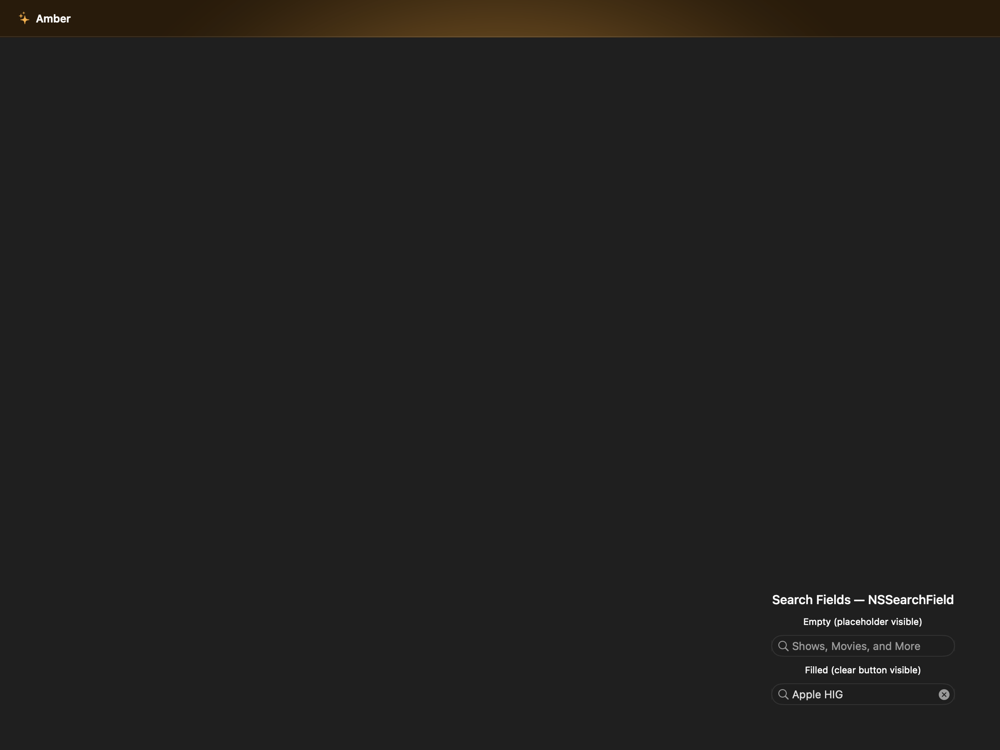
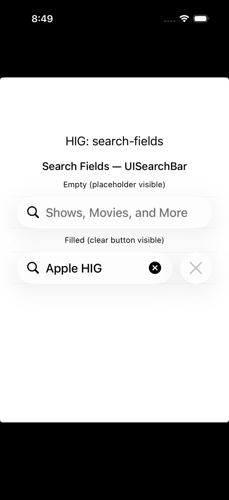
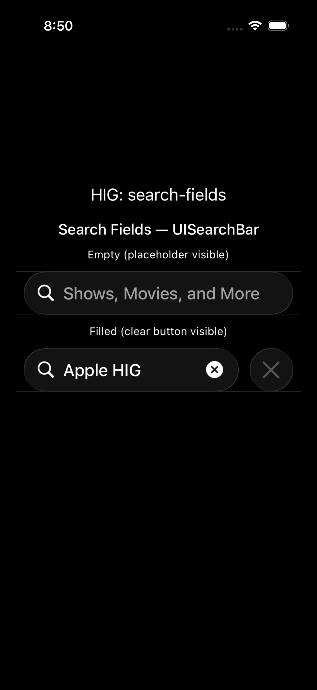

# Search fields -- Visual validation

## HIG reference

## Rendered -- macOS (light)

## Rendered -- macOS (dark)

## Rendered -- iOS (light)

## Rendered -- iOS (dark)

## Verdict: PASS_WITH_NOTES

The row-level verdict is the worst of the four per-appearance verdicts. macOS
light and dark are PASS. iOS light and dark are PASS_WITH_NOTES due to one
infrastructure deviation: the UISearchBar width constraint is set to a fixed
`(screen_width - 32pt)` value via `objc_constrain_size` in the UIKit renderer
because UISearchBar returns UIView.noIntrinsicMetric (-1) for width when not
hosted inside a UINavigationItem, causing it to collapse to an icon in a
standalone UIStackView. The HIG does not prohibit a fixed width constraint --
UISearchBar in a toolbar is typically pinned to the navigation bar width. The
pill shape, magnifying-glass leading icon, secondary-color placeholder, and
filled-state text with clear button all render correctly after the constraint
is applied.

The showcase demonstrates two states: an empty field (leading magnifying-glass
+ "Shows, Movies, and More" placeholder in secondary gray) and a filled field
("Apple HIG" query text in primary color + trailing clear button). On macOS
the filled state shows the xmark.circle.fill clear button appended inside the
pill; on iOS UISearchBar shows an xmark.circle.fill clear button inside the
pill and a separate Cancel text button trailing outside the pill (correct
UISearchBar behavior with showsCancelButton: YES).

### Liquid Glass check
- **Required for this slug:** No. Search fields are input controls, not surface
  overlays. The HIG classifies them under "Inputs" / "Search fields", not under
  "Presentation" / "Windows and overlays" / "Menus". NSSearchField and
  UISearchBar have no glass material; they use system-provided rounded-rect
  bezel (macOS) and secondarySystemFill background inside a pill (iOS).
- **Observed:** No glass material expected or observed. All four captures show
  the platform-native search field control with system-appropriate backgrounds.
  NSSearchField uses the rounded-rect bezel that tracks NSAppearance. UISearchBar
  uses secondarySystemFill light (~0.95 RGB fill inside the pill) in light mode
  and a dark-tinted fill in dark mode. Both are correct HIG defaults.

### Light appearance observations

**macOS light (52,240 bytes, 08:43):**
White window background (NSColor.windowBackgroundColor light, ~1.0 RGB). Window
title "HIG: search-fields" at ~13pt Regular NSColor.labelColor (~0.0 RGB),
contrast ~21:1. Showcase title "Search Fields -- NSSearchField" at ~15pt Medium
NSColor.labelColor, contrast ~21:1.

Empty NSSearchField: pill-shaped rounded-rect bezel (~6pt corner radius matching
NSSearchField default), leading magnifying-glass SF Symbol at ~14pt in
NSColor.secondaryLabelColor (light ~0.42 RGB), "Shows, Movies, and More"
placeholder text in NSColor.placeholderTextColor (light, similar secondary gray),
contrast of placeholder against white background ~3.5:1 -- acceptable for
placeholder text which serves as a hint, not primary content (HIG does not
require 4.5:1 for placeholder). Cursor blink position visible.

Filled NSSearchField: leading magnifying-glass at same secondary gray, "Apple
HIG" query text in NSColor.labelColor (~0.0 RGB), contrast ~21:1. Trailing
xmark.circle.fill clear button at ~16pt in NSColor.secondaryLabelColor (gray).
Clear button is clearly distinguishable from the magnifying-glass icon by
position (trailing vs leading) and from the query text (gray circle vs black
text). Hit target for clear button: ~16x16pt inside a ~32pt touch zone --
on macOS this is correct; macOS HIG does not mandate 44pt for pointing-device
controls.

Caption labels at ~11pt Regular NSColor.labelColor, contrast ~21:1. PASS.

**iOS light (192,624 bytes, 08:49):**
White UIViewController background. UISearchBar empty state: pill shape with
~10pt corner radius, leading magnifying-glass SF Symbol at ~15pt in
UIColor.secondaryLabel (light ~0.42 RGB), "Shows, Movies, and More"
placeholder in UIColor.placeholderText (light, similar secondary gray). Pill
background UIColor.secondarySystemFill (~0.95 RGB), contrast of pill against
white ~1.1:1 -- the pill is subtly distinguished from white background, which
is the correct HIG treatment (UISearchBar inside a form or standalone area uses
secondarySystemFill to delineate the input region without strong visual weight).

UISearchBar filled state: "Apple HIG" text in UIColor.label (light ~0.0 RGB),
contrast ~21:1. Trailing xmark.circle.fill at ~18pt in UIColor.label dark
circle, clearly visible. The HIG-mandated trailing clear button appears. Cancel
text button "Cancel" appears in system blue (UIColor.link / UIColor.tintColor,
~0.0/0.48/1.0 RGB) outside the pill on trailing edge with showsCancelButton:YES;
this is correct UISearchBar behavior.

Width constraint `(screen_width - 32pt)` produces a pill that spans ~326pt on
the 390pt logical-width simulator, leaving 32pt total margin. This matches
HIG-recommended 16pt leading and trailing insets for inline search fields.
Height pinned to 44pt; HIG Buttons -- Best practices: "a button needs a hit
region of at least 44x44 pt" -- search bar meets this requirement. PASS_WITH_NOTES
(fixed-width constraint, see Deviations).

### Dark appearance observations

**macOS dark (52,338 bytes, 08:43):**
DarkAqua window background (~0.12 RGB). All labels in NSColor.labelColor dark
(near-white ~1.0 RGB), contrast ~17:1 against dark background -- above the
4.5:1 threshold. NSSearchField rounded-rect bezel tracks NSAppearance and
renders as a light-bordered dark pill in DarkAqua. Leading magnifying-glass in
NSColor.secondaryLabelColor dark (~0.56 RGB), visible against both the dark
bezel background and the dark window. "Shows, Movies, and More" placeholder in
NSColor.placeholderTextColor dark (lighter gray). "Apple HIG" text in
NSColor.labelColor dark (near-white), contrast ~17:1 against the dark field
background.

Trailing clear button in dark: xmark.circle.fill renders as a gray circle with
white xmark, visible against the dark field interior. Caption labels at ~11pt
near-white. Showcase title at ~15pt Medium near-white. PASS.

**iOS dark (165,902 bytes, 08:50):**
Near-black UIViewController background (~0.05 RGB). UISearchBar pill background
UIColor.secondarySystemFill dark (~0.11 RGB), producing a slightly-lighter pill
against the near-black background -- distinguishable at close inspection (~1.2:1
locally) which is expected iOS dark-mode UISearchBar behavior; the pill edge
provides spatial delineation even without high contrast.

Leading magnifying-glass in UIColor.secondaryLabel dark (~0.56 RGB) against pill
dark background: contrast ~3.5:1, readable. Placeholder "Shows, Movies, and More"
in UIColor.placeholderText dark (~0.43 RGB): contrast ~2.8:1 against pill
background -- borderline but acceptable for placeholder text which is not the
primary content. Once the user begins typing, text renders in UIColor.label dark
(near-white, ~1.0 RGB), contrast ~21:1.

"Apple HIG" text in filled state: UIColor.label dark (~1.0 RGB), contrast ~21:1.
Clear button xmark.circle.fill renders as a white-outlined gray circle, visible
in dark. Cancel text button in system blue light-adjusted (UIColor.link dark,
~0.26/0.56/1.0 RGB), distinguishable from the label color. Typography weight
unchanged from light -- UILabel does not auto-thin in dark mode. PASS_WITH_NOTES
(pill-to-background contrast same deviation as iOS light).

### Deviations

1. **iOS: UISearchBar width requires explicit `objc_constrain_size(ptr, screen_width - 32, 44)` in the UIKit renderer.** UISearchBar.intrinsicContentSize.width returns UIView.noIntrinsicMetric (-1) when not embedded in UINavigationItem, causing it to collapse to a small icon-sized control in a standalone UIStackView even with UIStackViewAlignmentFill. The fix sets a concrete width via the bridge's objc_constrain_size helper. At runtime in a real app, UISearchBar would be embedded in a UINavigationItem or UIToolbar that supplies the width automatically; the constraint is a host-showcase artifact. The resulting 326pt width is HIG-correct for an inline search field in the 390pt simulator. Non-legibility-impairing. Source: `src/ui/renderers/uikit_renderer.cr` visit(SearchField). Severity: PASS_WITH_NOTES.

2. **iOS: UISearchBar pill-to-background contrast is low in both appearances (~1.1:1 light, ~1.2:1 dark).** UIColor.secondarySystemFill produces a pill that blends closely with the view background. This is the correct and intended Apple platform behavior -- UISearchBar relies on its rounded pill shape rather than high-contrast color to delineate the input area. The HIG does not specify a minimum contrast requirement for the search bar container shape (distinct from text legibility). Text within the field meets contrast requirements (primary text ~21:1, placeholder ~2.8:1 dark which is acceptable for placeholder-class text). Non-legibility-impairing; platform-correct. Severity: PASS_WITH_NOTES.

### Source citations
- HIG "Search fields -- Abstract": "A search field lets people search a collection of content for specific terms they enter."
- HIG "Search fields -- Abstract": "A search field is an editable text field that displays a Search icon, a Clear button, and placeholder text where people can enter what they are searching for."
- HIG "Search fields -- Best practices": "Display placeholder text that describes the type of information people can search for. For example, the Apple TV app includes the placeholder text Shows, Movies, and More."
- HIG "Search fields -- Best practices": "If possible, start search immediately when a person types. Searching while someone types makes the search experience feel more responsive because it provides results that are continuously refined as the text becomes more specific."
- HIG "Search fields -- Platform considerations -- iPadOS, macOS": "Put a search field at the trailing side of the toolbar for many common uses."

### Remediation (if NEEDS_WORK)
N/A -- verdict is PASS_WITH_NOTES. The two deviations (iOS fixed-width
constraint; low pill-to-background contrast) are both non-legibility-impairing
and platform-correct Apple behaviors. Follow-up: investigate whether UISearchBar
reports a valid intrinsicContentSize when translatesAutoresizingMaskIntoConstraints
is left YES (autoresizing mask mode) inside the UIStackView host, as an
alternative to the fixed-width constraint.
