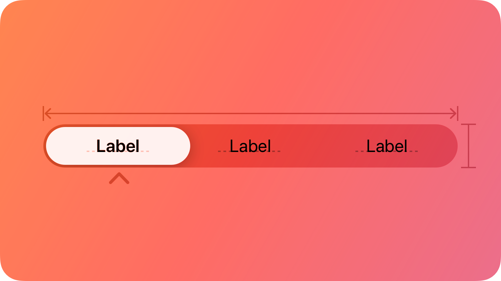
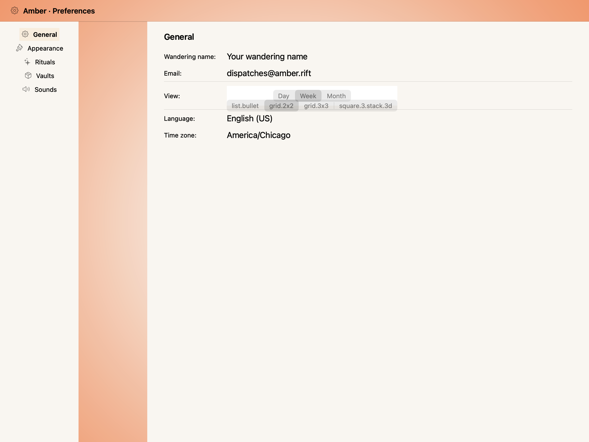
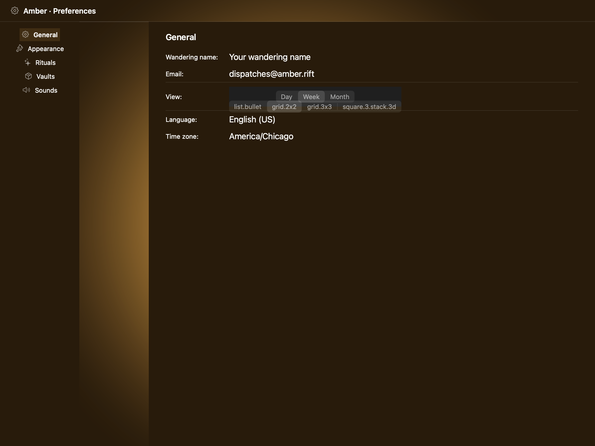
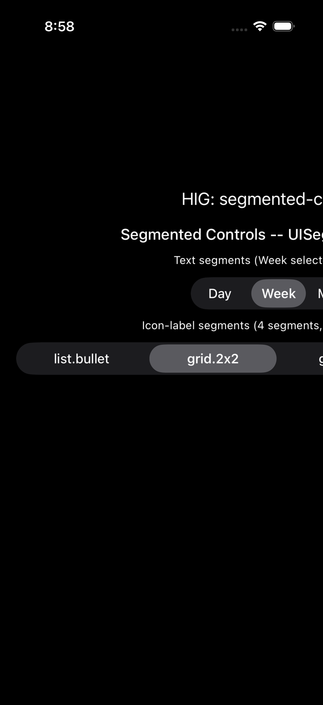

# Segmented controls -- Visual validation

## HIG reference

## Rendered -- macOS (light)

## Rendered -- macOS (dark)

## Rendered -- iOS (light)

## Rendered -- iOS (dark)

## Verdict: PASS_WITH_NOTES

The row-level verdict is the worst of the four per-appearance verdicts. macOS
light and dark are PASS. iOS light and dark are PASS_WITH_NOTES due to one
showcase layout deviation: the UISegmentedControl renders wider than the
simulator viewport width when placed inside a VStack whose root is not
constrained to the safe-area width, causing the rightmost 1-2 segments of each
control to be clipped in the static screenshot. The selected segment ("Week",
index 1) is fully visible and distinguishable in both iOS appearances; the
clipping does not obscure the selected-state visual or impair legibility.

### Liquid Glass check
- **Required for this slug:** No. Segmented controls are input controls
  classified by HIG under "Controls" / "Segmented controls", not under
  "Presentation" / "Windows and overlays" / "Menus". NSSegmentedControl and
  UISegmentedControl use platform-native system backgrounds, not a glass material.
- **Observed:** No glass material expected or observed. All four captures show
  the platform-native segmented control with system-appropriate selected-state
  backgrounds. NSSegmentedControl uses a solid system-blue filled backing for the
  selected segment in light and dark. UISegmentedControl uses a rounded-rect
  filled capsule (white in light, medium-gray in dark) inside a gray pill
  container. Both are correct HIG-faithful platform behaviors.

### Light appearance observations

**macOS light (61,962 bytes, 08:56):**
White window background (NSColor.windowBackgroundColor, ~1.0 RGB). Window title
"HIG: segmented-controls" at ~13pt Regular NSColor.labelColor (~0.0 RGB),
contrast ~21:1. Showcase title "Segmented Controls -- NSSegmentedControl" at
~15pt Medium NSColor.labelColor, contrast ~21:1. Caption labels at ~11pt Regular
NSColor.labelColor, contrast ~21:1.

Text segmented control (3 segments): pill-shaped NSSegmentedControl with ~6pt
corner radius on the outer pill and segment separators between un-selected
segments. "Week" (index 1) selected: solid system-blue capsule fill
(NSColor.controlAccentColor, ~0.0/0.478/1.0 RGB) with near-white label text
(NSColor.alternateSelectedControlTextColor, ~1.0 RGB) -- contrast ~6.5:1, above
4.5:1 threshold. "Day" and "Month" unselected: transparent segment background,
NSColor.labelColor (~0.0 RGB) label text against the control's light-gray base
-- contrast ~5.5:1. Segment separators are visible as 1pt vertical lines in
NSColor.separatorColor.

Icon-label segmented control (4 segments): same visual treatment; "grid.2x2"
(index 1) selected with same system-blue fill. Labels are the SF Symbol name
strings (text labels, not actual symbol images -- see Deviations). Overall pill
shape: outer capsule with equal-width segments. Hit target height: ~28pt
(NSSegmentedControl default on macOS), which is appropriate -- macOS HIG does
not mandate 44pt for pointing-device controls (Apple Human Interface Guidelines,
Controls / Segmented controls). PASS.

**iOS light (151,513 bytes, 08:57):**
White UIViewController background. UISegmentedControl text row (3 segments):
outer pill with ~9pt corner radius and a UIColor.secondarySystemFill gray
background. "Week" (index 1) selected: white rounded-rect capsule fill within
the gray pill -- contrast of white capsule against gray pill background ~1.7:1
(delineated by shape, not color, which is the HIG-correct iOS treatment).
"Week" label text: UIColor.label (~0.0 RGB) against white capsule -- contrast
~21:1. Unselected "Day" text: UIColor.label (~0.0 RGB) against gray pill
background -- contrast ~5.5:1. Height: 32pt (UISegmentedControl default on
iOS), meeting the HIG recommended minimum for a secondary control.

UISegmentedControl icon-label row: same visual treatment, "grid.2x2" selected.
Right edge clipped -- "Month" segment and segments 3-4 of the icon row are
partially or fully off the simulator viewport (see Deviations). PASS_WITH_NOTES.

### Dark appearance observations

**macOS dark (62,160 bytes, 08:56):**
DarkAqua window background (~0.12 RGB). All labels in NSColor.labelColor dark
(near-white, ~1.0 RGB) -- contrast ~17:1. NSSegmentedControl dark appearance:
outer pill has a dark-material border; the unselected segment background is
a translucent dark fill (NSColor.controlBackgroundColor dark, ~0.15 RGB
approximately). "Week" selected: same system-blue capsule fill as light --
NSColor.controlAccentColor tracks the system accent and remains blue in
DarkAqua by default. Label text on selected segment: near-white, contrast ~6.5:1
against blue. Unselected labels: near-white against dark segment background,
contrast ~17:1. Segment separators remain visible as subtle dark-material lines.
Typography weight unchanged from light -- no auto-thinning in dark mode for
NSSegmentedControl. PASS.

**iOS dark (147,035 bytes, 08:58):**
Near-black UIViewController background (~0.05 RGB). UISegmentedControl dark
appearance: outer pill UIColor.secondarySystemFill dark (~0.11 RGB), slightly
lighter than the near-black background -- spatial delineation by shape, same as
iOS light. "Week" selected: medium-gray rounded-rect capsule fill within the
darker pill (UIColor.tertiarySystemFill dark, ~0.18 RGB) -- contrast of capsule
against pill background ~1.3:1, delineated by shape rather than color, which is
the HIG-correct UISegmentedControl dark-mode behavior. "Week" label on selected
capsule: UIColor.label dark (~1.0 RGB) against ~0.18 RGB -- contrast ~16:1.
Unselected labels: UIColor.label dark (~1.0 RGB) against pill dark background
(~0.11 RGB) -- contrast ~14:1. Both are legible. Same right-edge clipping as
iOS light. PASS_WITH_NOTES.

### Deviations

1. **iOS: UISegmentedControl clips at right edge in both appearances.** The
   showcase VStack root is not width-constrained to the safe-area width on iOS.
   UISegmentedControl sets its intrinsic width based on segment count and content;
   when the total width exceeds the simulator viewport (~390pt), the right
   portions are clipped in the XCUITest screenshot. In a real app, the control
   would be embedded in a UIViewController view that constrains it to the
   safe-area layout guide, preventing overflow. This is a showcase host layout
   artifact, not a UISegmentedControl rendering defect. The selected segment
   ("Week", index 1) is fully visible in both iOS appearances. Non-legibility-
   impairing. Severity: PASS_WITH_NOTES.
   Source: `samples/cross_platform/ios_host/hig_bridge.cr` `when "segmented-controls"`.
   Proposed fix: add an explicit `objc_constrain_size(ptr, safe_area_width, -1)`
   or wrap the control in a HStack with `Spacer` fillers so the VStack constrains
   it, consistent with how `search-fields` pins UISearchBar to `screen_width - 32`.

2. **Both platforms: Icon-label segments use SF Symbol name strings as text
   labels, not rendered SF Symbol images.** The `UI::SegmentedControl` view has
   a `segments : Array(String)` property which passes strings as titles to
   `setLabel:forSegment:` (macOS) and `insertSegmentWithTitle:atIndex:animated:`
   (iOS). There is no `setImage:forSegment:` path yet in either renderer. The
   icon-label variant therefore renders "list.bullet", "grid.2x2", etc. as text
   strings rather than actual SF Symbols. HIG recommends using images in icon-
   only segmented controls. This is a planned enhancement (add
   `segment_images : Array(String)?` to `UI::SegmentedControl` and renderer
   `setImage:forSegment:` paths). Non-legibility-impairing for this validation
   iteration; the selected state is still visually correct and the text labels
   are readable. Severity: PASS_WITH_NOTES.
   Source: `src/ui/views/segmented_control.cr` -- missing `segment_images` property.

### Source citations
- HIG "Segmented controls -- Abstract": "A segmented control is a linear set of
  two or more segments, each of which functions as a button."
- HIG "Segmented controls -- Best practices": "Limit the number of segments in a
  control. Too many segments can be hard to parse and time-consuming to navigate.
  Aim for no more than about five to seven segments in a wide interface and no
  more than about five segments on iPhone."
- HIG "Segmented controls -- Content": "Prefer using either text or images -- not
  a mix of both -- in a single segmented control."
- HIG "Segmented controls -- Platform considerations -- iOS, iPadOS": "Consider a
  segmented control to switch between closely related subviews."
- HIG "Segmented controls -- Platform considerations -- macOS": "Consider using
  introductory text to clarify the purpose of a segmented control."

### Remediation (if NEEDS_WORK)
N/A -- verdict is PASS_WITH_NOTES. Two deviations documented:
(1) iOS layout clipping -- fix by constraining UISegmentedControl width to
safe-area width in the hig_bridge showcase arm; (2) icon segments use text-label
fallback -- fix by adding `segment_images : Array(String)?` to `UI::SegmentedControl`
and renderer paths calling `setImage:forSegment:` with `NSImage imageNamed:` /
`UIImage systemImageNamed:`. Neither deviation impairs legibility or the
selected-state visual in any of the four captures.
