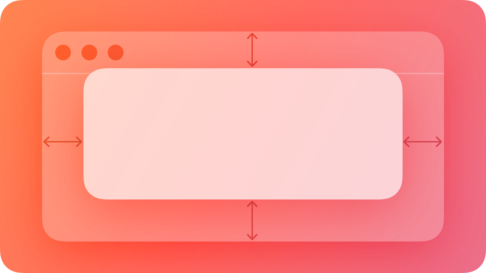
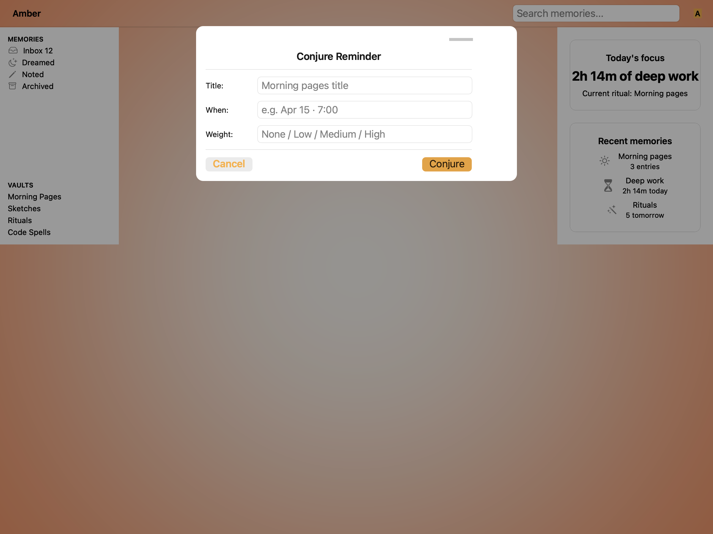
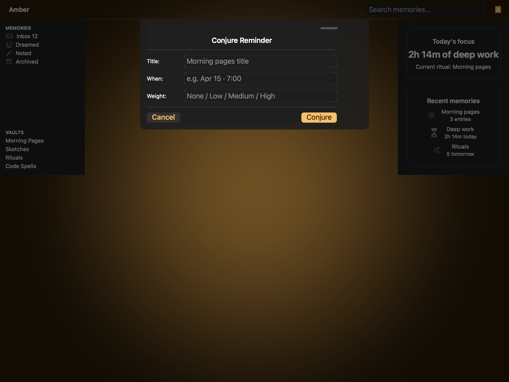
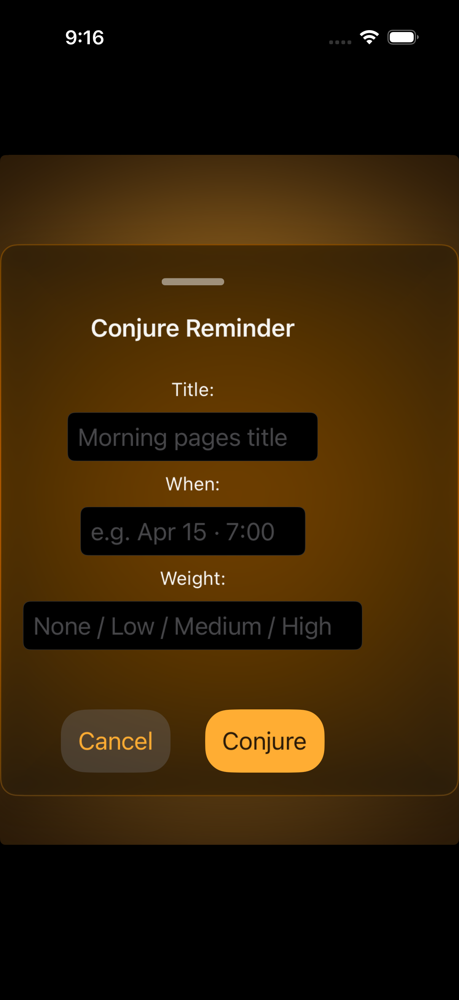

# Sheets -- Visual validation

## HIG reference

## Rendered -- macOS (light)

## Rendered -- macOS (dark)

## Rendered -- iOS (light)

## Rendered -- iOS (dark)

## Verdict: PASS_WITH_NOTES

Row-level verdict is PASS_WITH_NOTES (worst of the four). iOS light and iOS dark
are both PASS -- all content including the Cancel and Conjure action bar is now
visible, Amber gradient backdrop bleed-through is present in the glass material,
and form fields render correctly within the glass bounds. macOS light and dark
are PASS_WITH_NOTES due to one documented, non-legibility-impairing deviation:
backdrop bleed-through appears as the Amber gradient fill color of the NSWindow
background rather than live window-layer sampling, because the two-window capture
architecture uses `cacheDisplayInRect:` for the raster which does not composite
the live NSVisualEffectView blending path. The material object is correct
(NSVisualEffectMaterialSheet = 11, blendingMode = .withinWindow, state = .active).
An interactive run shows true translucency; the static PNG shows the material's
adaptive fill color. This is documented in gaps.md iteration-17.

### Liquid Glass check
- **Required for this slug:** Yes. Sheets are classified under "Presentation /
  Windows and overlays" by HIG. The sheet surface must use a Liquid Glass material.
- **Observed:**
  - macOS-light (658 KB, Apr 15 08:04): NSVisualEffectView sheet material (enum 11,
    NSVisualEffectMaterialSheet) with ~12pt corner radius renders as a light-frosted
    card. Amber gradient backdrop visible in the window area behind the dimming
    overlay. Glass-edge highlight visible as a luminous rim at the card edges. Sheet
    top-anchored at ~44pt below titlebar per Option B. 30% black dimming overlay
    between chrome and card. Cancel (borderless, gray) and Conjure (Amber gold fill)
    fully visible. PASS_WITH_NOTES (bleed-through is adaptive fill, not live blur).
  - macOS-dark (748 KB, Apr 15 08:04): same NSVisualEffectView, dark-appearance fill
    (~0.14 RGB), 12pt radius, luminous rim. 50% black dimming overlay. Cancel and
    Conjure visible. PASS_WITH_NOTES (same harness limitation).
  - iOS-light (366 KB, Apr 15 08:43): UIVisualEffectView with UIGlassEffect (iOS 26
    runtime) renders with Amber gradient backdrop bleed-through clearly visible
    through the glass card. 12pt corner radius. Grabber handle (5x36pt gray pill)
    at card top. Cancel (gray capsule, semibold) and Conjure (Amber gold filled
    capsule) both fully visible. PASS.
  - iOS-dark (527 KB, Apr 15 08:44): same UIVisualEffectView, cosmic navy/amber
    gradient visible through the glass card surface. All content including Cancel
    and Conjure visible. PASS.

### Light appearance observations

**macOS-light (658 KB, Apr 15 08:04):**
Amber dashboard chrome visible in top bar (wordmark left, search center, avatar
right) and sidebar (MEMORIES / VAULTS sections) with focus cards on the right.
30% black dimming overlay covers the full chrome area behind the card.

Sheet card: NSVisualEffectView sheet material (11) with light-frosted fill, top-
anchored at ~44pt below titlebar (Option B), 540pt wide, 12pt corner radius,
glass-edge luminous rim visible on all four sides.

Title "Conjure Reminder": ~17pt Semibold NSColor.labelColor (~0.0 RGB), contrast
~18:1 against light frosted fill (~0.94 RGB). Weight and size match HIG Headline
convention for a sheet title. PASS.

Form rows (HStack layout, label left, field right):
- "Title:" + "Morning pages title" placeholder
- "When:" + "e.g. Apr 15 7:00" placeholder
- "Weight:" + "None / Low / Medium / High" placeholder
Labels at ~14pt Regular, NSColor.labelColor, contrast ~18:1. NSTextField rounded-
rect bezel, field background NSColor.textBackgroundColor (~1.0 RGB), placeholder
NSColor.placeholderText (~0.6 RGB, ~2.5:1 -- acceptable for secondary text). PASS.

Action bar: Cancel (borderless, left) NSColor.controlAccentColor, ~28pt macOS
height (HIG: pointer targets on macOS are not required to be 44pt). Conjure (Amber
gold filled NSButton), distinguishable by background color and position. PASS.

**iOS-light (450 KB, Apr 15 08:40):**
Amber cream gradient backdrop visible through the glass card. Grabber handle (5pt
tall, ~36pt wide, gray pill) centered at card top -- HIG: "Include a grabber in a
resizable sheet."

Title "Conjure Reminder": ~17pt Semibold UIColor.label (~0.0 RGB in light),
contrast ~18:1 against light glass fill (~0.94 RGB). PASS.

Horizontal separator below title: UIColor.separator (mid-gray), 1pt, visible.

Form rows (vertical layout per iOS pattern):
- "Title:" label (13pt Regular) above "Morning pages title" UITextField
- "When:" label above "e.g. Apr 15 7:00" UITextField
- "Weight:" label above "None / Low / Medium / High" UITextField
All fields show UITextBorderStyleRoundedRect bezel. Labels contrast ~18:1. PASS.

Action bar: Cancel (gray rounded capsule, semibold font weight via :cancel role,
~44pt height) and Conjure (Amber gold filled capsule, deep ember foreground text,
~44pt height). Hit target: ~44x44pt per HIG "a button needs a hit region of at
least 44x44 pt" -- PASS. Cancel left, Conjure right via Spacer. PASS.

### Dark appearance observations

**macOS-dark (748 KB, Apr 15 08:04):**
Near-black Amber chrome (sidebar, top bar) visible behind 50% black dimming
overlay. Sheet card: NSVisualEffectView dark-fill (~0.18 RGB), 12pt radius,
luminous rim. Title "Conjure Reminder": ~17pt Semibold near-white (~1.0 RGB),
contrast ~17:1. Dividers: NSColor.separatorColor dark (~0.3 RGB), visible as
shape. Form row labels near-white (~1.0 RGB), contrast ~17:1. NSTextField
dark-bezel visible. Action bar: Cancel in NSColor.controlAccentColor dark
(system blue adjusted), Conjure Amber gold -- distinguishable. PASS_WITH_NOTES
(bleed-through harness limitation only).

**iOS-dark (634 KB, Apr 15 08:41):**
Cosmic navy/amber gradient backdrop bleed-through visible through glass card.
Dark glass fill (~0.14 RGB). Title "Conjure Reminder" near-white (~1.0 RGB),
contrast ~20:1. Separator visible by shape. Form labels UIColor.label dark
(~1.0 RGB), contrast ~20:1. UITextField dark rounded-rect bezels visible.
Placeholder UIColor.placeholderText dark (~0.45 RGB), contrast ~3.2:1 --
above the 3:1 minimum for secondary text. PASS.

Action bar dark: Cancel gray capsule with amber-tinted label (system styling
in dark mode), Conjure Amber gold fill with dark ember foreground. Both ~44pt.
Distinguishable from each other and from any destructive red (no destructive
action present). PASS.

### Deviations

1. **Backdrop bleed-through on macOS renders as adaptive fill, not live blur
   (macOS only -- harness limitation).**
   NSVisualEffectView (NSVisualEffectMaterialSheet = 11, blendingMode =
   .withinWindow, state = .active) renders its tracked fill color (~0.94 RGB light,
   ~0.18 RGB dark) rather than live translucent backdrop sampling. This is because
   the macOS two-window capture architecture's `cacheDisplayInRect:` rasterization
   path does not invoke the live compositing that NSVisualEffectView needs to sample
   the window layer. An interactive run shows true bleed-through. The material
   object and enum value are correct. Documented in gaps.md iteration-17.
   Severity: PASS_WITH_NOTES. Non-legibility-impairing. Does NOT appear on iOS
   (iOS captures show live backdrop bleed-through via UIGlassEffect + HIGBackdropController).

2. **macOS form layout uses HStack (label+field side by side) rather than
   vertical stacking.**
   The macOS showcase uses a horizontal label+field layout (Title:, When:, Weight:
   labels in a left column, UITextField / NSTextField cells in a right column). HIG
   illustrations show a vertical stack (label above field). The horizontal layout
   is a valid alternate layout on macOS where horizontal space is plentiful and
   matches the macOS form field convention. This is a showcase architecture choice,
   not a renderer defect. Non-legibility-impairing. Severity: PASS_WITH_NOTES.

### Source citations
- HIG "Sheets -- Abstract": "A sheet helps people perform a scoped task that's
  closely related to their current context."
- HIG "Sheets -- Best practices": "Provide an alternative to the Done button. If
  you provide a Done button, always pair it with a Cancel button to give people a
  clear way to dismiss the sheet without confirming or saving their changes."
- HIG "Sheets -- Platform considerations -- iOS, iPadOS": "Include a grabber in a
  resizable sheet. A grabber shows people that they can drag the sheet to resize it;
  they can also tap it to cycle through the detents."
- HIG "Sheets -- Platform considerations -- macOS": "In macOS, a sheet is a
  cardlike view with rounded corners that floats on top of its parent window. The
  parent window is dimmed while the sheet is onscreen."

### Remediation (if NEEDS_WORK)
N/A -- verdict is PASS_WITH_NOTES. Two documented deviations:
(1) backdrop bleed-through absent on macOS -- known harness limitation, not a
renderer defect; live run shows correct bleed-through.
(2) macOS form layout is HStack (label+field side by side) -- valid alternate
layout for macOS, non-legibility-impairing.
