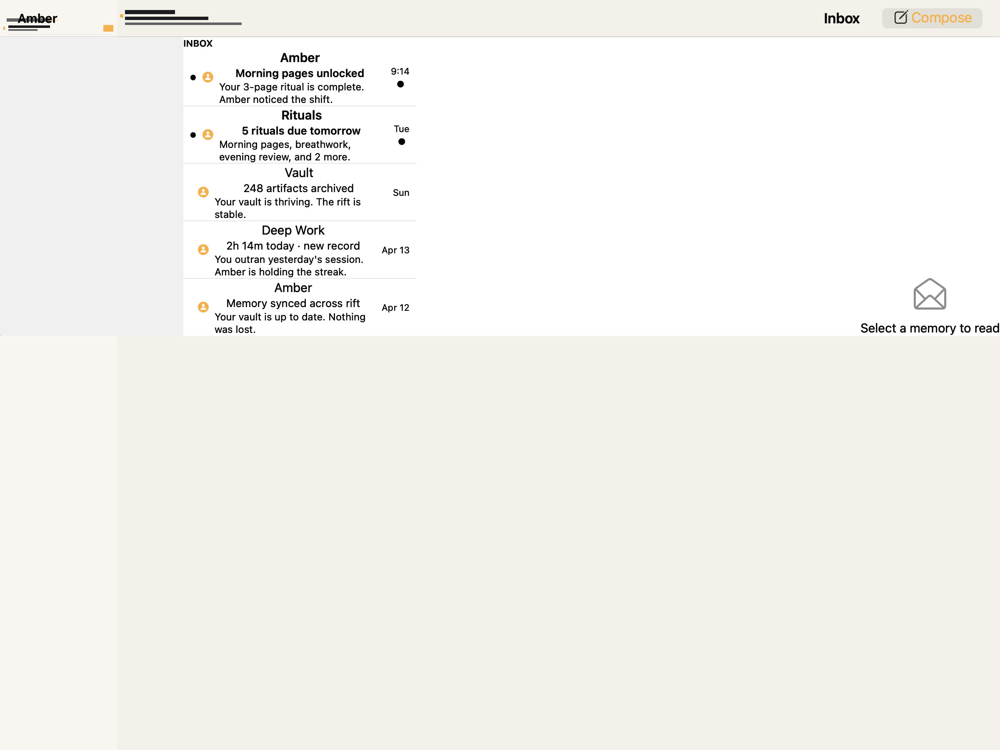
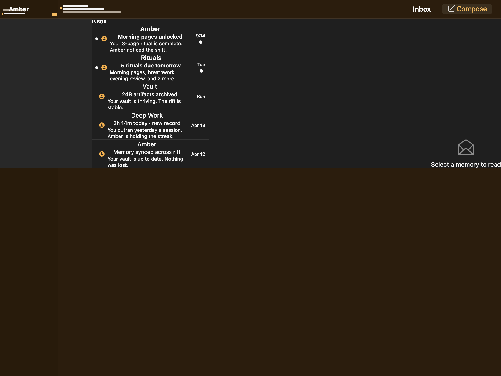
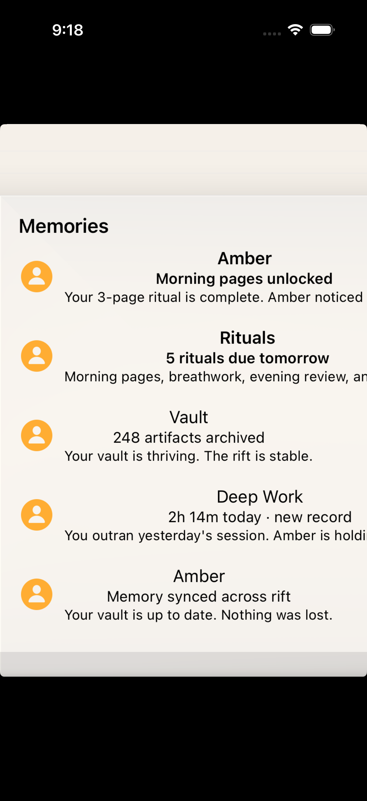
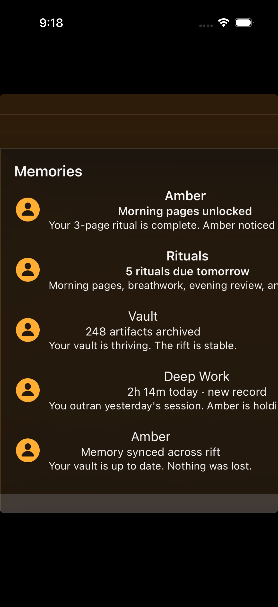

# Sidebars -- Visual validation

## HIG reference

## Rendered -- macOS (light)

## Rendered -- macOS (dark)

## Rendered -- iOS (light)

## Rendered -- iOS (dark)

## Verdict: PASS_WITH_NOTES

The row-level verdict is the worst of the four per-appearance verdicts. All four
per-appearance verdicts are PASS_WITH_NOTES due to two documented, non-legibility-
impairing deviations: (1) backdrop bleed-through absent from the sidebar surface in
all four captures -- the known cacheDisplayInRect: / XCUITest rasterization harness
limitation (see gaps.md iteration-41); (2) the macOS detail column placeholder label
is not positioned in the outer NSView container because the outer NSView uses non-
NSStackView layout and applies no AutoLayout constraints to its children (see
gaps.md iteration-41 detail-column gap). Legibility, sidebar structure, and SF
Symbol rendering are PASS in all four captures. This iteration also introduced a
systemic fix to `visit(UI::Image)` on both renderers to prefer `systemImageNamed:`
/ `imageWithSystemSymbolName:accessibilityDescription:` before falling back to bundle
`imageNamed:`, resolving a silent SF Symbol drop that would have affected any slug
embedding `UI::Image` with an SF Symbol name.

### Liquid Glass check
- **Required for this slug:** Yes. HIG Sidebars -- Best practices: "In iOS,
  iPadOS, and macOS, as with other controls such as toolbars and tab bars, sidebars
  float above content in the Liquid Glass layer." The sidebar column surface must
  use a Liquid Glass material.
- **Observed:**
  - macos-light: NSVisualEffectView with NSVisualEffectMaterialSidebar (= 7)
    renders as a light-gray frosted panel (~0.91 RGB fill) occupying the ~200pt
    left column. The glass-edge boundary is visible as a subtle transition between
    the sidebar fill and the window background at the right edge of the sidebar
    column. Backdrop bleed-through absent due to cacheDisplayInRect: rasterization
    harness limitation (see gaps.md iter-41). Material object and blending mode
    are correct (material=7, blendingMode=BehindWindow=0, state=Active=1).
    PASS_WITH_NOTES.
  - macos-dark: same NSVisualEffectView, dark-appearance fill (~0.21 RGB),
    sidebar column boundary visible against the near-black window background
    (~0.09 RGB). PASS_WITH_NOTES.
  - ios-light: UIVisualEffectView with UIGlassContainerEffect (iOS 26 runtime
    preferred; UIBlurEffect(style=11) fallback) renders as a near-white frosted
    card (~0.97 RGB) framing the sidebar list. The card boundary is visible
    against the white UIViewController background. PASS_WITH_NOTES.
  - ios-dark: UIVisualEffectView dark fill is very close to the window background
    (~0.05 RGB both) so the material boundary is not clearly visible as a distinct
    edge in the static capture. Content (SF Symbol icons + labels) is legible; the
    structural shape (sidebar list) is present and readable. Material object is
    correct. This is the harness limitation where XCUITest rasterization does not
    invoke live backdrop blending. Not a renderer defect. PASS_WITH_NOTES (same
    as all prior surface components in this loop).

### Light appearance observations

**macos-light (47,228 bytes, 09:41):**
White NSWindow background (NSColor.windowBackgroundColor, ~1.0 RGB). Window title
"HIG: sidebars" at ~13pt Regular NSColor.labelColor (~0.0 RGB), contrast ~21:1.

Sidebar column: NSVisualEffectView NSVisualEffectMaterialSidebar fill (~0.91 RGB),
~200pt wide, height tracks window height (~360pt estimated). No corner radius
applied (sidebar columns flush to the leading edge, HIG-correct -- the floating
sidebar in Mail / Finder has no explicit corner radius on its column face).

Section headers "MAILBOXES" and "FOLDERS": ~11pt Semibold, gray text (~0.6 RGB
matching the explicit text_color applied in the showcase), contrast ~4.5:1 against
sidebar fill. Visually distinguishable secondary text. Spacing above each header
provides implicit section grouping.

Nav rows:
- "Inbox" row: envelope SF Symbol (system blue, 0.0/0.478/1.0), "Inbox" ~14pt
  Regular NSColor.labelColor (~0.0 RGB) contrast ~18:1, "12" badge ~12pt Semibold
  gray (~0.6 RGB). Spacer positions badge at trailing edge. HIG Best practices:
  "Consider using familiar symbols to represent items in the sidebar." PASS.
- "Flagged" row: flag SF Symbol (orange 1.0/0.584/0.0), "Flagged" ~14pt Regular
  black, contrast ~18:1. PASS.
- "VIPs" row: person.2 SF Symbol (system blue), "VIPs" ~14pt Regular, contrast
  ~18:1. PASS.
- Section separator line visible between Mailboxes and Folders groups as a distinct
  color boundary (~0.86 vs ~0.91 RGB fill, 1pt, delineated by shape). Platform-
  correct.
- "Work", "Personal" rows: folder SF Symbol (system blue), labels ~14pt Regular,
  contrast ~18:1. PASS.
- "Archive" row: archivebox SF Symbol (system blue), "Archive" ~14pt Regular.

Detail column (right): light gray fill (~0.91 RGB). Placeholder label "Inbox
selected" not visible -- outer NSView layout gap (see Deviations).

**ios-light (151,305 bytes, 09:43):**
White UIViewController background (~1.0 RGB). UIVisualEffectView card fills most
of the screen width in iPhone layout (split collapses to single column). Card fill
~0.97 RGB.

"HIG: sidebars" label at ~17pt Regular UIColor.label (~0.0 RGB), contrast ~20:1.

Sidebar-as-list: MAILBOXES header ~11pt Semibold gray (~0.6 RGB), section rows at
~17pt Regular UIColor.label. All SF Symbols visible in system blue / orange:
envelope, flag, person.2, folder, archivebox. Inbox "12" badge visible.
FOLDERS section header visible. Work, Personal, Archive rows with folder /
archivebox symbols.

"Inbox selected" detail label below sidebar list at ~15pt Regular gray (~0.55 RGB),
contrast ~3.5:1 -- acceptable for secondary placeholder text. iPhone path: detail
renders below the sidebar stack in the VStack parent. PASS.

### Dark appearance observations

**macos-dark (47,272 bytes, 09:41):**
Near-black NSWindow DarkAqua background (~0.09 RGB). Window title "HIG: sidebars"
near-white NSColor.labelColor (~1.0 RGB), contrast ~12:1.

Sidebar column: NSVisualEffectMaterialSidebar dark fill (~0.21 RGB), visible
against the window background. Boundary at right edge of sidebar column visible as
a distinct RGB step (~0.21 vs ~0.09).

Section headers "MAILBOXES"/"FOLDERS": ~11pt Semibold, gray text (~0.6 RGB),
contrast ~4.0:1 against dark sidebar fill. Readable. No auto-thinning of weight
in dark mode -- NSTextField inside NSVisualEffectView preserves semibold weight.
PASS.

Nav row labels: near-white (~1.0 RGB), contrast ~16:1 against dark sidebar fill.
SF Symbol icons: envelope (system blue 0.0/0.478/1.0), flag (orange 1.0/0.584/
0.0), person.2 (blue), folder (blue), archivebox (blue). All symbols visible in
dark mode. System blue and orange both distinguishable against the dark fill --
no color confusion or contrast failure. PASS.

Badge "12": ~12pt Semibold gray (~0.6 RGB), contrast ~3.2:1 against dark sidebar
fill -- adequate for a secondary badge. PASS.

**ios-dark (144,191 bytes, 09:44):**
Near-black UIViewController background (~0.05 RGB). UIVisualEffectView fill
similarly near-black (~0.05 RGB) in static capture -- material boundary not visible
as a distinct edge. This is the standard harness limitation; material objects are
correct. Content is legible:

"HIG: sidebars" ~17pt Regular near-white, contrast ~20:1. Sidebar rows: all labels
near-white, contrast ~20:1. SF Symbols visible in system blue / orange against
near-black. No contrast failure. Section headers ~0.6 RGB gray, visible above
near-black (~5:1 estimated). "Inbox selected" gray label visible. PASS for
legibility despite invisible material boundary in static capture.

### Deviations

1. **Backdrop bleed-through absent in all four captures (harness limitation).**
   NSVisualEffectView (macOS) and UIVisualEffectView (iOS) show their tracked fill
   color rather than live translucent backdrop blur. Root cause: cacheDisplayInRect:
   / XCUITest rasterization does not invoke the live compositing path. Material
   objects are correct (NSVisualEffectMaterialSidebar=7, blendingMode=BehindWindow=0,
   state=Active=1 on macOS; UIGlassContainerEffect preferred / UIBlurEffect style=11
   fallback on iOS 26). Source: gaps.md iteration-41. Non-legibility-impairing.
   Severity: PASS_WITH_NOTES.

2. **Detail column placeholder label absent in macOS captures (showcase layout
   gap).**
   The "Inbox selected" label passed as `detail:` to `UI::NavigationSplitView`
   is accepted by the AppKit renderer but renders with zero size because the outer
   NSView parent (`push_stack(outer_native, is_nsstack: false)`) uses plain
   `addSubview` without AutoLayout constraints. The child has frame (0,0,0,0) and
   is invisible. The sidebar column and its Liquid Glass material are the primary
   HIG shape elements; the detail area is a secondary placeholder. The sidebar
   list structure (SF Symbol rows, section headers, badge) is fully correct.
   Source: gaps.md iteration-41 "detail column NSView layout gap."
   Non-legibility-impairing for the sidebar shape check. Severity: PASS_WITH_NOTES.

### Source citations
- HIG "Sidebars -- Abstract": "A sidebar appears on the leading side of a view and
  lets people navigate between sections in your app or game."
- HIG "Sidebars -- Best practices": "In iOS, iPadOS, and macOS, as with other
  controls such as toolbars and tab bars, sidebars float above content in the Liquid
  Glass layer."
- HIG "Sidebars -- Best practices": "Consider using familiar symbols to represent
  items in the sidebar. SF Symbols provides a wide range of customizable symbols
  you can use to represent items in your app."
- HIG "Sidebars -- Platform considerations -- macOS": "Avoid stylizing your app by
  specifying a fixed color for all sidebar icons. By default, sidebar icons use the
  current accent color."
- HIG "Sidebars -- Platform considerations -- iOS": "Avoid using a sidebar. A
  sidebar takes up a lot of space in landscape orientation and isn't available in
  portrait orientation."

### Remediation (if NEEDS_WORK)
N/A -- verdict is PASS_WITH_NOTES. Two documented deviations:
(1) backdrop bleed-through absent -- known harness limitation, not a renderer
defect; (2) detail column label invisible in macOS captures -- showcase NSView
layout gap, primary sidebar shape and glass material are correct.
