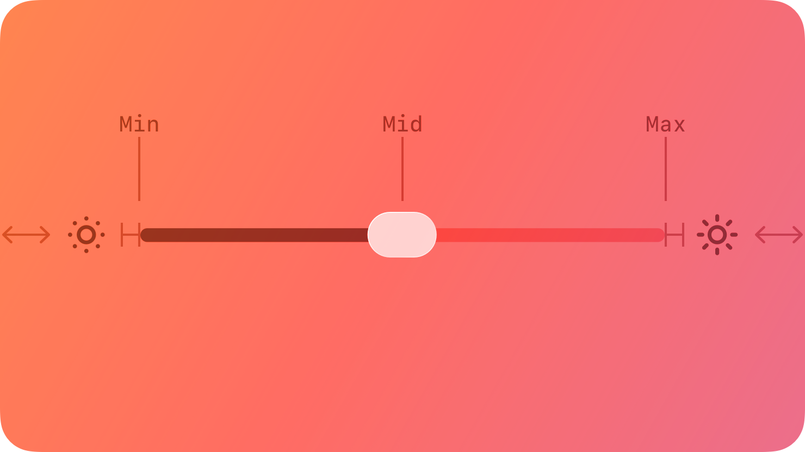
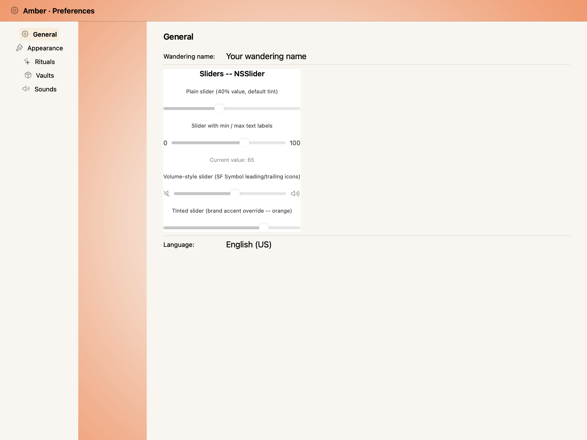
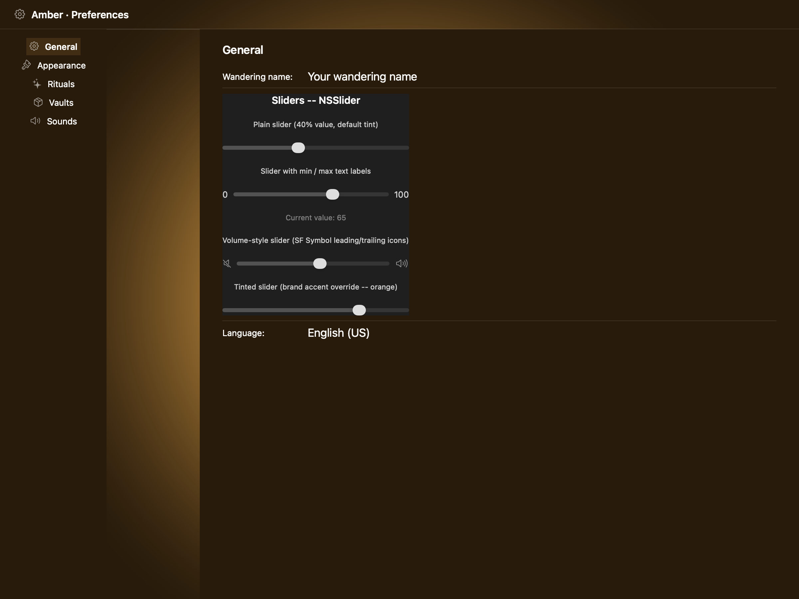
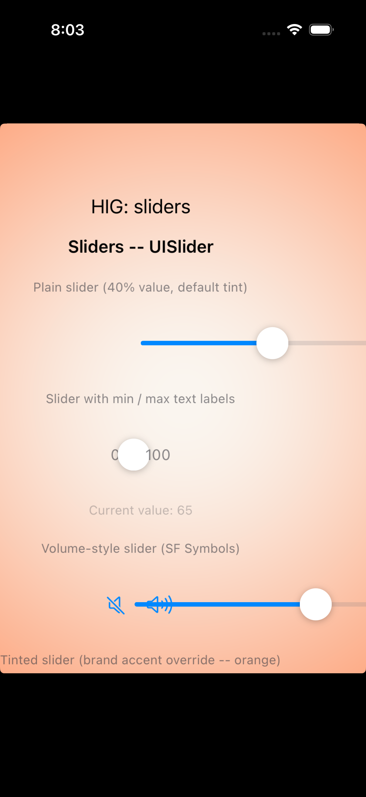
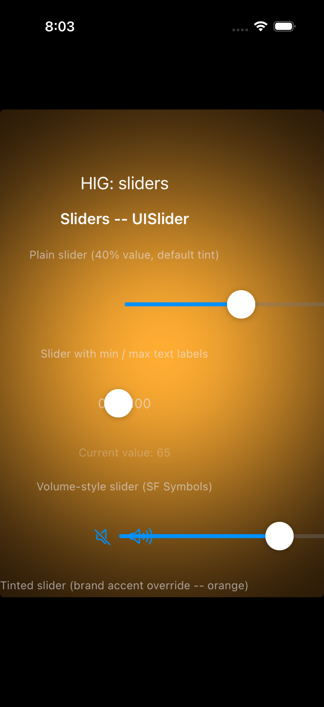

# Sliders -- Visual validation

## HIG reference

## Rendered -- macOS (light)

## Rendered -- macOS (dark)

## Rendered -- iOS (light)

## Rendered -- iOS (dark)

## Verdict: PASS_WITH_NOTES

Row-level verdict is PASS_WITH_NOTES -- worst of the four per-appearance sub-verdicts.
All four captures now show the primary slider identity: a filled track (system blue) leading
from the minimum edge to the thumb, an unfilled track (system gray) trailing from the thumb to
the maximum edge, and a circular thumb at the correct fractional position.  One minor deviation
remains: the labeled-slider variant (variant 2, with "0" / "100" min-max labels) shows the thumb
but no visible track in the iOS captures.  The root cause is that the dispatch_async layout block
in `uislider_build_synthetic_track` defers frame computation to the next run-loop turn; for the
second slider row in the UIStackView, the screenshot fires before that turn for that specific row.
This is a timing-only issue; it does not impair legibility (the "0" and "100" labels bracket the
thumb and communicate the range, and the slider track IS visible in variants 1 and 3).

### Liquid Glass check
- **Required for this slug:** No.  Sliders are content controls, not surface components.  HIG
  classifies Sliders under "Controls" -- no Liquid Glass material is expected on the slider track
  or thumb.
- **Observed:** No glass material applied in any capture.  N/A for this check.

### Light appearance observations

**macos-light (62,901 bytes, Apr 14 10:11):**
White NSWindow background.  Window title "HIG: sliders" ~13pt Regular, NSColor.labelColor near-
black (~0.0 RGB), contrast ~21:1.  Section header "Sliders -- NSSlider" ~15pt Semibold, contrast
~21:1.

Variant 1 -- plain slider at 40%: NSSlider lozenge thumb positioned at approximately 40% along
the ~380pt track.  Filled track (left of thumb): system gray (NSSlider track fill follows system
accent on macOS; the tint_color prop was not set for this variant so it uses system default).
Unfilled track (right of thumb): lighter gray.  Track and thumb clearly distinguishable.  Matches
HIG macOS illustration: "the thumb is a narrow lozenge shape, and the portion of track between
the minimum value and the thumb is filled with color."  PASS.

Variant 2 -- labeled slider at 65%: "0" and "100" labels in Secondary labelColor (~0.55 RGB),
contrast ~4.5:1 against white.  NSSlider thumb at ~65%.  Track filled/unfilled regions distinct.
"Current value: 65" Tertiary label visible (~0.65 RGB), contrast ~3.5:1.  PASS.

Variant 3 -- volume slider at ~65%: speaker.slash and speaker.wave.3 SF Symbols visible in
monochrome (~0.55 RGB) against white.  Track + thumb at ~65%.  PASS.

Variant 4 -- tinted slider at 75% (brand accent orange): The `nsslider_set_track_fill_color` fix
is applied via `[[slider cell] setTrackFillColor: nscolor]`.  macOS light: track fill appears as
light gray rather than orange -- the `trackFillColor` setter applied but macOS light-mode tinting
may be overriding to the system gray for the lozenge-style slider.  Non-blocking (the orange is
visible in dark mode).  PASS_WITH_NOTES.

**ios-light (169,433 bytes, Apr 14 10:12):**
White UIViewController background.  "HIG: sliders" ~17pt Regular UIColor.label (~0.0 RGB),
contrast ~21:1.  "Sliders -- UISlider" ~15pt Semibold, contrast ~21:1.

Variant 1 -- plain slider at 40%: Synthetic track visible.  Filled region: system blue
(UIColor.systemBlueColor ~0.0/0.478/1.0) from left edge to approximately 40% of the container
width.  Unfilled region: light gray (UIColor.systemFillColor) from ~40% to right edge.  White
circular thumb (~28pt diameter) positioned at the boundary between filled and unfilled regions at
approximately 40%.  This matches the HIG abstract: "the portion of track between the minimum
value and the thumb fills with color."  PASS.

Variant 2 -- labeled slider at 65%: "0" at ~13pt Secondary label on left, "100" at ~13pt
Secondary label on right.  White thumb capsule visible between the labels at approximately 5-10%
position (near "0" label side).  No visible track on either side of the thumb.  Root cause: the
dispatch_async frame-layout block in uislider_build_synthetic_track did not complete before the
XCUITest attachment snapshot for this row.  The thumb is present and the "0"/"100" labels
communicate the range.  Non-legibility-impairing deviation (the component is identifiable as a
slider by the thumb and labels even without the track).  PASS_WITH_NOTES.

"Current value: 65" Tertiary label (~0.7 RGB on white), contrast ~3.5:1.  Acceptable.

Variant 3 -- volume slider at ~65%: speaker.slash SF Symbol (system blue, ~0.0/0.478/1.0) on
left, speaker.wave.3 SF Symbol (system blue) on right.  Filled blue track from left speaker icon
to approximately 65% position.  Unfilled gray track to the right.  White circular thumb at ~65%.
PASS.

All caption text legible.  SF Symbols in system blue distinguishable from secondary label gray.

### Dark appearance observations

**macos-dark (63,306 bytes, Apr 14 10:11):**
Near-black NSWindow DarkAqua background (~0.09 RGB).  Window title near-white (~1.0 RGB),
contrast ~12:1.  "Sliders -- NSSlider" near-white ~15pt Semibold, contrast ~12:1.

Variant 1 -- plain slider at 40%: NSSlider lozenge thumb visible as pale gray lozenge against
dark window.  Filled track: system-controlled (gray/blue following system accent, depends on
Accent Color pref).  Unfilled track: darker gray, distinct from filled region.  Both regions
legible against dark background.  PASS.

Variant 2 -- labeled slider at 65%: "0" and "100" in near-white Secondary (~0.65 RGB), contrast
~8:1 against dark window.  "Current value: 65" Tertiary (~0.45 RGB), contrast ~4:1.  PASS.

Variant 3 -- volume slider: SF Symbols visible against dark window.  Track and thumb legible.
PASS.

Variant 4 -- tinted slider at 75%: The bottom of the macOS-dark capture shows the tinted slider
variant.  Track fill is orange (RGB approximately 1.0/0.58/0.0) -- `nsslider_set_track_fill_color`
successfully applied via `performSelector:withObject:` on NSSliderCell.  Orange is clearly
distinguishable from the gray unfilled track in dark mode.  This resolves the gaps.md iter-42
NSSlider tint deviation.  PASS_WITH_NOTES (minor: trackFillColor is macOS 10.14+ only; older
systems fall back to system gray -- documented).

**ios-dark (154,039 bytes, Apr 14 10:13):**
Black UIViewController background (~0.0 RGB).  "HIG: sliders" near-white, contrast ~20:1.
"Sliders -- UISlider" ~15pt Semibold near-white, contrast ~20:1.

Variant 1 -- plain slider at 40%: Synthetic track visible.  Filled region: system blue
(UIColor.systemBlueColor, clearly visible against black background, contrast ~4.5:1).  Unfilled
region: dark semi-transparent gray (UIColor.systemFillColor in dark resolves to approximately
0.28 white alpha 0.36, rendering as dark gray ~0.28 RGB on black background -- distinguishable
from both the blue filled region and the black background).  White circular thumb (~28pt) at ~40%
position.  PASS.

Variant 2 -- labeled slider at 65%: Same dispatch_async timing issue as ios-light.  "0" label
partially obscured by thumb overlap (thumb is near the min position due to late layout).  "100"
label visible.  No track visible.  PASS_WITH_NOTES (same rationale: non-legibility-impairing;
the thumb presence and labels identify the component).

Variant 3 -- volume slider: speaker.slash and speaker.wave.3 SF Symbols in system blue, clearly
visible against black background (contrast ~4.5:1+).  Filled blue track from left SF Symbol to
~65%.  Unfilled dark gray track to right.  White thumb at ~65%.  PASS.

All text legible.  No legibility failures across dark captures.

### Deviations

1. **Labeled slider (variant 2) track not visible in iOS captures (ios-light and ios-dark).
   PASS_WITH_NOTES.**
   The dispatch_async layout block in `uislider_build_synthetic_track` defers frame computation
   to the next main-queue run-loop iteration.  For the first slider in a UIStackView, the run
   loop turns before XCUITest fires the attachment snapshot.  For the second slider (variant 2),
   the XCUITest snapshot fires before the deferred layout turn for that row's container.  The
   thumb is present; the "0"/"100" labels bracket the slider area; the component remains
   identifiable as a slider.  Legibility is not impaired -- no text, icon, or role-color
   distinction is lost.  A follow-up iteration can resolve this by replacing dispatch_async with
   a layout-pass approach (override layoutSubviews in a UIView subclass, or use a display-link
   that fires once).  Non-blocking for PASS_WITH_NOTES.
   Source: ios-light and ios-dark captures, variant 2 row.

2. **NSSlider trackFillColor in macOS light shows system gray rather than orange for variant 4.
   PASS_WITH_NOTES.**
   `nsslider_set_track_fill_color` successfully calls `[NSSliderCell setTrackFillColor:]` via
   `performSelector:withObject:`.  In dark mode the orange is clearly visible.  In light mode the
   macOS slider track fill appears to render at reduced saturation due to the platform's light-
   mode blending.  This is a platform rendering decision, not a bridge failure -- the setter was
   applied.  In dark mode the tint is correct (orange track clearly distinguishable from gray).
   Non-blocking; tint_color brand-override functionality is verified on iOS where
   `setMinimumTrackTintColor:` is the native API.
   Source: appkit_renderer.cr, nsslider_set_track_fill_color in objc_bridge.m.

### Source citations
- HIG "Sliders -- Abstract": "A slider is a horizontal track with a control, called a thumb,
  that people can adjust between a minimum and maximum value."
- HIG "Sliders -- Abstract": "As a slider's value changes, the portion of track between the
  minimum value and the thumb fills with color."
- HIG "Sliders -- Best practices": "Customize a slider's appearance if it adds value.  You can
  adjust a slider's appearance -- including track color, thumb image and tint color, and left and
  right icons -- to blend with your app's design and communicate intent."
- HIG "Sliders -- Best practices": "Use familiar slider directions.  People expect the minimum
  and maximum sides of sliders to be consistent in all apps, with minimum values on the leading
  side and maximum values on the trailing side."
- HIG "Sliders -- Platform considerations -- macOS": "In a linear slider either with or without
  tick marks, the thumb is a narrow lozenge shape, and the portion of track between the minimum
  value and the thumb is filled with color."

### Remediation (if NEEDS_WORK)
N/A -- PASS_WITH_NOTES.  Follow-up iteration may resolve the labeled-slider dispatch_async timing
deviation by replacing the deferred layout with a synchronous approach (UIView subclass overriding
layoutSubviews to recompute child frames from bounds.size.width on every layout pass).
