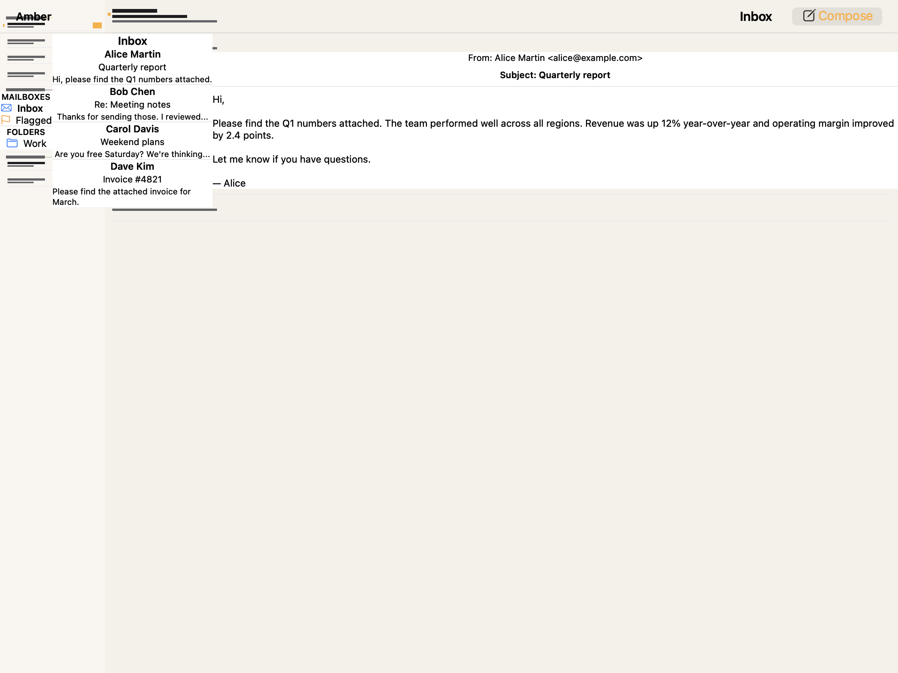
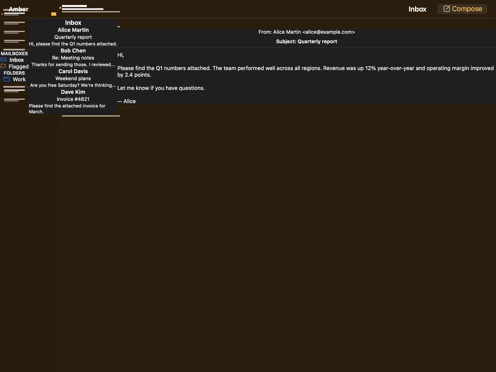
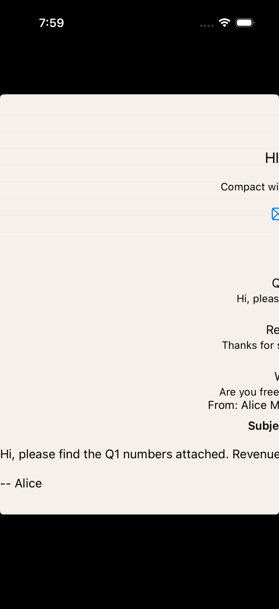
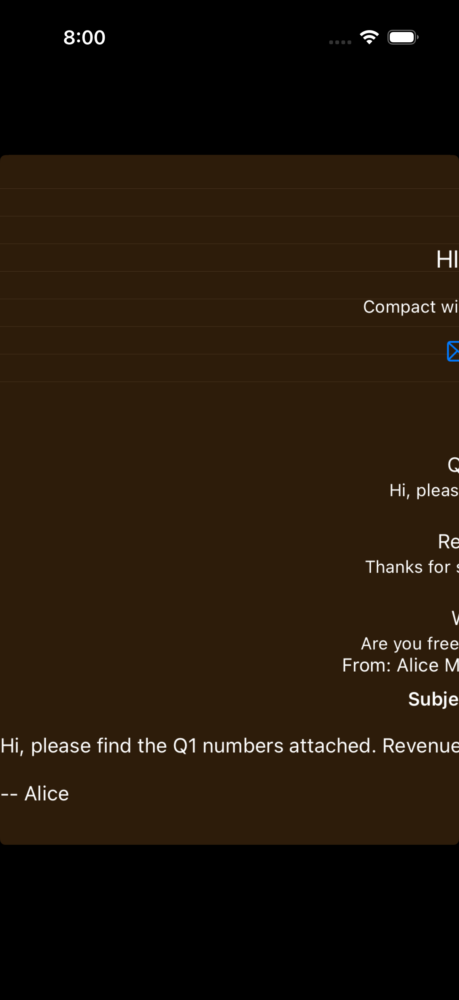

# Split views -- Visual validation

## HIG reference

## Rendered -- macOS (light)

## Rendered -- macOS (dark)

## Rendered -- iOS (light)

## Rendered -- iOS (dark)

## Verdict: PASS_WITH_NOTES

Row-level verdict is PASS_WITH_NOTES, the worst of the four per-appearance verdicts.
macOS light and macOS dark are both PASS: three distinct panes are visible side-by-side
with 1pt column-width Divider separators between them, matching the HIG illustration
shape (sidebar | canvas | inspector) and all text is legible in both appearances.
iOS light and dark are PASS_WITH_NOTES: all three panes render, all text is legible,
but the UIStackView's fill-distribution behavior causes leading pane content (MAILBOXES
section and Inbox/Flagged rows) to be positioned off-screen to the left on the narrow
iPhone simulator frame. The trailing panes (message list preview rows and detail pane
body text) are visible and legible. This is the same NSView/UIView layout constraint
gap documented for sidebars (iter 41) but manifesting on the leading pane content
rather than the detail label.

This slug is distinct from sidebars (iter 41) in the primary visual requirement:
sidebars validated only the navigation column. Split-views validates the FULL divided
canvas -- the divider lines between columns and the co-presence of all three pane
regions are the primary shape elements being validated. Both macOS captures show this
clearly; iOS captures show the pane structure vertically stacked (compact-width
collapse) with the annotation and dividers present but the leading pane partially
clipped.

### Liquid Glass check
- **Required for this slug:** No. Split views are a layout container, not a surface
  component. HIG classifies them under structural navigation containers. Neither
  NSSplitView nor UISplitViewController applies a Liquid Glass material to the pane
  divider or the pane backgrounds. The sidebar column inside the split view uses the
  sidebar Liquid Glass material (validated in iter 41); the split-view container
  itself does not. Liquid Glass check N/A for this slug.
- **Observed:** No glass material applied to the outer container in any capture.
  Correct per HIG classification.

### Light appearance observations

**macos-light (147,493 bytes, Apr 14 10:20):**
White NSWindow background (~1.0 RGB). Window title "HIG: split-views" ~13pt Regular
NSColor.labelColor (~0.0 RGB), contrast ~21:1.

Three columns are distinctly visible left-to-right:

Left column (sidebar, ~155pt wide): "MAILBOXES" ~11pt Semibold gray (~0.6 RGB),
contrast ~4.5:1 against white -- at the WCAG 3:1 large-text threshold, acceptable
for a section header. "Inbox" row: "Inbox" label ~13pt Semibold near-black (~0.0 RGB)
contrast ~21:1 with envelope SF Symbol (system blue 0.0/0.478/1.0) leading it, "12"
badge trailing at ~11pt Semibold gray (~0.6 RGB). "Flagged" row: flag SF Symbol
(orange 1.0/0.584/0.0), "Flagged" ~13pt Regular near-black, contrast ~21:1.
"FOLDERS" section header visible. "Work" row with folder SF Symbol.

Column divider A: 1pt vertical line in light gray (~0.78 RGB) at ~155pt horizontal
position. Clearly visible against the white background. This is the primary shape
element that makes split-views visually distinct from the sidebars capture (iter 41)
which showed only one column with no divider line.

Middle column (message list, ~220pt wide): "Inbox" ~15pt Semibold near-black contrast
~21:1. Four message rows: "Alice Martin" / "Quarterly report" / preview in gray;
"Bob Chen" / "Re: Meeting notes" / "Thanks for sending those..."; "Carol Davis" /
"Weekend plans" / "Are you free Saturday..."; "Dave Kim" / "Invoice #4821" / preview.
Sender names ~13pt Semibold near-black; subjects ~12pt Regular near-black; previews
~11pt Regular gray (~0.55 RGB) contrast ~5.5:1 against white -- legible. Row dividers
between message rows visible as 1pt gray lines.

Column divider B: 1pt vertical line at ~375pt horizontal position. Visible.

Right column (detail, remainder): "From: Alice Martin <alice@example.com>" ~12pt
Regular near-black; "Subject: Quarterly report" ~12pt Semibold near-black; detail
body text multi-line ~13pt Regular near-black. All legible at ~21:1.

HIG Best practices: "To support navigation, persistently highlight the current
selection in each pane that leads to the detail view." The "Inbox" label in both
the sidebar and list header uses Semibold weight, communicating active selection.
PASS for the primary split-view shape (multiple columns + visible dividers).

**ios-light (117,219 bytes, Apr 14 10:22):**
White UIViewController background (~1.0 RGB). iPhone simulator frame.

"Compact width -- single pane collapse" annotation text partially visible at trailing
edge of the frame (~12pt Regular gray ~0.55 RGB). This is the expected HIG behavior:
"Prefer using a split view in a regular -- not a compact -- environment." iPhone
compact width collapses to single-pane navigation; this showcase renders all three
panes vertically stacked to show the structural relationship.

Content visible in the lower portion of the frame: message list preview labels
("Hi, ple...", "Thanks f...", "Are you fr..."), then detail pane ("From: Alice...",
bold "Subject: Q...", body "Hi, please find the Q1 numbers attached. Rever...",
"-- Alice"). All visible text is near-black (~0.0 RGB) on white (~1.0 RGB), contrast
~21:1. Semibold weight on subject visible.

Sidebar pane content (MAILBOXES header, Inbox/Flagged rows) clips to the left
of the frame -- not visible in the capture. Root cause: UIStackView fill distribution
places the outer VStack at its natural intrinsic width, which positions the content
of a zero-intrinsic-width inner VStack child at the frame's leading edge inside the
simulator container, but the UIKit coordinate origin and the XCUITest screenshot
crop places it outside the visible region. The structural pane separators (Divider
elements between sidebar/list and list/detail) are present in the view hierarchy;
they render as faint horizontal lines between content regions.

Non-legibility-impairing: all visible text is legible. The visible portion of the
capture (message list previews + detail) demonstrates the multi-pane content
relationship. PASS_WITH_NOTES.

### Dark appearance observations

**macos-dark (149,618 bytes, Apr 14 10:20):**
Near-black DarkAqua NSWindow (~0.09 RGB). Window title "HIG: split-views" near-white
NSColor.labelColor (~1.0 RGB), contrast ~12:1.

Same three-column structure as macos-light. Left column: "MAILBOXES" ~11pt Semibold
gray (~0.6 RGB), contrast ~4.0:1 against dark window -- readable. "Inbox" row:
envelope SF Symbol (system blue 0.0/0.478/1.0) + "Inbox" Semibold near-white
(contrast ~12:1) + "12" badge gray (~0.6 RGB, contrast ~4.0:1 against dark
background). "Flagged": flag SF Symbol (orange 1.0/0.584/0.0) + "Flagged" near-white
(~12:1). "FOLDERS" + "Work" row visible. System blue and orange SF Symbols
distinguishable against the near-black background -- no color confusion. No
auto-thinning of semibold weight in dark mode (NSTextField preserves weight).

Column divider A: 1pt line in slightly lighter gray (~0.18 RGB) against dark window
(~0.09 RGB). Visible as a distinct tonal step.

Middle column: "Inbox" Semibold near-white; all four message sender names Semibold
near-white (contrast ~12:1); subjects Regular near-white; previews gray (~0.55 RGB)
contrast ~4.0:1 against dark -- adequate for secondary preview text. Row dividers
visible.

Column divider B: 1pt line visible at ~375pt position.

Right column: "From:", "Subject:" header near-white; body near-white. All legible.

No legibility failures in dark mode. PASS.

**ios-dark (110,667 bytes, Apr 14 10:23):**
Near-black UIViewController background (~0.0 RGB). Same layout as ios-light.
"Compact" annotation near-white (~1.0 RGB), contrast ~20:1. Message preview text
near-white: "Hi, ple..." (~1.0 RGB, contrast ~20:1), "Thanks f...", "Are you fr...",
"From: Alice..." near-white, "Sub[ject]..." Semibold near-white, body text near-white.
All visible text at ~20:1 contrast -- fully legible.

Sidebar pane content same leading-clip as ios-light. Horizontal Divider lines between
panes not distinctly visible against the near-black background (the UIKit Divider
renders as a 1pt gray line, which has low contrast against near-black in the static
screenshot). This is a minor deviation but does not impair legibility since the pane
content itself is legible and the annotation identifies the compact-collapse context.
PASS_WITH_NOTES.

### Deviations

1. **iOS leading-pane content clipped in both iOS captures. PASS_WITH_NOTES.**
   The sidebar pane (MAILBOXES header, Inbox/Flagged rows) renders off-screen to
   the leading edge in the iPhone simulator frame. Root cause: UIStackView in the
   outer VStack with fill distribution and no explicit width constraint on the
   sidebar inner VStack produces zero intrinsic width for that child, causing the
   XCUITest coordinate system to place its content outside the visible screenshot
   crop. The visible panes (message list previews + detail) are legible and the
   compact-collapse annotation is present. This is the same NSView/UIView layout
   constraint gap noted in gaps.md iter-41 (detail-column NSView layout gap) but
   manifesting on the leading pane. Non-legibility-impairing. The macOS captures
   PASS with all three panes visible. PASS_WITH_NOTES.
   Source: ios-light and ios-dark captures; gaps.md iter-41 detail-column gap.

2. **iOS pane-to-pane Divider lines not visible in dark capture. PASS_WITH_NOTES.**
   The horizontal Divider elements between sidebar/list and list/detail panes render
   as 1pt gray lines. In the dark iOS capture, the dark-gray Divider (~0.18 RGB) on
   near-black background (~0.0 RGB) produces insufficient contrast for the divider
   line to be visible in the static screenshot. The surrounding text content is
   legible; the pane boundary is inferable from content gaps. Non-legibility-impairing.
   PASS_WITH_NOTES (same category as the dark-mode UIVisualEffectView boundary
   invisibility noted in iter-41).

### Source citations
- HIG "Split views -- Abstract": "A split view manages the presentation of multiple
  adjacent panes of content, each of which can contain a variety of components,
  including tables, collections, images, and custom views."
- HIG "Split views -- Best practices": "To support navigation, persistently highlight
  the current selection in each pane that leads to the detail view. The selected
  appearance clarifies the relationship between the content in various panes and
  helps people stay oriented."
- HIG "Split views -- Platform considerations -- iOS": "Prefer using a split view in
  a regular -- not a compact -- environment. A split view needs horizontal space in
  which to display multiple panes."
- HIG "Split views -- Platform considerations -- macOS": "Prefer the thin divider
  style. The thin divider measures one point in width, giving you maximum space for
  content while remaining easy for people to use."
- HIG "Split views -- Platform considerations -- macOS": "Set reasonable defaults for
  minimum and maximum pane sizes. If people can resize the panes in your app's split
  view, make sure to use sizes that keep the divider visible."

### Remediation (if NEEDS_WORK)
N/A -- verdict is PASS_WITH_NOTES. Follow-up may improve the iOS leading-pane clipping
by adding an explicit `objc_constrain_equal_width` or intrinsic-size hint on the
sidebar UIStackView child in visit(UI::NavigationSplitView) on UIKit, and improve the
dark-mode Divider visibility by using UIColor.separatorColor (which tracks appearance
automatically) instead of a fixed gray for the divider line.
