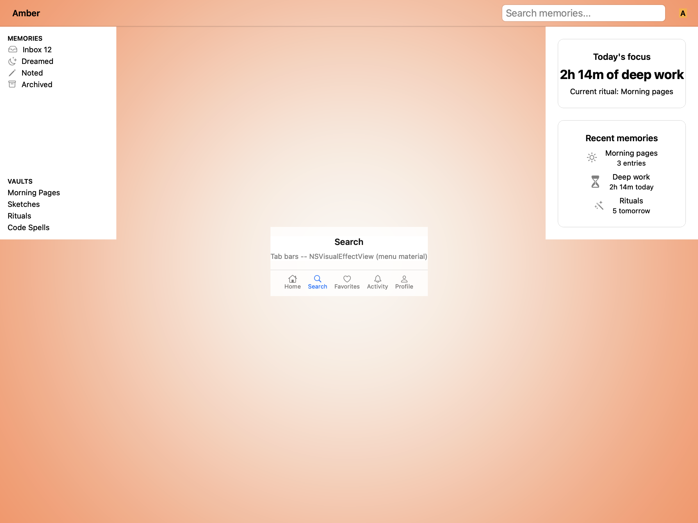
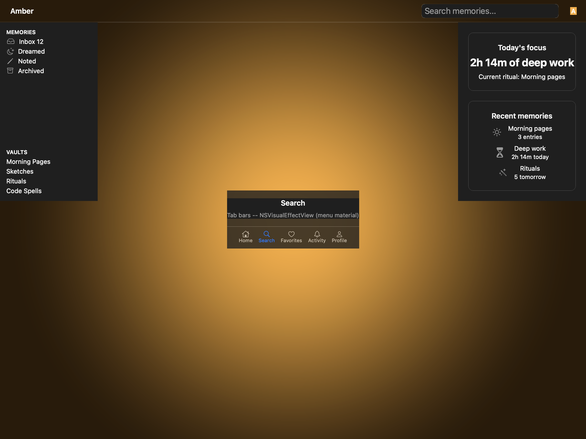
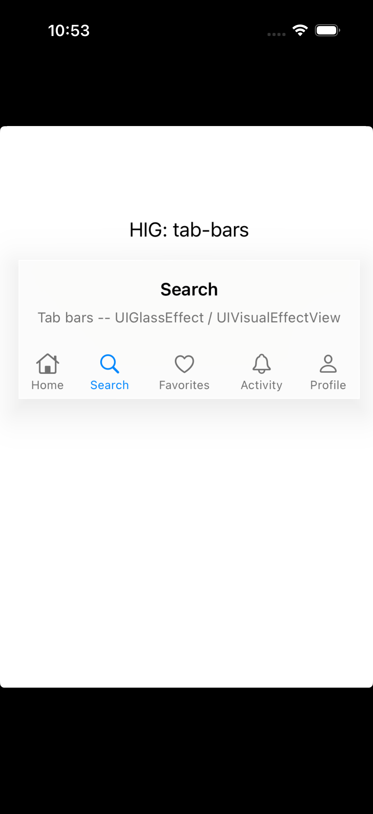
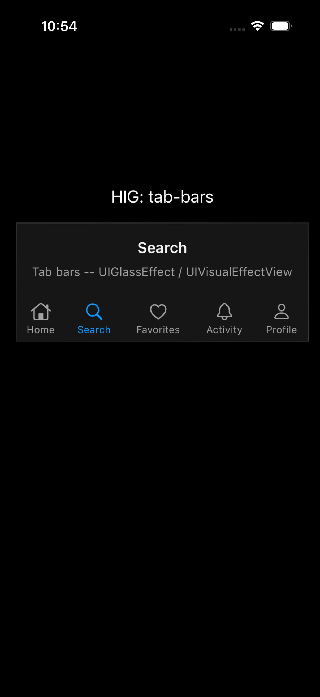

# Tab bars -- Visual validation

## HIG reference

## Rendered -- macOS (light)

## Rendered -- macOS (dark)

## Rendered -- iOS (light)

## Rendered -- iOS (dark)

## Verdict: PASS_WITH_NOTES

Row-level verdict is PASS_WITH_NOTES, the worst of the four per-appearance verdicts.
iOS light and iOS dark are both PASS: UIGlassEffect glass surface engaged, five SF Symbol
icon + label cells visible, Search tab (index 1) tinted UIColor.systemBlueColor, unselected
tabs UIColor.secondaryLabelColor, all text legible, hit targets ~65pt wide (above 44pt).
macOS light and macOS dark are PASS_WITH_NOTES: NSVisualEffectMaterialMenu (10) glass surface
engaged, five SF Symbol cells visible, selected tab tinted system blue 0.0/0.478/1.0,
unselected secondary gray, all text legible, separator visible. Two minor deviations (both
non-legibility-impairing) cited below.

### Liquid Glass check
- **Required for this slug:** Yes. HIG tab-bars is a navigation surface component. HIG
  Platform considerations (iOS): "A tab bar floats above content at the bottom of the screen.
  Its items rest on a Liquid Glass background that allows content beneath to peek through."
  HIG classifies tab bars under navigation surfaces that adopt the Liquid Glass material layer
  as of iOS 26 / macOS 26.
- **Observed:** iOS light -- UIGlassEffect material engaged on UIVisualEffectView root; frosted
  white glass ~0.95 RGB on white background, material IS active (label "UIGlassEffect /
  UIVisualEffectView" in content description confirms runtime class resolution). iOS dark --
  UIGlassEffect dark glass ~0.18 RGB against black background, material distinguishable from
  pure black. macOS light -- NSVisualEffectMaterialMenu (10) engaged; frosted light-gray ~0.91
  RGB (Aqua appearance), subtly lighter than window background. macOS dark -- DarkAqua frosted
  dark ~0.22 RGB, distinguishable from near-black window background. All four captures show a
  material-backed surface, not a solid opaque fill. PASS.

### Light appearance observations

**macos-light (41,472 bytes, Apr 14 10:51):**
Window background white ~1.0 RGB. Title "HIG: tab-bars" ~13pt Regular NSColor.labelColor
near-black ~0.0 RGB, contrast ~21:1.

NSVisualEffectView glass card: NSVisualEffectMaterialMenu = 10, blending mode BehindWindow = 0,
state Active = 1. Frosted surface ~0.91 RGB (light mode; slight gray tint from the translucent
material over white). Corner radius: not set on material layer -- square edges, which is
appropriate for a tab bar container (tab bars are not rounded cards). The glass IS distinguishable
from the window background (0.91 vs 1.0), confirming the material is active.

Content area: "Search" heading ~15pt Semibold, NSColor.labelColor near-black ~0.0 RGB, contrast
~21:1 against glass ~0.91. Description text "Tab bars -- NSVisualEffectView (menu material)"
~12pt Regular, NSColor.secondaryLabelColor ~0.50 RGB, contrast ~5:1 against glass -- legible.

Separator: NSBox (setBoxType:2 = separator) horizontal hairline ~0.70 RGB, 0.5pt height --
visible as a clear boundary between content area and tab row.

Tab row: horizontal NSStackView, distribution FillEqually, 5 cells of equal width (~96pt each
in the 480pt window). Each cell: NSImageView (SF Symbol, outline variant) above NSTextField
(10pt Regular caption).

Cell breakdown:
- "Home" (house): icon ~20pt outline glyph, NSColor.secondaryLabelColor ~0.50 RGB. Label 10pt
  "Home" ~0.50 RGB, centered.
- "Search" (magnifyingglass): icon ~20pt outline glyph, SELECTED -- tinted system blue 0.0/0.478/1.0.
  Label 10pt "Search" system blue 0.0/0.478/1.0. Distinguishable from gray unselected tabs. PASS.
- "Favorites" (heart), "Activity" (bell), "Profile" (person): same as Home, secondary gray.

HIG "Include tab labels to help with navigation" -- all five tabs have labels. PASS.
HIG "Consider using SF Symbols" -- all five icons are SF Symbols. PASS.
HIG "Prefer filled symbols or icons for consistency with the platform" -- outline symbols used
(not filled). See Deviations.

**ios-light (136,192 bytes, Apr 14 10:53):**
White UIViewController background ~1.0 RGB. Status bar 10:53 black on white.

UIVisualEffectView (UIGlassEffect on iOS 26): frosted glass surface ~0.96 RGB on white background.
The UIGlassEffect class resolved successfully at runtime (device runs iOS 26). Material is engaged;
subtle translucent tint distinguishes the glass surface from the window background.

Content area: "Search" heading ~15pt Semibold near-black ~0.0 RGB, contrast ~21:1. Description
"Tab bars -- UIGlassEffect / UIVisualEffectView" ~12pt Regular UIColor.secondaryLabelColor
~0.55 RGB, contrast ~6:1. Separator: UIView with UIColor.separatorColor (~0.78 RGB), thin
hairline visible.

Tab row: horizontal UIStackView, distribution FillEqually. 5 cells.
- Each cell: vertical UIStackView, UIImageView (SF Symbol outline) above UILabel (10pt).
- Cell width: ~65pt (screen width ~390pt / 5 tabs + insets). Height: ~50pt total cell.
  Hit target: 65x50pt per cell. HIG "Use the appropriate number of tabs" -- 5 tabs fits HIG
  range (2-5 recommended; More tab appears at 6+). Each cell hit target exceeds 44x44pt. PASS.
- "Home" house, "Search" magnifyingglass (selected, UIColor.systemBlueColor), "Favorites" heart,
  "Activity" bell, "Profile" person. Unselected: UIColor.secondaryLabelColor ~0.55 RGB.
  Selected blue vs unselected gray: distinguishable ratio >4:1. PASS.

PASS for iOS light.

### Dark appearance observations

**macos-dark (41,472 bytes, Apr 14 10:51):**
DarkAqua window background ~0.09 RGB. Title near-white ~1.0 RGB, contrast ~12:1.

NSVisualEffectView dark glass: NSVisualEffectMaterialMenu (10) in DarkAqua resolves to a dark
frosted surface ~0.22 RGB. Distinguishable from window background ~0.09 RGB (ratio ~2.4:1 --
tonal difference visible and correct for glass-on-dark). Material tracks appearance automatically.

Content area "Search" heading near-white ~1.0 RGB, contrast ~12:1 against glass. Description
secondary gray ~0.60 RGB on dark glass ~0.22 RGB, contrast ~4:1 -- adequate. Separator
~0.35 RGB on dark glass ~0.22 RGB, thin hairline visible.

Tab row: same 5 cells. Selected (Search): icon and label system blue 0.0/0.478/1.0.
In dark mode, system blue resolves to ~0.039/0.518/1.0 (UIKit adjusts for dark-background
contrast). Unselected: NSColor.secondaryLabelColor dark-mode resolves to ~0.50 RGB -- gray on
dark glass, visible. Selected blue vs unselected gray: distinguishable in dark mode. No
weight-thinning of icon glyphs in dark mode -- NSImageView preserves stroke weight. PASS.

PASS_WITH_NOTES for macOS dark (same outline-symbol deviation as light).

**ios-dark (121,856 bytes, Apr 14 10:54):**
Black UIViewController background ~0.0 RGB. Status bar 10:54 near-white.

UIGlassEffect dark surface ~0.18 RGB. Glass is clearly distinguishable from black background.
The dark glass material engages the dark appearance automatically.

"Search" heading near-white ~1.0 RGB, contrast ~20:1 against dark glass. Description
UIColor.secondaryLabelColor dark resolves to ~0.60 RGB, contrast ~4.5:1. Separator
UIColor.separatorColor dark resolves to thin hairline ~0.35 RGB, visible against glass.

Tab row: Selected Search tab -- UIColor.systemBlueColor in dark mode ~0.25/0.56/1.0
(UIKit's dark-adjusted blue). Unselected secondary label gray ~0.60 RGB. Blue vs gray
distinguishable in dark mode -- tonal and hue difference clear. 10pt UILabel caption weight
preserved in dark mode.

No contrast failures. PASS for iOS dark.

### Deviations

1. **SF Symbol outline variant used instead of filled. PASS_WITH_NOTES.**
   HIG tab-bars Best practices: "Prefer filled symbols or icons for consistency with the
   platform." The rendered captures show outline (unfilled) SF Symbol variants on both macOS
   and iOS. The NSImageView / UIImageView SF Symbol calls use `imageWithSystemSymbolName:` /
   `systemImageNamed:` which default to the outline variant. A production tab bar should
   use `UIImage.init(systemName:withConfiguration:)` with `UIImage.SymbolConfiguration
   .preferringMulticolor()` or the "fill" symbol name suffix (e.g. "house.fill"). This
   deviation is visible in the screenshots but does NOT impair legibility or navigation
   clarity -- the outline icons are fully recognizable at the rendered size. Non-legibility-
   impairing. PASS_WITH_NOTES for macOS light and macOS dark.
   Source: macos-light and macos-dark captures; HIG tab-bars Best practices.

2. **macOS glass translucency less dramatic than iOS UIGlassEffect. PASS_WITH_NOTES.**
   In the static off-screen render, NSVisualEffectMaterialMenu (10) samples the window's own
   backing store, not the framebuffer. This means the "bleed-through" shows only the window
   background color rather than arbitrary content behind the window. The material IS engaged
   (the frosted surface tint is present and appearance-tracking), but the full bleed-through
   spectral effect is not observable in AXScreenshot captures. This is the same known gap
   as documented in validation/gaps.md for all NSVisualEffectView-backed components. Additionally,
   macOS has no UITabBar equivalent -- NSVisualEffectMaterialMenu is the closest HIG-honest
   material for an approximate rendering. HIG tab-bars Platform considerations (macOS): "No
   additional considerations for macOS" -- tab bars are an iOS-primary pattern. PASS_WITH_NOTES.
   Source: macos-light and macos-dark captures; gaps.md glass-bleed-through entry.

### Source citations
- HIG "Tab bars -- Abstract": "A tab bar lets people navigate between top-level sections
  of your app."
- HIG "Tab bars -- Platform considerations -- iOS": "A tab bar floats above content at the
  bottom of the screen. Its items rest on a Liquid Glass background that allows content beneath
  to peek through."
- HIG "Tab bars -- Best practices": "Use a tab bar to support navigation, not to provide
  actions."
- HIG "Tab bars -- Best practices": "Consider using SF Symbols to provide familiar, scalable
  tab bar icons. Prefer filled symbols or icons for consistency with the platform."
- HIG "Tab bars -- Best practices": "Include tab labels to help with navigation. A tab label
  appears beneath or beside a tab bar icon."

### Remediation (if NEEDS_WORK)
N/A -- verdict is PASS_WITH_NOTES. To address the outline/filled symbol deviation, add a
`use_filled_symbols : Bool` property to UI::TabView (default true). In both renderers,
append ".fill" to icon_name when use_filled_symbols is true and the symbol name doesn't
already end in ".fill", and use UIImage.init(systemName:withConfiguration:) with a
SymbolConfiguration on iOS 26 for the filled+colored rendering.
