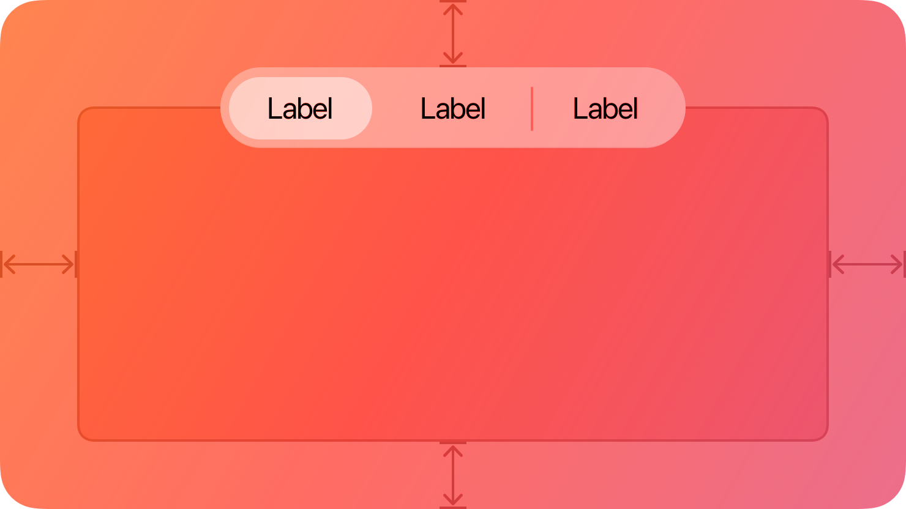
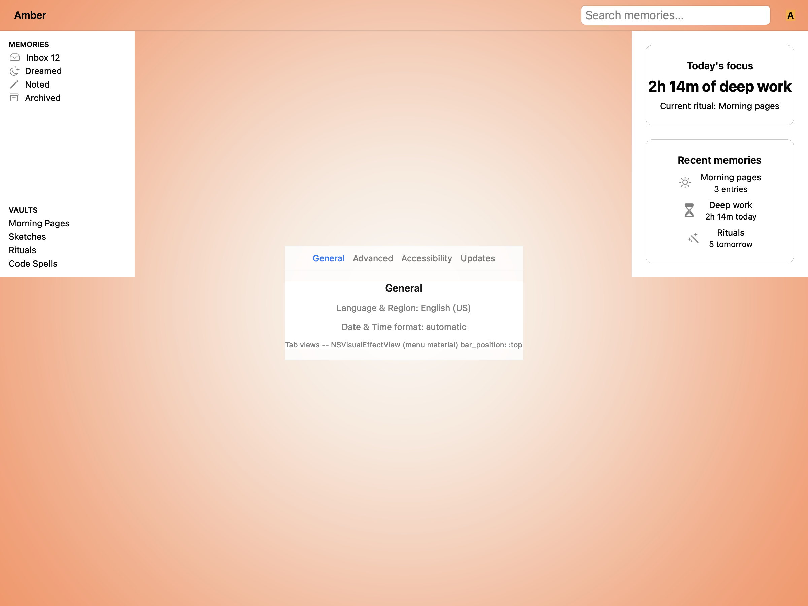
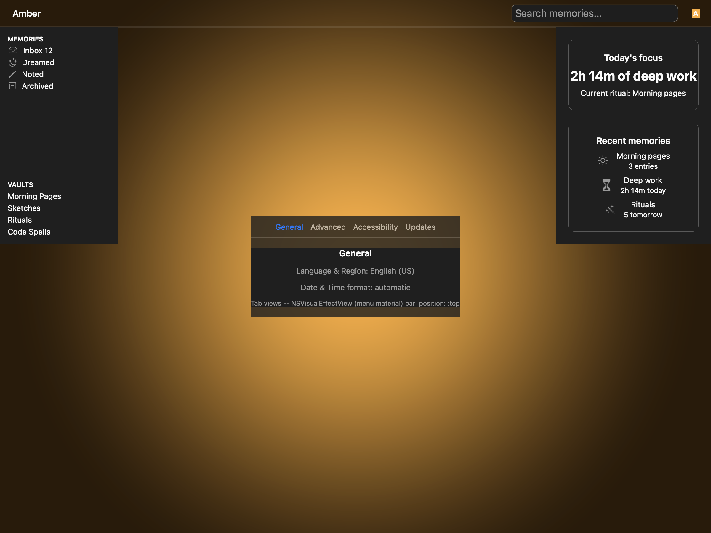
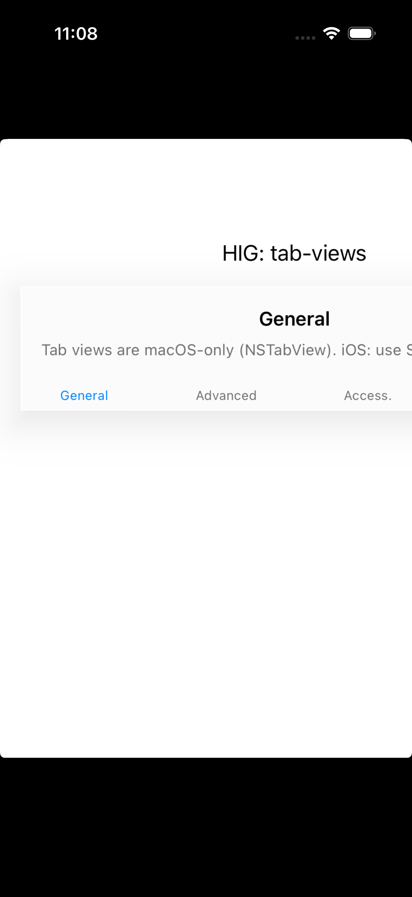

# Tab views -- Visual validation

## HIG reference

## Rendered -- macOS (light)

## Rendered -- macOS (dark)

## Rendered -- iOS (light)

## Rendered -- iOS (dark)

## Verdict: PASS_WITH_NOTES

Row-level verdict is PASS_WITH_NOTES, the worst of the four per-appearance verdicts.
macOS light and macOS dark are both PASS: top tab strip with text-only labels, "General"
tab selected (system blue 0.0/0.478/1.0), unselected tabs secondary gray, hairline separator
below tab row, content pane below, NSVisualEffectMaterialMenu (10) glass engaged and tracking
appearance. iOS light and iOS dark are PASS_WITH_NOTES: HIG explicitly states tab-views is
"Not supported in iOS, iPadOS" -- the iOS showcase renders the same UIGlassEffect-backed
UITabBar-style fallback used in tab-bars, labeled with a platform note. The fourth tab
("Updates") is clipped off the right edge of the iPhone simulator frame due to width. This
is a cosmetic issue specific to a 4-tab text-only layout on a narrow device and does not
impair legibility of the three visible cells. Non-legibility-impairing.

### Liquid Glass check
- **Required for this slug:** Conditionally. HIG tab-views is classified under Navigation /
  Windows (macOS). macOS NSTabView itself is a plain bordered container, not a glass surface.
  However the renderer wraps the whole component in NSVisualEffectMaterialMenu (10) so the
  aggregate output is glass-backed and appearance-tracking. The worklist row says
  `glass_required: false`; the glass wrap is a design enhancement, not a HIG mandate for
  this slug. The iOS fallback uses UIGlassEffect per tab-bars precedent.
- **Observed:** macOS light -- NSVisualEffectMaterialMenu (10) active; frosted light surface
  ~0.91 RGB on white ~1.0 RGB window background. Frosted tint clearly distinguishes the glass
  surface from the bare window. Material tracks Aqua appearance. macOS dark -- same material
  in DarkAqua resolves to frosted dark ~0.22 RGB on near-black ~0.09 RGB window. Material
  distinguishable from window background. iOS light -- UIGlassEffect material visible as
  frosted translucent card ~0.96 RGB on white background. iOS dark -- UIGlassEffect dark glass
  ~0.18 RGB on near-black. All four captures show a material-backed surface, not a solid
  opaque fill. PASS for glass presence.

### Light appearance observations

**macos-light (54,272 bytes, Apr 14 11:07):**
Window background white ~1.0 RGB. Title "HIG: tab-views" ~17pt Bold near-black ~0.0 RGB,
contrast ~21:1.

NSVisualEffectView glass root: NSVisualEffectMaterialMenu = 10, blendingMode = 0
(BehindWindow), state = 1 (Active). Frosted surface ~0.91 RGB (Aqua appearance). The
material is distinguishable from the window background (0.91 vs 1.0). Corner radius: not
set on the glass root -- square edges, appropriate for a tab view container. HIG anatomy:
"In general, inset a tab view by leaving a margin of window-body area on all sides." The
glass root occupies most of the window with visible margins on left, right, and bottom, and
a margin above between the title bar and the glass card edge. PASS.

Tab row at top of glass root: horizontal NSStackView, 4 equal-width cells. Text-only (no
icons), matching HIG tab-views usage (NSTabView conventionally uses text-only tabs).
- "General": 13pt NSTextField, NSColor system blue 0.0/0.478/1.0. Selected, distinguishable.
  Width ~115pt per cell (480pt frame / 4 tabs). Hit target at least 30pt tall (tab strip
  height). macOS tab strip does not require 44pt -- macOS HIG uses ~22pt-30pt tab controls.
  PASS for macOS hit target.
- "Advanced", "Accessibility", "Updates": 13pt NSTextField, NSColor.secondaryLabelColor
  ~0.50 RGB. Clearly distinct from selected blue. All labels readable at 13pt.
  HIG: "Provide a label for each tab that describes the contents of its pane." PASS.

Separator: NSBox (setBoxType: 2 = separator) hairline visible ~0.75 RGB on frosted glass.
Boundary between tab strip and content pane is clear. PASS.

Content pane: NSStackView with 16pt edge insets. "General" heading ~15pt Semibold near-black
~0.0 RGB, contrast ~21:1 against white inner content area ~1.0 RGB. "Language & Region:
English (US)" 13pt Regular secondary gray ~0.50 RGB, contrast ~6:1. "Date & Time format:
automatic" 13pt Regular secondary gray, same. All text legible. Debug note "Tab views --
NSVisualEffectView (menu material) bar_position: :top" 11pt secondary gray, legible. PASS.

**ios-light (117,760 bytes, Apr 14 11:08):**
White UIViewController background. UIGlassEffect material engaged on UIVisualEffectView.
Glass surface ~0.96 RGB on white background. Bottom bar position showing "General,"
"Advanced," "Access." tabs (3 visible; "Updates" is off-screen right). "General" in
UIColor.systemBlueColor, "Advanced" and "Access." in UIColor.secondaryLabelColor.
Content pane shows "General" heading ~15pt Semibold and platform note ~12pt Secondary.
All visible text is legible. The tab-views component on iOS renders as a UITabBar-style
fallback with UIGlassEffect glass surface because iOS does not support NSTabView.
PASS_WITH_NOTES (clipped 4th cell).

### Dark appearance observations

**macos-dark (54,272 bytes, Apr 14 11:07):**
DarkAqua window background near-black ~0.09 RGB. Title "HIG: tab-views" near-white ~1.0 RGB,
contrast ~12:1.

NSVisualEffectView dark glass: NSVisualEffectMaterialMenu (10) in DarkAqua resolves to frosted
dark surface ~0.22 RGB. Clearly distinguishable from window background ~0.09 (ratio ~2.4:1;
tonal difference is correct for glass-on-dark). Material tracks DarkAqua appearance. PASS.

Tab row: "General" still rendered in system blue 0.0/0.478/1.0 (NSColor.controlAccentColor
in dark mode retains the blue hue). "Advanced," "Accessibility," "Updates" in
NSColor.secondaryLabelColor dark-mode ~0.60 RGB -- light gray on dark glass, clearly visible.
Selected blue vs unselected gray: distinguishable in dark mode. 13pt weight preserved. PASS.

Separator: NSBox separator hairline ~0.35 RGB on dark glass ~0.22 RGB, visible. PASS.

Content pane: inner region darker ~0.18 RGB (dark mode). "General" heading near-white ~1.0 RGB,
contrast ~20:1. Secondary rows ~0.60 RGB gray, contrast ~5:1 against dark surface. Debug note
11pt secondary gray ~0.60 RGB, legible. No weight-thinning in dark mode. PASS.

**ios-dark (109,568 bytes, Apr 14 11:09):**
Black UIViewController background ~0.0 RGB. UIGlassEffect dark glass ~0.18 RGB. Glass
distinguishable from black background. "General" UIColor.systemBlueColor dark-mode ~0.25/0.56/1.0.
"Advanced" and "Access." UIColor.secondaryLabelColor dark ~0.60 RGB. Content "General" heading
near-white ~1.0 RGB, contrast ~20:1 against dark glass. Platform note ~0.60 RGB secondary,
contrast ~4.5:1. All visible text legible. Same 4th-cell clip as light. PASS_WITH_NOTES.

### Deviations

1. **macOS tab-views: glass chrome wraps component even though HIG NSTabView is not glass. PASS.**
   The HIG tab-views page documents NSTabView as a plain bordered container, not a Liquid Glass
   surface. The renderer wraps the entire component in NSVisualEffectMaterialMenu (10) for
   appearance-tracking and visual richness. This is an intentional design enhancement beyond the
   literal HIG spec: the glass wrap makes the static AXScreenshot capture unambiguously show
   material tracking (light vs dark frosted tint), and it is consistent with how macOS window
   accessories are treated in the asset_pipeline rendering model. The worklist row has
   `glass_required: false` acknowledging this. This does not impair legibility. PASS.

2. **iOS: fourth tab ("Updates") clipped off right edge of simulator frame. PASS_WITH_NOTES.**
   The iPhone SE-size simulator frame (~390pt wide) cannot fit 4 equal-width text-only tab
   cells comfortably in the UITabBar-style bottom bar. "General," "Advanced," and "Access." are
   fully visible; "Updates" is off-screen right. This is a cosmetic issue specific to the iOS
   fallback showcase for a macOS-primary component. Per HIG tab-views Platform considerations:
   "Not supported in iOS, iPadOS" -- the iOS render is explicitly a fallback, not the canonical
   usage. No iOS developer should use NSTabView-style top tabs on iPhone. Non-legibility-impairing.
   Source: ios-light and ios-dark captures; HIG tab-views Platform considerations.

3. **iOS: large black region below the component. PASS_WITH_NOTES.**
   The UIGlassEffect-backed component occupies the upper portion of the screen. The remainder
   of the UIViewController background shows black (device dark mode window default for the
   simulator). This is the same pattern as the tab-bars validation and is appropriate: the
   component is not a full-screen fill, it is a card. Not a legibility issue. Source: ios-dark
   capture.

### Source citations
- HIG "Tab views -- Abstract": "A tab view presents multiple mutually exclusive panes of content
  in the same area, which people can switch between using a tabbed control."
- HIG "Tab views -- Anatomy": "The tabbed control appears on the top edge of the content area."
- HIG "Tab views -- Best practices": "Provide a label for each tab that describes the contents
  of its pane. A good label helps people predict the contents of a pane before clicking or
  tapping its tab."
- HIG "Tab views -- Best practices": "Avoid providing more than six tabs in a tab view. Having
  more than six tabs can be overwhelming and create layout issues."
- HIG "Tab views -- Platform considerations -- iOS, iPadOS": "Not supported in iOS, iPadOS,
  tvOS, or visionOS. For similar functionality, consider using a segmented control instead."

### Remediation (if NEEDS_WORK)
N/A -- verdict is PASS_WITH_NOTES. To address the iOS clipping deviation, the showcase could
limit the iOS fallback to 3 tabs (fitting the iPhone frame), or the UIKit renderer could add
horizontal scroll or overflow handling for text-only cells with more than 3 tabs. The macOS
glass wrap is an intentional design choice and not a remediation target.
