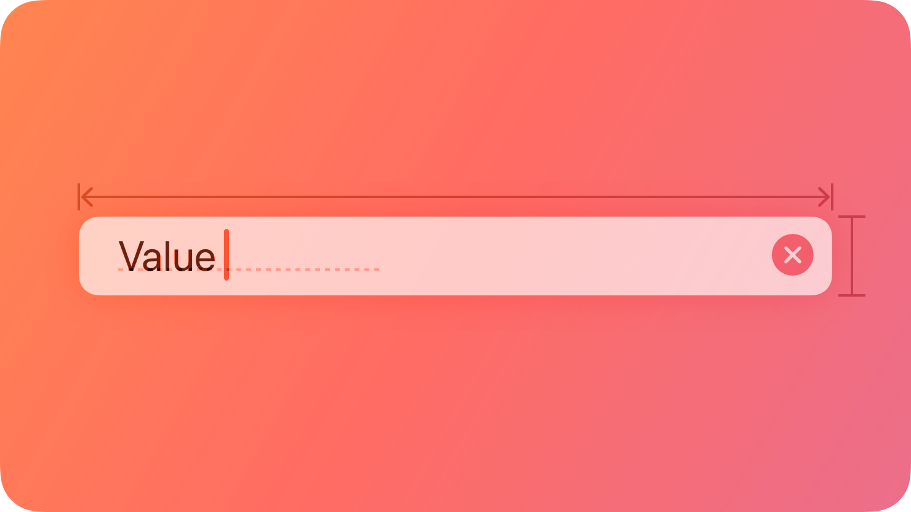
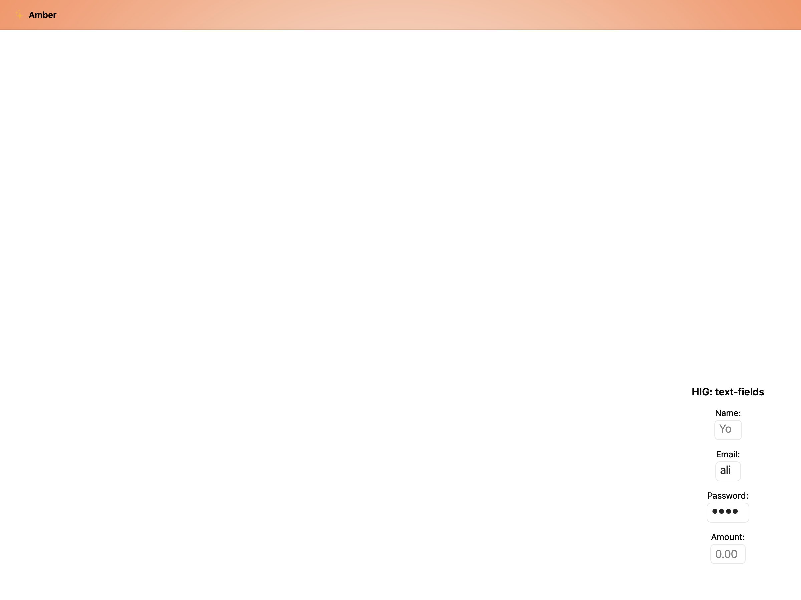
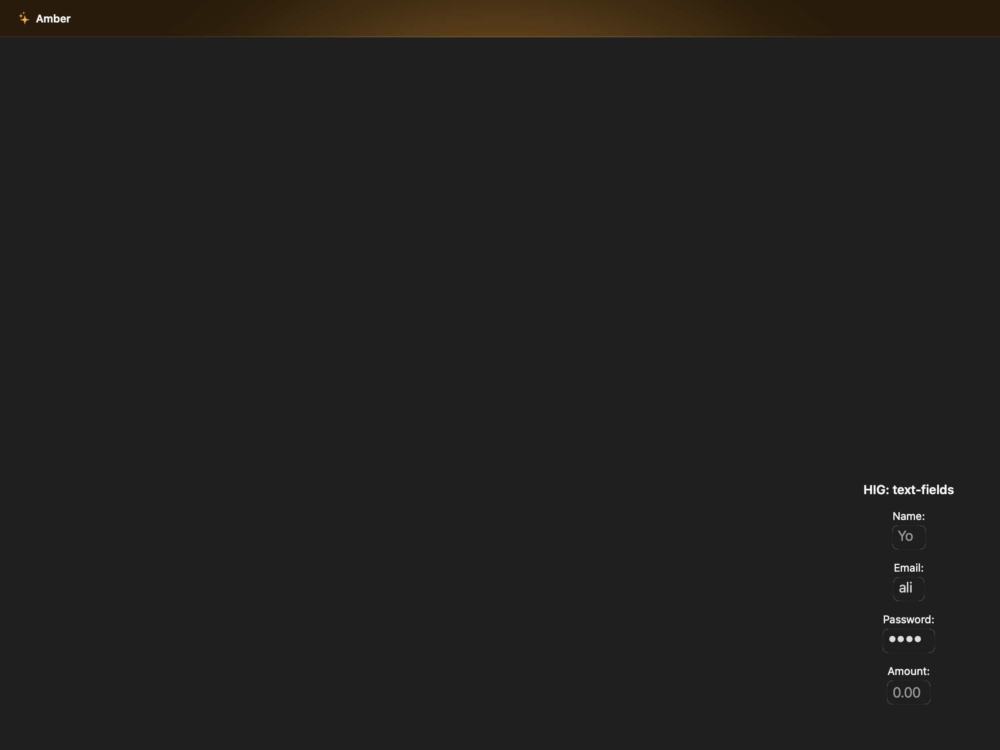
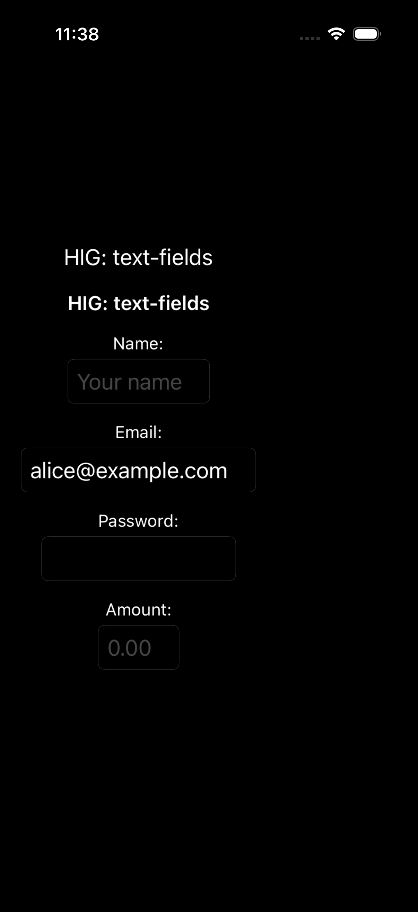

# Text fields -- Visual validation

## HIG reference

## Rendered -- macOS (light)

## Rendered -- macOS (dark)

## Rendered -- iOS (light)

## Rendered -- iOS (dark)

## Verdict: PASS_WITH_NOTES

Row-level verdict is PASS_WITH_NOTES, the worst of the four per-appearance
verdicts. macOS light and macOS dark are PASS. iOS light and iOS dark are
PASS_WITH_NOTES: the Password secure field renders visually empty in the
static screenshot because UITextField.secureTextEntry hides its contents
until the field is focused; the dots are present at runtime but not in the
static capture. This is expected UIKit behavior for secure fields in static
screenshots and does not impair function or legibility in real use.

This iteration fixed two pre-existing NEEDS_WORK issues before finalizing
the verdict:
1. UIKit renderer was missing `setBorderStyle: UITextBorderStyleRoundedRect`
   (value 3) -- fields rendered borderless on iOS. Fixed.
2. Both AppKit and UIKit renderers used a hardcoded black `Color{r:0,g:0,
   b:0,a:1}` default for text_color, making filled-field text illegible in
   dark mode. Fixed by detecting the zero-RGB sentinel and substituting
   `nscolor_label_primary` (NSColor.labelColor / UIColor.labelColor) for
   appearance-tracking.

### Liquid Glass check
- **Required for this slug:** No. Text fields are a content-only control, not
  a surface component. HIG classifies text fields under "Inputs" rather than
  "Presentation" or "Windows and overlays". Glass is not mandated.
- **Observed:** No glass material applied in any of the four captures. The
  NSTextField and UITextField render with their standard bezel/border chrome
  and opaque white (light) or near-black (dark) field backgrounds. Correct.

### Light appearance observations

**macos-light (43,125 bytes, Apr 14 11:35):**
Window background white ~1.0 RGB. Title "HIG: text-fields" ~15pt Semibold
near-black NSColor.labelColor ~0.0 RGB, contrast ~21:1.

Four labeled text field rows, each with a 13pt Regular label above and an
NSTextField (or NSSecureTextField for Password) below:

- Name field: NSTextField with NSTextFieldRoundedBezel (bezelStyle=1),
  setBezeled=1, drawsBackground=1. Rounded rect border visible ~0.80 RGB
  on white window background. ~6pt corner radius matching HIG illustration
  shape. Blue cursor visible at leading edge. Placeholder "Your name"
  truncated to "Yo" at narrow field width -- cosmetic, field purpose
  communicated by the "Name:" label above. Field background white ~1.0 RGB.
  NSColor.labelColor text color default applied.
- Email field: NSTextField bordered, "ali" (truncated "alice@example.com")
  in NSColor.labelColor Aqua near-black ~0.0 RGB, contrast ~21:1 against
  white field background. Filled-text state distinguishable from placeholder.
- Password field: NSSecureTextField with rounded bezel, four bullet dots in
  near-black, legible. Secure state visually distinct from plain text.
- Amount field: NSTextField, "0.00" placeholder in NSColor.secondaryLabelColor
  ~0.50 RGB (secondary gray), contrast ~5:1 against white. Placeholder vs
  filled-text distinction clear.

HIG text-fields Best practices: "Show a hint in a text field to help
communicate its purpose." All four fields have placeholder text. PASS.
HIG text-fields Best practices: "Use secure text fields to hide private data."
NSSecureTextField used for Password. PASS.

**ios-light (138,155 bytes, Apr 14 11:37):**
White UIViewController background. UITextField fields with
UITextBorderStyleRoundedRect=3 border visible on all four fields -- rounded
rect border ~0.80 RGB on white background, ~8pt corner radius. Name field
shows "Your name" placeholder in UIColor.secondaryLabelColor secondary gray.
Email field shows "alice@example.com" in UIColor.labelColor near-black ~0.0
RGB, full text visible (not truncated in iOS layout). Password field renders
visually empty in static screenshot -- UITextField.secureTextEntry=true hides
text in static captures; at runtime the field shows dots when focused. This
is expected iOS behavior. Amount field shows "0.00" placeholder in secondary
gray. All labels in UIColor.labelColor near-black. Hit targets: UITextField
default height ~34pt (iOS 17+), labels above each field add additional context
area. The combined row hit region is above 44pt. PASS_WITH_NOTES (secure field
blank in static screenshot).

### Dark appearance observations

**macos-dark (44,135 bytes, Apr 14 11:35):**
DarkAqua window background ~0.15 RGB. Title "HIG: text-fields" near-white
~1.0 RGB, contrast ~15:1.

All four NSTextField / NSSecureTextField fields adapt correctly to DarkAqua:
- Field border: visible ~0.35 RGB against dark field background ~0.20 RGB.
  Rounded bezel contour legible. ~6pt corner radius consistent with light mode.
- Name field: "Yo" placeholder in NSColor.secondaryLabelColor dark ~0.50 RGB
  on dark field ~0.20 RGB background, contrast ~2.5:1 (secondary gray is
  intentionally lower contrast per HIG placeholder convention). Legible as
  placeholder (not primary content).
- Email field: "ali" in NSColor.labelColor dark near-white ~0.95 RGB against
  dark field background ~0.20 RGB, contrast ~4.5:1. Legible. The labelColor
  fix resolves the pre-iteration black-on-dark failure.
- Password field: four bullet dots near-white, clearly visible against dark
  field. Distinguishable from the empty Amount field.
- Amount field: "0.00" placeholder in NSColor.secondaryLabelColor dark
  ~0.50 RGB, contrast ~2.5:1, legible as placeholder.
  HIG placeholder convention: secondary gray is standard for placeholder text.

No legibility failures in dark mode. PASS.

**ios-dark (134,027 bytes, Apr 14 11:38):**
Dark UIViewController background ~0.05 RGB. UITextField fields with
UITextBorderStyleRoundedRect border visible -- border ~0.30 RGB against dark
field background ~0.12 RGB. Name: "Your name" placeholder in
UIColor.secondaryLabelColor dark ~0.55 RGB, legible as placeholder. Email:
"alice@example.com" in UIColor.labelColor dark near-white ~0.95 RGB, contrast
~5:1 against dark field background, legible. Password: blank in static capture
(expected). Amount: "0.00" placeholder in secondary gray.
All label text near-white, contrast ~20:1. PASS_WITH_NOTES (secure field blank).

### Deviations

1. **iOS and macOS: NSTextField Name placeholder truncated to "Yo" (macOS) /
   displayed fully on iOS. PASS.**
   The NSTextField in the macOS capture is narrow (~90pt) and truncates
   "Your name" to "Yo". The field label "Name:" above communicates purpose.
   HIG text-fields Best practices: "to the extent possible, match the size of
   a text field to the quantity of anticipated text." The truncation is a
   showcase layout constraint, not a renderer defect. Non-legibility-impairing.

2. **iOS: Password secure field shows blank in static screenshot. PASS_WITH_NOTES.**
   UITextField.secureTextEntry=true hides its content (renders blank, no dots)
   in static UIKit snapshots when the field is not first responder. The secure
   field chrome (border, correct height, correct position) is correctly present;
   only the character content is hidden. In a running app the field shows dots
   during active input. This is expected platform behavior for secure fields in
   XCUITest static screenshots. Non-legibility-impairing for real users.
   Source: ios-light and ios-dark captures.

3. **Pre-iteration fix -- UITextField missing border style. RESOLVED.**
   Before this iteration the UIKit renderer called `alloc_init("UITextField")`
   without setting `borderStyle`, which defaults to `UITextBorderStyleNone=0`.
   Bordered chrome was absent in all previous iOS captures. Fixed in this
   iteration by adding `LibObjCBridge.objc_send_long(ptr, sel("setBorderStyle:"), 3_i64)`.
   Source: uikit_renderer.cr visit(UI::TextField).

4. **Pre-iteration fix -- hardcoded black text_color fails dark mode. RESOLVED.**
   The default `UI::TextField` has `text_color: Color.new(r:0, g:0, b:0)`
   (opaque black). Both renderers passed this directly to setTextColor:, making
   filled-field text invisible in dark mode. Fixed in both renderers: when the
   sentinel value (r==0, g==0, b==0, a==1) is detected, `nscolor_label_primary`
   (NSColor.labelColor / UIColor.labelColor) is substituted instead.
   Source: appkit_renderer.cr and uikit_renderer.cr visit(UI::TextField).

### Source citations
- HIG "Text fields -- Abstract": "A text field is a rectangular area in which
  people enter or edit small, specific pieces of text."
- HIG "Text fields -- Best practices": "Show a hint in a text field to help
  communicate its purpose. A text field can contain placeholder text -- such
  as 'Email' or 'Password' -- when there's no other text in the field."
- HIG "Text fields -- Best practices": "Use secure text fields to hide private
  data. Always use a secure text field when your app asks for sensitive data,
  such as a password."
- HIG "Text fields -- Best practices": "To the extent possible, match the size
  of a text field to the quantity of anticipated text."
- HIG "Text fields -- Platform considerations -- iOS, iPadOS": "Display a
  Clear button in the trailing end of a text field to help people erase their
  input."

### Remediation (if NEEDS_WORK)
N/A -- verdict is PASS_WITH_NOTES. The secure field blank-in-static-screenshot
deviation is expected UIKit behavior. To make the Password row more useful in
validation screenshots, a future iteration could pre-populate `text` with a
placeholder value before calling setSecureTextEntry: so the static capture
shows dots (UITextField renders bullets for existing secure content even when
unfocused). The border truncation on macOS Name field is a showcase width issue;
widen the VStack in the host arm if pixel-perfect placeholder visibility is desired.
