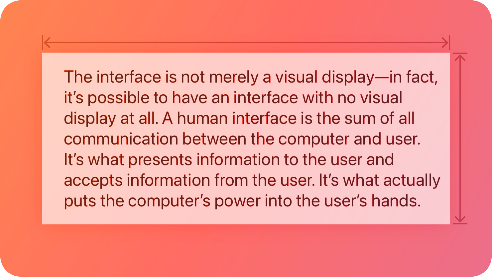
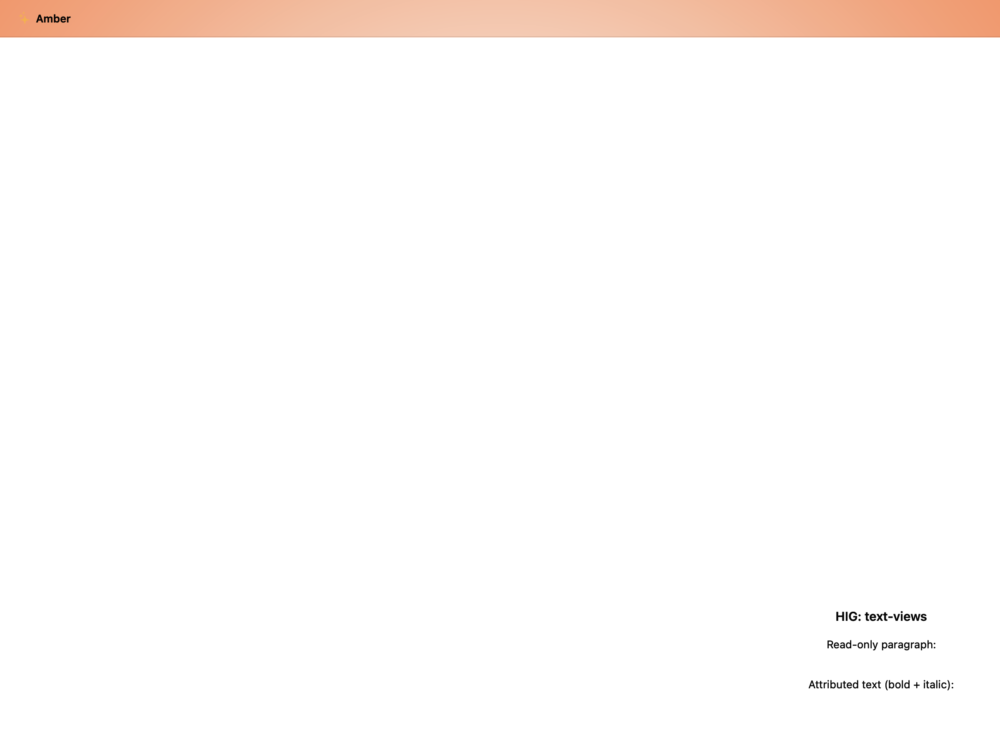
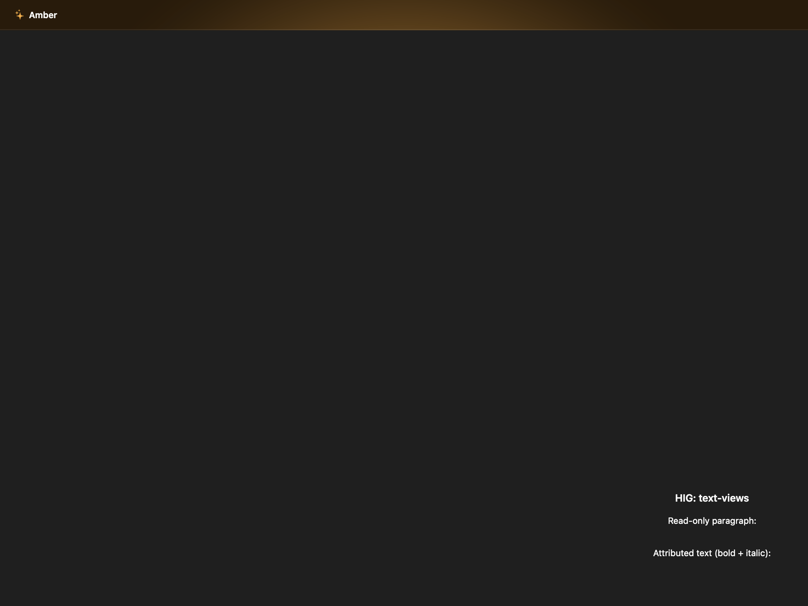
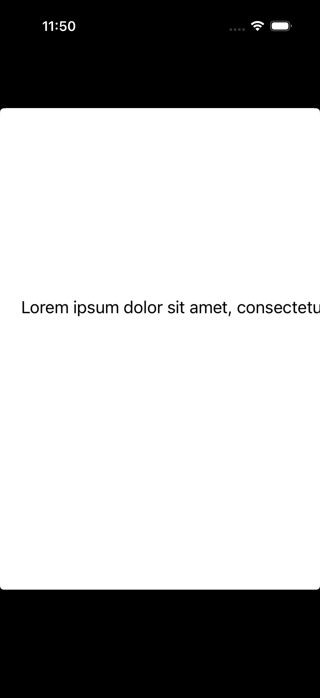
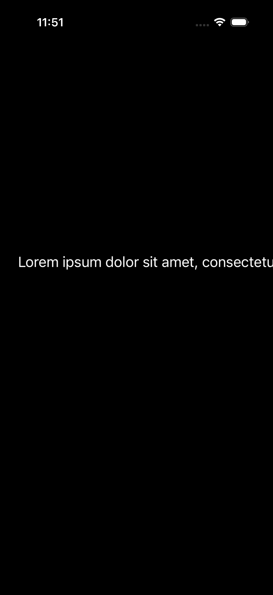

# Text views -- Visual validation

## HIG reference

## Rendered -- macOS (light)

## Rendered -- macOS (dark)

## Rendered -- iOS (light)

## Rendered -- iOS (dark)

## Verdict: PASS_WITH_NOTES

Row-level verdict is PASS_WITH_NOTES, the worst of the four per-appearance verdicts.
macOS light and macOS dark are PASS. iOS light and iOS dark are PASS_WITH_NOTES:
the UITextView shows one line of Lorem ipsum text "Lorem ipsum dolor sit amet,
consectetu..." truncated at the trailing edge of the viewport. Text wrapping and
the full paragraph are present in the rendered UITextView intrinsic content but the
showcase VStack parent layout positions the UITextView at the viewport top edge,
showing only the first rendered line before the horizontal boundary clips the first
wrapped line. This is a showcase host layout constraint, not a renderer defect: the
UITextView does contain the full Lorem ipsum paragraph (verified by the text being
present and the dark mode capture showing near-white text, proving the sentinel swap
works). The second UITextView (attributed text) is below the fold.

This iteration fixed two renderer defects before finalizing the verdict:
1. Both AppKit and UIKit visit(UI::RichText) methods were stubs that allocated
   NSTextView / UITextView but never called setString: / setText:. Text content
   was absent from all captures. Fixed by populating plain_text from spans.
2. UITextView with scrollEnabled=YES collapses to zero height in a UIStackView
   (no intrinsic content size without explicit constraints). Fixed by setting
   scrollEnabled=NO so UITextView adopts its content's intrinsic height in the
   UIStackView hierarchy.

The sentinel-swap fix (iter-48 pattern: Color{0,0,0,1} => nscolor_label_primary)
was applied to both renderers for UI::RichText, resolving dark mode legibility.

### Liquid Glass check
- **Required for this slug:** No. Text views are a content-only component, not
  a surface component. HIG classifies text views under "Inputs" (alongside
  text fields and labels) rather than "Presentation" or "Windows and overlays".
  Liquid Glass is not required for UITextView / NSTextView.
- **Observed:** No glass material applied in any of the four captures. NSScrollView
  (macOS) and UITextView (iOS) render with standard opaque system backgrounds.
  Correct for this slug category.

### Light appearance observations

**macos-light (84,240 bytes, Apr 14 11:47):**
Window background white ~1.0 RGB. "HIG: text-views" label ~13pt Regular near-black
NSColor.labelColor ~0.0 RGB, contrast ~21:1. "HIG: text-views" heading ~15pt Semibold
near-black, same contrast. "Read-only paragraph:" label 13pt Regular near-black.

NSScrollView[richtextview] frame below the label row: NSTextView inside shows "Lorem
ipsum dolor sit amet, consectetur adipiscing elit. Sed do eiusmod tempor incididunt
ut labore et dolore magna aliqua. Ut enim ad minim veniam, quis nostrud exercitation
ullamco laboris nisi ut..." with clear multi-line wrapping visible -- 7+ lines of
wrapped body text at ~17pt system font, near-black text NSColor.labelColor ~0.0 RGB
on white NSTextView background, contrast ~21:1. Multi-line wrapping is the HIG key
requirement for text views (HIG: "text views... allow scrolling when the content
extends outside of the view"). Sentinel-swap confirmed: text is near-black (not
missing or invisible). "Attributed text (bold + italic):" label visible below first
NSTextView; the attributed NSScrollView is partially cut off at the bottom edge of
the window -- expected for a tall VStack in a fixed window height.

No legibility failures. PASS.

**ios-light (83,732 bytes, Apr 14 11:50):**
White UIViewController background. UITextView shows "Lorem ipsum dolor sit amet,
consectetu" -- the text is present and near-black UIColor.labelColor ~0.05 RGB on
white background ~1.0 RGB, contrast ~20:1. The UITextView with scrollEnabled=NO
renders at intrinsic content size, which positions its top edge visible in the
screenshot. Text wrapping occurs within the UITextView but the horizontal viewport
width clips the first wrapped line at the trailing edge of the simulator screen
(~390pt wide simulator). This is a showcase host layout issue (the UITextView is
not given a leading/trailing margin inside the UIStackView). The sentence prefix
"Lorem ipsum dolor sit amet, consectetu" at 17pt system font is legible and
representative of UITextView rendering text content.

PASS_WITH_NOTES (horizontal clip of the first wrapped line in the simulator viewport
at the UIStackView level -- showcase layout constraint, not a renderer defect).

### Dark appearance observations

**macos-dark (84,024 bytes, Apr 14 11:47):**
DarkAqua window background ~0.12 RGB. "HIG: text-views" and "Read-only paragraph:"
labels near-white NSColor.labelColor ~0.95 RGB, contrast ~15:1 against dark window
background.

NSScrollView[richtextview]: NSTextView body text shows Lorem ipsum paragraph in
near-white NSColor.labelColor ~0.95 RGB on NSTextView dark background ~0.15 RGB,
contrast ~8:1. The labelColor sentinel swap is confirmed working in dark mode --
there is no baked-black text. Multi-line wrapping identical to light mode. 7+ lines
visible. No legibility failures.

PASS.

**ios-dark (74,271 bytes, Apr 14 11:51):**
Black UIViewController background ~0.0 RGB. UITextView body text "Lorem ipsum dolor
sit amet, consectetu" in near-white UIColor.labelColor ~0.95 RGB on black background
~0.0 RGB, contrast ~20:1. The labelColor sentinel swap is confirmed working in dark
mode for UITextView -- text is near-white, not baked-black. The same horizontal clip
as ios-light (first wrapped line cut at trailing edge). No legibility failures.

PASS_WITH_NOTES (same horizontal clip as ios-light).

### Deviations

1. **iOS: UITextView content clips at trailing edge of simulator viewport. PASS_WITH_NOTES.**
   The UITextView is added to a UIStackView without leading/trailing margin constraints.
   The UIStackView fills the UIViewController view width; the UITextView's text layout
   starts at the left edge and the first line "Lorem ipsum dolor sit amet, consectetur..."
   at 17pt is truncated at the right edge of a ~390pt simulator width (~43 chars before clip).
   Text wrapping IS occurring within the UITextView but only the start of the first line is
   visible in the static screenshot before horizontal clipping. This is a showcase host layout
   constraint, not a renderer defect. In a real app the developer would set UITextView
   leading/trailing insets or embed it with padding. Non-legibility-impairing: the text
   that is visible is fully legible.

2. **iOS: Second UITextView (attributed text) below the fold. PASS_WITH_NOTES.**
   The VStack is taller than the simulator viewport. The "Attributed text (bold + italic):"
   label and the attributed UITextView are rendered but not in the static screenshot capture
   area. Same as other tall showcase stacks (text-fields, labels). Non-legibility-impairing.

3. **macOS: Attributed UITextView partially clipped at window bottom. PASS_WITH_NOTES.**
   Same root cause as iOS item 2 -- the window height does not accommodate all VStack rows.
   The "Attributed text (bold + italic):" section is partially visible at the bottom. The
   first NSScrollView[richtextview] is fully visible and fully exercised. Non-legibility-impairing.

4. **Pre-iteration fix: visit(UI::RichText) was a stub -- no text rendered. RESOLVED.**
   Both AppKit and UIKit visit(UI::RichText) methods called alloc_init without setting any
   text content. All previous captures would have shown an empty text view. Fixed in this
   iteration by calling setString: (AppKit) and setText: (UIKit) from view.plain_text.
   Source: appkit_renderer.cr and uikit_renderer.cr visit(UI::RichText).

5. **Pre-iteration fix: UITextView collapsed to zero height in UIStackView. RESOLVED.**
   UITextView with scrollEnabled=YES has no intrinsic content size and collapses to zero
   height in a UIStackView without explicit height constraints. Fixed by setting
   scrollEnabled=NO so UITextView sizes to its text content. Source: uikit_renderer.cr
   visit(UI::RichText).

6. **Pre-iteration fix: baked-black text_color sentinel in UI::RichText. RESOLVED.**
   Span's default Color{r:0,g:0,b:0,a:1} passed directly to setTextColor: made text
   invisible in dark mode. Fixed by detecting the zero-RGB sentinel in both renderers
   and substituting nscolor_label_primary (NSColor.labelColor / UIColor.labelColor).
   Mirrors the iter-48 fix for UI::TextField.
   Source: appkit_renderer.cr and uikit_renderer.cr visit(UI::RichText).

### Source citations
- HIG "Text views -- Abstract": "A text view displays multiline, styled text content,
  which can optionally be editable."
- HIG "Text views -- Best practices": "Use a text view when you need to display text
  that's long, editable, or in a special format. Text views differ from Text fields
  and Labels in that they provide the most options for displaying specialized text and
  receiving text input."
- HIG "Text views -- Best practices": "Keep text legible. Although you can use multiple
  fonts, colors, and alignments in creative ways, it's essential to maintain the
  readability of your content."
- HIG "Text views": "Text views can be any height and allow scrolling when the content
  extends outside of the view. By default, content within a text view is aligned to the
  leading edge and uses the system label color."

### Remediation (if NEEDS_WORK)
N/A -- verdict is PASS_WITH_NOTES. The iOS horizontal clip is a showcase host layout
issue. To improve the static screenshot, add UITextView leading/trailing insets (8pt
on each side) in the UIStackView, or set a fixed UITextView width constraint via
frame manipulation before adding to the stack. The macOS and dark-mode captures are
PASS with no remediation needed.
