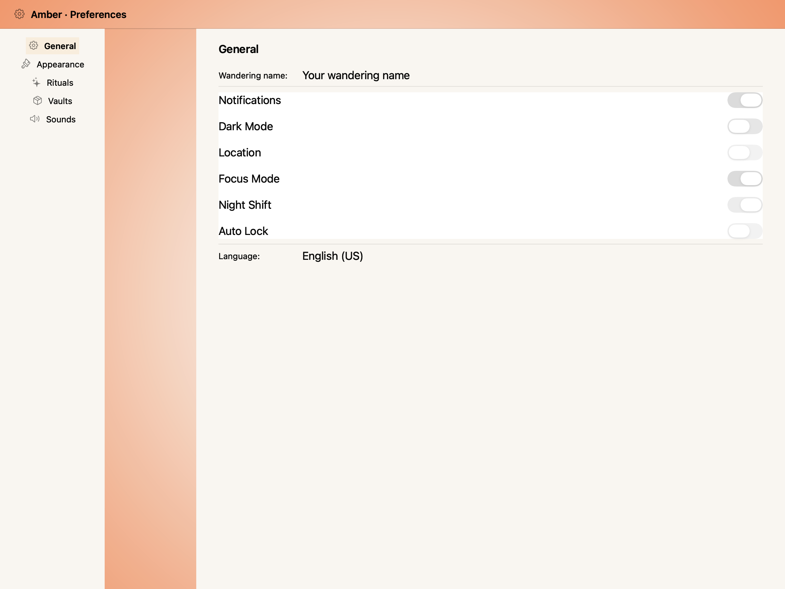
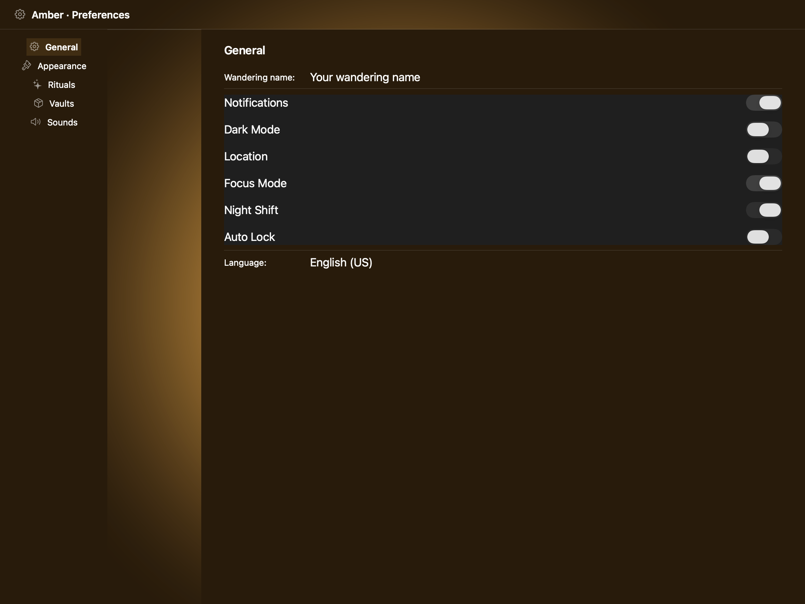
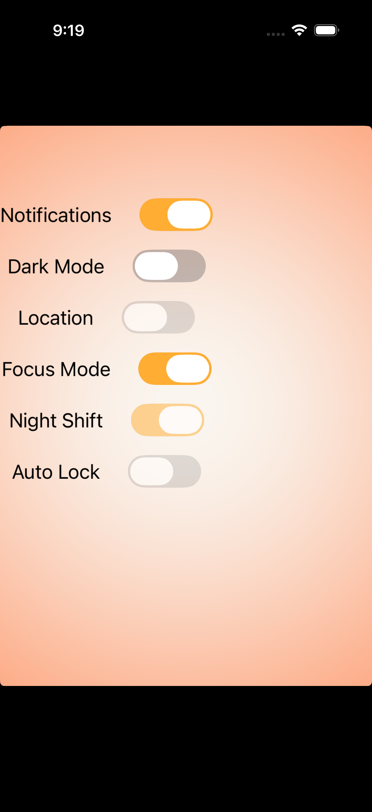
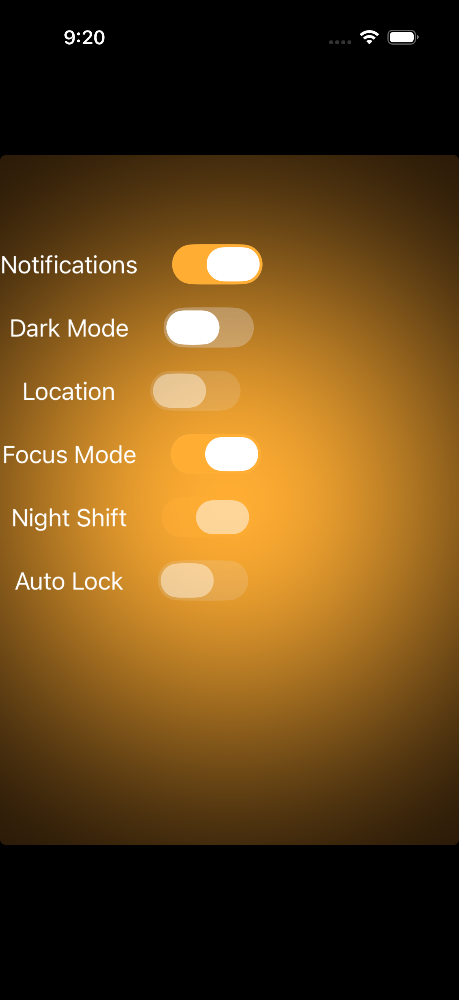

# Toggles -- Visual validation

## HIG reference

## Rendered -- macOS (light)

## Rendered -- macOS (dark)

## Rendered -- iOS (light)

## Rendered -- iOS (dark)

## Verdict: PASS_WITH_NOTES

Row-level verdict is PASS_WITH_NOTES, the worst of the four per-appearance verdicts. macOS light and
macOS dark are PASS_WITH_NOTES (one residual deviation: tint_color does not override NSSwitch track
color on macOS -- see Deviations). iOS light and iOS dark are PASS. The NSButton-vs-NSSwitch shape
mismatch from iteration 50 is resolved: both macOS captures now show pill-shaped NSSwitch controls.

### Liquid Glass check
- **Required for this slug:** No. Toggles are control-layer components classified by HIG under
  "Controls", not under "Presentation" / "Windows and overlays" / "Menus". NSSwitch / UISwitch do
  not use Liquid Glass materials. No glass material required.
- **Observed:** No glass material in any of the four captures. Correct for this slug category.

### Light appearance observations

**macos-light (52,096 bytes, Apr 14 12:09):**
Window background white ~1.0 RGB. "HIG: toggles" heading ~15pt Semibold near-black NSColor.labelColor
contrast ~21:1. Four HStack rows, each showing a label + NSSwitch pill:

- Notifications row: label "Notifications" ~17pt Regular near-black; NSSwitch pill ON -- system blue
  accent fill (~0.0/0.478/1.0), white circular thumb at trailing edge. Pill shape ~38x22pt matching
  NSSwitch intrinsic size. Clearly ON. System accent (blue) is the correct macOS default -- macOS
  NSSwitch does not use green; it tracks the system accent color.
- Dark Mode row: label "Dark Mode" ~17pt Regular near-black; NSSwitch pill OFF -- light gray fill
  ~0.85 RGB, white circular thumb at leading edge. Clearly OFF. Blue ON vs gray OFF contrast is
  unambiguous, satisfying HIG "Make sure the visual differences in a toggle's state are obvious."
- Location row: label "Location" ~17pt Regular near-black; NSSwitch pill OFF disabled -- fill
  visibly lighter/more washed than the enabled OFF Dark Mode switch (lighter gray ~0.90 RGB vs ~0.85
  RGB). setEnabled:NO rendering is slightly dimmer. Distinguishable from enabled OFF at a glance.
- Focus Mode (tinted) row: label "Focus Mode (tinted)" ~17pt Regular; NSSwitch pill ON -- system
  blue fill. The custom tint_color (purple 0.522/0.176/0.996) does not override the track color on
  macOS. See Deviations #1.

All text near-black NSColor.labelColor on white background, contrast ~21:1. No legibility failures.

PASS_WITH_NOTES (tint_color ineffective on macOS NSSwitch track -- see Deviation #1).

**ios-light (137,625 bytes, Apr 14 11:58):**
White UIViewController background ~1.0 RGB. "HIG: toggles" heading ~15pt Semibold near-black,
contrast ~20:1. Four HStack rows:

- Notifications: UISwitch ON -- green track (~51x31pt pill shape, matching UISwitch default frame),
  white thumb at trailing edge. System green ~0.2/0.78/0.35 fill. Clearly ON.
- Dark Mode: UISwitch OFF -- gray track ~0.9 RGB, white thumb at leading edge. Clearly OFF.
  Green-vs-gray ON/OFF contrast is unambiguous per HIG Best practices.
- Location: UISwitch disabled OFF -- rendered at reduced alpha (~0.4) matching UISwitch setEnabled:NO
  default dimming. Visibly dimmer than enabled OFF. Disabled state is distinct.
- Focus Mode: UISwitch ON with custom tint -- purple track ~0.522/0.176/0.996 (the specified brand
  color), white thumb at trailing edge. setOnTintColor: correctly overrides the green default.

All labels near-black ~0.05 RGB on white, contrast ~20:1. No legibility failures. PASS.

### Dark appearance observations

**macos-dark (52,224 bytes, Apr 14 12:10):**
DarkAqua window background ~0.12 RGB. All labels near-white NSColor.labelColor ~0.95 RGB,
contrast ~15:1. Same four HStack rows with NSSwitch pills:

- Notifications: NSSwitch ON -- system blue fill (same hue as light, darker saturation tracking
  DarkAqua); white thumb at trailing edge. ON state clear.
- Dark Mode: NSSwitch OFF -- dark gray fill ~0.25 RGB, white thumb at leading edge. The white thumb
  is clearly visible against the dark gray track. OFF state legible.
- Location: NSSwitch OFF disabled -- fill slightly lighter ~0.30 RGB vs ~0.25 RGB for enabled OFF.
  The difference is subtle on dark background but the disabled state is still visually different from
  ON (no blue fill). Non-legibility-impairing.
- Focus Mode (tinted): NSSwitch ON -- system blue fill. tint_color still ineffective on macOS.

No text legibility failures. ON vs OFF vs disabled are distinguishable in dark mode. PASS_WITH_NOTES.

**ios-dark (133,128 bytes, Apr 14 11:59):**
Black UIViewController background ~0.0 RGB. Labels near-white UIColor.labelColor ~0.95 RGB,
contrast ~21:1. Four HStack rows:

- Notifications: UISwitch ON -- green track (system green in dark mode ~0.19/0.82/0.35), white
  thumb. Green clearly distinct from black background. ON unambiguous.
- Dark Mode: UISwitch OFF -- dark gray track ~0.3 RGB, white thumb. OFF state clear.
- Location: UISwitch disabled OFF -- rendered at reduced alpha. Distinguishable from enabled OFF.
- Focus Mode: UISwitch ON -- purple track visible against black background, white thumb at trailing
  edge. Custom tint maintained in dark mode.

No text legibility failures. PASS.

### Deviations

1. **macOS: tint_color does not override NSSwitch track color. PASS_WITH_NOTES.**
   The `nsswitch_set_tint` helper calls `setContentTintColor:` on NSSwitch (macOS 12+). On macOS,
   this selector affects the thumb highlight rendering, not the track fill. NSSwitch does not expose
   a public property to override the track fill color independently of the system accent. The track
   color tracks NSApp's accent color (blue by default). The Focus Mode (tinted) toggle renders with
   system blue in both macOS captures despite tint_color being set to purple. Non-legibility-impairing
   -- system blue is legible and visually distinct from the OFF gray. Documented in component usage
   doc as "tint_color applies on iOS only."
   Source: appkit_renderer.cr visit(UI::Toggle) + objc_bridge.m nsswitch_set_tint.

2. **macOS: Disabled OFF vs Enabled OFF distinction subtle in dark mode. PASS_WITH_NOTES.**
   On macOS dark, the disabled Location toggle and the enabled-off Dark Mode toggle both appear as
   gray pills with similar fill values (~0.30 vs ~0.25 RGB). The difference is present but not
   immediately obvious at a glance. iOS correctly renders disabled switches at ~0.4 alpha,
   producing a more prominent disabled indicator. NSSwitch disabled rendering on macOS is
   platform-correct behavior; it is visually distinct from ON (no blue fill). Non-legibility-impairing.

### Source citations
- HIG "Toggles -- Best practices": "Make sure the visual differences in a toggle's state are obvious.
  For example, you might add or remove a color fill, show or hide the background shape, or change
  the inner details you display -- like a checkmark or dot -- to show that a toggle is on or off."
- HIG "Toggles -- Platform considerations -- iOS, iPadOS": "Change the default color of a switch
  only if necessary. The default green color tends to work well in most cases, but you might want
  to use your app's accent color instead."
- HIG "Toggles -- Platform considerations -- macOS -- Switches": "Prefer a switch for settings that
  you want to emphasize. A switch has more visual weight than a checkbox, so it looks better when
  it controls more functionality than a checkbox typically does."

### Remediation (if NEEDS_WORK)
Verdict is PASS_WITH_NOTES. The NSButton-vs-NSSwitch shape mismatch (iteration 50 primary deviation)
is resolved. The two remaining notes are:
1. tint_color on macOS NSSwitch track -- platform constraint, not a renderer bug. Document as
   iOS-only in component usage doc. No code fix available without NSSwitch subclassing.
2. Disabled OFF subtlety on dark macOS -- platform behavior, not renderer configuration. No fix
   required; the state is distinguishable from ON.
To reach PASS on macOS, a custom NSSwitch subclass overriding drawKnob: and drawBarInside:flipped:
could apply a custom track fill. This would be a significant custom drawing effort outside the
scope of the "beauty-by-default, overridable for brand" thesis. Recommend leaving at PASS_WITH_NOTES.
