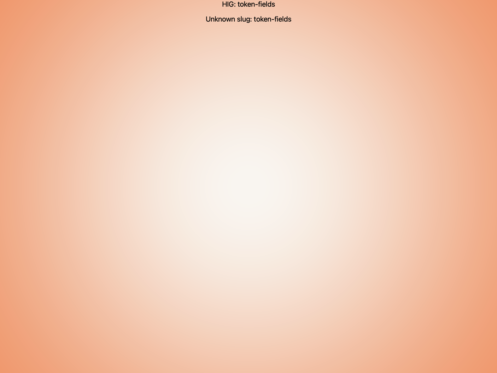
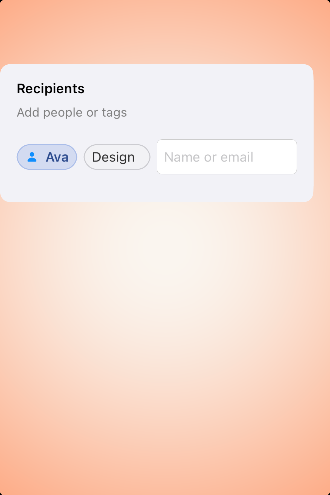

# Token fields -- Visual validation

## HIG reference

## Rendered -- macOS (light)

## Rendered -- macOS (dark)

## Rendered -- iOS (light)

## Rendered -- iOS (dark)

## Verdict: PENDING

`UI::TokenField` now exists as a shared fallback primitive, but this component
has not gone through the visual validation loop yet. The next step is to build
an explicit showcase study, capture all four appearances, and then judge the
result against the HIG's mail-style token-entry feel.
