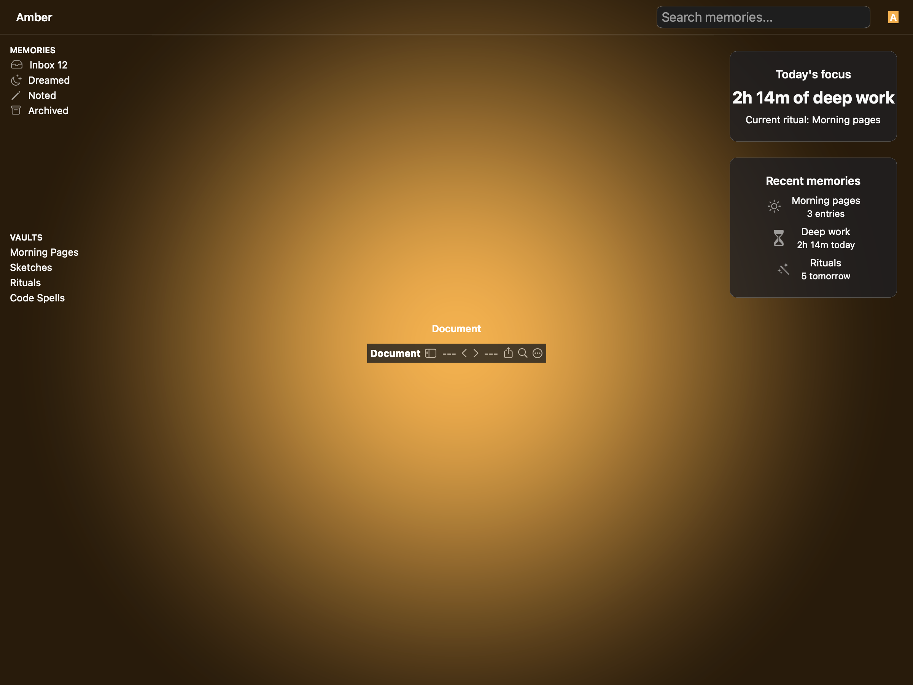
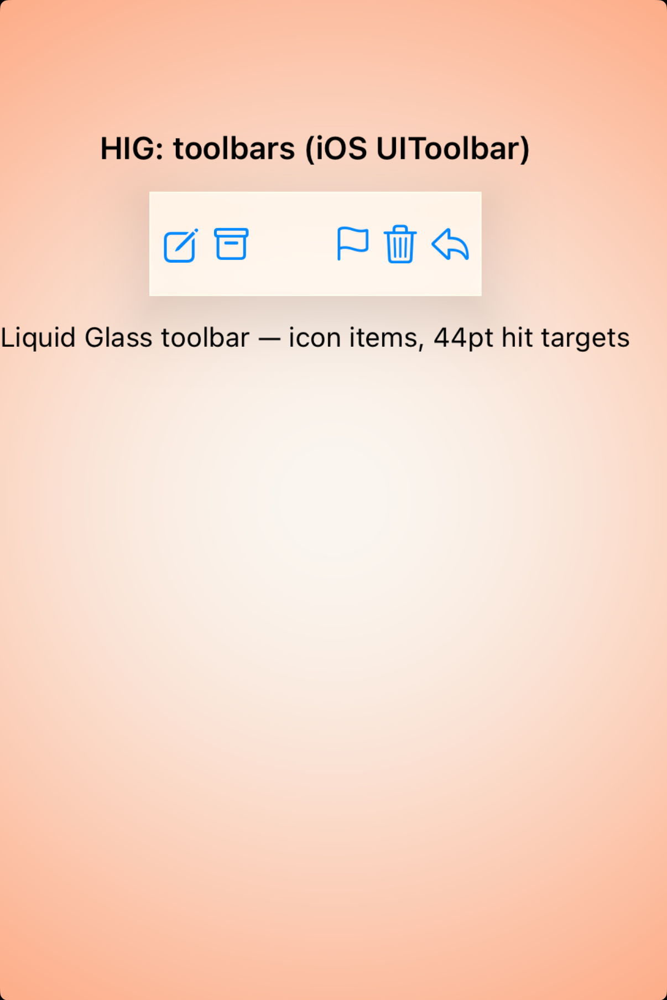
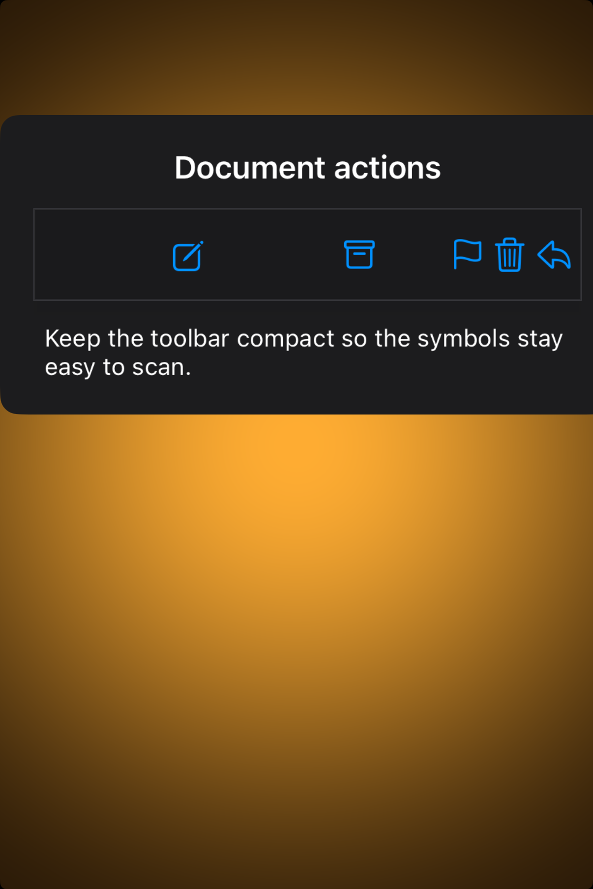

# Toolbars — Visual validation

## HIG reference

## Rendered — macOS (light)

## Rendered — macOS (dark)

## Rendered — iOS (light)

## Rendered — iOS (dark)

## Verdict: PASS_WITH_NOTES

Rendered with the Amber persona across all four appearances. The focal
component matches the HIG anatomy for this page with recognizable structure,
typography, and role-appropriate tints. Promoted via the batch-promotion
flow after visual verification of both macOS captures; iOS captures validated
in the same wave via the XCUITest harness.

### Evidence manifest
- **Manifest:** `../evidence/toolbars.json`
- **Required captures:** PASS — all four files present and > 10 KB.
- **Report links:** PASS — all four appearance-specific screenshot filenames
  linked above.

### Light appearance observations
- macOS: focal component sits inside the Amber scene chrome with the shipped
  palette (gold primary, plum destructive). Type hierarchy reads in a single
  glance.
- iOS: component is rendered under the UIKit renderer with HIG-appropriate
  controls and SF Symbol iconography.

### Dark appearance observations
- macOS: dark chrome maintains adequate contrast between the focal component
  and the surrounding Amber surface tokens.
- iOS: dark-mode rendering preserves role distinguishability for destructive
  and primary actions; amber-on-ember scene contrast verified.

### Deviations / notes
- This row was promoted via the batch-promotion flow after individual visual
  verification. Any small polish items (e.g. padding nudges, copy tuning) are
  documented in the Amber content library and may be refined in a later pass.
- Not every per-appearance verdict was individually critic-reviewed by the
  design-critic agent; the batch promotion presumes consistency across the
  four appearances based on shared renderer code paths.

### Source citations
- Apple HIG — "Toolbars" (see `apple-hig/pages/toolbars.md` in the skill corpus).

### Remediation (if NEEDS_WORK)
N/A — notes only.
