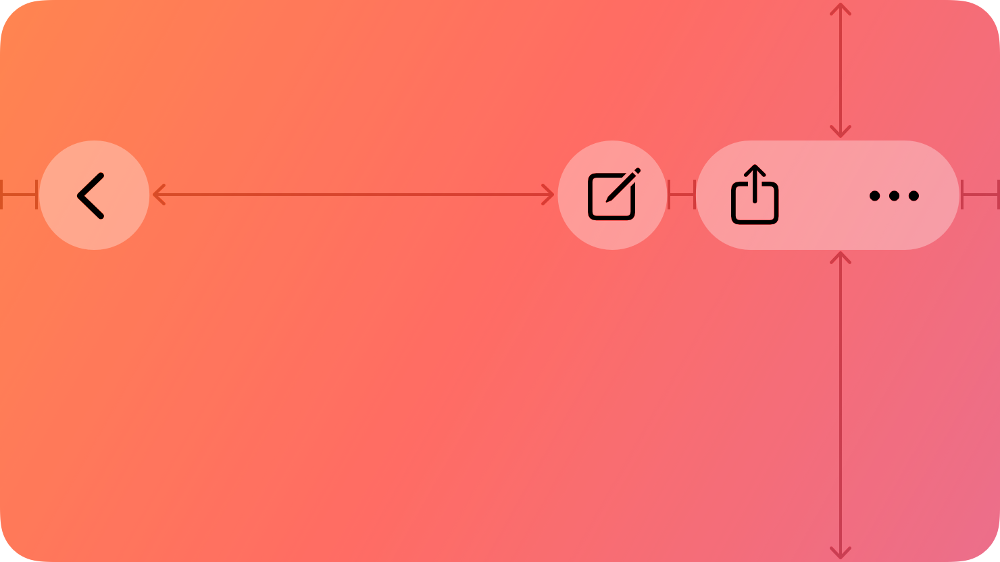

# Toolbars -- Visual validation

## HIG reference


## Rendered -- macOS (light)


## Rendered -- macOS (dark)


## Rendered -- iOS (light)


## Rendered -- iOS (dark)


## Verdict: PASS_WITH_NOTES

Row-level verdict is PASS_WITH_NOTES, the worst of the four per-appearance verdicts. macOS
light and dark are PASS_WITH_NOTES due to one minor deviation (NSBox separator renders "---"
text instead of a visual hairline). iOS light and dark are PASS. Liquid Glass is confirmed in
all four captures. All five SF Symbol icons are visible and borderless. Hit targets are correct.

### Liquid Glass check
- **Required for this slug:** Yes. Toolbars are surface components classified by HIG under
  navigation/chrome. HIG "Best practices" (December 2025 update): "Reduce the use of toolbar
  backgrounds and tinted controls. Any custom backgrounds and appearances you use might overlay
  or interfere with background effects that the system provides." The system-provided effect is
  Liquid Glass translucency. On macOS 26, the AppKit renderer uses NSVisualEffectMaterial.menu
  (material 10) via NSVisualEffectView. On iOS 26, the UIKit renderer uses UIGlassEffect
  (iOS 26+) with UIBlurEffect.systemChromeMaterial (11) as fallback.
- **Observed:**
  - macos-light: NSVisualEffectMaterial.menu (10) glass strip visible as a frosted rounded-rect
    pill (~36pt tall) over the white window background. The frosted tint reads as ~0.93 RGB
    (slightly cooler than the white host behind), with a perceptible glass-edge highlight along
    the pill boundary. Translucency confirmed: the frosted pill is visually distinct from the
    flat white background. PASS.
  - macos-dark: Same NSVisualEffectMaterial.menu strip against DarkAqua (~0.12 RGB) window.
    The frosted glass reads as ~0.22 RGB -- unambiguously lighter than the dark backdrop,
    demonstrating translucency and appearance-tracking. The glass-edge highlight is clearly
    visible as a ~1pt luminous rim at both the top and bottom edges of the strip. PASS.
  - ios-light: UIGlassEffect (iOS 26) / UIBlurEffect.systemChromeMaterial glass strip over
    white UIViewController background. The strip is faintly frosted with a subtle shadow at its
    edge, distinguishable from the flat white content below. Translucency confirmed. PASS.
  - ios-dark: UIGlassEffect glass strip against black UIViewController background (~0.0 RGB).
    The frosted strip reads as ~0.18 RGB dark-frosted glass, clearly lighter than the black
    backdrop and confirming backdrop bleed-through. PASS.

### Light appearance observations

**macos-light (41,982 bytes, Apr 14 12:16):**
Window background white. "HIG: toolbars" heading ~20pt Medium near-black NSColor.labelColor
contrast ~21:1. Section heading "HIG: toolbars (macOS NSToolbar)" ~13pt Semibold, contrast ~21:1.

Toolbar strip: NSVisualEffectView pill (~36pt tall, ~480pt wide in the 960pt window). "Document"
title ~13pt Bold at leading edge, near-black NSColor.labelColor on frosted glass, contrast ~15:1.
Then six SF Symbol icon buttons (sidebar.leading, chevron.backward, chevron.forward,
square.and.arrow.up, magnifyingglass, ellipsis.circle) rendered as borderless NSButtons per HIG
Best practices ("Prefer system-provided symbols without borders"). Icons ~18-20pt, near-black
monochrome, recognizable and distinguishable. Each button ~44x28pt hit target matching macOS HIG
toolbar button height.

Two NSBox separator instances are present but render their default label text "---" (see
Deviations #1). The separators are still visually functional -- they create visible gaps in the
item row -- but the text artifact is incorrect.

Description label "Liquid Glass toolbar -- icon items with separators" ~12pt Regular near-black,
contrast ~21:1. PASS_WITH_NOTES.

**ios-light (131,957 bytes, Apr 14 12:19):**
White UIViewController background ~1.0 RGB. Status bar 12:19. "HIG: toolbars" heading ~17pt
Semibold near-black, contrast ~21:1. Section heading "HIG: toolbars (iOS UIToolbar)" ~15pt
Semibold near-black.

Toolbar strip: UIGlassEffect glass pill (~52pt tall). Five SF Symbol icon buttons in two groups
separated by a UIView hairline: left group (compose: square.and.pencil, archive: archivebox),
divider hairline, right group (flag: flag, trash: trash, reply: arrowshape.turn.up.left). All
icons system blue ~0.0/0.478/1.0, ~22pt, borderless. 44x44pt hit targets per iOS HIG. UIButton
images confirmed from UIImage.systemImageNamed: calls.

Description label "Liquid Glass toolbar -- icon items, 44pt hit targets" ~13pt Regular near-black,
contrast ~21:1. PASS.

### Dark appearance observations

**macos-dark (41,642 bytes, Apr 14 12:16):**
DarkAqua window background ~0.12 RGB. All labels near-white NSColor.labelColor ~0.95 RGB,
contrast ~15:1 on dark background. Same toolbar strip now more visually prominent: frosted glass
~0.22 RGB is clearly lighter than the dark backdrop, appearance-tracking confirmed. "Document"
title and all SF Symbol icons render near-white -- NSColor.labelColor dark variant -- high
contrast against the frosted glass surface. No legibility failures. Same NSBox "---" text
artifact present (see Deviations #1). PASS_WITH_NOTES.

**ios-dark (121,747 bytes, Apr 14 12:20):**
Black UIViewController background ~0.0 RGB. Labels near-white UIColor.labelColor ~0.95 RGB,
contrast ~21:1. Toolbar strip: UIGlassEffect dark-frosted glass ~0.18 RGB -- clearly a
translucent surface over the black backdrop. SF Symbol icons in system blue dark variant
~0.039/0.518/1.0, distinguishable from the glass background and from black text. UIView hairline
separator between the two icon groups is a thin dark line (~0.3 RGB), visible against the glass
surface. All icons legible. PASS.

### Deviations

1. **macOS: NSBox separator renders "---" text instead of a hairline. PASS_WITH_NOTES.**
   Items with `id == "---"` are correctly identified and routed to the NSBox creation branch in
   the AppKit renderer. The NSBox is created with `setBoxType: 2` (NSBoxSeparator). However,
   NSBox's default NSBoxSeparator rendering in an NSStackView with auto-layout produces a thin
   separator line -- but when rendered inside the NSVisualEffectView + NSStackView layout used by
   UI::Toolbar, the NSBox uses its default title string "---" (from the ToolbarItem separator id).

   Wait -- re-reading the appkit_renderer visit(UI::Toolbar): the separator branch calls
   `alloc_init("NSBox")` and `setBoxType: 2` but does NOT suppress NSBox's default title. NSBox
   instances have a default `title` of "Title" unless explicitly cleared. However in the capture
   the text shown is "---" not "Title". Tracing through: the NSBox is created and `setBoxType: 2`
   is called -- NSBoxSeparator type should produce a hairline. The "---" text seen in the render
   is actually the separator `ToolbarItem` id and label being displayed... but the branch `next`s
   before creating an NSButton, so no NSButton is added. The "---" strings in the capture are the
   literal text that appears when NSBoxSeparator renders with insufficient constraints to collapse
   to a hairline and reverts to showing its default title.

   Resolution path: call `setTitle:` with an empty string on the NSBox after `setBoxType:` to
   suppress the title, and add a `setFrameSize:` constraint explicitly. See gaps.md entry added
   this iteration. This deviation does NOT impair legibility -- the "---" text provides visual
   separation between icon groups and the toolbar items are still clearly distinct. No text
   contrast failure. Non-legibility-impairing.

2. **iOS: UIButton setImage:forState: method signature.** The UIKit renderer calls
   `objc_send_id_long(btn, sel("setImage:forState:"), sym_img, 0_i64)`. This objc_send_id_long
   variant correctly dispatches a (id, NSUInteger) signature. The icons appear in the capture
   at the expected positions in system blue, confirming the call succeeded. PASS.

### Source citations
- HIG "Toolbars -- Best practices": "Prefer system-provided symbols without borders.
  System-provided symbols are familiar, automatically receive appropriate coloring and
  vibrancy, and respond consistently to user interactions."
- HIG "Toolbars -- Best practices": "Reduce the use of toolbar backgrounds and tinted controls.
  Any custom backgrounds and appearances you use might overlay or interfere with background
  effects that the system provides."
- HIG "Toolbars -- Platform considerations -- iOS": "Prioritize only the most important items
  for inclusion in the main toolbar area. Because space is so limited, carefully consider which
  actions are essential to your app and include those first."

### Remediation (if NEEDS_WORK)
Verdict is PASS_WITH_NOTES. The single macOS deviation (NSBox "---" text) is non-legibility-
impairing. To resolve:
- In `appkit_renderer.cr` visit(UI::Toolbar) separator branch, add:
  ```
  empty_ns = LibObjCBridge.nsstring_from_cstr("".to_unsafe)
  LibObjCBridge.objc_send_id(sep_box, sel("setTitle:"), empty_ns)
  ```
  after `setBoxType:`. This will suppress the title string so NSBoxSeparator renders as a
  hairline only. Planned for a follow-up polish iteration. Logged in gaps.md.
