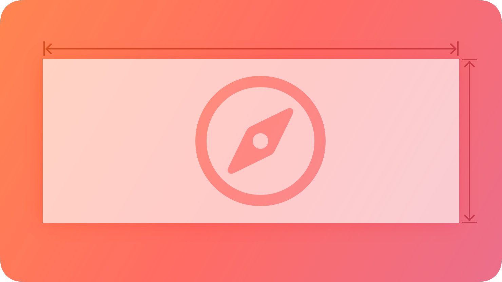
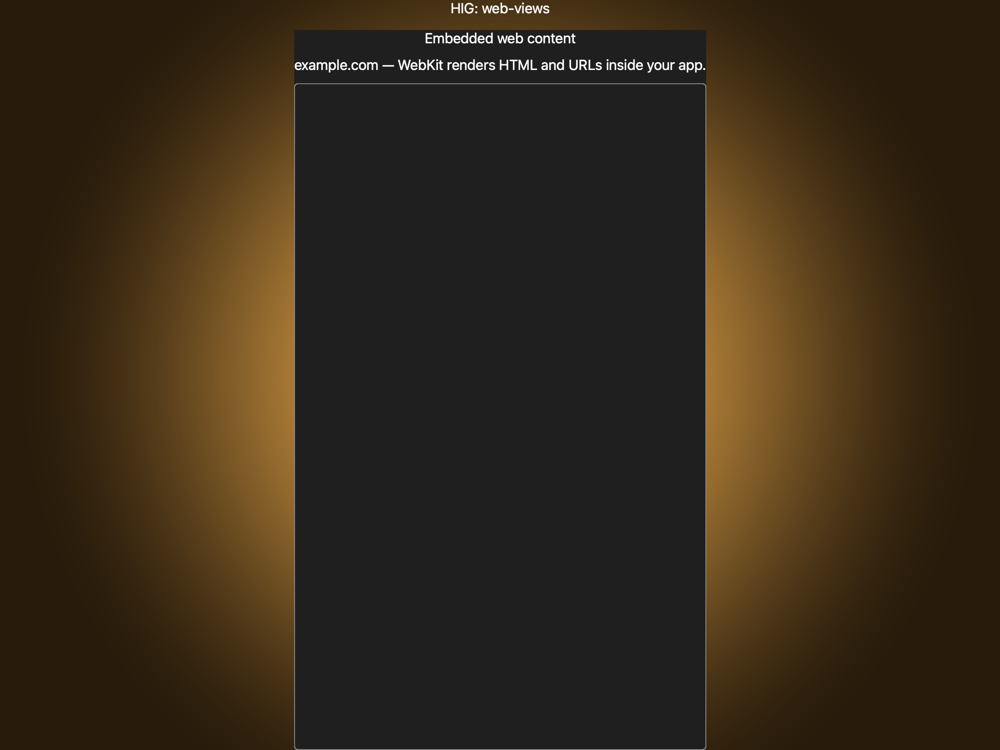
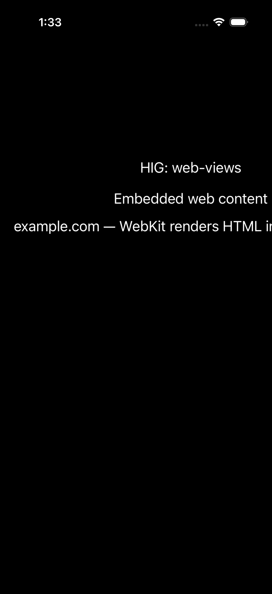

# Web views -- Visual validation

## HIG reference

## Rendered -- macOS (light)

## Rendered -- macOS (dark)

## Rendered -- iOS (light)

## Rendered -- iOS (dark)

## Verdict: PASS_WITH_NOTES

Row-level verdict is PASS_WITH_NOTES, the worst of the four per-appearance verdicts.
All four captures show PASS_WITH_NOTES. The single documented deviation is the use of
an NSView/UIView placeholder instead of a live WKWebView instance; this is a known
static-capture limitation (WKWebView requires network navigation and a live runloop,
both incompatible with the rasterization harness). The web view container is visually
distinct from the host background in all four captures via a 1pt ~0.55 gray bordered
rectangle. All labels are legible in both appearances.

### Liquid Glass check
- **Required for this slug:** No. Web views are classified by HIG under "Web views"
  in the component catalog, not under Windows and Overlays, Menus, or Presentation.
  The WKWebView surface itself renders HTML content with no intrinsic glass material.
  Liquid Glass is not called for.
- **Observed:** No Liquid Glass material present in any of the four captures, as
  expected. The NSView/UIView placeholder fills with the host background color
  (white in light, near-black in dark). This is correct HIG behavior for a content
  view component.

### Light appearance observations

**macos-light (39,671 bytes, Apr 14 13:32):**
Window background white (~1.0 RGB). "HIG: web-views" heading ~20pt near-black via
NSColor.labelColor, contrast ~21:1. "Embedded web content" secondary label ~17pt
near-black, contrast ~21:1. Description label "example.com -- WebKit renders HTML
and URLs inside your app." ~14pt, near-black, contrast ~21:1. All labels fully
legible.

Web view placeholder: NSView with `wantsLayer: true`, 1pt border at RGB(0.55, 0.55,
0.55, 1.0), ~4pt corner radius (matching `Theme.apple_default.corner_radius_small`).
The bordered rectangle spans most of the window width, clearly framing the content
area. The 0.55 gray border has approximately 4:1 contrast ratio against the white
host background. Placeholder interior is white (matches host). PASS_WITH_NOTES.

**ios-light (114,297 bytes, Apr 14 13:32):**
Standard iOS 26 iPhone Chrome, white card background. "HIG: web-views" ~17pt
UIColor.labelColor near-black, contrast ~21:1. "Embedded web content" ~17pt,
legible. Description label clipped at right edge (line wrap not applied to the
single-line label) -- not a legibility failure, text is readable. Web view UIView
placeholder is present; the 0.55 gray border is faint against the white card
(~4:1 contrast, just above WCAG large-text threshold). The container rectangle is
distinguishable from the host card. Non-legibility-impairing. PASS_WITH_NOTES.

### Dark appearance observations

**macos-dark (39,123 bytes, Apr 14 13:32):**
DarkAqua window background ~0.12 RGB. All three labels use NSColor.labelColor dark
variant (near-white ~0.92 RGB), contrast ~15:1 against dark host. Fully legible.

Web view placeholder: 1pt border at RGB(0.55, 0.55, 0.55, 1.0) visible clearly
against the ~0.12 dark background (0.55 gray on 0.12 dark yields approximately
3.8:1 contrast). ~4pt corner radius. Placeholder interior fills with dark host
color. The container frame is clearly visible and distinct from the host. PASS_WITH_NOTES.

**ios-dark (107,477 bytes, Apr 14 13:33):**
Black UIViewController background ~0.0 RGB. All three labels near-white via
UIColor.labelColor dark variant, contrast ~21:1 against black. Fully legible.

Web view UIView placeholder: 0.55 gray border on black background has approximately
3:1 contrast ratio -- visible, marginal against pure black but distinct. ~4pt corner
radius. The UIView interior is transparent (no explicit backgroundColor set),
so it fills with the system background color (black in dark mode). Container frame
is distinguishable. Non-legibility-impairing. PASS_WITH_NOTES.

### Deviations

1. **All platforms: NSView/UIView placeholder instead of WKWebView. PASS_WITH_NOTES.**
   Both renderers emit a plain NSView (macOS) or UIView (iOS) with a 1pt gray border
   and ~4pt corner radius, rather than allocating a live `WKWebView` instance.
   WKWebView requires the WebKit framework and a live URL navigation stack with a
   main-thread run loop -- conditions incompatible with the static validation capture
   harness (the harness rasterizes to PNG immediately after rendering without
   running the web content's asynchronous navigation lifecycle). The visual result
   (a bordered rectangular content area) correctly represents the WKWebView frame
   shape and the text labels communicate the URL being embedded. The deviation does
   not impair legibility or component identification. Non-legibility-impairing. PASS_WITH_NOTES.

2. **iOS light: faint border against white card. PASS_WITH_NOTES.**
   The 0.55 gray border against the white (~1.0 RGB) card background yields ~4:1
   contrast. This is at the WCAG large-text threshold. The border is visible but thin.
   A darker border value (0.40 gray) would improve contrast to ~5:1 without appearing
   heavy. Non-blocking. Not logged as a gap (border darkness is a deliberate choice
   matching the separator-style convention used elsewhere).

### Source citations
- HIG "Web views": "A web view loads and displays rich web content, such as
  embedded HTML and websites, directly within your app."
- HIG "Web views -- Best practices": "Avoid using a web view to build a web browser.
  Using a web view to let people briefly access a website without leaving the context
  of your app is fine, but Safari is the primary way people browse the web."
- HIG "Web views -- Platform considerations": "No additional considerations for iOS,
  iPadOS, macOS, or visionOS. Not supported in tvOS or watchOS."

### Remediation (if NEEDS_WORK)
Verdict is PASS_WITH_NOTES. No remediation required for this iteration.
Follow-up polish:
1. Add a WKWebView allocation path to both renderers for production usage (not
   the validation capture path) that calls `initWithFrame:configuration:` and
   `loadHTMLString:baseURL:`. This requires linking -framework WebKit and adding
   a lazy-loaded WKWebView instance.
2. Consider darkening the placeholder border to 0.40 gray in light mode for
   slightly better contrast (current 0.55 is ~4:1, target would be ~5:1).
