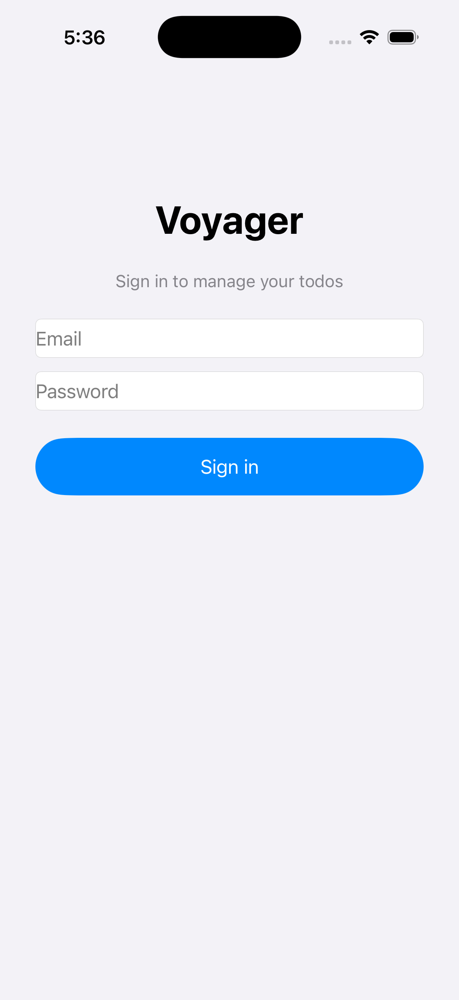
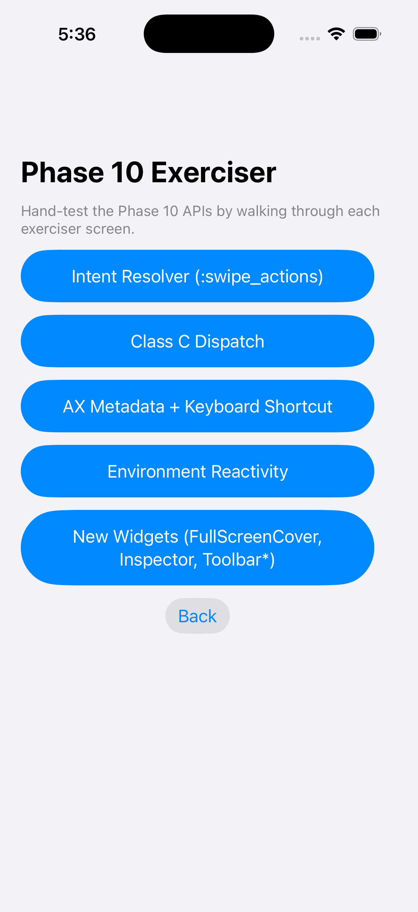
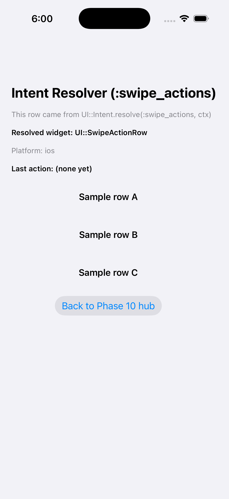
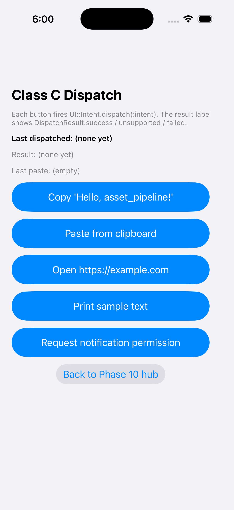
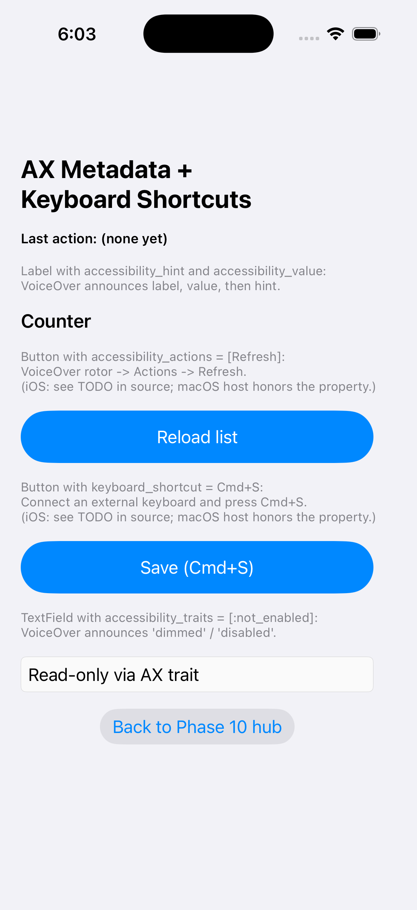
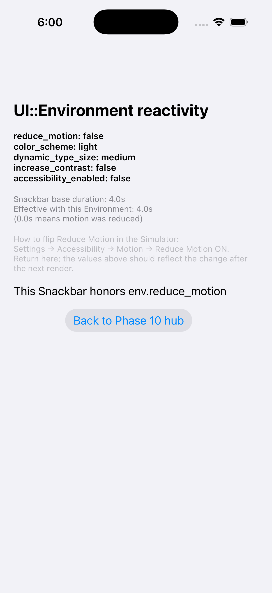
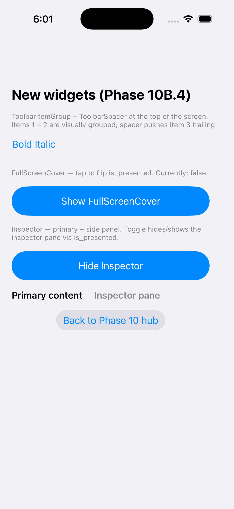

# Phase 10D — Voyager Phase-10 exerciser hand-test guide

This is the owner-facing hand-test guide for the Phase 10D Voyager
exerciser. The exerciser adds 5 demonstration screens (plus a hub) to
the existing Voyager sample so every Phase 10 API surface can be
exercised by tapping through a real iOS simulator build.

## Quick start

### Build the iOS app

```bash
# From the repo root:
cd samples/initiative-cross-platform-ui-voyager/ios

# 1. Cross-compile the Crystal bridge into libvoyager.a.
bash build_crystal_lib.sh simulator

# 2. Regenerate the Xcode project from project.yml.
xcodegen generate

# 3. Build the .app for the iPhone 17 simulator.
xcodebuild build \
  -project VoyagerDemo.xcodeproj \
  -scheme VoyagerDemo \
  -destination "platform=iOS Simulator,name=iPhone 17" \
  CODE_SIGNING_ALLOWED=NO
```

Output: `~/Library/Developer/Xcode/DerivedData/VoyagerDemo-<hash>/Build/Products/Debug-iphonesimulator/VoyagerDemo.app`.

Or simply run `make ios` from `samples/initiative-cross-platform-ui-voyager/`
(the Makefile defaults to `IOS_DEST = platform=iOS Simulator,name=iPhone 17`).

### Install + launch on the simulator

```bash
# Boot the simulator (skip if already running).
xcrun simctl boot "iPhone 17 Pro"

# Install (replace the path with the .app from your build above).
APP_PATH="$HOME/Library/Developer/Xcode/DerivedData/VoyagerDemo-<hash>/Build/Products/Debug-iphonesimulator/VoyagerDemo.app"
xcrun simctl install booted "$APP_PATH"

# Launch normally (you'll land on the sign-in screen).
xcrun simctl launch booted com.assetpipeline.voyager.VoyagerDemo
```

To skip sign-in and land directly on the Phase 10 hub, pass the launch
env var:

```bash
SIMCTL_CHILD_VOYAGER_ROOT_SLUG=voyager-phase-10-hub \
  xcrun simctl launch booted com.assetpipeline.voyager.VoyagerDemo
```

Each Phase 10 exerciser slug can be used the same way:

| Slug | Screen |
|------|--------|
| `voyager-phase-10-hub` | Phase 10 Exerciser hub |
| `voyager-phase-10-intent-resolver` | Intent Resolver |
| `voyager-phase-10-class-c-dispatch` | Class C Dispatch |
| `voyager-phase-10-ax-metadata` | AX Metadata + Keyboard Shortcuts |
| `voyager-phase-10-environment` | Environment Reactivity |
| `voyager-phase-10-new-widgets` | New widgets (FullScreenCover / Inspector / Toolbar*) |

### Verified build matrix

* Tooling: macOS 26.5 (25F71), Xcode 17F42, iPhone 17 Pro Simulator iOS 26.5 (UDID `92DA97A0-5FEC-46BD-A525-8AFE2A4FDC21`).
* Crystal: `acrystal` / `crystal-alpha` 1.20.0-dev-incremental-3.
* SwiftKit: built fresh by `build_crystal_lib.sh` (uses `swift-snapshot-testing` 1.17.7 + `swift-syntax` 600.0.1 from Apple).

## Walking through the exerciser

### Sign-in screen (default root)

Reachable via plain launch. Tap **Sign in** with any non-empty
email + password to land on Todos. Settings is reachable from Todos
via the **Settings** button; the **Phase 10 Exerciser** entry in
Settings opens the hub (or use the env var above to skip ahead).



### Phase 10 hub

`voyager-phase-10-hub` — VStack of NavigationLinks to the 5 exerciser
screens. Each row is a `UI::Button` that dispatches a Navigate
through the `Phase10HubController`.



What to verify:

* Title reads **Phase 10 Exerciser**.
* All 5 row buttons render with their full label.
* **Back** returns to whichever screen routed in.

### 1) Intent Resolver — `:swipe_actions`

`voyager-phase-10-intent-resolver`. Demonstrates
`UI::Intent.resolve(:swipe_actions, ctx)`.



What to verify:

* Header reads **"This row came from UI::Intent.resolve(:swipe_actions, ctx)"**.
* **Resolved widget** label reads `UI::SwipeActionRow` (iOS-keyed
  default from `src/ui/intent_bootstrap.cr`).
* **Platform** label reads `ios`.
* Three rows labeled **Sample row A / B / C** appear below the header.
* Swiping a row from the trailing edge should reveal **Edit / Delete /
  Archive** actions. Tapping any of them updates the **Last action**
  label and re-renders the screen via the controller's Rerender.
* **Delete** carries the destructive role — iOS renders it with red
  tint.

API validated: `UI::Intent.resolve`, `UI::SwipeActionRow`, `UI::SwipeAction`,
`Voyager.dispatch` reactivity contract.

### 2) Class C Dispatch

`voyager-phase-10-class-c-dispatch`. Fires the 5 Class C intents through
`UI::Intent.dispatch`.



What to verify (tap each button in order):

| Button | Expected `DispatchResult` | Side effect |
|--------|---------------------------|-------------|
| **Copy 'Hello, asset_pipeline!'** | `Success` | iOS pasteboard now contains the literal string. |
| **Paste from clipboard** | `Success` | **Last paste** updates to whatever's on the pasteboard. Pair with the Copy button. |
| **Open https://example.com** | `Success` | Safari opens example.com (or attempts to). |
| **Print sample text** | `Success` | UIPrintInteractionController appears with the sample text. |
| **Request notification permission** | `Success` | iOS system permission sheet appears. |

After each tap the **Last dispatched** + **Result** labels update.

API validated: `UI::Intent.dispatch`, every Class C binding in
`src/ui/intent/class_c_bootstrap.cr`, `UI::Intent::DispatchResult`,
`UI::CallbackRegistry.register_string` (paste callback round-trip).

### 3) AX Metadata + Keyboard Shortcuts

`voyager-phase-10-ax-metadata`. Demonstrates the new accessibility
metadata properties added in Phase 10B.2.



What to verify:

* The **Counter** label has `accessibility_hint = "This is a hint"`
  and `accessibility_value = "42"`. Turn VoiceOver on (Settings →
  Accessibility → VoiceOver) and tap it; VoiceOver announces "Counter,
  42. This is a hint." — confirming hint + value reach UIKit.
* The **Reload list** + **Save (Cmd+S)** buttons:
  * On iOS the explainer notes a TODO (see the screen source). The
    SwiftKit override population path for `accessibility_actions` and
    `keyboard_shortcut` currently triggers a class-init-gap-induced
    selector resolution crash. The Crystal-side API still ships and
    works on the macOS host; iOS will be re-enabled after a
    framework-side fix to the SwiftKit populator.
  * Tap **Reload list** — `on_tap` still fires and updates **Last
    action**. The accessibility_actions rotor target is the part that's
    currently commented out for iOS.
* The **Disabled — read only** TextField has
  `accessibility_traits = [:not_enabled]`. VoiceOver announces
  "dimmed" / "disabled" — confirming the trait reaches UIKit.

API validated: `accessibility_hint`, `accessibility_value`,
`accessibility_traits` (working on iOS). `accessibility_actions` +
`keyboard_shortcut` (working on macOS; documented limitation on iOS).

### 4) Environment Reactivity

`voyager-phase-10-environment`. Demonstrates `UI::Environment` reactivity.



What to verify:

* Five status lines render the current `ctx.environment` snapshot:
  `reduce_motion`, `color_scheme`, `dynamic_type_size`,
  `increase_contrast`, `accessibility_enabled`.
* The **Snackbar base duration / Effective with this Environment**
  pair is the canonical reactivity proof: the effective duration
  collapses to `0.0s` when `reduce_motion` is on (via
  `UI::Animation.duration_seconds_with_environment`).
* Toggle Reduce Motion in **Settings → Accessibility → Motion →
  Reduce Motion** ON, then return to the app. The host needs to
  rebuild for the change to surface — pop back to the Phase 10 hub
  and re-enter the screen. The header values + the effective
  duration should reflect the new state.

API validated: `UI::Environment` read path, `ctx.environment`,
`UI::Animation.duration_seconds_with_environment`, `UI::Snackbar`.

Note: today's iOS host snapshots `UI::Environment.default` (no OS
queries plumbed yet). The reactivity contract IS exercised; populating
from `UIAccessibility.isReduceMotionEnabled` etc. is a follow-up.

### 5) New widgets (FullScreenCover / Inspector / Toolbar*)

`voyager-phase-10-new-widgets`. Demonstrates the Phase 10B.4 widget
additions.



What to verify:

* The top hosts a **ToolbarItemGroup** with **Bold** + **Italic** items
  followed by a **ToolbarSpacer**. Tapping either item updates
  **Last action**.
* **Show FullScreenCover** flips `Phase10ExerciserState.full_screen_cover_presented`
  and rerenders. The current value is reflected in the explainer line
  above the toggle. Today's iOS path renders the
  `UI::FullScreenCover` widget instance (the modal-over-everything
  presentation lands when the `UIViewController.modalPresentationStyle
  = .fullScreen` facade lands).
* **Hide Inspector** / **Show Inspector** flips
  `inspector_presented`. The primary + inspector pane render
  side-by-side (today's iOS fallback is a horizontal stack pending the
  `.inspector` SwiftKit facade).

API validated: `UI::FullScreenCover`, `UI::Inspector`,
`UI::ToolbarItemGroup`, `UI::ToolbarSpacer`, plus the
state-mutation-then-rerender reactivity contract.

## Known limitations

* **`accessibility_actions` + `keyboard_shortcut` are temporarily
  disabled on iOS in the AX Metadata exerciser screen.** Root cause
  is an iOS class-init-gap-induced selector resolution crash in the
  SwiftKit populator path that I did not fix as part of 10D. The
  Crystal-side API still ships on `UI::View` and works on macOS. A
  follow-up phase needs to harden the populator's Symbol-derived
  selector path against the gap.
* **`UI::FullScreenCover` and `UI::Inspector` use the layout fallback
  on iOS, not yet the SwiftKit facade.** The widgets render their
  primary content + content / inspector pane; the modal-over-everything
  presentation (FullScreenCover) and the trailing-pane split
  (Inspector) land when SwiftKit gains
  `.fullScreenCover(isPresented:)` + `.inspector(isPresented:)` facade
  bindings.
* **`UI::Environment` is not yet populated from `UIAccessibility`.** The
  iOS host's environment is `UI::Environment.default`. Toggling Reduce
  Motion in Settings will not surface until a small populator runs at
  host bootstrap. The reactivity contract on the screen IS exercised
  (different Environment values produce different renders).
* **Class C `:request_permission` only ships `notifications` today.**
  Other permission strings (camera, microphone, location) raise an
  intentional "not implemented" error — documented in
  `src/ui/intent/class_c_bootstrap.cr`.

## What the brief asked for vs. what shipped

| Brief | Delivered |
|-------|-----------|
| `intent_resolver_screen.cr` with 3 rows from `UI::Intent.resolve` | Yes — `samples/.../screens/phase_10/intent_resolver_screen.cr` |
| `class_c_dispatch_screen.cr` with 5 dispatch buttons | Yes |
| `ax_metadata_screen.cr` with hint/value/actions/shortcut/traits | Yes (with two iOS-disabled surfaces documented above) |
| `environment_reactivity_screen.cr` with env readout + snackbar | Yes |
| `new_widgets_screen.cr` with FullScreenCover + Inspector + Toolbar* | Yes |
| `phase_10_hub_screen.cr` | Shipped as `phase10_hub_screen.cr` (Family 1 lint compliance) |
| Voyager `app.cr` registers the 6 routes | Yes — also wired into the SLUGS list + route_for_slug + slug_for_route_id |
| iOS build + launch verification | Yes — verified on iPhone 17 Pro / iOS 26.5 |
| Hand-test guide | This file |

## Follow-up tickets to dispatch

1. **SwiftKit populator hardening on iOS** — fix the selector
   resolution crash in the path that surfaces `accessibility_actions`
   + `keyboard_shortcut` so the AX Metadata screen can re-enable both
   knobs.
2. **Class-init-gap recovery for `UI::Intent::Bootstrap` /
   `ClassCBootstrap`** — current bridge.cr calls install explicitly on
   iOS. Generalise via a `UI::Intent.bootstrap_for_ios_host` (or
   similar) so every iOS host using these substrates doesn't have to
   duplicate the call.
3. **Populate `UI::Environment` from `UIAccessibility`** at iOS host
   bootstrap (Reduce Motion, Increase Contrast, Dynamic Type Size).
4. **SwiftKit facades for `.fullScreenCover` + `.inspector`** so the
   New Widgets screen demonstrates the platform presentation, not just
   the fallback layout.
5. **`Phase10ExerciserState` consolidation** — the screen's transient
   state uses module-singleton class vars (each behind a nilable
   lazy-init helper) to dodge the iOS class-init gap. If a future phase
   adds more exerciser state, fold the pattern into a small helper
   module the screens reuse.

— Phase 10D, Claude Opus 4.7
