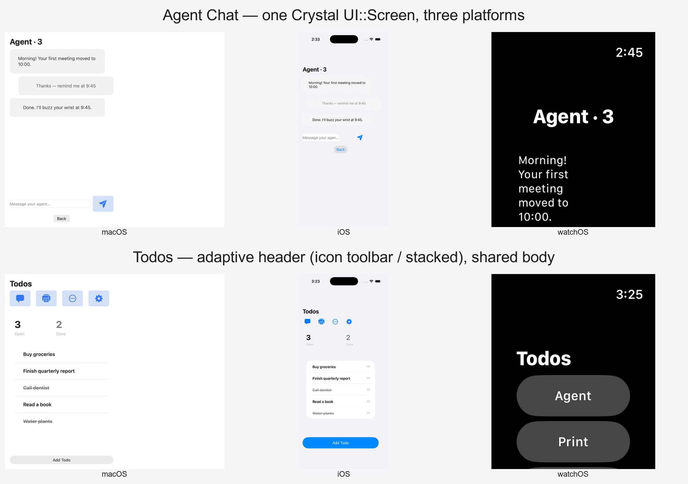

# Voyager — cross-platform UI demo (macOS · iOS · watchOS · web)

Voyager is the asset_pipeline kit's flagship sample: a small but real app whose screens are
authored **once** as Crystal `UI::Screen` classes and rendered **natively** on macOS (AppKit),
iOS (UIKit), watchOS (WatchKit/SwiftUI), and the web — from one source tree, with no
per-platform layout forks. It exists to demonstrate that the kit builds *cohesive* and
*beautiful* applications across every Apple target.



## Screens (one `UI::Screen` each, three native renderers)

| Screen | Slug | Demonstrates |
|---|---|---|
| Sign-in | `voyager-sign-in` | Form fields, branded entry, `ReplaceRoot` |
| Todos | `voyager-todos` | List + adaptive header (SF-Symbol toolbar ↔ stacked), count cards, swipe/modals |
| Agent Chat | `voyager-agent-chat` | Conversation bubbles, reactive transcript, compose row |
| Settings | `voyager-settings` | Toggle, prominent buttons, navigation hub |
| Daily Check-in | `voyager-check-in` | Control breadth — Slider / Stepper / Picker / Toggle, native per platform |

Screens live in `screens/`, controllers in `controllers/`, shared state in `screens/state.cr`.
The app graph (`UI::App` + routes) is `app.cr`; the dispatcher substrate is `host_bootstrap.cr`.

## What it demonstrates (and where the proof is)

- **One screen, three platforms** — `handoff/cohesion-gallery/voyager-cohesion-gallery.png`.
- **Whole-design adaptation, not just resizing** — reusable primitives:
  `DeviceMetrics#adaptive_content_width` (column clamps to the device), `#compact_canvas?`
  (a row *reflows* to a column on a narrow canvas), `UI::View#fill_horizontal` (flex-grow).
  Within-platform proof: `handoff/cohesion-gallery/macos-adaptive-resize.png` (resize the Mac
  window → the design reflows). Recipe + gotchas:
  [`docs/initiative-cross-platform-ui/adaptive-layout-patterns.md`](../../docs/initiative-cross-platform-ui/adaptive-layout-patterns.md).
- **Appearance** — all five screens verified light + dark; `handoff/cohesion-gallery/voyager-dark-mode-cohesion.png`.
- **Reactivity + navigation** — Rerender and Navigate both proven on the watch
  (`handoff/.../watchos-navigation-proof.png`); functional controls proven via XCUITest.
- **Per-platform native idiom from one API** — e.g. the Check-in Toggle is a UISwitch on iOS,
  an NSButton checkbox on macOS; the Picker is a menu on iOS, an NSPopUpButton on macOS.

## Build & run

> Native targets use the watchOS-capable Crystal (`acrystal`); web uses vanilla `crystal`.

```sh
# Web (pure Crystal, no native toolchain) → output/voyager-demo/
make web

# macOS (AppKit). make macos builds macos/bin/voyager.
make macos CRYSTAL_NATIVE=acrystal
make macos-run                       # opens a real resizable window
# …or capture a screen offscreen:
VOYAGER_ROOT_SLUG=voyager-check-in VOYAGER_SCREENSHOT_PATH=/tmp/out.png \
  VOYAGER_CAPTURE_WIDTH=720 VOYAGER_CAPTURE_HEIGHT=640 macos/bin/voyager

# iOS (UIKit) — cross-compiles the bridge, generates the Xcode project, builds.
make ios                             # deploy target is iOS 26 → use an iOS-26 simulator
# run/capture:  xcrun simctl launch <ios26-sim> com.assetpipeline.voyager.VoyagerDemo
# UI tests:     xcodebuild test -project ios/VoyagerDemo.xcodeproj -scheme VoyagerDemo \
#                 -destination 'id=<ios26-sim>' -only-testing:VoyagerDemoUITests

# watchOS (WatchKit) — build the Crystal bridge lib, then the watch app.
cd watchos && ./build_crystal_lib.sh && \
  xcodebuild -project VoyagerWatch.xcodeproj -scheme VoyagerWatch -destination 'id=<watch-sim>' build
# run/capture: SIMCTL_CHILD_VOYAGER_ROOT_SLUG=voyager-<slug> \
#   xcrun simctl launch <watch-sim> com.assetpipeline.voyager.VoyagerWatch
```

Useful launch env (native): `VOYAGER_ROOT_SLUG` (which screen to root at — every screen is
reachable), `VOYAGER_APPEARANCE=dark` (macOS dark bake), `VOYAGER_SKIP_NOTIF_PROMPT=1`
(suppress the first-launch notification prompt during captures).

## Architecture (per-target entry points)

| Target | Entry | Notes |
|---|---|---|
| macOS / iOS native | `UI::ActionDispatcher` (via `host_bootstrap.cr`) | `ios/bridge.cr`, `macos/host.cr` |
| watchOS | `watchos/bridge.cr` (`voyager_watch_render`) | `UI::WatchKit::Renderer` + SwiftKit facades |
| web (static site) | `Voyager.build_route` (`web/static_site.cr`) | deliberately static-site; see the web-target-position note |

The same `screens/` + `controllers/` + `state.cr` drive every target; only the thin
per-platform bridge/host differs.
